# You (White) vs CPU (Black)

**Result:** 1-0  
**Date:** 2026.05.18  
**Source:** `PGN_2026_05_18_21h50_c75c920b2414.pgn`  
**Engine:** Stockfish depth 14  
**Your side:** White  
**Computer side:** Black  
**Board perspective:** Standard White-at-bottom

---

## Who Is Who

- **You:** You (White)
- **Computer:** CPU (5) (Black)

---

## Toaster Summary

**Game Story:** In a Caro-Kann Defense: Advance Variation, Black’s 11...Kd7, 13...dxc3, 14...Nd4, and 15...Bc4 let your attack grow into a winning position. Your 16.Nb3+ and final 19.Nxc3 still let mate slip, so this was a sloppy win, not a clean finish. The practical lesson is to pause when the enemy king is exposed and look for forcing checks before choosing a capture.

Biggest toaster scream: **16. Nb3+** by **You (White)**.

- **Label:** 💀 **Blunder**
- **Eval:** White has mate → +19.97
- **Stockfish preferred:** `Nf3+`
- **Loss:** 98003 cp

Final move recorded: **19. Nxc3** by **You (White)**.

- 💀 Your blunders: **2**
- ❌ Your mistakes: **0**
- ⚠️ Your inaccuracies: **4**
- ✅ Your best moves called out: **5**

---

## Final Position


---

## Key Moments

### ✅ Best: 8. Nb5 by You (White)

Nb5 was the preferred move and kept White’s strong position essentially intact. Learn this pattern: when your move matches the engine choice, focus on placing pieces actively without weakening the position.

- **Eval:** +3.94 → +3.83
- **Preferred:** `Nb5`
- **Loss:** 11 cp

**Before 8. Nb5**

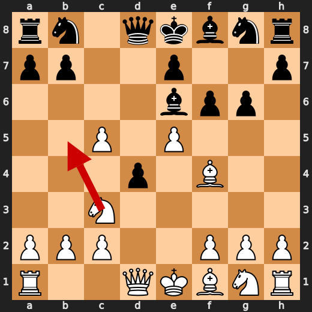

**After 8. Nb5**

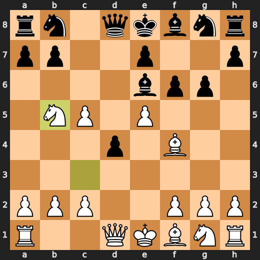

### ❌ Mistake: 11. Kd7 by CPU (Black)

Kd7 failed to limit White’s advantage and significantly worsened Black’s position. Qd5 was preferred because it held the position together better than the king move. Learn to compare king moves with active queen moves when the evaluation can swing sharply.

- **Eval:** +3.35 → +8.51
- **Preferred:** `Qd5`
- **Loss:** 516 cp

**Before 11. Kd7**

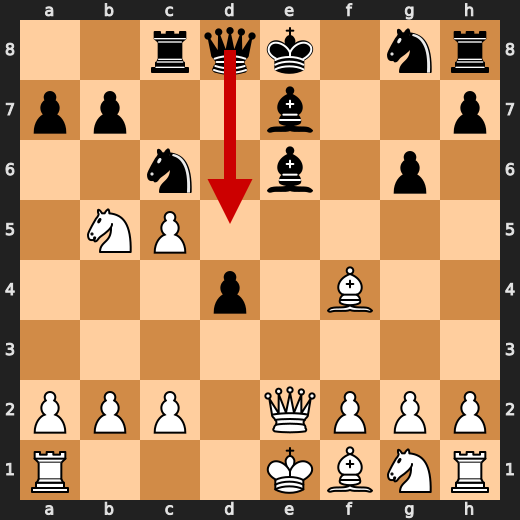

**After 11. Kd7**

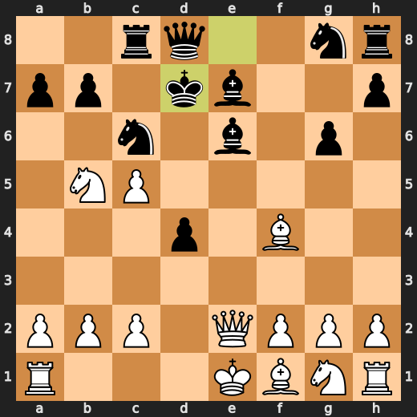

### ❌ Mistake: 13. dxc3 by CPU (Black)

dxc3 did not address Black’s worsening position and allowed White’s advantage to grow further. Qa5 was preferred because it gave Black a better practical chance to hold the position. Learn to check whether a capture improves your position before taking material.

- **Eval:** +5.91 → +10.81
- **Preferred:** `Qa5`
- **Loss:** 490 cp

**Before 13. dxc3**

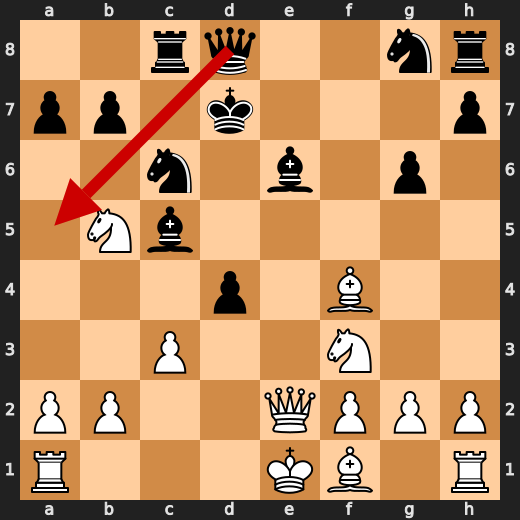

**After 13. dxc3**

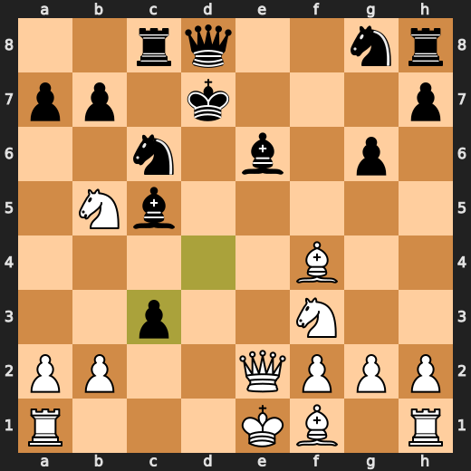

### ❌ Mistake: 14. Nd4 by CPU (Black)

Nd4 did not solve Black’s defensive problems and made White’s already winning position even stronger. Ke8 was preferred because it kept Black’s position more resistant than the knight move. Learn to choose stabilizing moves over activity when the position is already under serious pressure.

- **Eval:** +10.06 → +14.62
- **Preferred:** `Ke8`
- **Loss:** 456 cp

**Before 14. Nd4**

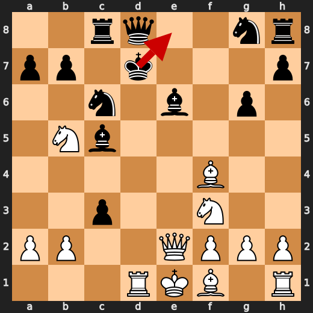

**After 14. Nd4**

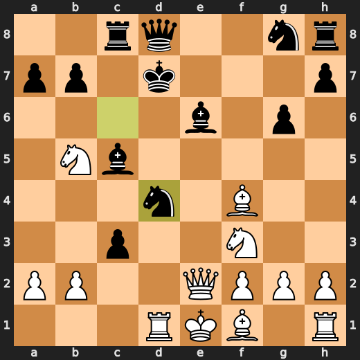

### 💀 Blunder: 15. Bc4 by CPU (Black)

Bc4 worsened Black’s position instead of finding the more resilient Bd5. When the evaluation swings this sharply, the practical lesson is to look for the move that best limits the opponent’s advantage rather than making a move that does not improve the defense.

- **Eval:** +12.38 → +28.00
- **Preferred:** `Bd5`
- **Loss:** 1562 cp

**Before 15. Bc4**

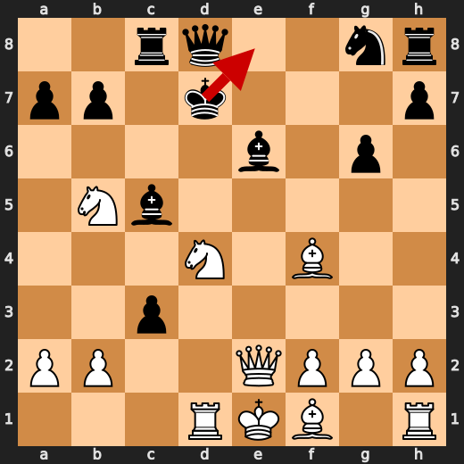

**After 15. Bc4**

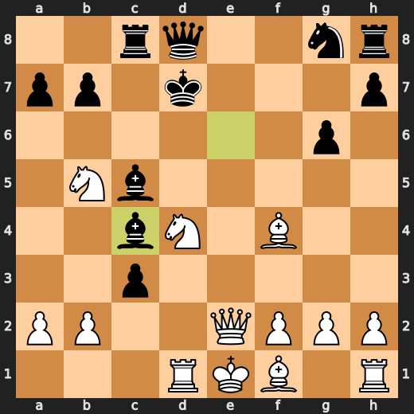

### 💀 Blunder: 16. Nb3+ by You (White)

Nb3+ missed a much stronger forcing continuation, turning a winning position with mate available into one where Black can keep playing. Nf3+ was preferred because it preserves the decisive pressure more accurately. Learn to check candidate forcing moves carefully when a position is already tactically winning.

- **Eval:** White has mate → +19.97
- **Preferred:** `Nf3+`
- **Loss:** 98003 cp

**Before 16. Nb3+**

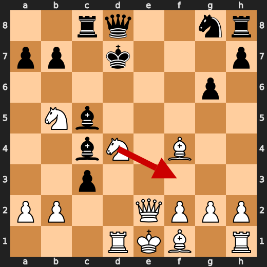

**After 16. Nb3+**

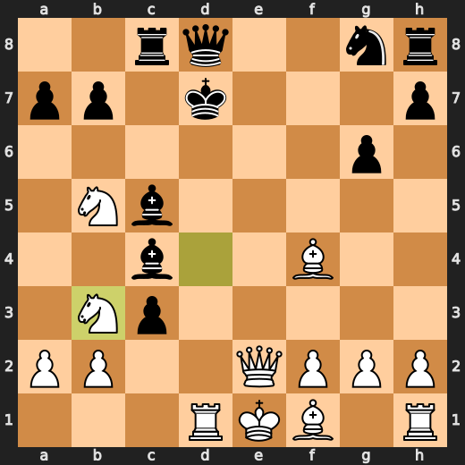

### 💀 Blunder: 17. Bxf2+ by CPU (Black)

Bxf2+ failed to keep Black’s defense together and worsened the position enough to allow a forced mate for White. Bxe2 was the preferred move because it offered a more resilient defense than the check on f2. Learn to be cautious with checks that do not improve your position, especially when the alternative better limits the opponent’s attack.

- **Eval:** +21.61 → White has mate
- **Preferred:** `Bxe2`
- **Loss:** 97839 cp

**Before 17. Bxf2+**

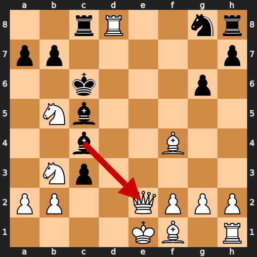

**After 17. Bxf2+**

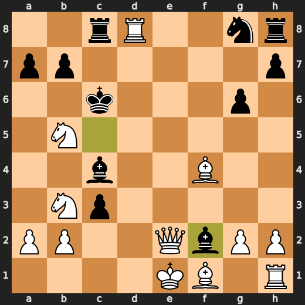

### 💀 Blunder: 19. Nxc3 by You (White)

Nxc3 failed to use the immediate forcing chance in a position where White had mate available. Qc5+ was preferred because it keeps the attack forcing and preserves the decisive continuation. Learn to check forcing moves first when the position contains a mating opportunity.

- **Eval:** White has mate → +23.00
- **Preferred:** `Qc5+`
- **Loss:** 97700 cp

**Before 19. Nxc3**

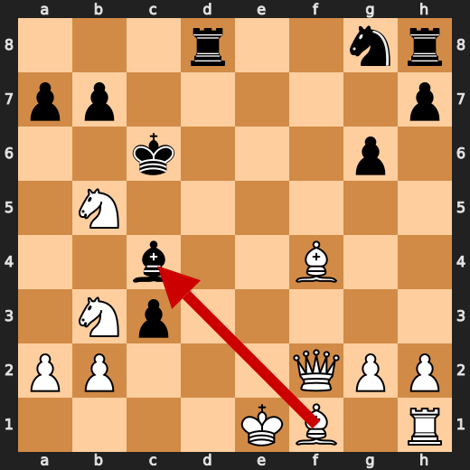

**After 19. Nxc3**

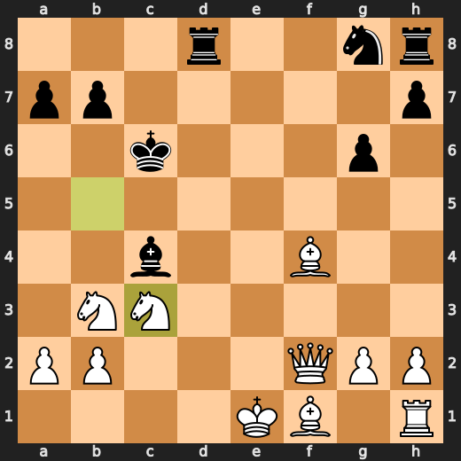

---

## Human Notes

Biggest caveman lesson: CPU (Black) blew it with **15. Bc4**.

There was another real screw-up at **11. Kd7** by **CPU (Black)**.

---

<details>
<summary>Compact move list</summary>

- 📖 **1. e4** (You (White), Book) — +0.35 → +0.31, preferred `d4`, loss 4 cp
- 📖 **1. c6** (CPU (Black), Book) — +0.34 → +0.50, preferred `c5`, loss 16 cp
- 📖 **2. d4** (You (White), Book) — +0.24 → +0.24, preferred `Nc3`, loss 0 cp
- 📖 **2. d5** (CPU (Black), Book) — +0.29 → +0.43, preferred `d5`, loss 14 cp
- 📖 **3. e5** (You (White), Book) — +0.32 → +0.39, preferred `Nd2`, loss 0 cp
- 📖 **3. c5** (CPU (Black), Book) — +0.36 → +0.37, preferred `Bf5`, loss 1 cp
- ✅ **4. dxc5** (You (White), Best) — +0.45 → +0.32, preferred `dxc5`, loss 13 cp
- ⚠️ **4. g6** (CPU (Black), Inaccuracy) — +0.32 → +1.78, preferred `e6`, loss 146 cp
- 🔥 **5. Nc3** (You (White), Great) — +1.89 → +1.48, preferred `Nf3`, loss 41 cp
- ⚠️ **5. Be6** (CPU (Black), Inaccuracy) — +1.44 → +3.52, preferred `e6`, loss 208 cp
- ⚠️ **6. Bg5** (You (White), Inaccuracy) — +3.27 → +1.92, preferred `Bb5+`, loss 135 cp
- ⚠️ **6. f6** (CPU (Black), Inaccuracy) — +2.02 → +3.30, preferred `Nc6`, loss 128 cp
- ✅ **7. Bf4** (You (White), Best) — +2.67 → +2.70, preferred `exf6`, loss 0 cp
- ⚠️ **7. d4** (CPU (Black), Inaccuracy) — +2.75 → +3.99, preferred `g5`, loss 124 cp
- ✅ **8. Nb5** (You (White), Best) — +3.94 → +3.83, preferred `Nb5`, loss 11 cp
- 🔥 **8. Nc6** (CPU (Black), Great) — +3.77 → +4.13, preferred `Nc6`, loss 36 cp
- 🔥 **9. exf6** (You (White), Great) — +4.27 → +3.96, preferred `exf6`, loss 31 cp
- 🔥 **9. Rc8** (CPU (Black), Great) — +4.08 → +4.27, preferred `Qa5+`, loss 19 cp
- ⚠️ **10. fxe7** (You (White), Inaccuracy) — +4.28 → +2.83, preferred `Nf3`, loss 145 cp
- ✅ **10. Bxe7** (CPU (Black), Best) — +3.34 → +3.42, preferred `Bxe7`, loss 8 cp
- 🔥 **11. Qe2** (You (White), Great) — +3.14 → +2.87, preferred `Nd6+`, loss 27 cp
- ❌ **11. Kd7** (CPU (Black), Mistake) — +3.35 → +8.51, preferred `Qd5`, loss 516 cp
- 🔥 **12. Nf3** (You (White), Great) — +8.37 → +7.89, preferred `O-O-O`, loss 48 cp
- 🔥 **12. Bxc5** (CPU (Black), Great) — +8.07 → +8.44, preferred `Qa5+`, loss 37 cp
- ⚠️ **13. c3** (You (White), Inaccuracy) — +8.53 → +6.09, preferred `O-O-O`, loss 244 cp
- ❌ **13. dxc3** (CPU (Black), Mistake) — +5.91 → +10.81, preferred `Qa5`, loss 490 cp
- 🔥 **14. Rd1+** (You (White), Great) — +10.70 → +10.32, preferred `O-O-O+`, loss 38 cp
- ❌ **14. Nd4** (CPU (Black), Mistake) — +10.06 → +14.62, preferred `Ke8`, loss 456 cp
- ⚠️ **15. Nfxd4** (You (White), Inaccuracy) — +14.84 → +12.68, preferred `Nbxd4`, loss 216 cp
- 💀 **15. Bc4** (CPU (Black), Blunder) — +12.38 → +28.00, preferred `Bd5`, loss 1562 cp
- 💀 **16. Nb3+** (You (White), Blunder) — White has mate → +19.97, preferred `Nf3+`, loss 98003 cp
- 🔥 **16. Kc6** (CPU (Black), Great) — +20.46 → +20.92, preferred `Kc6`, loss 46 cp
- ✅ **17. Rxd8** (You (White), Best) — +21.07 → +21.61, preferred `Rxd8`, loss 0 cp
- 💀 **17. Bxf2+** (CPU (Black), Blunder) — +21.61 → White has mate, preferred `Bxe2`, loss 97839 cp
- ✅ **18. Qxf2** (You (White), Best) — White has mate → White has mate, preferred `Qxf2`, loss 0 cp
- ✅ **18. Rxd8** (CPU (Black), Best) — White has mate → White has mate, preferred `Rxd8`, loss 0 cp
- 💀 **19. Nxc3** (You (White), Blunder) — White has mate → +23.00, preferred `Qc5+`, loss 97700 cp

</details>

---

<details>
<summary>Raw engine table</summary>

| Ply | Move | Actor | Played | Label | Eval Before | Eval After | Preferred | Loss |
|---:|---:|---|---|---|---:|---:|---|---:|
| 1 | 1 | You (White) | e4 | Book | +0.35 | +0.31 | d4 | 4 |
| 2 | 1 | CPU (Black) | c6 | Book | +0.34 | +0.50 | c5 | 16 |
| 3 | 2 | You (White) | d4 | Book | +0.24 | +0.24 | Nc3 | 0 |
| 4 | 2 | CPU (Black) | d5 | Book | +0.29 | +0.43 | d5 | 14 |
| 5 | 3 | You (White) | e5 | Book | +0.32 | +0.39 | Nd2 | 0 |
| 6 | 3 | CPU (Black) | c5 | Book | +0.36 | +0.37 | Bf5 | 1 |
| 7 | 4 | You (White) | dxc5 | Best | +0.45 | +0.32 | dxc5 | 13 |
| 8 | 4 | CPU (Black) | g6 | Inaccuracy | +0.32 | +1.78 | e6 | 146 |
| 9 | 5 | You (White) | Nc3 | Great | +1.89 | +1.48 | Nf3 | 41 |
| 10 | 5 | CPU (Black) | Be6 | Inaccuracy | +1.44 | +3.52 | e6 | 208 |
| 11 | 6 | You (White) | Bg5 | Inaccuracy | +3.27 | +1.92 | Bb5+ | 135 |
| 12 | 6 | CPU (Black) | f6 | Inaccuracy | +2.02 | +3.30 | Nc6 | 128 |
| 13 | 7 | You (White) | Bf4 | Best | +2.67 | +2.70 | exf6 | 0 |
| 14 | 7 | CPU (Black) | d4 | Inaccuracy | +2.75 | +3.99 | g5 | 124 |
| 15 | 8 | You (White) | Nb5 | Best | +3.94 | +3.83 | Nb5 | 11 |
| 16 | 8 | CPU (Black) | Nc6 | Great | +3.77 | +4.13 | Nc6 | 36 |
| 17 | 9 | You (White) | exf6 | Great | +4.27 | +3.96 | exf6 | 31 |
| 18 | 9 | CPU (Black) | Rc8 | Great | +4.08 | +4.27 | Qa5+ | 19 |
| 19 | 10 | You (White) | fxe7 | Inaccuracy | +4.28 | +2.83 | Nf3 | 145 |
| 20 | 10 | CPU (Black) | Bxe7 | Best | +3.34 | +3.42 | Bxe7 | 8 |
| 21 | 11 | You (White) | Qe2 | Great | +3.14 | +2.87 | Nd6+ | 27 |
| 22 | 11 | CPU (Black) | Kd7 | Mistake | +3.35 | +8.51 | Qd5 | 516 |
| 23 | 12 | You (White) | Nf3 | Great | +8.37 | +7.89 | O-O-O | 48 |
| 24 | 12 | CPU (Black) | Bxc5 | Great | +8.07 | +8.44 | Qa5+ | 37 |
| 25 | 13 | You (White) | c3 | Inaccuracy | +8.53 | +6.09 | O-O-O | 244 |
| 26 | 13 | CPU (Black) | dxc3 | Mistake | +5.91 | +10.81 | Qa5 | 490 |
| 27 | 14 | You (White) | Rd1+ | Great | +10.70 | +10.32 | O-O-O+ | 38 |
| 28 | 14 | CPU (Black) | Nd4 | Mistake | +10.06 | +14.62 | Ke8 | 456 |
| 29 | 15 | You (White) | Nfxd4 | Inaccuracy | +14.84 | +12.68 | Nbxd4 | 216 |
| 30 | 15 | CPU (Black) | Bc4 | Blunder | +12.38 | +28.00 | Bd5 | 1562 |
| 31 | 16 | You (White) | Nb3+ | Blunder | White has mate | +19.97 | Nf3+ | 98003 |
| 32 | 16 | CPU (Black) | Kc6 | Great | +20.46 | +20.92 | Kc6 | 46 |
| 33 | 17 | You (White) | Rxd8 | Best | +21.07 | +21.61 | Rxd8 | 0 |
| 34 | 17 | CPU (Black) | Bxf2+ | Blunder | +21.61 | White has mate | Bxe2 | 97839 |
| 35 | 18 | You (White) | Qxf2 | Best | White has mate | White has mate | Qxf2 | 0 |
| 36 | 18 | CPU (Black) | Rxd8 | Best | White has mate | White has mate | Rxd8 | 0 |
| 37 | 19 | You (White) | Nxc3 | Blunder | White has mate | +23.00 | Qc5+ | 97700 |

</details>

---

<details>
<summary>Clean PGN</summary>

```pgn
[Event "AI Factory's Chess"]
[Site "Android Device"]
[Date "2026.05.18"]
[Round "1"]
[White "You"]
[Black "CPU (5)"]
[Result "1-0"]
[PlyCount "39"]

1. e4 c6 2. d4 d5 3. e5 c5 4. dxc5 g6 5. Nc3 Be6 6. Bg5 f6 7. Bf4 d4 8. Nb5 Nc6
9. exf6 Rc8 10. fxe7 Bxe7 11. Qe2 Kd7 12. Nf3 Bxc5 13. c3 dxc3 14. Rd1+ Nd4 15.
Nfxd4 Bc4 16. Nb3+ Kc6 17. Rxd8 Bxf2+ 18. Qxf2 Rxd8 19. Nxc3 1-0
```

</details>
