# You (White) vs CPU (Black)

**Result:** 1-0  
**Date:** 2026.05.19  
**Source:** `PGN_2026_05_19_18h10_aa8c56bacfa2.pgn`  
**Engine:** Stockfish depth 14  
**Your side:** White  
**Computer side:** Black  
**Board perspective:** Standard White-at-bottom

---

## Who Is Who

- **You:** You (White)
- **Computer:** CPU (5) (Black)

---

## Toaster Summary

**Game Story:** In this game, you played as White against an AI opponent (CPU). The CPU made a blunder on move 26, missing out on a forced mate and losing 92656 centipawns in engine evaluation. You also made some mistakes along the way, such as move 32 Nc5 which was preferred over Qd6+ by an astounding margin of 92532 cp. Despite these missteps, you were able to checkmate your opponent on move 36 with Qa6#, securing a sloppy but well-deserved victory.

Biggest toaster scream: **26. Kc7** by **CPU (Black)**.

- **Label:** 💀 **Blunder**
- **Eval:** +73.44 → White has mate
- **Stockfish preferred:** `Kc8`
- **Loss:** 92656 cp

Final move recorded: **36. Qa6#** by **You (White)**.

- 💀 Your blunders: **2**
- ❌ Your mistakes: **1**
- ⚠️ Your inaccuracies: **2**
- ✅ Your best moves called out: **20**

---

## Final Position


---

## Key Moments

### ❌ Mistake: 17. Qb6 by CPU (Black)

CPU (Black) played Qb6 at move 17 because it's like they decided to take a nap in the middle of a chess game and just randomly pressed buttons when they woke up, hoping for something good. But alas, this isn't a game console, and your opponent is not a cute little AI that can be tricked into giving you points by being nice. You know what they say: "Don't be fooled by the cuteness of an AI.

- **Eval:** +1.16 → +6.26
- **Preferred:** `Na5`
- **Loss:** 510 cp

**Before 17. Qb6**

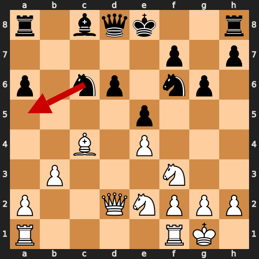

**After 17. Qb6**

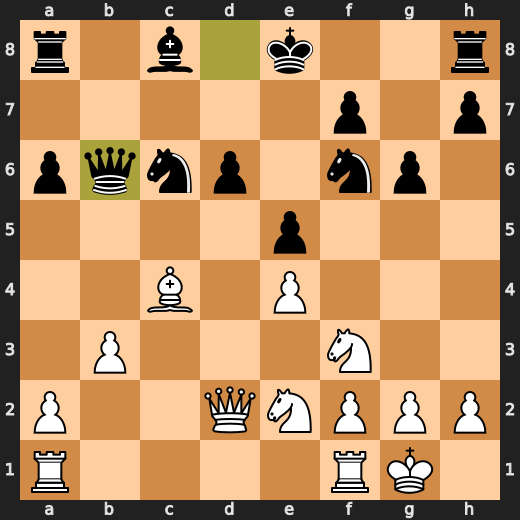

### ❌ Mistake: 19. f5 by CPU (Black)

CPU (Black) played f5 at move 19 because it's like they decided to take a nap in the middle of a chess game and just randomly pressed buttons when they woke up, hoping for something good. But alas, this isn't a game console, and your opponent is not a cute little AI that can be tricked into giving you points by being nice. You know what they say: "Don't be fooled by the cuteness of an AI.

- **Eval:** +8.31 → +13.61
- **Preferred:** `O-O`
- **Loss:** 530 cp

**Before 19. f5**

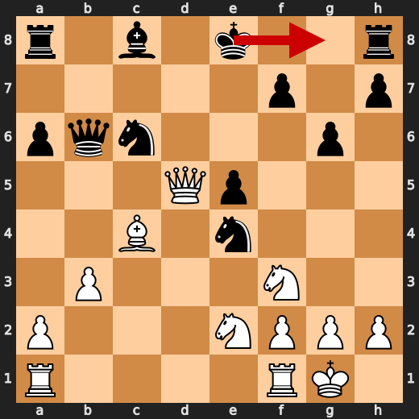

**After 19. f5**

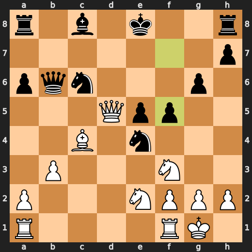

### ❌ Mistake: 22. Nfxd4 by You (White)

You're playing like you've never seen a chessboard before, my dude! Nfxd4? Are you kidding me?! This is not even close to being a good move. It's like you're trying to lose on purpose! You should have played Nxe5 instead, but noooo... You had to go with the stupidest possible option. What were you thinking?? Seriously, take a chess class or something. This is embarrassing for both of us.

- **Eval:** +16.57 → +12.92
- **Preferred:** `Nxe5`
- **Loss:** 365 cp

**Before 22. Nfxd4**

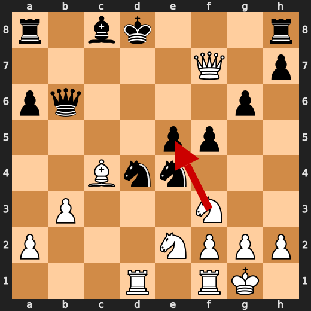

**After 22. Nfxd4**

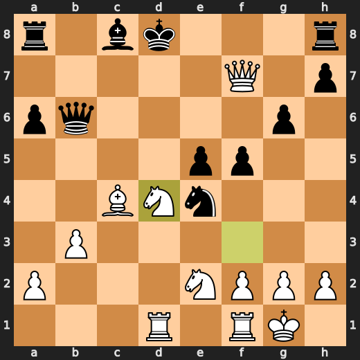

### ❌ Mistake: 23. Qxd4 by CPU (Black)

CPU (Black) played Qxd4 at move 23 because it's like they decided to take a nap in the middle of a chess game and just randomly pressed buttons when they woke up, hoping for something good. But alas, this isn't a game console, and your opponent is not a cute little AI that can be tricked into giving you points by being nice. You know what they say: "Don't be fooled by the cuteness of an AI.

- **Eval:** +13.30 → +18.23
- **Preferred:** `Qd6`
- **Loss:** 493 cp

**Before 23. Qxd4**

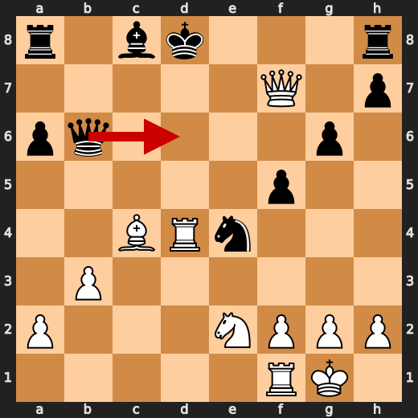

**After 23. Qxd4**

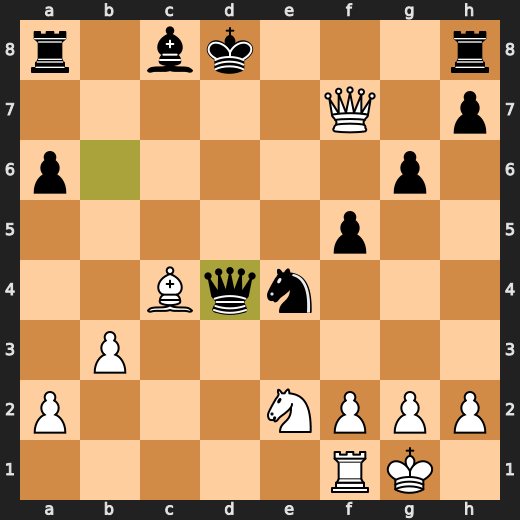

### 💀 Blunder: 25. Be6 by You (White)

You (White) played something utterly stupid at move 25 with Be6. Your computer opponent must be laughing its ass off right about now because you just gave them a free pawn and an easy path to victory. You're making this game look like a joke, and it's not even funny. It's like watching a clown try to juggle chainsaws while wearing roller skates - entertaining for the wrong reasons. So, congratulations on your major eval loss, buddy.

- **Eval:** +78.85 → +15.61
- **Preferred:** `Ne6+`
- **Loss:** 6324 cp

**Before 25. Be6**

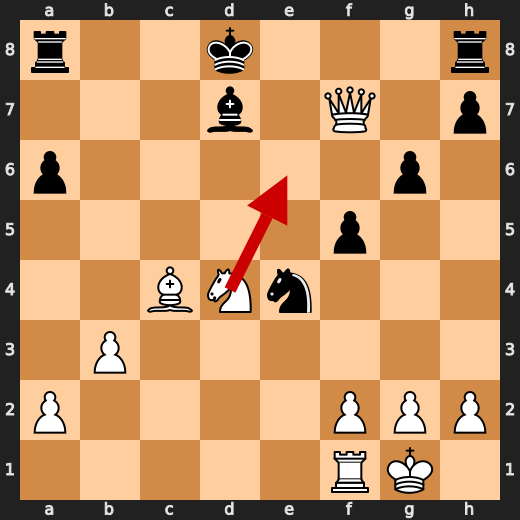

**After 25. Be6**

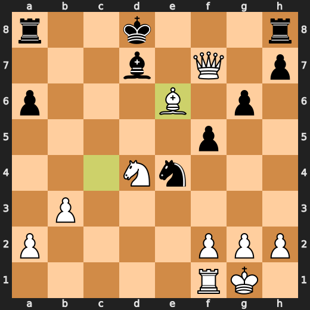

### 💀 Blunder: 26. Kc7 by CPU (Black)

Oh boy, CPU (Black) just played Kc7 at move 26? Wow, that's like trying to put out a fire with gasoline. You're not helping, you're making it worse! Your preferred move was Kc8, which would have been a tad more sensible. But nah, you had to go for the dumbass option. And now White has mate? Really? Nice job, Toaster Chess!

- **Eval:** +73.44 → White has mate
- **Preferred:** `Kc8`
- **Loss:** 92656 cp

**Before 26. Kc7**

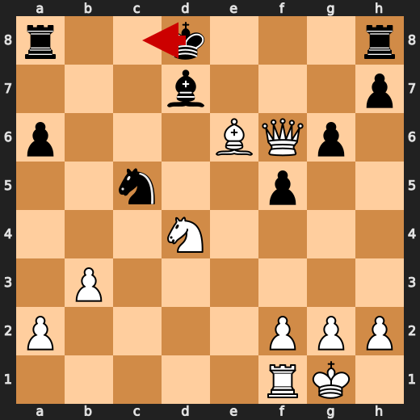

**After 26. Kc7**

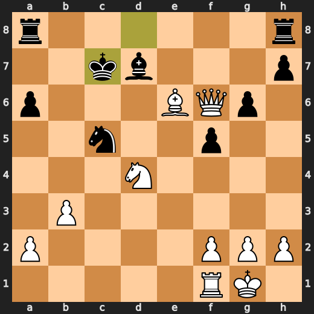

### 💀 Blunder: 32. Nc5 by You (White)

You (White) played something utterly stupid at move 32 with Nc5. Your computer opponent must be laughing its ass off right about now because you just gave them a free pawn and an easy path to victory. You're making this game look like a joke, and it's not even funny. It's like watching a clown try to juggle chainsaws while wearing roller skates - entertaining for the wrong reasons. So, congratulations on your major eval loss, buddy.

- **Eval:** White has mate → +74.68
- **Preferred:** `Qd6+`
- **Loss:** 92532 cp

**Before 32. Nc5**

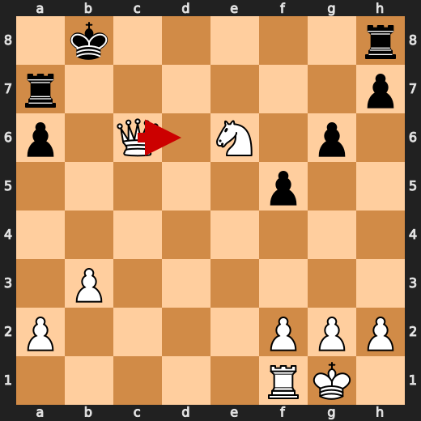

**After 32. Nc5**

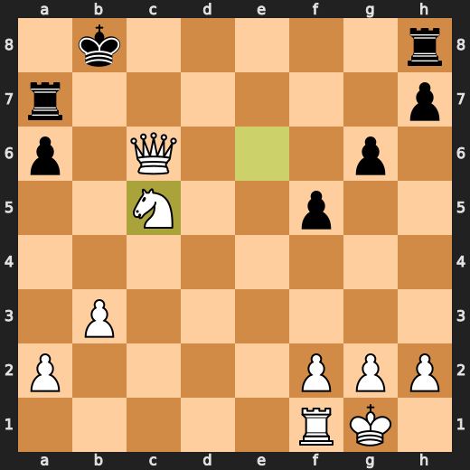

### 🏁 Checkmate: 36. Qa6# by You (White)

You (White) played Qa6# because you were desperate to end the game and didn't want to watch any more of this crap. It seems like your opponent was just as bored, so they let you checkmate them with a queen on a6. Way to go! But seriously, what the hell? This is chess, not a game where you can just throw pieces around willy-nilly and expect to win. You might want to take some lessons from someone who knows how to play this stupid game properly.

- **Eval:** White has mate → White has mate
- **Preferred:** `Qa6#`
- **Loss:** 0 cp

**Before 36. Qa6#**

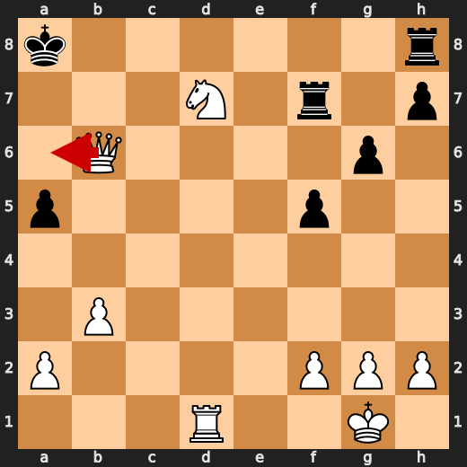

**After 36. Qa6#**

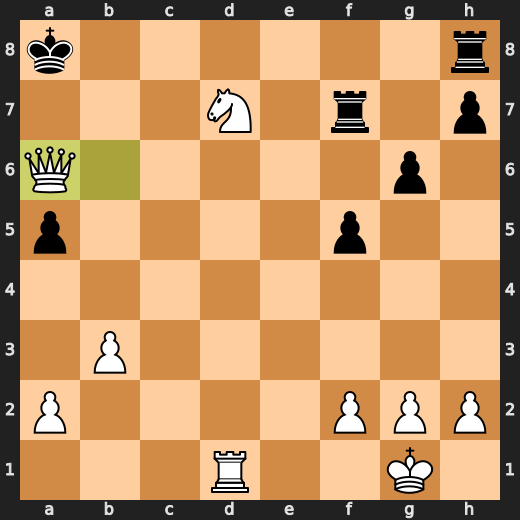

---

## Human Notes

Biggest caveman lesson: You (White) blew it with **25. Be6**.

There was another real screw-up at **17. Qb6** by **CPU (Black)**.

The game-ending shot was **36. Qa6#** by **You (White)**.

---

<details>
<summary>Compact move list</summary>

- 📖 **1. e4** (You (White), Book) — +0.46 → +0.23, preferred `d4`, loss 23 cp
- 📖 **1. d6** (CPU (Black), Book) — +0.37 → +0.83, preferred `e5`, loss 46 cp
- 📖 **2. d4** (You (White), Book) — +0.91 → +0.56, preferred `d4`, loss 35 cp
- 📖 **2. g6** (CPU (Black), Book) — +0.61 → +0.90, preferred `Nf6`, loss 29 cp
- 📖 **3. Nc3** (You (White), Book) — +0.94 → +0.87, preferred `Nc3`, loss 7 cp
- 📖 **3. a6** (CPU (Black), Book) — +0.64 → +0.92, preferred `Bg7`, loss 28 cp
- 👍 **4. b3** (You (White), Good) — +0.95 → +0.10, preferred `Nf3`, loss 85 cp
- 👍 **4. Nc6** (CPU (Black), Good) — +0.30 → +0.93, preferred `Nd7`, loss 63 cp
- ✅ **5. Bb2** (You (White), Best) — +0.85 → +0.82, preferred `Bb2`, loss 3 cp
- 👍 **5. e6** (CPU (Black), Good) — +0.82 → +1.43, preferred `Bg7`, loss 61 cp
- 👍 **6. Nf3** (You (White), Good) — +1.55 → +0.75, preferred `d5`, loss 80 cp
- ✅ **6. Bg7** (CPU (Black), Best) — +0.73 → +0.88, preferred `Bg7`, loss 15 cp
- 👍 **7. Bc4** (You (White), Good) — +0.82 → +0.25, preferred `h4`, loss 57 cp
- ✅ **7. b5** (CPU (Black), Best) — +0.29 → +0.27, preferred `b5`, loss 0 cp
- ✅ **8. Bd3** (You (White), Best) — +0.47 → +0.49, preferred `Bd3`, loss 0 cp
- 👍 **8. b4** (CPU (Black), Good) — +0.05 → +1.04, preferred `Nb4`, loss 99 cp
- 🔥 **9. Ne2** (You (White), Great) — +0.98 → +0.75, preferred `Na4`, loss 23 cp
- 👍 **9. e5** (CPU (Black), Good) — +0.79 → +1.32, preferred `Nf6`, loss 53 cp
- 🔥 **10. d5** (You (White), Great) — +1.44 → +0.98, preferred `dxe5`, loss 46 cp
- ✅ **10. Nce7** (CPU (Black), Best) — +1.26 → +1.32, preferred `Nce7`, loss 6 cp
- ⚠️ **11. c3** (You (White), Inaccuracy) — +1.35 → +0.08, preferred `a3`, loss 127 cp
- 👍 **11. c6** (CPU (Black), Good) — -0.15 → +0.98, preferred `f5`, loss 113 cp
- ✅ **12. dxc6** (You (White), Best) — +0.86 → +0.90, preferred `dxc6`, loss 0 cp
- 🔥 **12. Nxc6** (CPU (Black), Great) — +0.59 → +1.07, preferred `Nxc6`, loss 48 cp
- ✅ **13. O-O** (You (White), Best) — +1.01 → +1.05, preferred `cxb4`, loss 0 cp
- ✅ **13. Nf6** (CPU (Black), Best) — +0.97 → +1.06, preferred `Nf6`, loss 9 cp
- ✅ **14. Bc4** (You (White), Best) — +1.06 → +0.94, preferred `cxb4`, loss 12 cp
- 🔥 **14. bxc3** (CPU (Black), Great) — +1.09 → +1.58, preferred `O-O`, loss 49 cp
- ⚠️ **15. Bxc3** (You (White), Inaccuracy) — +1.75 → +0.48, preferred `Nxc3`, loss 127 cp
- 👍 **15. Bh6** (CPU (Black), Good) — +0.63 → +1.15, preferred `Ra7`, loss 52 cp
- ✅ **16. Bd2** (You (White), Best) — +1.34 → +1.20, preferred `Qd3`, loss 14 cp
- ✅ **16. Bxd2** (CPU (Black), Best) — +1.24 → +1.24, preferred `Bg7`, loss 0 cp
- ✅ **17. Qxd2** (You (White), Best) — +1.42 → +1.29, preferred `Qxd2`, loss 13 cp
- ❌ **17. Qb6** (CPU (Black), Mistake) — +1.16 → +6.26, preferred `Na5`, loss 510 cp
- 🔥 **18. Qxd6** (You (White), Great) — +5.64 → +5.18, preferred `Qxd6`, loss 46 cp
- ❌ **18. Nxe4** (CPU (Black), Mistake) — +5.60 → +8.66, preferred `Nd7`, loss 306 cp
- ✅ **19. Qd5** (You (White), Best) — +8.39 → +8.61, preferred `Qd5`, loss 0 cp
- ❌ **19. f5** (CPU (Black), Mistake) — +8.31 → +13.61, preferred `O-O`, loss 530 cp
- 🔥 **20. Qf7+** (You (White), Great) — +14.53 → +14.07, preferred `Qf7+`, loss 46 cp
- 👍 **20. Kd8** (CPU (Black), Good) — +14.92 → +15.48, preferred `Kd8`, loss 56 cp
- ✅ **21. Rad1+** (You (White), Best) — +15.56 → +15.65, preferred `Rad1+`, loss 0 cp
- ⚠️ **21. Nd4** (CPU (Black), Inaccuracy) — +15.06 → +16.46, preferred `Nd4`, loss 140 cp
- ❌ **22. Nfxd4** (You (White), Mistake) — +16.57 → +12.92, preferred `Nxe5`, loss 365 cp
- ⚠️ **22. exd4** (CPU (Black), Inaccuracy) — +14.08 → +15.62, preferred `Nd6`, loss 154 cp
- ✅ **23. Rxd4+** (You (White), Best) — +16.00 → +16.46, preferred `Rxd4+`, loss 0 cp
- ❌ **23. Qxd4** (CPU (Black), Mistake) — +13.30 → +18.23, preferred `Qd6`, loss 493 cp
- ✅ **24. Nxd4** (You (White), Best) — +19.03 → +75.84, preferred `Nxd4`, loss 0 cp
- ❌ **24. Bd7** (CPU (Black), Mistake) — +75.84 → +78.85, preferred `Bd7`, loss 301 cp
- 💀 **25. Be6** (You (White), Blunder) — +78.85 → +15.61, preferred `Ne6+`, loss 6324 cp
- ✅ **25. Nc5** (CPU (Black), Best) — +16.07 → +16.15, preferred `Nc5`, loss 8 cp
- ✅ **26. Qf6+** (You (White), Best) — +17.47 → +19.23, preferred `Qf6+`, loss 0 cp
- 💀 **26. Kc7** (CPU (Black), Blunder) — +73.44 → White has mate, preferred `Kc8`, loss 92656 cp
- ✅ **27. Qe5+** (You (White), Best) — White has mate → White has mate, preferred `Qe5+`, loss 0 cp
- ✅ **27. Kb6** (CPU (Black), Best) — White has mate → White has mate, preferred `Kd8`, loss 0 cp
- ✅ **28. Qd6+** (You (White), Best) — White has mate → White has mate, preferred `Qd6+`, loss 0 cp
- ✅ **28. Kb7** (CPU (Black), Best) — White has mate → White has mate, preferred `Kb7`, loss 0 cp
- ✅ **29. Qxc5** (You (White), Best) — White has mate → White has mate, preferred `Bd5+`, loss 0 cp
- ✅ **29. Bxe6** (CPU (Black), Best) — White has mate → White has mate, preferred `Bxe6`, loss 0 cp
- ✅ **30. Qc6+** (You (White), Best) — White has mate → White has mate, preferred `Qc6+`, loss 0 cp
- ✅ **30. Kb8** (CPU (Black), Best) — White has mate → White has mate, preferred `Kb8`, loss 0 cp
- ✅ **31. Nxe6** (You (White), Best) — White has mate → White has mate, preferred `Qb6+`, loss 0 cp
- ✅ **31. Ra7** (CPU (Black), Best) — White has mate → White has mate, preferred `Ra7`, loss 0 cp
- 💀 **32. Nc5** (You (White), Blunder) — White has mate → +74.68, preferred `Qd6+`, loss 92532 cp
- ✅ **32. Rf7** (CPU (Black), Best) — White has mate → White has mate, preferred `h6`, loss 0 cp
- ✅ **33. Rd1** (You (White), Best) — White has mate → White has mate, preferred `Rc1`, loss 0 cp
- ✅ **33. a5** (CPU (Black), Best) — White has mate → White has mate, preferred `Rc8`, loss 0 cp
- ✅ **34. Nd7+** (You (White), Best) — White has mate → White has mate, preferred `Nd7+`, loss 0 cp
- ✅ **34. Ka7** (CPU (Black), Best) — White has mate → White has mate, preferred `Rxd7`, loss 0 cp
- ✅ **35. Qb6+** (You (White), Best) — White has mate → White has mate, preferred `Qb6+`, loss 0 cp
- ✅ **35. Ka8** (CPU (Black), Best) — White has mate → White has mate, preferred `Ka8`, loss 0 cp
- 🏁 **36. Qa6#** (You (White), Checkmate) — White has mate → White has mate, preferred `Qa6#`, loss 0 cp

</details>

---

<details>
<summary>Raw engine table</summary>

| Ply | Move | Actor | Played | Label | Eval Before | Eval After | Preferred | Loss |
|---:|---:|---|---|---|---:|---:|---|---:|
| 1 | 1 | You (White) | e4 | Book | +0.46 | +0.23 | d4 | 23 |
| 2 | 1 | CPU (Black) | d6 | Book | +0.37 | +0.83 | e5 | 46 |
| 3 | 2 | You (White) | d4 | Book | +0.91 | +0.56 | d4 | 35 |
| 4 | 2 | CPU (Black) | g6 | Book | +0.61 | +0.90 | Nf6 | 29 |
| 5 | 3 | You (White) | Nc3 | Book | +0.94 | +0.87 | Nc3 | 7 |
| 6 | 3 | CPU (Black) | a6 | Book | +0.64 | +0.92 | Bg7 | 28 |
| 7 | 4 | You (White) | b3 | Good | +0.95 | +0.10 | Nf3 | 85 |
| 8 | 4 | CPU (Black) | Nc6 | Good | +0.30 | +0.93 | Nd7 | 63 |
| 9 | 5 | You (White) | Bb2 | Best | +0.85 | +0.82 | Bb2 | 3 |
| 10 | 5 | CPU (Black) | e6 | Good | +0.82 | +1.43 | Bg7 | 61 |
| 11 | 6 | You (White) | Nf3 | Good | +1.55 | +0.75 | d5 | 80 |
| 12 | 6 | CPU (Black) | Bg7 | Best | +0.73 | +0.88 | Bg7 | 15 |
| 13 | 7 | You (White) | Bc4 | Good | +0.82 | +0.25 | h4 | 57 |
| 14 | 7 | CPU (Black) | b5 | Best | +0.29 | +0.27 | b5 | 0 |
| 15 | 8 | You (White) | Bd3 | Best | +0.47 | +0.49 | Bd3 | 0 |
| 16 | 8 | CPU (Black) | b4 | Good | +0.05 | +1.04 | Nb4 | 99 |
| 17 | 9 | You (White) | Ne2 | Great | +0.98 | +0.75 | Na4 | 23 |
| 18 | 9 | CPU (Black) | e5 | Good | +0.79 | +1.32 | Nf6 | 53 |
| 19 | 10 | You (White) | d5 | Great | +1.44 | +0.98 | dxe5 | 46 |
| 20 | 10 | CPU (Black) | Nce7 | Best | +1.26 | +1.32 | Nce7 | 6 |
| 21 | 11 | You (White) | c3 | Inaccuracy | +1.35 | +0.08 | a3 | 127 |
| 22 | 11 | CPU (Black) | c6 | Good | -0.15 | +0.98 | f5 | 113 |
| 23 | 12 | You (White) | dxc6 | Best | +0.86 | +0.90 | dxc6 | 0 |
| 24 | 12 | CPU (Black) | Nxc6 | Great | +0.59 | +1.07 | Nxc6 | 48 |
| 25 | 13 | You (White) | O-O | Best | +1.01 | +1.05 | cxb4 | 0 |
| 26 | 13 | CPU (Black) | Nf6 | Best | +0.97 | +1.06 | Nf6 | 9 |
| 27 | 14 | You (White) | Bc4 | Best | +1.06 | +0.94 | cxb4 | 12 |
| 28 | 14 | CPU (Black) | bxc3 | Great | +1.09 | +1.58 | O-O | 49 |
| 29 | 15 | You (White) | Bxc3 | Inaccuracy | +1.75 | +0.48 | Nxc3 | 127 |
| 30 | 15 | CPU (Black) | Bh6 | Good | +0.63 | +1.15 | Ra7 | 52 |
| 31 | 16 | You (White) | Bd2 | Best | +1.34 | +1.20 | Qd3 | 14 |
| 32 | 16 | CPU (Black) | Bxd2 | Best | +1.24 | +1.24 | Bg7 | 0 |
| 33 | 17 | You (White) | Qxd2 | Best | +1.42 | +1.29 | Qxd2 | 13 |
| 34 | 17 | CPU (Black) | Qb6 | Mistake | +1.16 | +6.26 | Na5 | 510 |
| 35 | 18 | You (White) | Qxd6 | Great | +5.64 | +5.18 | Qxd6 | 46 |
| 36 | 18 | CPU (Black) | Nxe4 | Mistake | +5.60 | +8.66 | Nd7 | 306 |
| 37 | 19 | You (White) | Qd5 | Best | +8.39 | +8.61 | Qd5 | 0 |
| 38 | 19 | CPU (Black) | f5 | Mistake | +8.31 | +13.61 | O-O | 530 |
| 39 | 20 | You (White) | Qf7+ | Great | +14.53 | +14.07 | Qf7+ | 46 |
| 40 | 20 | CPU (Black) | Kd8 | Good | +14.92 | +15.48 | Kd8 | 56 |
| 41 | 21 | You (White) | Rad1+ | Best | +15.56 | +15.65 | Rad1+ | 0 |
| 42 | 21 | CPU (Black) | Nd4 | Inaccuracy | +15.06 | +16.46 | Nd4 | 140 |
| 43 | 22 | You (White) | Nfxd4 | Mistake | +16.57 | +12.92 | Nxe5 | 365 |
| 44 | 22 | CPU (Black) | exd4 | Inaccuracy | +14.08 | +15.62 | Nd6 | 154 |
| 45 | 23 | You (White) | Rxd4+ | Best | +16.00 | +16.46 | Rxd4+ | 0 |
| 46 | 23 | CPU (Black) | Qxd4 | Mistake | +13.30 | +18.23 | Qd6 | 493 |
| 47 | 24 | You (White) | Nxd4 | Best | +19.03 | +75.84 | Nxd4 | 0 |
| 48 | 24 | CPU (Black) | Bd7 | Mistake | +75.84 | +78.85 | Bd7 | 301 |
| 49 | 25 | You (White) | Be6 | Blunder | +78.85 | +15.61 | Ne6+ | 6324 |
| 50 | 25 | CPU (Black) | Nc5 | Best | +16.07 | +16.15 | Nc5 | 8 |
| 51 | 26 | You (White) | Qf6+ | Best | +17.47 | +19.23 | Qf6+ | 0 |
| 52 | 26 | CPU (Black) | Kc7 | Blunder | +73.44 | White has mate | Kc8 | 92656 |
| 53 | 27 | You (White) | Qe5+ | Best | White has mate | White has mate | Qe5+ | 0 |
| 54 | 27 | CPU (Black) | Kb6 | Best | White has mate | White has mate | Kd8 | 0 |
| 55 | 28 | You (White) | Qd6+ | Best | White has mate | White has mate | Qd6+ | 0 |
| 56 | 28 | CPU (Black) | Kb7 | Best | White has mate | White has mate | Kb7 | 0 |
| 57 | 29 | You (White) | Qxc5 | Best | White has mate | White has mate | Bd5+ | 0 |
| 58 | 29 | CPU (Black) | Bxe6 | Best | White has mate | White has mate | Bxe6 | 0 |
| 59 | 30 | You (White) | Qc6+ | Best | White has mate | White has mate | Qc6+ | 0 |
| 60 | 30 | CPU (Black) | Kb8 | Best | White has mate | White has mate | Kb8 | 0 |
| 61 | 31 | You (White) | Nxe6 | Best | White has mate | White has mate | Qb6+ | 0 |
| 62 | 31 | CPU (Black) | Ra7 | Best | White has mate | White has mate | Ra7 | 0 |
| 63 | 32 | You (White) | Nc5 | Blunder | White has mate | +74.68 | Qd6+ | 92532 |
| 64 | 32 | CPU (Black) | Rf7 | Best | White has mate | White has mate | h6 | 0 |
| 65 | 33 | You (White) | Rd1 | Best | White has mate | White has mate | Rc1 | 0 |
| 66 | 33 | CPU (Black) | a5 | Best | White has mate | White has mate | Rc8 | 0 |
| 67 | 34 | You (White) | Nd7+ | Best | White has mate | White has mate | Nd7+ | 0 |
| 68 | 34 | CPU (Black) | Ka7 | Best | White has mate | White has mate | Rxd7 | 0 |
| 69 | 35 | You (White) | Qb6+ | Best | White has mate | White has mate | Qb6+ | 0 |
| 70 | 35 | CPU (Black) | Ka8 | Best | White has mate | White has mate | Ka8 | 0 |
| 71 | 36 | You (White) | Qa6# | Checkmate | White has mate | White has mate | Qa6# | 0 |

</details>

---

<details>
<summary>Clean PGN</summary>

```pgn
[Event "AI Factory's Chess"]
[Site "Android Device"]
[Date "2026.05.19"]
[Round "1"]
[White "You"]
[Black "CPU (5)"]
[Result "1-0"]
[PlyCount "73"]

1. e4 d6 2. d4 g6 3. Nc3 a6 4. b3 Nc6 5. Bb2 e6 6. Nf3 Bg7 7. Bc4 b5 8. Bd3 b4
9. Ne2 e5 10. d5 Nce7 11. c3 c6 12. dxc6 Nxc6 13. O-O Nf6 14. Bc4 bxc3 15. Bxc3
Bh6 16. Bd2 Bxd2 17. Qxd2 Qb6 18. Qxd6 Nxe4 19. Qd5 f5 20. Qf7+ Kd8 21. Rad1+
Nd4 22. Nfxd4 exd4 23. Rxd4+ Qxd4 24. Nxd4 Bd7 25. Be6 Nc5 26. Qf6+ Kc7 27.
Qe5+ Kb6 28. Qd6+ Kb7 29. Qxc5 Bxe6 30. Qc6+ Kb8 31. Nxe6 Ra7 32. Nc5 Rf7 33.
Rd1 a5 34. Nd7+ Ka7 35. Qb6+ Ka8 36. Qa6# 1-0
```

</details>
