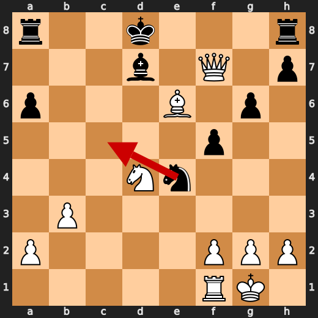
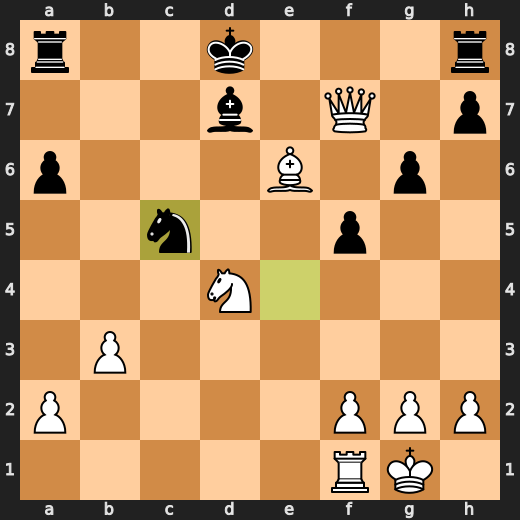
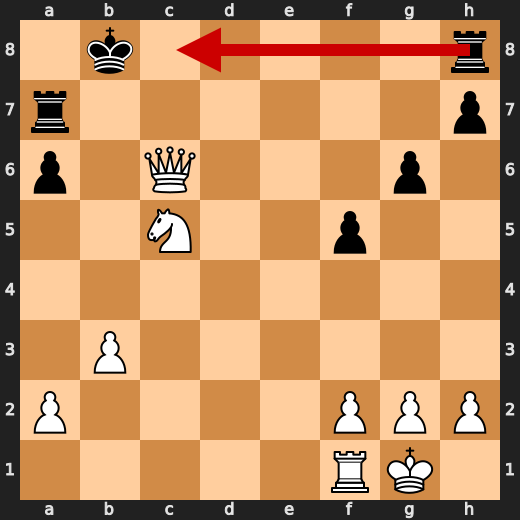
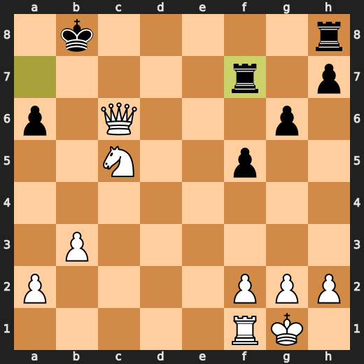

# You (White) vs CPU (Black)

**Result:** 1-0  
**Date:** 2026.05.19  
**Source:** `PGN_2026_05_19_18h10_aa8c56bacfa2.pgn`  
**Engine:** Stockfish depth 14  
**Your side:** White  
**Computer side:** Black  
**Board perspective:** Standard White-at-bottom

---

## Who Is Who

- **You:** You (White)
- **Computer:** CPU (5) (Black)

---

## Toaster Summary

**Game Story:** In a Pirc Defense, Black’s 17...Qb6 and 19...f5 let your attack become overwhelming. Your 32.Nc5 missed a stronger forced finish, so the conversion was sloppy, but Black’s 32...Rf7 failed to stop the mating net. The practical lesson is to look for forcing rook moves and mate threats before choosing a good-looking knight move. You finished the win with 36.Qa6#.

Biggest toaster scream: **32. Nc5** by **You (White)**.

- **Label:** 💀 **Blunder**
- **Eval:** White has mate → +12.38
- **Stockfish preferred:** `Rc1`
- **Loss:** 98762 cp

Final move recorded: **36. Qa6#** by **You (White)**.

- 💀 Your blunders: **1**
- ❌ Your mistakes: **1**
- ⚠️ Your inaccuracies: **2**
- ✅ Your best moves called out: **20**

---

## Final Position


---

## Key Moments

### ❌ Mistake: 17. Qb6 by CPU (Black)

Qb6 worsened Black’s position significantly without addressing the main defensive need. Na5 was preferred because it improves Black’s position more directly than moving the queen to b6. Learn to check whether a queen move actually solves a concrete problem before playing it.

- **Eval:** +1.21 → +5.92
- **Preferred:** `Na5`
- **Loss:** 471 cp

**Before 17. Qb6**


**After 17. Qb6**


### 💀 Blunder: 19. f5 by CPU (Black)

f5 failed to address Black’s urgent king safety problem and worsened an already losing position. O-O was preferred because it would at least move the king toward safety instead of spending a move on the pawn.

- **Eval:** +8.23 → +15.72
- **Preferred:** `O-O`
- **Loss:** 749 cp

**Before 19. f5**


**After 19. f5**


### ❌ Mistake: 22. Nfxd4 by You (White)

Nfxd4 worsened the position despite still leaving White ahead, because it missed the stronger Nxe5. Learn to compare captures and choose the one that improves the position most, not just the first useful-looking recapture.

- **Eval:** +18.46 → +13.78
- **Preferred:** `Nxe5`
- **Loss:** 468 cp

**Before 22. Nfxd4**


**After 22. Nfxd4**


### ❌ Mistake: 23. Qxd4 by CPU (Black)

Qxd4 still worsened Black’s position significantly, despite the engine fact listing the same move as preferred. The practical lesson is to recognize that a move can win material or look active but still fail if it does not improve the position’s main defensive problems.

- **Eval:** +13.08 → +17.53
- **Preferred:** `Qxd4`
- **Loss:** 445 cp

**Before 23. Qxd4**


**After 23. Qxd4**


### ❌ Mistake: 25. Nc5 by CPU (Black)

Nc5 was also the engine’s preferred move, so the useful idea is that Black at least chose the best available practical try. The position still became worse for Black, so the lesson is to judge a move by whether it changes the defensive situation, not just by whether it is the top engine choice.

- **Eval:** +72.68 → +75.82
- **Preferred:** `Nc5`
- **Loss:** 314 cp

**Before 25. Nc5**



**After 25. Nc5**



### 💀 Blunder: 32. Nc5 by You (White)

Nc5 failed to keep White’s forced mate available and worsened the position. Rc1 was preferred because it preserved the strongest continuation, so the key pattern is to choose forcing moves carefully when mate is available.

- **Eval:** White has mate → +12.38
- **Preferred:** `Rc1`
- **Loss:** 98762 cp

**Before 32. Nc5**


**After 32. Nc5**


### 💀 Blunder: 32. Rf7 by CPU (Black)

Rf7 worsened Black’s position so severely that White now has a forced mate. Rc8 was preferred because it was the better defensive try compared with moving the rook to f7.

- **Eval:** +74.69 → White has mate
- **Preferred:** `Rc8`
- **Loss:** 92531 cp

**Before 32. Rf7**



**After 32. Rf7**



### 🏁 Checkmate: 36. Qa6# by You (White)

Qa6# was the preferred move and it immediately ended the game by checkmate. The key pattern is to recognize a forcing move that leaves the opponent with no playable reply.

- **Eval:** White has mate → White has mate
- **Preferred:** `Qa6#`
- **Loss:** 0 cp

**Before 36. Qa6#**


**After 36. Qa6#**


---

## Human Notes

Biggest caveman lesson: CPU (Black) blew it with **19. f5**.

There was another real screw-up at **17. Qb6** by **CPU (Black)**.

The game-ending shot was **36. Qa6#** by **You (White)**.

---

<details>
<summary>Compact move list</summary>

- 📖 **1. e4** (You (White), Book) — +0.46 → +0.38, preferred `d4`, loss 8 cp
- 📖 **1. d6** (CPU (Black), Book) — +0.33 → +0.87, preferred `c5`, loss 54 cp
- 📖 **2. d4** (You (White), Book) — +0.83 → +0.59, preferred `d4`, loss 24 cp
- 📖 **2. g6** (CPU (Black), Book) — +0.64 → +0.88, preferred `e5`, loss 24 cp
- 📖 **3. Nc3** (You (White), Book) — +0.87 → +0.90, preferred `Nc3`, loss 0 cp
- 📖 **3. a6** (CPU (Black), Book) — +0.86 → +0.87, preferred `Nf6`, loss 1 cp
- 👍 **4. b3** (You (White), Good) — +1.01 → +0.10, preferred `Nf3`, loss 91 cp
- 👍 **4. Nc6** (CPU (Black), Good) — +0.06 → +0.66, preferred `Nd7`, loss 60 cp
- ✅ **5. Bb2** (You (White), Best) — +1.13 → +1.03, preferred `Bb2`, loss 10 cp
- 👍 **5. e6** (CPU (Black), Good) — +1.05 → +1.65, preferred `Bg7`, loss 60 cp
- 👍 **6. Nf3** (You (White), Good) — +1.54 → +0.68, preferred `d5`, loss 86 cp
- ✅ **6. Bg7** (CPU (Black), Best) — +0.57 → +0.68, preferred `Bg7`, loss 11 cp
- 🔥 **7. Bc4** (You (White), Great) — +0.67 → +0.24, preferred `Qd2`, loss 43 cp
- 🔥 **7. b5** (CPU (Black), Great) — +0.15 → +0.31, preferred `b5`, loss 16 cp
- ✅ **8. Bd3** (You (White), Best) — +0.26 → +0.24, preferred `Bd3`, loss 2 cp
- 👍 **8. b4** (CPU (Black), Good) — +0.17 → +0.68, preferred `Nb4`, loss 51 cp
- 🔥 **9. Ne2** (You (White), Great) — +1.01 → +0.69, preferred `Na4`, loss 32 cp
- 🔥 **9. e5** (CPU (Black), Great) — +0.77 → +1.25, preferred `Bb7`, loss 48 cp
- 🔥 **10. d5** (You (White), Great) — +1.61 → +1.23, preferred `dxe5`, loss 38 cp
- ✅ **10. Nce7** (CPU (Black), Best) — +1.32 → +1.24, preferred `Nce7`, loss 0 cp
- ⚠️ **11. c3** (You (White), Inaccuracy) — +1.42 → +0.00, preferred `a3`, loss 142 cp
- 👍 **11. c6** (CPU (Black), Good) — -0.11 → +0.88, preferred `f5`, loss 99 cp
- ✅ **12. dxc6** (You (White), Best) — +0.96 → +0.77, preferred `dxc6`, loss 19 cp
- ✅ **12. Nxc6** (CPU (Black), Best) — +0.80 → +0.97, preferred `Nxc6`, loss 17 cp
- 🔥 **13. O-O** (You (White), Great) — +0.97 → +0.68, preferred `cxb4`, loss 29 cp
- ✅ **13. Nf6** (CPU (Black), Best) — +0.84 → +0.82, preferred `Nf6`, loss 0 cp
- ✅ **14. Bc4** (You (White), Best) — +0.85 → +0.86, preferred `cxb4`, loss 0 cp
- 🔥 **14. bxc3** (CPU (Black), Great) — +0.79 → +1.26, preferred `a5`, loss 47 cp
- 👍 **15. Bxc3** (You (White), Good) — +1.43 → +0.47, preferred `Nxc3`, loss 96 cp
- 👍 **15. Bh6** (CPU (Black), Good) — +0.56 → +1.29, preferred `O-O`, loss 73 cp
- ✅ **16. Bd2** (You (White), Best) — +1.29 → +1.17, preferred `Bd2`, loss 12 cp
- ✅ **16. Bxd2** (CPU (Black), Best) — +1.13 → +0.94, preferred `Bxd2`, loss 0 cp
- ✅ **17. Qxd2** (You (White), Best) — +1.19 → +1.11, preferred `Qxd2`, loss 8 cp
- ❌ **17. Qb6** (CPU (Black), Mistake) — +1.21 → +5.92, preferred `Na5`, loss 471 cp
- ⚠️ **18. Qxd6** (You (White), Inaccuracy) — +6.54 → +5.00, preferred `Qxd6`, loss 154 cp
- ⚠️ **18. Nxe4** (CPU (Black), Inaccuracy) — +6.58 → +8.68, preferred `Nd7`, loss 210 cp
- ✅ **19. Qd5** (You (White), Best) — +8.17 → +8.38, preferred `Qd5`, loss 0 cp
- 💀 **19. f5** (CPU (Black), Blunder) — +8.23 → +15.72, preferred `O-O`, loss 749 cp
- ✅ **20. Qf7+** (You (White), Best) — +16.02 → +16.76, preferred `Qf7+`, loss 0 cp
- ✅ **20. Kd8** (CPU (Black), Best) — +16.92 → +17.00, preferred `Kd8`, loss 8 cp
- ✅ **21. Rad1+** (You (White), Best) — +17.56 → +18.17, preferred `Rad1+`, loss 0 cp
- ✅ **21. Nd4** (CPU (Black), Best) — +18.65 → +18.31, preferred `Nd4`, loss 0 cp
- ❌ **22. Nfxd4** (You (White), Mistake) — +18.46 → +13.78, preferred `Nxe5`, loss 468 cp
- 👍 **22. exd4** (CPU (Black), Good) — +13.64 → +14.40, preferred `exd4`, loss 76 cp
- 👍 **23. Rxd4+** (You (White), Good) — +14.51 → +13.69, preferred `Nxd4`, loss 82 cp
- ❌ **23. Qxd4** (CPU (Black), Mistake) — +13.08 → +17.53, preferred `Qxd4`, loss 445 cp
- ✅ **24. Nxd4** (You (White), Best) — +18.38 → +19.92, preferred `Nxd4`, loss 0 cp
- ✅ **24. Bd7** (CPU (Black), Best) — +69.44 → +20.46, preferred `Bd7`, loss 0 cp
- ✅ **25. Be6** (You (White), Best) — +69.48 → +75.79, preferred `Ne6+`, loss 0 cp
- ❌ **25. Nc5** (CPU (Black), Mistake) — +72.68 → +75.82, preferred `Nc5`, loss 314 cp
- ✅ **26. Qf6+** (You (White), Best) — White has mate → White has mate, preferred `Qf6+`, loss 0 cp
- ✅ **26. Kc7** (CPU (Black), Best) — White has mate → White has mate, preferred `Kc8`, loss 0 cp
- ✅ **27. Qe5+** (You (White), Best) — White has mate → White has mate, preferred `Rc1`, loss 0 cp
- ✅ **27. Kb6** (CPU (Black), Best) — White has mate → White has mate, preferred `Kd8`, loss 0 cp
- ✅ **28. Qd6+** (You (White), Best) — White has mate → White has mate, preferred `Qd6+`, loss 0 cp
- ✅ **28. Kb7** (CPU (Black), Best) — White has mate → White has mate, preferred `Kb7`, loss 0 cp
- ✅ **29. Qxc5** (You (White), Best) — White has mate → White has mate, preferred `Bd5+`, loss 0 cp
- ✅ **29. Bxe6** (CPU (Black), Best) — White has mate → White has mate, preferred `Rac8`, loss 0 cp
- ✅ **30. Qc6+** (You (White), Best) — White has mate → White has mate, preferred `Qc6+`, loss 0 cp
- ✅ **30. Kb8** (CPU (Black), Best) — White has mate → White has mate, preferred `Kb8`, loss 0 cp
- ✅ **31. Nxe6** (You (White), Best) — White has mate → White has mate, preferred `Qb6+`, loss 0 cp
- ✅ **31. Ra7** (CPU (Black), Best) — White has mate → White has mate, preferred `Ra7`, loss 0 cp
- 💀 **32. Nc5** (You (White), Blunder) — White has mate → +12.38, preferred `Rc1`, loss 98762 cp
- 💀 **32. Rf7** (CPU (Black), Blunder) — +74.69 → White has mate, preferred `Rc8`, loss 92531 cp
- ✅ **33. Rd1** (You (White), Best) — White has mate → White has mate, preferred `Rc1`, loss 0 cp
- ✅ **33. a5** (CPU (Black), Best) — White has mate → White has mate, preferred `Rc8`, loss 0 cp
- ✅ **34. Nd7+** (You (White), Best) — White has mate → White has mate, preferred `Nd7+`, loss 0 cp
- ✅ **34. Ka7** (CPU (Black), Best) — White has mate → White has mate, preferred `Rxd7`, loss 0 cp
- ✅ **35. Qb6+** (You (White), Best) — White has mate → White has mate, preferred `Qb6+`, loss 0 cp
- ✅ **35. Ka8** (CPU (Black), Best) — White has mate → White has mate, preferred `Ka8`, loss 0 cp
- 🏁 **36. Qa6#** (You (White), Checkmate) — White has mate → White has mate, preferred `Qa6#`, loss 0 cp

</details>

---

<details>
<summary>Raw engine table</summary>

| Ply | Move | Actor | Played | Label | Eval Before | Eval After | Preferred | Loss |
|---:|---:|---|---|---|---:|---:|---|---:|
| 1 | 1 | You (White) | e4 | Book | +0.46 | +0.38 | d4 | 8 |
| 2 | 1 | CPU (Black) | d6 | Book | +0.33 | +0.87 | c5 | 54 |
| 3 | 2 | You (White) | d4 | Book | +0.83 | +0.59 | d4 | 24 |
| 4 | 2 | CPU (Black) | g6 | Book | +0.64 | +0.88 | e5 | 24 |
| 5 | 3 | You (White) | Nc3 | Book | +0.87 | +0.90 | Nc3 | 0 |
| 6 | 3 | CPU (Black) | a6 | Book | +0.86 | +0.87 | Nf6 | 1 |
| 7 | 4 | You (White) | b3 | Good | +1.01 | +0.10 | Nf3 | 91 |
| 8 | 4 | CPU (Black) | Nc6 | Good | +0.06 | +0.66 | Nd7 | 60 |
| 9 | 5 | You (White) | Bb2 | Best | +1.13 | +1.03 | Bb2 | 10 |
| 10 | 5 | CPU (Black) | e6 | Good | +1.05 | +1.65 | Bg7 | 60 |
| 11 | 6 | You (White) | Nf3 | Good | +1.54 | +0.68 | d5 | 86 |
| 12 | 6 | CPU (Black) | Bg7 | Best | +0.57 | +0.68 | Bg7 | 11 |
| 13 | 7 | You (White) | Bc4 | Great | +0.67 | +0.24 | Qd2 | 43 |
| 14 | 7 | CPU (Black) | b5 | Great | +0.15 | +0.31 | b5 | 16 |
| 15 | 8 | You (White) | Bd3 | Best | +0.26 | +0.24 | Bd3 | 2 |
| 16 | 8 | CPU (Black) | b4 | Good | +0.17 | +0.68 | Nb4 | 51 |
| 17 | 9 | You (White) | Ne2 | Great | +1.01 | +0.69 | Na4 | 32 |
| 18 | 9 | CPU (Black) | e5 | Great | +0.77 | +1.25 | Bb7 | 48 |
| 19 | 10 | You (White) | d5 | Great | +1.61 | +1.23 | dxe5 | 38 |
| 20 | 10 | CPU (Black) | Nce7 | Best | +1.32 | +1.24 | Nce7 | 0 |
| 21 | 11 | You (White) | c3 | Inaccuracy | +1.42 | +0.00 | a3 | 142 |
| 22 | 11 | CPU (Black) | c6 | Good | -0.11 | +0.88 | f5 | 99 |
| 23 | 12 | You (White) | dxc6 | Best | +0.96 | +0.77 | dxc6 | 19 |
| 24 | 12 | CPU (Black) | Nxc6 | Best | +0.80 | +0.97 | Nxc6 | 17 |
| 25 | 13 | You (White) | O-O | Great | +0.97 | +0.68 | cxb4 | 29 |
| 26 | 13 | CPU (Black) | Nf6 | Best | +0.84 | +0.82 | Nf6 | 0 |
| 27 | 14 | You (White) | Bc4 | Best | +0.85 | +0.86 | cxb4 | 0 |
| 28 | 14 | CPU (Black) | bxc3 | Great | +0.79 | +1.26 | a5 | 47 |
| 29 | 15 | You (White) | Bxc3 | Good | +1.43 | +0.47 | Nxc3 | 96 |
| 30 | 15 | CPU (Black) | Bh6 | Good | +0.56 | +1.29 | O-O | 73 |
| 31 | 16 | You (White) | Bd2 | Best | +1.29 | +1.17 | Bd2 | 12 |
| 32 | 16 | CPU (Black) | Bxd2 | Best | +1.13 | +0.94 | Bxd2 | 0 |
| 33 | 17 | You (White) | Qxd2 | Best | +1.19 | +1.11 | Qxd2 | 8 |
| 34 | 17 | CPU (Black) | Qb6 | Mistake | +1.21 | +5.92 | Na5 | 471 |
| 35 | 18 | You (White) | Qxd6 | Inaccuracy | +6.54 | +5.00 | Qxd6 | 154 |
| 36 | 18 | CPU (Black) | Nxe4 | Inaccuracy | +6.58 | +8.68 | Nd7 | 210 |
| 37 | 19 | You (White) | Qd5 | Best | +8.17 | +8.38 | Qd5 | 0 |
| 38 | 19 | CPU (Black) | f5 | Blunder | +8.23 | +15.72 | O-O | 749 |
| 39 | 20 | You (White) | Qf7+ | Best | +16.02 | +16.76 | Qf7+ | 0 |
| 40 | 20 | CPU (Black) | Kd8 | Best | +16.92 | +17.00 | Kd8 | 8 |
| 41 | 21 | You (White) | Rad1+ | Best | +17.56 | +18.17 | Rad1+ | 0 |
| 42 | 21 | CPU (Black) | Nd4 | Best | +18.65 | +18.31 | Nd4 | 0 |
| 43 | 22 | You (White) | Nfxd4 | Mistake | +18.46 | +13.78 | Nxe5 | 468 |
| 44 | 22 | CPU (Black) | exd4 | Good | +13.64 | +14.40 | exd4 | 76 |
| 45 | 23 | You (White) | Rxd4+ | Good | +14.51 | +13.69 | Nxd4 | 82 |
| 46 | 23 | CPU (Black) | Qxd4 | Mistake | +13.08 | +17.53 | Qxd4 | 445 |
| 47 | 24 | You (White) | Nxd4 | Best | +18.38 | +19.92 | Nxd4 | 0 |
| 48 | 24 | CPU (Black) | Bd7 | Best | +69.44 | +20.46 | Bd7 | 0 |
| 49 | 25 | You (White) | Be6 | Best | +69.48 | +75.79 | Ne6+ | 0 |
| 50 | 25 | CPU (Black) | Nc5 | Mistake | +72.68 | +75.82 | Nc5 | 314 |
| 51 | 26 | You (White) | Qf6+ | Best | White has mate | White has mate | Qf6+ | 0 |
| 52 | 26 | CPU (Black) | Kc7 | Best | White has mate | White has mate | Kc8 | 0 |
| 53 | 27 | You (White) | Qe5+ | Best | White has mate | White has mate | Rc1 | 0 |
| 54 | 27 | CPU (Black) | Kb6 | Best | White has mate | White has mate | Kd8 | 0 |
| 55 | 28 | You (White) | Qd6+ | Best | White has mate | White has mate | Qd6+ | 0 |
| 56 | 28 | CPU (Black) | Kb7 | Best | White has mate | White has mate | Kb7 | 0 |
| 57 | 29 | You (White) | Qxc5 | Best | White has mate | White has mate | Bd5+ | 0 |
| 58 | 29 | CPU (Black) | Bxe6 | Best | White has mate | White has mate | Rac8 | 0 |
| 59 | 30 | You (White) | Qc6+ | Best | White has mate | White has mate | Qc6+ | 0 |
| 60 | 30 | CPU (Black) | Kb8 | Best | White has mate | White has mate | Kb8 | 0 |
| 61 | 31 | You (White) | Nxe6 | Best | White has mate | White has mate | Qb6+ | 0 |
| 62 | 31 | CPU (Black) | Ra7 | Best | White has mate | White has mate | Ra7 | 0 |
| 63 | 32 | You (White) | Nc5 | Blunder | White has mate | +12.38 | Rc1 | 98762 |
| 64 | 32 | CPU (Black) | Rf7 | Blunder | +74.69 | White has mate | Rc8 | 92531 |
| 65 | 33 | You (White) | Rd1 | Best | White has mate | White has mate | Rc1 | 0 |
| 66 | 33 | CPU (Black) | a5 | Best | White has mate | White has mate | Rc8 | 0 |
| 67 | 34 | You (White) | Nd7+ | Best | White has mate | White has mate | Nd7+ | 0 |
| 68 | 34 | CPU (Black) | Ka7 | Best | White has mate | White has mate | Rxd7 | 0 |
| 69 | 35 | You (White) | Qb6+ | Best | White has mate | White has mate | Qb6+ | 0 |
| 70 | 35 | CPU (Black) | Ka8 | Best | White has mate | White has mate | Ka8 | 0 |
| 71 | 36 | You (White) | Qa6# | Checkmate | White has mate | White has mate | Qa6# | 0 |

</details>

---

<details>
<summary>Clean PGN</summary>

```pgn
[Event "AI Factory's Chess"]
[Site "Android Device"]
[Date "2026.05.19"]
[Round "1"]
[White "You"]
[Black "CPU (5)"]
[Result "1-0"]
[PlyCount "73"]

1. e4 d6 2. d4 g6 3. Nc3 a6 4. b3 Nc6 5. Bb2 e6 6. Nf3 Bg7 7. Bc4 b5 8. Bd3 b4
9. Ne2 e5 10. d5 Nce7 11. c3 c6 12. dxc6 Nxc6 13. O-O Nf6 14. Bc4 bxc3 15. Bxc3
Bh6 16. Bd2 Bxd2 17. Qxd2 Qb6 18. Qxd6 Nxe4 19. Qd5 f5 20. Qf7+ Kd8 21. Rad1+
Nd4 22. Nfxd4 exd4 23. Rxd4+ Qxd4 24. Nxd4 Bd7 25. Be6 Nc5 26. Qf6+ Kc7 27.
Qe5+ Kb6 28. Qd6+ Kb7 29. Qxc5 Bxe6 30. Qc6+ Kb8 31. Nxe6 Ra7 32. Nc5 Rf7 33.
Rd1 a5 34. Nd7+ Ka7 35. Qb6+ Ka8 36. Qa6# 1-0
```

</details>
