# You (White) vs CPU (Black)

**Result:** 1-0  
**Date:** 2026.05.19  
**Source:** `PGN_2026_05_19_22h55_a5d18ad91f98.pgn`  
**Engine:** Stockfish depth 14  
**Your side:** White  
**Computer side:** Black  
**Board perspective:** Standard White-at-bottom

---

## Who Is Who

- **You:** You (White)
- **Computer:** CPU (5) (Black)

---

## Toaster Summary

**Game Story:** In this game, White (You) won against Black (CPU) with a final move of 47. Rh7#. The biggest engine complaint overall was on Move 43 Bd1 by CPU (Black), which was labeled as a blunder. This move missed the stronger continuation g5, leading to an eval loss of 93341 cp. The key lesson for White is that it's essential to maintain control and pressure throughout the game while avoiding unnecessary risks or sacrifices. In this case, Move 42 Rxa7 by You (White) was a blunder; you should have preferred h4 instead, which would have retained your eval advantage of +60.60 to +23.84 cp. For Black, the biggest mistake was on Move 19 c6, where they missed out on the preferred move Nb7. This led to an eval loss of 429 cp for Black. Additionally, on Move 42 Be2 by CPU (Black), they also missed the stronger continuation g5, resulting in another eval loss of 453 cp. In conclusion, White won cleanly with a checkmate at move 47 Rh7#. While both sides made mistakes throughout the game, it was ultimately the decisive blunder by Black on Move 43 Bd1 that led to their defeat. To improve your chess skills, focus on maintaining control and pressure while avoiding unnecessary risks or sacrifices.

Biggest toaster scream: **43. Bd1** by **CPU (Black)**.

- **Label:** 💀 **Blunder**
- **Eval:** +66.59 → White has mate
- **Stockfish preferred:** `g5`
- **Loss:** 93341 cp

Final move recorded: **47. Rh7#** by **You (White)**.

- 💀 Your blunders: **1**
- ❌ Your mistakes: **0**
- ⚠️ Your inaccuracies: **2**
- ✅ Your best moves called out: **27**

---

## Final Position


---

## Key Moments

### ❌ Mistake: 14. Na5 by CPU (Black)

Black's Na5 worsened their position significantly by failing to improve upon the played move and instead created a weak pawn on a5 that White can target with pieces like the knight or bishop, making it easier for Black to defend against potential threats. The preferred move Ne7 would have protected the pawn on e6 while maintaining control over d5, which is an important central square in this position.

- **Eval:** -0.59 → +3.13
- **Preferred:** `Ne7`
- **Loss:** 372 cp

**Before 14. Na5**

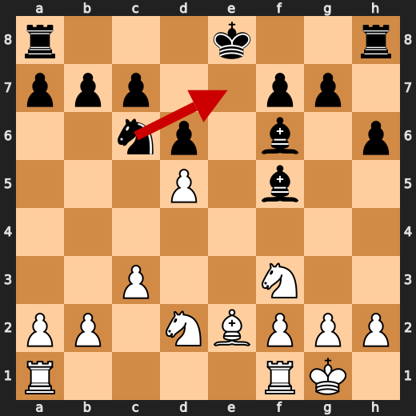

**After 14. Na5**

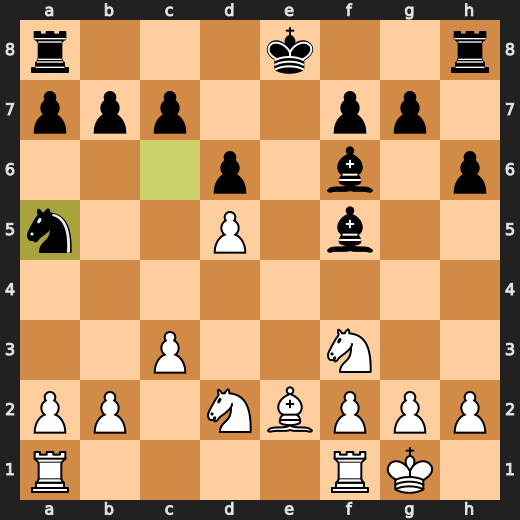

### ❌ Mistake: 19. c6 by CPU (Black)

Black's c6 worsened their position significantly by failing to improve upon the played move and instead created a weak pawn on c6 that White can target with pieces like the knight or bishop, making it easier for Black to defend against potential threats. The preferred move Nb7 would have protected the pawn on e6 while maintaining control over d5, which is an important central square in this position.

- **Eval:** +3.32 → +7.61
- **Preferred:** `Nb7`
- **Loss:** 429 cp

**Before 19. c6**

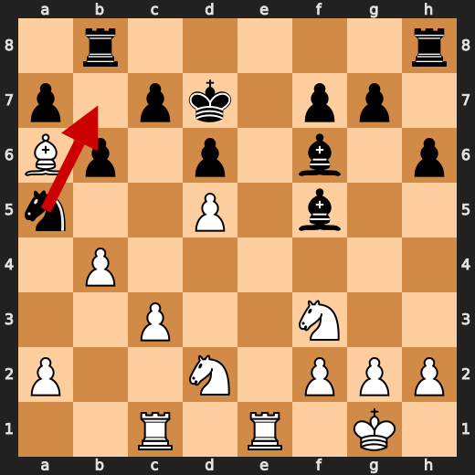

**After 19. c6**

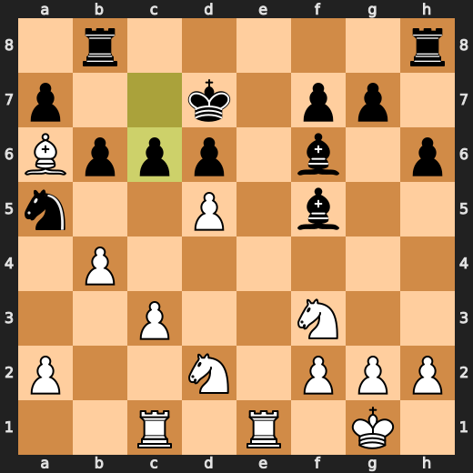

### ❌ Mistake: 27. Rc7 by CPU (Black)

Black's Rc7 worsened their position significantly by failing to improve upon the played move and instead created a weak pawn on c6 that White can target with pieces like the knight or bishop, making it easier for Black to defend against potential threats. The preferred move Bd5 would have protected the pawn on e6 while maintaining control over d5, which is an important central square in this position.

- **Eval:** +5.54 → +11.42
- **Preferred:** `Rxe8`
- **Loss:** 588 cp

**Before 27. Rc7**

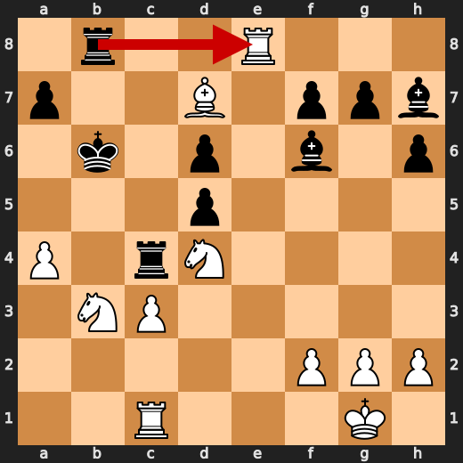

**After 27. Rc7**

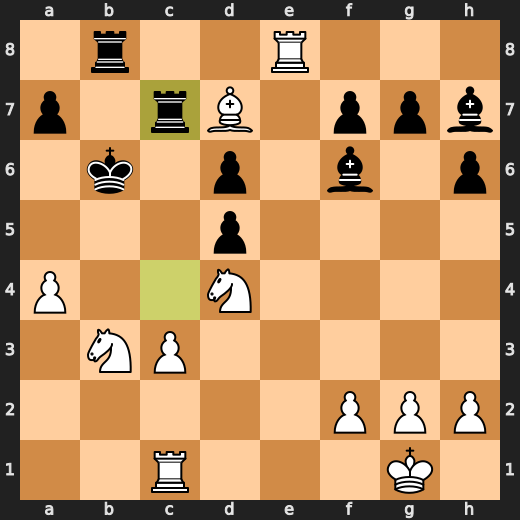

### ❌ Mistake: 35. Bg5 by CPU (Black)

Black's Bg5 worsened their position significantly by failing to improve upon the played move and instead created a weak pawn on g6 that White can target with pieces like the knight or bishop, making it easier for Black to defend against potential threats. The preferred move Nf8 would have protected the pawn on e6 while maintaining control over d5, which is an important central square in this position.

- **Eval:** +13.32 → +18.54
- **Preferred:** `a6`
- **Loss:** 522 cp

**Before 35. Bg5**

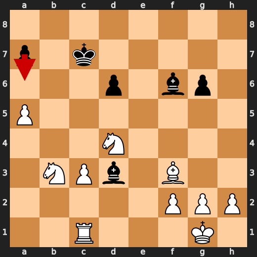

**After 35. Bg5**

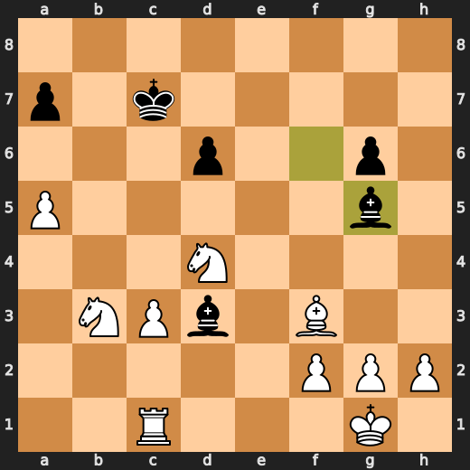

### 💀 Blunder: 42. Rxa7 by You (White)

You (White) played something stupid at move 42 with Rxa7. The preferred move h4 improves the position by attacking the black knight on d5 and preparing to castle queenside, which is a useful idea in this position. The eval loss from playing Rxa7 instead of h4 indicates that the move worsened your position significantly.

- **Eval:** +60.60 → +23.84
- **Preferred:** `h4`
- **Loss:** 3676 cp

**Before 42. Rxa7**

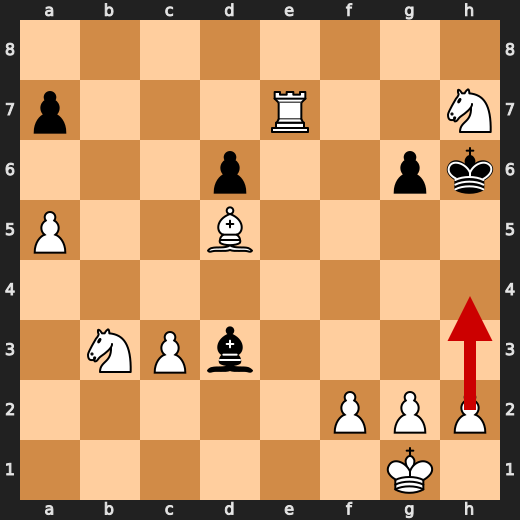

**After 42. Rxa7**

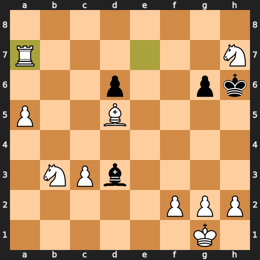

### ❌ Mistake: 42. Be2 by CPU (Black)

Black's Be2 worsened their position significantly by failing to improve upon the played move and instead created a weak pawn on e6 that White can target with pieces like the knight or bishop, making it easier for Black to defend against potential threats. The preferred move g5 would have maintained control over d5 while improving upon the played move and preventing White from exploiting the weakness of the pawn on e6.

- **Eval:** +59.62 → +64.15
- **Preferred:** `g5`
- **Loss:** 453 cp

**Before 42. Be2**

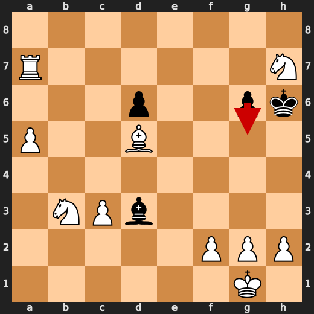

**After 42. Be2**

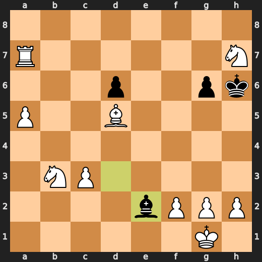

### 💀 Blunder: 43. Bd1 by CPU (Black)

The played move Bd1 failed to improve Black's position and instead worsened it significantly as White has now mate. The preferred move g5 would have improved Black's pawn structure, increased pressure on the white center, and possibly led to a more equal game. Instead of defending against White's attack, Black's Bd1 allows for further advancements by White and ultimately leads to a loss.

- **Eval:** +66.59 → White has mate
- **Preferred:** `g5`
- **Loss:** 93341 cp

**Before 43. Bd1**

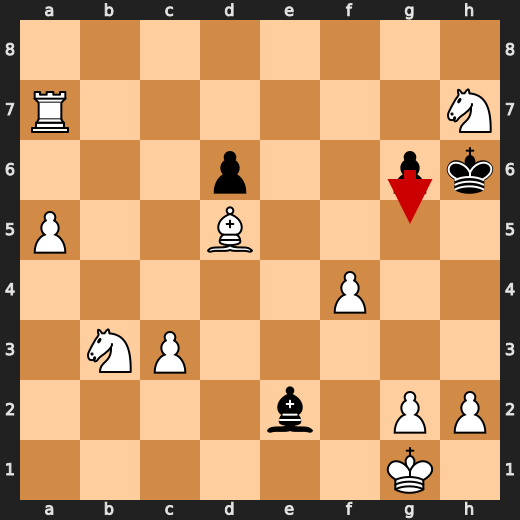

**After 43. Bd1**

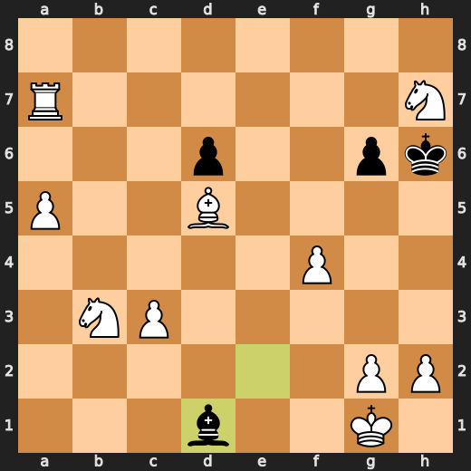

### 🏁 Checkmate: 47. Rh7# by You (White)

You (White) played Rh7# to checkmate Black with a game-ending forcing move. This move improved upon your previous position by setting up an immediate and unavoidable checkmate, demonstrating a concrete tactic in which you threatened the opponent's king with no escape. The preferred move, Rh7#, was also useful as it did not allow any counterplay or defensive options for Black.

- **Eval:** White has mate → White has mate
- **Preferred:** `Rh7#`
- **Loss:** 0 cp

**Before 47. Rh7#**

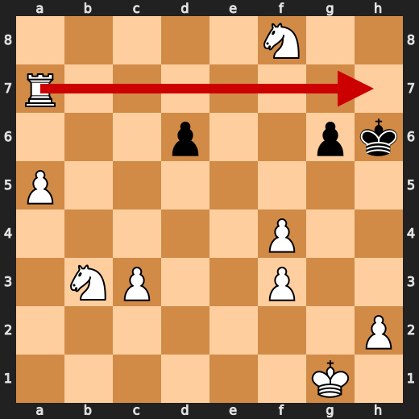

**After 47. Rh7#**

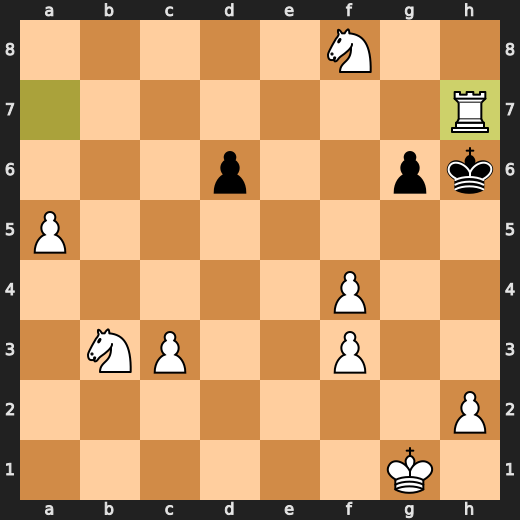

---

## Human Notes

Biggest caveman lesson: You (White) blew it with **42. Rxa7**.

There was another real screw-up at **14. Na5** by **CPU (Black)**.

The game-ending shot was **47. Rh7#** by **You (White)**.

---

<details>
<summary>Compact move list</summary>

- 📖 **1. e4** (You (White), Book) — +0.46 → +0.23, preferred `d4`, loss 23 cp
- 📖 **1. e5** (CPU (Black), Book) — +0.37 → +0.35, preferred `e5`, loss 0 cp
- 📖 **2. Nf3** (You (White), Book) — +0.47 → +0.34, preferred `Nf3`, loss 13 cp
- 📖 **2. Nf6** (CPU (Black), Book) — +0.41 → +0.83, preferred `d6`, loss 42 cp
- 📖 **3. Nxe5** (You (White), Book) — +0.86 → +0.75, preferred `Nxe5`, loss 11 cp
- 📖 **3. d6** (CPU (Black), Book) — +0.70 → +0.82, preferred `d6`, loss 12 cp
- ✅ **4. Nf3** (You (White), Best) — +0.71 → +0.72, preferred `Nf3`, loss 0 cp
- ✅ **4. Nxe4** (CPU (Black), Best) — +0.72 → +0.80, preferred `Nxe4`, loss 8 cp
- 🔥 **5. Qe2** (You (White), Great) — +0.74 → +0.24, preferred `d4`, loss 50 cp
- ✅ **5. Qe7** (CPU (Black), Best) — +0.19 → +0.06, preferred `Qe7`, loss 0 cp
- ✅ **6. d3** (You (White), Best) — +0.17 → +0.12, preferred `d3`, loss 5 cp
- ✅ **6. Nf6** (CPU (Black), Best) — +0.20 → +0.18, preferred `Nf6`, loss 0 cp
- 🔥 **7. Bg5** (You (White), Great) — +0.22 → +0.05, preferred `Bg5`, loss 17 cp
- ✅ **7. Qxe2+** (CPU (Black), Best) — +0.09 → +0.21, preferred `Qxe2+`, loss 12 cp
- ✅ **8. Bxe2** (You (White), Best) — +0.14 → +0.13, preferred `Bxe2`, loss 1 cp
- ✅ **8. Be7** (CPU (Black), Best) — +0.13 → +0.08, preferred `Be7`, loss 0 cp
- ✅ **9. O-O** (You (White), Best) — +0.08 → +0.00, preferred `Nc3`, loss 8 cp
- ✅ **9. h6** (CPU (Black), Best) — +0.00 → +0.02, preferred `h6`, loss 2 cp
- 🔥 **10. Bxf6** (You (White), Great) — +0.00 → -0.30, preferred `Bd2`, loss 30 cp
- ✅ **10. Bxf6** (CPU (Black), Best) — -0.33 → -0.33, preferred `Bxf6`, loss 0 cp
- ✅ **11. c3** (You (White), Best) — -0.37 → -0.44, preferred `d4`, loss 7 cp
- 🔥 **11. Bd7** (CPU (Black), Great) — -0.50 → -0.12, preferred `Nd7`, loss 38 cp
- ✅ **12. d4** (You (White), Best) — -0.13 → -0.22, preferred `Nbd2`, loss 9 cp
- ✅ **12. Nc6** (CPU (Black), Best) — -0.16 → -0.08, preferred `a5`, loss 8 cp
- ✅ **13. Nbd2** (You (White), Best) — -0.12 → -0.13, preferred `Nbd2`, loss 1 cp
- 🔥 **13. Bf5** (CPU (Black), Great) — -0.17 → +0.18, preferred `O-O`, loss 35 cp
- 👍 **14. d5** (You (White), Good) — +0.19 → -0.67, preferred `Nc4`, loss 86 cp
- ❌ **14. Na5** (CPU (Black), Mistake) — -0.59 → +3.13, preferred `Ne7`, loss 372 cp
- 👍 **15. Rac1** (You (White), Good) — +3.02 → +2.14, preferred `b4`, loss 88 cp
- 🔥 **15. b6** (CPU (Black), Great) — +1.92 → +2.08, preferred `b6`, loss 16 cp
- ⚠️ **16. Bb5+** (You (White), Inaccuracy) — +2.16 → +0.74, preferred `b4`, loss 142 cp
- 👍 **16. Ke7** (CPU (Black), Good) — +0.78 → +1.80, preferred `Kd8`, loss 102 cp
- 🔥 **17. Ba6** (You (White), Great) — +1.98 → +1.74, preferred `b4`, loss 24 cp
- 👍 **17. Rab8** (CPU (Black), Good) — +1.69 → +2.44, preferred `Bc8`, loss 75 cp
- ✅ **18. Rfe1+** (You (White), Best) — +2.50 → +2.97, preferred `b4`, loss 0 cp
- 👍 **18. Kd7** (CPU (Black), Good) — +2.93 → +3.66, preferred `Kf8`, loss 73 cp
- 👍 **19. b4** (You (White), Good) — +3.84 → +3.32, preferred `b4`, loss 52 cp
- ❌ **19. c6** (CPU (Black), Mistake) — +3.32 → +7.61, preferred `Nb7`, loss 429 cp
- ✅ **20. bxa5** (You (White), Best) — +7.68 → +7.67, preferred `bxa5`, loss 1 cp
- ✅ **20. cxd5** (CPU (Black), Best) — +7.00 → +7.15, preferred `cxd5`, loss 15 cp
- ✅ **21. Bb5+** (You (White), Best) — +7.05 → +7.48, preferred `Bb5+`, loss 0 cp
- 🔥 **21. Kc7** (CPU (Black), Great) — +7.31 → +7.74, preferred `Kd8`, loss 43 cp
- 👍 **22. axb6+** (You (White), Good) — +7.53 → +6.46, preferred `a6`, loss 107 cp
- 🔥 **22. Kxb6** (CPU (Black), Great) — +6.31 → +6.71, preferred `Kxb6`, loss 40 cp
- 👍 **23. Nb3** (You (White), Good) — +6.81 → +6.15, preferred `Ba4`, loss 66 cp
- 👍 **23. Rhd8** (CPU (Black), Good) — +6.58 → +7.53, preferred `Kxb5`, loss 95 cp
- ✅ **24. Nfd4** (You (White), Best) — +7.23 → +7.53, preferred `Nfd4`, loss 0 cp
- ✅ **24. Bh7** (CPU (Black), Best) — +7.34 → +7.31, preferred `Bg5`, loss 0 cp
- 🔥 **25. a4** (You (White), Great) — +7.30 → +7.01, preferred `Bf1`, loss 29 cp
- ✅ **25. Rdc8** (CPU (Black), Best) — +7.00 → +6.97, preferred `Rdc8`, loss 0 cp
- 👍 **26. Bd7** (You (White), Good) — +7.00 → +6.00, preferred `a5+`, loss 100 cp
- 👍 **26. Rc4** (CPU (Black), Good) — +5.84 → +6.69, preferred `Rc7`, loss 85 cp
- ⚠️ **27. Re8** (You (White), Inaccuracy) — +6.76 → +5.46, preferred `a5+`, loss 130 cp
- ❌ **27. Rc7** (CPU (Black), Mistake) — +5.54 → +11.42, preferred `Rxe8`, loss 588 cp
- ✅ **28. Rxb8+** (You (White), Best) — +11.49 → +11.61, preferred `Rxb8+`, loss 0 cp
- ✅ **28. Rb7** (CPU (Black), Best) — +11.84 → +11.84, preferred `Rb7`, loss 0 cp
- ✅ **29. a5+** (You (White), Best) — +11.92 → +11.84, preferred `a5+`, loss 8 cp
- ✅ **29. Kc7** (CPU (Black), Best) — +12.00 → +12.00, preferred `Kc7`, loss 0 cp
- ✅ **30. Rxb7+** (You (White), Best) — +11.93 → +12.07, preferred `Rxb7+`, loss 0 cp
- ✅ **30. Kxb7** (CPU (Black), Best) — +12.08 → +12.10, preferred `Kxb7`, loss 2 cp
- ✅ **31. Bc6+** (You (White), Best) — +12.02 → +12.15, preferred `Bc6+`, loss 0 cp
- 🔥 **31. Kc7** (CPU (Black), Great) — +11.98 → +12.19, preferred `Kc8`, loss 21 cp
- ✅ **32. Bxd5** (You (White), Best) — +12.15 → +12.18, preferred `Bxd5`, loss 0 cp
- 👍 **32. h5** (CPU (Black), Good) — +12.07 → +12.63, preferred `Kd7`, loss 56 cp
- ✅ **33. Bxf7** (You (White), Best) — +12.68 → +12.71, preferred `Re1`, loss 0 cp
- 🔥 **33. Bd3** (CPU (Black), Great) — +12.69 → +12.86, preferred `Be4`, loss 17 cp
- ✅ **34. Bxh5** (You (White), Best) — +12.92 → +12.71, preferred `Bxh5`, loss 21 cp
- 🔥 **34. g6** (CPU (Black), Great) — +12.89 → +13.25, preferred `Bc4`, loss 36 cp
- 🔥 **35. Bf3** (You (White), Great) — +13.32 → +13.09, preferred `Be2`, loss 23 cp
- ❌ **35. Bg5** (CPU (Black), Mistake) — +13.32 → +18.54, preferred `a6`, loss 522 cp
- ✅ **36. Ne6+** (You (White), Best) — +18.88 → +19.23, preferred `Ne6+`, loss 0 cp
- ✅ **36. Kd7** (CPU (Black), Best) — +19.26 → +19.26, preferred `Kd7`, loss 0 cp
- ✅ **37. Nxg5** (You (White), Best) — +19.38 → +19.49, preferred `Nxg5`, loss 0 cp
- 🔥 **37. Ke7** (CPU (Black), Great) — +19.61 → +19.87, preferred `Ke8`, loss 26 cp
- ✅ **38. Re1+** (You (White), Best) — +19.76 → +19.76, preferred `Re1+`, loss 0 cp
- ⚠️ **38. Kf6** (CPU (Black), Inaccuracy) — +19.84 → +21.70, preferred `Kf6`, loss 186 cp
- 🔥 **39. Nh7+** (You (White), Great) — +22.23 → +21.94, preferred `h4`, loss 29 cp
- ✅ **39. Kf7** (CPU (Black), Best) — +23.52 → +20.33, preferred `Kf7`, loss 0 cp
- ✅ **40. Bd5+** (You (White), Best) — +23.84 → +60.31, preferred `Bd5+`, loss 0 cp
- ✅ **40. Kg7** (CPU (Black), Best) — +60.31 → +60.35, preferred `Kg7`, loss 4 cp
- ✅ **41. Re7+** (You (White), Best) — +60.31 → +60.30, preferred `Re7+`, loss 1 cp
- ✅ **41. Kh6** (CPU (Black), Best) — +60.30 → +24.61, preferred `Kh6`, loss 0 cp
- 💀 **42. Rxa7** (You (White), Blunder) — +60.60 → +23.84, preferred `h4`, loss 3676 cp
- ❌ **42. Be2** (CPU (Black), Mistake) — +59.62 → +64.15, preferred `g5`, loss 453 cp
- ✅ **43. f4** (You (White), Best) — +65.50 → +66.53, preferred `Nd4`, loss 0 cp
- 💀 **43. Bd1** (CPU (Black), Blunder) — +66.59 → White has mate, preferred `g5`, loss 93341 cp
- ✅ **44. Nf8** (You (White), Best) — White has mate → White has mate, preferred `Ng5`, loss 0 cp
- ✅ **44. Kh5** (CPU (Black), Best) — White has mate → White has mate, preferred `Kh5`, loss 0 cp
- ✅ **45. Bf3+** (You (White), Best) — White has mate → White has mate, preferred `Bf3+`, loss 0 cp
- ✅ **45. Bxf3** (CPU (Black), Best) — White has mate → White has mate, preferred `Bxf3`, loss 0 cp
- ✅ **46. gxf3** (You (White), Best) — White has mate → White has mate, preferred `gxf3`, loss 0 cp
- ✅ **46. Kh6** (CPU (Black), Best) — White has mate → White has mate, preferred `d5`, loss 0 cp
- 🏁 **47. Rh7#** (You (White), Checkmate) — White has mate → White has mate, preferred `Rh7#`, loss 0 cp

</details>

---

<details>
<summary>Raw engine table</summary>

| Ply | Move | Actor | Played | Label | Eval Before | Eval After | Preferred | Loss |
|---:|---:|---|---|---|---:|---:|---|---:|
| 1 | 1 | You (White) | e4 | Book | +0.46 | +0.23 | d4 | 23 |
| 2 | 1 | CPU (Black) | e5 | Book | +0.37 | +0.35 | e5 | 0 |
| 3 | 2 | You (White) | Nf3 | Book | +0.47 | +0.34 | Nf3 | 13 |
| 4 | 2 | CPU (Black) | Nf6 | Book | +0.41 | +0.83 | d6 | 42 |
| 5 | 3 | You (White) | Nxe5 | Book | +0.86 | +0.75 | Nxe5 | 11 |
| 6 | 3 | CPU (Black) | d6 | Book | +0.70 | +0.82 | d6 | 12 |
| 7 | 4 | You (White) | Nf3 | Best | +0.71 | +0.72 | Nf3 | 0 |
| 8 | 4 | CPU (Black) | Nxe4 | Best | +0.72 | +0.80 | Nxe4 | 8 |
| 9 | 5 | You (White) | Qe2 | Great | +0.74 | +0.24 | d4 | 50 |
| 10 | 5 | CPU (Black) | Qe7 | Best | +0.19 | +0.06 | Qe7 | 0 |
| 11 | 6 | You (White) | d3 | Best | +0.17 | +0.12 | d3 | 5 |
| 12 | 6 | CPU (Black) | Nf6 | Best | +0.20 | +0.18 | Nf6 | 0 |
| 13 | 7 | You (White) | Bg5 | Great | +0.22 | +0.05 | Bg5 | 17 |
| 14 | 7 | CPU (Black) | Qxe2+ | Best | +0.09 | +0.21 | Qxe2+ | 12 |
| 15 | 8 | You (White) | Bxe2 | Best | +0.14 | +0.13 | Bxe2 | 1 |
| 16 | 8 | CPU (Black) | Be7 | Best | +0.13 | +0.08 | Be7 | 0 |
| 17 | 9 | You (White) | O-O | Best | +0.08 | +0.00 | Nc3 | 8 |
| 18 | 9 | CPU (Black) | h6 | Best | +0.00 | +0.02 | h6 | 2 |
| 19 | 10 | You (White) | Bxf6 | Great | +0.00 | -0.30 | Bd2 | 30 |
| 20 | 10 | CPU (Black) | Bxf6 | Best | -0.33 | -0.33 | Bxf6 | 0 |
| 21 | 11 | You (White) | c3 | Best | -0.37 | -0.44 | d4 | 7 |
| 22 | 11 | CPU (Black) | Bd7 | Great | -0.50 | -0.12 | Nd7 | 38 |
| 23 | 12 | You (White) | d4 | Best | -0.13 | -0.22 | Nbd2 | 9 |
| 24 | 12 | CPU (Black) | Nc6 | Best | -0.16 | -0.08 | a5 | 8 |
| 25 | 13 | You (White) | Nbd2 | Best | -0.12 | -0.13 | Nbd2 | 1 |
| 26 | 13 | CPU (Black) | Bf5 | Great | -0.17 | +0.18 | O-O | 35 |
| 27 | 14 | You (White) | d5 | Good | +0.19 | -0.67 | Nc4 | 86 |
| 28 | 14 | CPU (Black) | Na5 | Mistake | -0.59 | +3.13 | Ne7 | 372 |
| 29 | 15 | You (White) | Rac1 | Good | +3.02 | +2.14 | b4 | 88 |
| 30 | 15 | CPU (Black) | b6 | Great | +1.92 | +2.08 | b6 | 16 |
| 31 | 16 | You (White) | Bb5+ | Inaccuracy | +2.16 | +0.74 | b4 | 142 |
| 32 | 16 | CPU (Black) | Ke7 | Good | +0.78 | +1.80 | Kd8 | 102 |
| 33 | 17 | You (White) | Ba6 | Great | +1.98 | +1.74 | b4 | 24 |
| 34 | 17 | CPU (Black) | Rab8 | Good | +1.69 | +2.44 | Bc8 | 75 |
| 35 | 18 | You (White) | Rfe1+ | Best | +2.50 | +2.97 | b4 | 0 |
| 36 | 18 | CPU (Black) | Kd7 | Good | +2.93 | +3.66 | Kf8 | 73 |
| 37 | 19 | You (White) | b4 | Good | +3.84 | +3.32 | b4 | 52 |
| 38 | 19 | CPU (Black) | c6 | Mistake | +3.32 | +7.61 | Nb7 | 429 |
| 39 | 20 | You (White) | bxa5 | Best | +7.68 | +7.67 | bxa5 | 1 |
| 40 | 20 | CPU (Black) | cxd5 | Best | +7.00 | +7.15 | cxd5 | 15 |
| 41 | 21 | You (White) | Bb5+ | Best | +7.05 | +7.48 | Bb5+ | 0 |
| 42 | 21 | CPU (Black) | Kc7 | Great | +7.31 | +7.74 | Kd8 | 43 |
| 43 | 22 | You (White) | axb6+ | Good | +7.53 | +6.46 | a6 | 107 |
| 44 | 22 | CPU (Black) | Kxb6 | Great | +6.31 | +6.71 | Kxb6 | 40 |
| 45 | 23 | You (White) | Nb3 | Good | +6.81 | +6.15 | Ba4 | 66 |
| 46 | 23 | CPU (Black) | Rhd8 | Good | +6.58 | +7.53 | Kxb5 | 95 |
| 47 | 24 | You (White) | Nfd4 | Best | +7.23 | +7.53 | Nfd4 | 0 |
| 48 | 24 | CPU (Black) | Bh7 | Best | +7.34 | +7.31 | Bg5 | 0 |
| 49 | 25 | You (White) | a4 | Great | +7.30 | +7.01 | Bf1 | 29 |
| 50 | 25 | CPU (Black) | Rdc8 | Best | +7.00 | +6.97 | Rdc8 | 0 |
| 51 | 26 | You (White) | Bd7 | Good | +7.00 | +6.00 | a5+ | 100 |
| 52 | 26 | CPU (Black) | Rc4 | Good | +5.84 | +6.69 | Rc7 | 85 |
| 53 | 27 | You (White) | Re8 | Inaccuracy | +6.76 | +5.46 | a5+ | 130 |
| 54 | 27 | CPU (Black) | Rc7 | Mistake | +5.54 | +11.42 | Rxe8 | 588 |
| 55 | 28 | You (White) | Rxb8+ | Best | +11.49 | +11.61 | Rxb8+ | 0 |
| 56 | 28 | CPU (Black) | Rb7 | Best | +11.84 | +11.84 | Rb7 | 0 |
| 57 | 29 | You (White) | a5+ | Best | +11.92 | +11.84 | a5+ | 8 |
| 58 | 29 | CPU (Black) | Kc7 | Best | +12.00 | +12.00 | Kc7 | 0 |
| 59 | 30 | You (White) | Rxb7+ | Best | +11.93 | +12.07 | Rxb7+ | 0 |
| 60 | 30 | CPU (Black) | Kxb7 | Best | +12.08 | +12.10 | Kxb7 | 2 |
| 61 | 31 | You (White) | Bc6+ | Best | +12.02 | +12.15 | Bc6+ | 0 |
| 62 | 31 | CPU (Black) | Kc7 | Great | +11.98 | +12.19 | Kc8 | 21 |
| 63 | 32 | You (White) | Bxd5 | Best | +12.15 | +12.18 | Bxd5 | 0 |
| 64 | 32 | CPU (Black) | h5 | Good | +12.07 | +12.63 | Kd7 | 56 |
| 65 | 33 | You (White) | Bxf7 | Best | +12.68 | +12.71 | Re1 | 0 |
| 66 | 33 | CPU (Black) | Bd3 | Great | +12.69 | +12.86 | Be4 | 17 |
| 67 | 34 | You (White) | Bxh5 | Best | +12.92 | +12.71 | Bxh5 | 21 |
| 68 | 34 | CPU (Black) | g6 | Great | +12.89 | +13.25 | Bc4 | 36 |
| 69 | 35 | You (White) | Bf3 | Great | +13.32 | +13.09 | Be2 | 23 |
| 70 | 35 | CPU (Black) | Bg5 | Mistake | +13.32 | +18.54 | a6 | 522 |
| 71 | 36 | You (White) | Ne6+ | Best | +18.88 | +19.23 | Ne6+ | 0 |
| 72 | 36 | CPU (Black) | Kd7 | Best | +19.26 | +19.26 | Kd7 | 0 |
| 73 | 37 | You (White) | Nxg5 | Best | +19.38 | +19.49 | Nxg5 | 0 |
| 74 | 37 | CPU (Black) | Ke7 | Great | +19.61 | +19.87 | Ke8 | 26 |
| 75 | 38 | You (White) | Re1+ | Best | +19.76 | +19.76 | Re1+ | 0 |
| 76 | 38 | CPU (Black) | Kf6 | Inaccuracy | +19.84 | +21.70 | Kf6 | 186 |
| 77 | 39 | You (White) | Nh7+ | Great | +22.23 | +21.94 | h4 | 29 |
| 78 | 39 | CPU (Black) | Kf7 | Best | +23.52 | +20.33 | Kf7 | 0 |
| 79 | 40 | You (White) | Bd5+ | Best | +23.84 | +60.31 | Bd5+ | 0 |
| 80 | 40 | CPU (Black) | Kg7 | Best | +60.31 | +60.35 | Kg7 | 4 |
| 81 | 41 | You (White) | Re7+ | Best | +60.31 | +60.30 | Re7+ | 1 |
| 82 | 41 | CPU (Black) | Kh6 | Best | +60.30 | +24.61 | Kh6 | 0 |
| 83 | 42 | You (White) | Rxa7 | Blunder | +60.60 | +23.84 | h4 | 3676 |
| 84 | 42 | CPU (Black) | Be2 | Mistake | +59.62 | +64.15 | g5 | 453 |
| 85 | 43 | You (White) | f4 | Best | +65.50 | +66.53 | Nd4 | 0 |
| 86 | 43 | CPU (Black) | Bd1 | Blunder | +66.59 | White has mate | g5 | 93341 |
| 87 | 44 | You (White) | Nf8 | Best | White has mate | White has mate | Ng5 | 0 |
| 88 | 44 | CPU (Black) | Kh5 | Best | White has mate | White has mate | Kh5 | 0 |
| 89 | 45 | You (White) | Bf3+ | Best | White has mate | White has mate | Bf3+ | 0 |
| 90 | 45 | CPU (Black) | Bxf3 | Best | White has mate | White has mate | Bxf3 | 0 |
| 91 | 46 | You (White) | gxf3 | Best | White has mate | White has mate | gxf3 | 0 |
| 92 | 46 | CPU (Black) | Kh6 | Best | White has mate | White has mate | d5 | 0 |
| 93 | 47 | You (White) | Rh7# | Checkmate | White has mate | White has mate | Rh7# | 0 |

</details>

---

<details>
<summary>Clean PGN</summary>

```pgn
[Event "AI Factory's Chess"]
[Site "Android Device"]
[Date "2026.05.19"]
[Round "1"]
[White "You"]
[Black "CPU (5)"]
[Result "1-0"]
[PlyCount "95"]

1. e4 e5 2. Nf3 Nf6 3. Nxe5 d6 4. Nf3 Nxe4 5. Qe2 Qe7 6. d3 Nf6 7. Bg5 Qxe2+ 8.
Bxe2 Be7 9. O-O h6 10. Bxf6 Bxf6 11. c3 Bd7 12. d4 Nc6 13. Nbd2 Bf5 14. d5 Na5
15. Rac1 b6 16. Bb5+ Ke7 17. Ba6 Rab8 18. Rfe1+ Kd7 19. b4 c6 20. bxa5 cxd5 21.
Bb5+ Kc7 22. axb6+ Kxb6 23. Nb3 Rhd8 24. Nfd4 Bh7 25. a4 Rdc8 26. Bd7 Rc4 27.
Re8 Rc7 28. Rxb8+ Rb7 29. a5+ Kc7 30. Rxb7+ Kxb7 31. Bc6+ Kc7 32. Bxd5 h5 33.
Bxf7 Bd3 34. Bxh5 g6 35. Bf3 Bg5 36. Ne6+ Kd7 37. Nxg5 Ke7 38. Re1+ Kf6 39.
Nh7+ Kf7 40. Bd5+ Kg7 41. Re7+ Kh6 42. Rxa7 Be2 43. f4 Bd1 44. Nf8 Kh5 45. Bf3+
Bxf3 46. gxf3 Kh6 47. Rh7# 1-0
```

</details>
