# You (Black) vs CPU (White)

**Result:** 0-1  
**Date:** 2026.05.20  
**Source:** `PGN_2026_05_20_19h27_0fc150a1aa0c.pgn`  
**Engine:** Stockfish depth 14  
**Your side:** Black  
**Computer side:** White  
**Board perspective:** Your perspective

---

## Who Is Who

- **You:** You (Black)
- **Computer:** CPU (5) (White)

---

## Toaster Summary

**Game Story:** The decisive mistake in this game was made by White, who missed a stronger continuation at move 31 with Rd1 instead of h4, which led to an eval loss of 99037 cp. This allowed Black to win cleanly with checkmate on the 55th move (Qee1#). The engine complaint for move 31 Qe1+ by You (Black) was a blunder; it preferred Qg2+, which would have given an eval of Black has mate to -9.53 cp. However, this did not affect the outcome as White had already made their critical mistake earlier in the game. The key lesson for you is to always be aware of your opponent's potential threats and avoid making unnecessary blunders that can cost valuable points.

Biggest toaster scream: **31. Qe1+** by **You (Black)**.

- **Label:** 💀 **Blunder**
- **Eval:** Black has mate → -9.53
- **Stockfish preferred:** `Qg2+`
- **Loss:** 99047 cp

Final move recorded: **55. Qee1#** by **You (Black)**.

- 💀 Your blunders: **3**
- ❌ Your mistakes: **1**
- ⚠️ Your inaccuracies: **2**
- ✅ Your best moves called out: **28**

---

## Final Position


---

## Key Moments

### ❌ Mistake: 21. Bd6 by CPU (White)

White's Bd6 worsened the position significantly by failing to improve the control over d5 and allowing Black to counter with ...Qa4+, which in turn would have forced White to either lose a piece or allow Black to gain a strong initiative. The preferred move Bc5 improves Black's control over c5 square and opens up possibilities for attacking on the queenside.

- **Eval:** -0.75 → -5.60
- **Preferred:** `Bc5`
- **Loss:** 485 cp

**Before 21. Bd6**

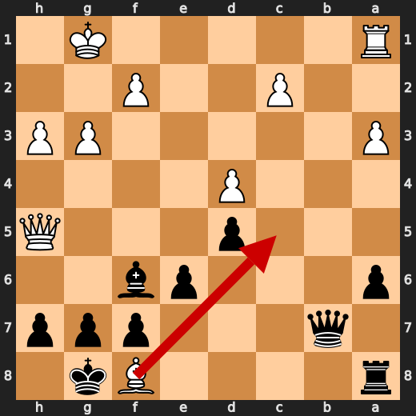

**After 21. Bd6**

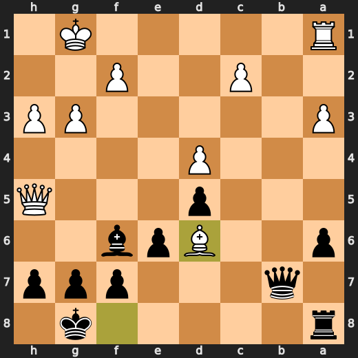

### 💀 Blunder: 31. h4 by CPU (White)

White blundered with h4 at move 31. This move fails to protect their king and allows Black to deliver mate. The preferred move Rd1 improves White's position by threatening a check on f2, which could force Black to retreat the rook from d8 or allow White to play gxh5+ with checkmate. However, h4 worsens White's position significantly due to its lack of protection for their king and provides an easy path for Black to deliver mate.

- **Eval:** -9.63 → Black has mate
- **Preferred:** `Rd1`
- **Loss:** 99037 cp

**Before 31. h4**

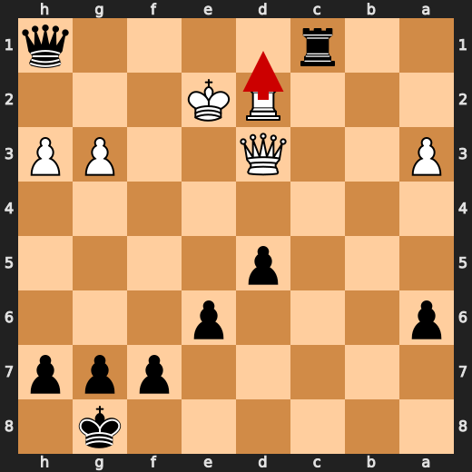

**After 31. h4**

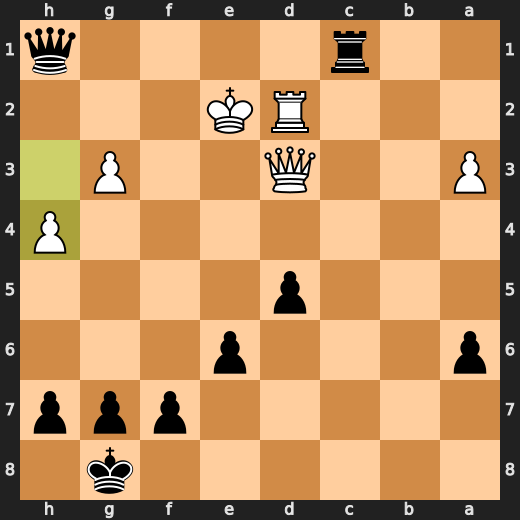

### 💀 Blunder: 31. Qe1+ by You (Black)

You (Black) played Qe1+ at move 31, which failed to improve your position and instead worsened it significantly. The engine's preferred move was Qg2+, which would have improved Black's position by attacking White's King and potentially forcing him to defend his King while also possibly opening up the g-file for further action on that side of the board.

- **Eval:** Black has mate → -9.53
- **Preferred:** `Qg2+`
- **Loss:** 99047 cp

**Before 31. Qe1+**

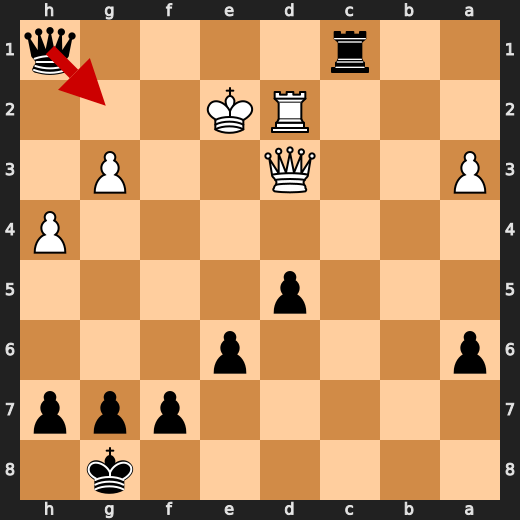

**After 31. Qe1+**

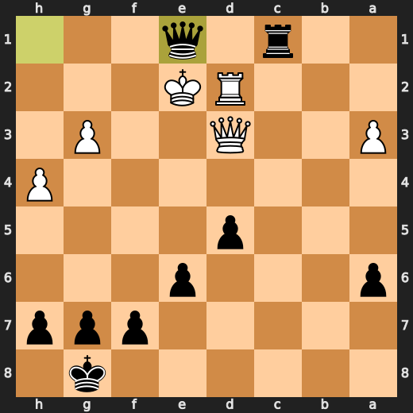

### ❌ Mistake: 37. Rf4+ by You (Black)

Black's Rf4+ worsened their position significantly by failing to create any meaningful threats or improve their structure. The preferred move Qf4+ would have improved Black's position by creating a potential fork on White's king and rook, which could have led to better chances for counterplay. Instead, the played move Rf4+ only weakened Black's position further.

- **Eval:** -12.84 → -9.25
- **Preferred:** `Qf4+`
- **Loss:** 359 cp

**Before 37. Rf4+**

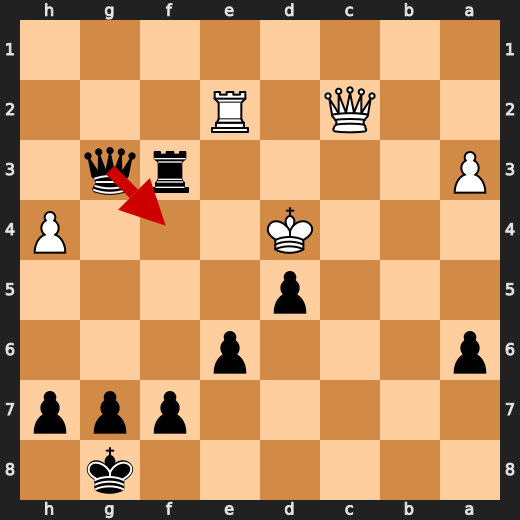

**After 37. Rf4+**

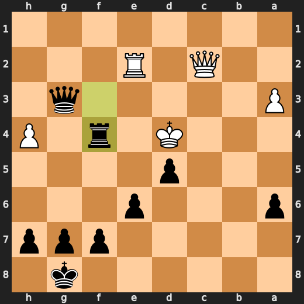

### 💀 Blunder: 43. Qc2+ by You (Black)

You (Black) played Qc2+ at move 43, which failed to improve your position and instead worsened it significantly. The engine's preferred move was Qg2+, which would have improved Black's position by attacking White's King and potentially forcing him to defend his King while also possibly opening up the g-file for further action on that side of the board. The anti-repetition memory is wording history only. It is not factual context for this move.

- **Eval:** -65.56 → -9.15
- **Preferred:** `Qc2+`
- **Loss:** 5641 cp

**Before 43. Qc2+**

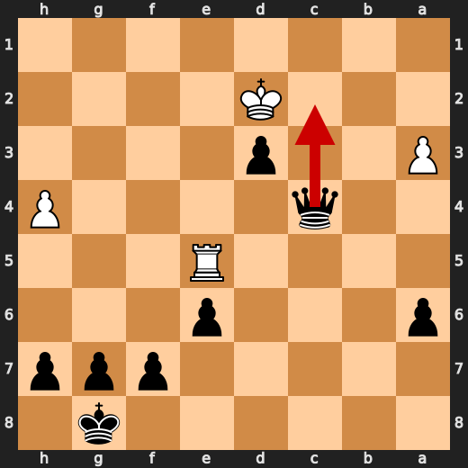

**After 43. Qc2+**

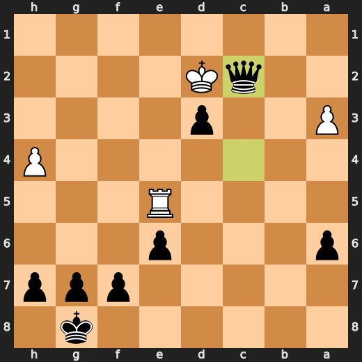

### 💀 Blunder: 47. f4 by You (Black)

You (Black) played f4 at move 47, which failed to improve your position and instead worsened it significantly. The engine's preferred move was Qxa3, which would have improved Black's position by attacking White's King and potentially forcing him to defend his King while also possibly opening up the g-file for further action on that side of the board. Major eval loss.

- **Eval:** -76.07 → -64.56
- **Preferred:** `Qxa3`
- **Loss:** 1151 cp

**Before 47. f4**

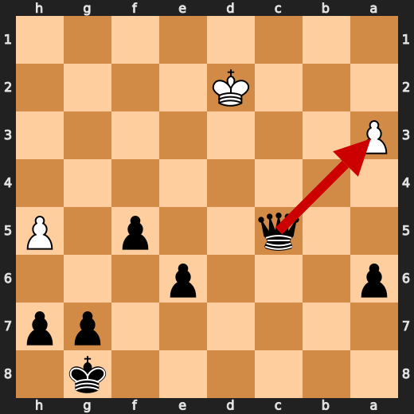

**After 47. f4**

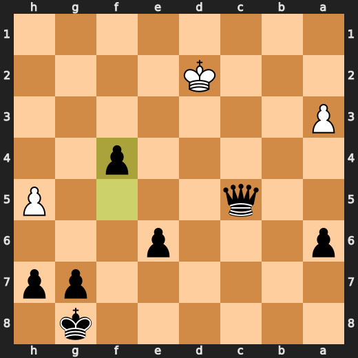

### 💀 Blunder: 48. a4 by CPU (White)

White blundered with a4 at move 48, losing -11.33 eval points. This move fails to protect their king and allows Black to deliver mate. The preferred move Rd1 improves White's position by threatening a check on f2, which could force Black to retreat the rook from d8 or allow White to play gxh5+ with checkmate. However, a4 worsens White's position significantly due to its lack of protection for their king and provides an easy path for Black to deliver mate.

- **Eval:** -64.65 → -75.98
- **Preferred:** `a4`
- **Loss:** 1133 cp

**Before 48. a4**

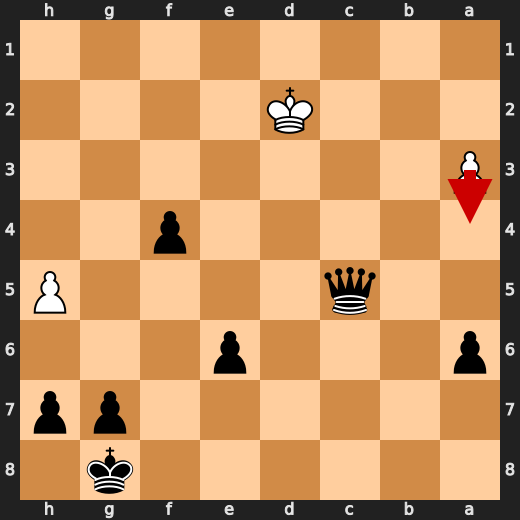

**After 48. a4**

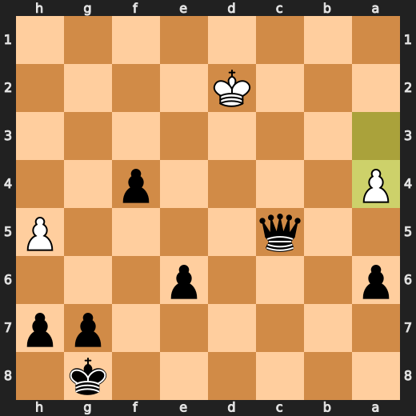

### 🏁 Checkmate: 55. Qee1# by You (Black)

You played Qee1# to checkmate White, but it was a forced mate due to the position on the board. The preferred move is the same as the played move because there were no other viable options for Black in this specific situation. This game-ending forcing move demonstrates an understanding of basic chess tactics and mating patterns.

- **Eval:** Black has mate → Black has mate
- **Preferred:** `Qee1#`
- **Loss:** 0 cp

**Before 55. Qee1#**

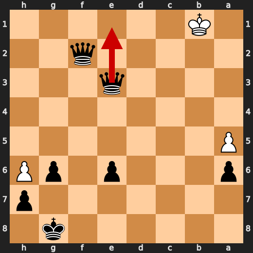

**After 55. Qee1#**

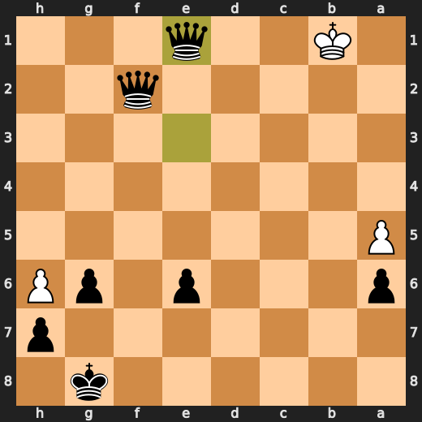

---

## Human Notes

Biggest caveman lesson: CPU (White) blew it with **31. h4**.

There was another real screw-up at **21. Bd6** by **CPU (White)**.

The game-ending shot was **55. Qee1#** by **You (Black)**.

---

<details>
<summary>Compact move list</summary>

- 📖 **1. e3** (CPU (White), Book) — +0.46 → +0.17, preferred `d4`, loss 29 cp
- 📖 **1. d5** (You (Black), Book) — +0.20 → +0.12, preferred `d5`, loss 0 cp
- 📖 **2. Nf3** (CPU (White), Book) — +0.17 → +0.16, preferred `Nf3`, loss 1 cp
- 📖 **2. Nf6** (You (Black), Book) — +0.18 → +0.18, preferred `c5`, loss 0 cp
- 📖 **3. Nc3** (CPU (White), Book) — +0.17 → -0.43, preferred `d4`, loss 60 cp
- 📖 **3. Bg4** (You (Black), Book) — -0.33 → +0.12, preferred `e6`, loss 45 cp
- 🔥 **4. d4** (CPU (White), Great) — +0.29 → -0.10, preferred `h3`, loss 39 cp
- 🔥 **4. Nc6** (You (Black), Great) — -0.02 → +0.23, preferred `e6`, loss 25 cp
- ✅ **5. Bb5** (CPU (White), Best) — -0.04 → +0.00, preferred `Bb5`, loss 0 cp
- 👍 **5. a6** (You (Black), Good) — -0.17 → +0.47, preferred `Qd6`, loss 64 cp
- 🔥 **6. Bxc6+** (CPU (White), Great) — +0.55 → +0.19, preferred `Bxc6+`, loss 36 cp
- ✅ **6. bxc6** (You (Black), Best) — +0.42 → +0.33, preferred `bxc6`, loss 0 cp
- 🔥 **7. O-O** (CPU (White), Great) — +0.28 → -0.12, preferred `h3`, loss 40 cp
- ✅ **7. e6** (You (Black), Best) — -0.21 → -0.26, preferred `e6`, loss 0 cp
- 👍 **8. a3** (CPU (White), Good) — -0.12 → -1.04, preferred `Na4`, loss 92 cp
- 🔥 **8. Ne4** (You (Black), Great) — -0.92 → -0.47, preferred `c5`, loss 45 cp
- 🔥 **9. h3** (CPU (White), Great) — -0.63 → -1.13, preferred `Ne2`, loss 50 cp
- ⚠️ **9. Nxc3** (You (Black), Inaccuracy) — -1.57 → -0.13, preferred `h5`, loss 144 cp
- ✅ **10. bxc3** (CPU (White), Best) — -0.50 → -0.18, preferred `bxc3`, loss 0 cp
- 👍 **10. Bxf3** (You (Black), Good) — -0.30 → +0.52, preferred `h5`, loss 82 cp
- ✅ **11. Qxf3** (CPU (White), Best) — +0.57 → +0.48, preferred `Qxf3`, loss 9 cp
- 🔥 **11. c5** (You (Black), Great) — +0.58 → +0.92, preferred `Qd7`, loss 34 cp
- 👍 **12. Bd2** (CPU (White), Good) — +1.13 → -0.04, preferred `c4`, loss 117 cp
- 👍 **12. cxd4** (You (Black), Good) — -0.26 → +0.90, preferred `c4`, loss 116 cp
- ✅ **13. cxd4** (CPU (White), Best) — +0.94 → +1.06, preferred `cxd4`, loss 0 cp
- 👍 **13. c6** (You (Black), Good) — +0.80 → +1.40, preferred `Bd6`, loss 60 cp
- 👍 **14. g3** (CPU (White), Good) — +1.05 → +0.47, preferred `Qg4`, loss 58 cp
- ✅ **14. Be7** (You (Black), Best) — +0.45 → +0.38, preferred `Be7`, loss 0 cp
- 👍 **15. Qh5** (CPU (White), Good) — +0.60 → +0.04, preferred `Bb4`, loss 56 cp
- ✅ **15. O-O** (You (Black), Best) — +0.06 → +0.00, preferred `O-O`, loss 0 cp
- 👍 **16. Rfb1** (CPU (White), Good) — +0.17 → -0.43, preferred `c4`, loss 60 cp
- ✅ **16. c5** (You (Black), Best) — -0.13 → -0.21, preferred `Qd7`, loss 0 cp
- 👍 **17. Rb7** (CPU (White), Good) — -0.12 → -0.74, preferred `dxc5`, loss 62 cp
- 🔥 **17. cxd4** (You (Black), Great) — -1.22 → -0.75, preferred `cxd4`, loss 47 cp
- ✅ **18. exd4** (CPU (White), Best) — -0.80 → -0.87, preferred `exd4`, loss 7 cp
- ✅ **18. Bf6** (You (Black), Best) — -0.75 → -0.80, preferred `Rb8`, loss 0 cp
- ✅ **19. Bb4** (CPU (White), Best) — -0.85 → -0.70, preferred `c3`, loss 0 cp
- ✅ **19. Qc8** (You (Black), Best) — -0.51 → -0.82, preferred `Qc8`, loss 0 cp
- ✅ **20. Bxf8** (CPU (White), Best) — -0.67 → -0.75, preferred `Bxf8`, loss 8 cp
- ✅ **20. Qxb7** (You (Black), Best) — -0.83 → -0.73, preferred `Qxb7`, loss 10 cp
- ❌ **21. Bd6** (CPU (White), Mistake) — -0.75 → -5.60, preferred `Bc5`, loss 485 cp
- 🔥 **21. Bxd4** (You (Black), Great) — -5.91 → -5.44, preferred `Bxd4`, loss 47 cp
- 🔥 **22. Rf1** (CPU (White), Great) — -5.55 → -6.00, preferred `Rf1`, loss 45 cp
- 👍 **22. Qc6** (You (Black), Good) — -6.00 → -5.22, preferred `Rc8`, loss 78 cp
- ❌ **23. Rd1** (CPU (White), Mistake) — -5.31 → -8.83, preferred `Be5`, loss 352 cp
- ✅ **23. Bxf2+** (You (Black), Best) — -8.50 → -8.74, preferred `Bxf2+`, loss 0 cp
- ✅ **24. Kxf2** (CPU (White), Best) — -8.71 → -8.61, preferred `Kxf2`, loss 0 cp
- ✅ **24. Qxd6** (You (Black), Best) — -8.71 → -8.69, preferred `Qxd6`, loss 2 cp
- ✅ **25. Qf3** (CPU (White), Best) — -8.49 → -8.63, preferred `Qf3`, loss 14 cp
- ✅ **25. Qc5+** (You (Black), Best) — -8.54 → -8.45, preferred `Qc5+`, loss 9 cp
- 👍 **26. Ke1** (CPU (White), Good) — -8.23 → -9.08, preferred `Qe3`, loss 85 cp
- 🔥 **26. Rc8** (You (Black), Great) — -8.92 → -8.63, preferred `Qxc2`, loss 29 cp
- 👍 **27. Ke2** (CPU (White), Good) — -8.42 → -9.21, preferred `Qd3`, loss 79 cp
- ✅ **27. Qxc2+** (You (Black), Best) — -9.07 → -9.15, preferred `Qxc2+`, loss 0 cp
- ✅ **28. Rd2** (CPU (White), Best) — -9.00 → -9.08, preferred `Rd2`, loss 8 cp
- ✅ **28. Qc1** (You (Black), Best) — -9.00 → -9.09, preferred `Qc1`, loss 0 cp
- 🔥 **29. Qb3** (CPU (White), Great) — -9.07 → -9.57, preferred `Qb3`, loss 50 cp
- 🔥 **29. Qh1** (You (Black), Great) — -9.24 → -8.76, preferred `h5`, loss 48 cp
- 👍 **30. Qd3** (CPU (White), Good) — -8.70 → -9.62, preferred `Rc2`, loss 92 cp
- 🔥 **30. Rc1** (You (Black), Great) — -10.02 → -9.73, preferred `Qg2+`, loss 29 cp
- 💀 **31. h4** (CPU (White), Blunder) — -9.63 → Black has mate, preferred `Rd1`, loss 99037 cp
- 💀 **31. Qe1+** (You (Black), Blunder) — Black has mate → -9.53, preferred `Qg2+`, loss 99047 cp
- 🔥 **32. Kf3** (CPU (White), Great) — -9.61 → -9.82, preferred `Kf3`, loss 21 cp
- 🔥 **32. Qh1+** (You (Black), Great) — -9.81 → -9.38, preferred `h6`, loss 43 cp
- 🔥 **33. Kf4** (CPU (White), Great) — -9.36 → -9.61, preferred `Kf4`, loss 25 cp
- ⚠️ **33. Rf1+** (You (Black), Inaccuracy) — -9.69 → -7.62, preferred `Re1`, loss 207 cp
- 👍 **34. Ke5** (CPU (White), Good) — -7.00 → -7.96, preferred `Ke5`, loss 96 cp
- 👍 **34. Rf3** (You (Black), Good) — -7.67 → -6.95, preferred `Rc1`, loss 72 cp
- 👍 **35. Qc2** (CPU (White), Good) — -7.34 → -8.31, preferred `Qxa6`, loss 97 cp
- ✅ **35. Qe1+** (You (Black), Best) — -8.22 → -8.22, preferred `Qe1+`, loss 0 cp
- ❌ **36. Re2** (CPU (White), Mistake) — -8.29 → -11.63, preferred `Kd6`, loss 334 cp
- ✅ **36. Qxg3+** (You (Black), Best) — -11.76 → -11.87, preferred `Qxg3+`, loss 0 cp
- ✅ **37. Kd4** (CPU (White), Best) — -12.00 → -12.02, preferred `Kd4`, loss 2 cp
- ❌ **37. Rf4+** (You (Black), Mistake) — -12.84 → -9.25, preferred `Qf4+`, loss 359 cp
- 🔥 **38. Kc5** (CPU (White), Great) — -9.24 → -9.46, preferred `Kc5`, loss 22 cp
- ✅ **38. Rc4+** (You (Black), Best) — -9.70 → -9.65, preferred `Qxa3+`, loss 5 cp
- ✅ **39. Qxc4** (CPU (White), Best) — -9.66 → -9.66, preferred `Qxc4`, loss 0 cp
- ✅ **39. Qc7+** (You (Black), Best) — -9.66 → -9.66, preferred `Qc7+`, loss 0 cp
- ✅ **40. Kd4** (CPU (White), Best) — -9.66 → -9.66, preferred `Kd4`, loss 0 cp
- ✅ **40. Qxc4+** (You (Black), Best) — -9.66 → -9.65, preferred `Qxc4+`, loss 1 cp
- ✅ **41. Ke3** (CPU (White), Best) — -9.65 → -9.66, preferred `Ke3`, loss 1 cp
- ✅ **41. d4+** (You (Black), Best) — -9.71 → -9.71, preferred `Qxe2+`, loss 0 cp
- ✅ **42. Kd2** (CPU (White), Best) — -9.71 → -9.82, preferred `Kd2`, loss 11 cp
- ✅ **42. d3** (You (Black), Best) — -9.85 → -62.40, preferred `Qa2+`, loss 0 cp
- ❌ **43. Re5** (CPU (White), Mistake) — -61.83 → -65.56, preferred `Rf2`, loss 373 cp
- 💀 **43. Qc2+** (You (Black), Blunder) — -65.56 → -9.15, preferred `Qc2+`, loss 5641 cp
- ✅ **44. Ke3** (CPU (White), Best) — -65.02 → -61.75, preferred `Ke3`, loss 0 cp
- ✅ **44. d2** (You (Black), Best) — -65.56 → -65.64, preferred `d2`, loss 0 cp
- ✅ **45. Rc5** (CPU (White), Best) — -65.64 → -65.64, preferred `Rc5`, loss 0 cp
- ✅ **45. Qxc5+** (You (Black), Best) — -65.74 → -65.78, preferred `Qxc5+`, loss 0 cp
- ✅ **46. Kxd2** (CPU (White), Best) — -75.10 → -75.10, preferred `Kxd2`, loss 0 cp
- 👍 **46. f5** (You (Black), Good) — -75.10 → -74.47, preferred `Qxa3`, loss 63 cp
- ⚠️ **47. h5** (CPU (White), Inaccuracy) — -74.65 → -76.07, preferred `Kd3`, loss 142 cp
- 💀 **47. f4** (You (Black), Blunder) — -76.07 → -64.56, preferred `Qxa3`, loss 1151 cp
- 💀 **48. a4** (CPU (White), Blunder) — -64.65 → -75.98, preferred `a4`, loss 1133 cp
- 👍 **48. Qf2+** (You (Black), Good) — -76.00 → -75.25, preferred `Qxh5`, loss 75 cp
- ✅ **49. Kd1** (CPU (White), Best) — -75.25 → -75.32, preferred `Kc3`, loss 7 cp
- ✅ **49. f3** (You (Black), Best) — -76.25 → Black has mate, preferred `f3`, loss 0 cp
- ✅ **50. h6** (CPU (White), Best) — Black has mate → Black has mate, preferred `a5`, loss 0 cp
- ✅ **50. g6** (You (Black), Best) — Black has mate → Black has mate, preferred `Qe2+`, loss 0 cp
- ✅ **51. a5** (CPU (White), Best) — Black has mate → Black has mate, preferred `Kc1`, loss 0 cp
- ✅ **51. Qe3** (You (Black), Best) — Black has mate → Black has mate, preferred `Qb2`, loss 0 cp
- ✅ **52. Kc2** (CPU (White), Best) — Black has mate → Black has mate, preferred `Kc2`, loss 0 cp
- ✅ **52. f2** (You (Black), Best) — Black has mate → Black has mate, preferred `f2`, loss 0 cp
- ✅ **53. Kb2** (CPU (White), Best) — Black has mate → Black has mate, preferred `Kb2`, loss 0 cp
- ✅ **53. f1=Q** (You (Black), Best) — Black has mate → Black has mate, preferred `f1=Q`, loss 0 cp
- ✅ **54. Ka2** (CPU (White), Best) — Black has mate → Black has mate, preferred `Ka2`, loss 0 cp
- ✅ **54. Qff2+** (You (Black), Best) — Black has mate → Black has mate, preferred `Qc4+`, loss 0 cp
- ✅ **55. Kb1** (CPU (White), Best) — Black has mate → Black has mate, preferred `Ka1`, loss 0 cp
- 🏁 **55. Qee1#** (You (Black), Checkmate) — Black has mate → Black has mate, preferred `Qee1#`, loss 0 cp

</details>

---

<details>
<summary>Raw engine table</summary>

| Ply | Move | Actor | Played | Label | Eval Before | Eval After | Preferred | Loss |
|---:|---:|---|---|---|---:|---:|---|---:|
| 1 | 1 | CPU (White) | e3 | Book | +0.46 | +0.17 | d4 | 29 |
| 2 | 1 | You (Black) | d5 | Book | +0.20 | +0.12 | d5 | 0 |
| 3 | 2 | CPU (White) | Nf3 | Book | +0.17 | +0.16 | Nf3 | 1 |
| 4 | 2 | You (Black) | Nf6 | Book | +0.18 | +0.18 | c5 | 0 |
| 5 | 3 | CPU (White) | Nc3 | Book | +0.17 | -0.43 | d4 | 60 |
| 6 | 3 | You (Black) | Bg4 | Book | -0.33 | +0.12 | e6 | 45 |
| 7 | 4 | CPU (White) | d4 | Great | +0.29 | -0.10 | h3 | 39 |
| 8 | 4 | You (Black) | Nc6 | Great | -0.02 | +0.23 | e6 | 25 |
| 9 | 5 | CPU (White) | Bb5 | Best | -0.04 | +0.00 | Bb5 | 0 |
| 10 | 5 | You (Black) | a6 | Good | -0.17 | +0.47 | Qd6 | 64 |
| 11 | 6 | CPU (White) | Bxc6+ | Great | +0.55 | +0.19 | Bxc6+ | 36 |
| 12 | 6 | You (Black) | bxc6 | Best | +0.42 | +0.33 | bxc6 | 0 |
| 13 | 7 | CPU (White) | O-O | Great | +0.28 | -0.12 | h3 | 40 |
| 14 | 7 | You (Black) | e6 | Best | -0.21 | -0.26 | e6 | 0 |
| 15 | 8 | CPU (White) | a3 | Good | -0.12 | -1.04 | Na4 | 92 |
| 16 | 8 | You (Black) | Ne4 | Great | -0.92 | -0.47 | c5 | 45 |
| 17 | 9 | CPU (White) | h3 | Great | -0.63 | -1.13 | Ne2 | 50 |
| 18 | 9 | You (Black) | Nxc3 | Inaccuracy | -1.57 | -0.13 | h5 | 144 |
| 19 | 10 | CPU (White) | bxc3 | Best | -0.50 | -0.18 | bxc3 | 0 |
| 20 | 10 | You (Black) | Bxf3 | Good | -0.30 | +0.52 | h5 | 82 |
| 21 | 11 | CPU (White) | Qxf3 | Best | +0.57 | +0.48 | Qxf3 | 9 |
| 22 | 11 | You (Black) | c5 | Great | +0.58 | +0.92 | Qd7 | 34 |
| 23 | 12 | CPU (White) | Bd2 | Good | +1.13 | -0.04 | c4 | 117 |
| 24 | 12 | You (Black) | cxd4 | Good | -0.26 | +0.90 | c4 | 116 |
| 25 | 13 | CPU (White) | cxd4 | Best | +0.94 | +1.06 | cxd4 | 0 |
| 26 | 13 | You (Black) | c6 | Good | +0.80 | +1.40 | Bd6 | 60 |
| 27 | 14 | CPU (White) | g3 | Good | +1.05 | +0.47 | Qg4 | 58 |
| 28 | 14 | You (Black) | Be7 | Best | +0.45 | +0.38 | Be7 | 0 |
| 29 | 15 | CPU (White) | Qh5 | Good | +0.60 | +0.04 | Bb4 | 56 |
| 30 | 15 | You (Black) | O-O | Best | +0.06 | +0.00 | O-O | 0 |
| 31 | 16 | CPU (White) | Rfb1 | Good | +0.17 | -0.43 | c4 | 60 |
| 32 | 16 | You (Black) | c5 | Best | -0.13 | -0.21 | Qd7 | 0 |
| 33 | 17 | CPU (White) | Rb7 | Good | -0.12 | -0.74 | dxc5 | 62 |
| 34 | 17 | You (Black) | cxd4 | Great | -1.22 | -0.75 | cxd4 | 47 |
| 35 | 18 | CPU (White) | exd4 | Best | -0.80 | -0.87 | exd4 | 7 |
| 36 | 18 | You (Black) | Bf6 | Best | -0.75 | -0.80 | Rb8 | 0 |
| 37 | 19 | CPU (White) | Bb4 | Best | -0.85 | -0.70 | c3 | 0 |
| 38 | 19 | You (Black) | Qc8 | Best | -0.51 | -0.82 | Qc8 | 0 |
| 39 | 20 | CPU (White) | Bxf8 | Best | -0.67 | -0.75 | Bxf8 | 8 |
| 40 | 20 | You (Black) | Qxb7 | Best | -0.83 | -0.73 | Qxb7 | 10 |
| 41 | 21 | CPU (White) | Bd6 | Mistake | -0.75 | -5.60 | Bc5 | 485 |
| 42 | 21 | You (Black) | Bxd4 | Great | -5.91 | -5.44 | Bxd4 | 47 |
| 43 | 22 | CPU (White) | Rf1 | Great | -5.55 | -6.00 | Rf1 | 45 |
| 44 | 22 | You (Black) | Qc6 | Good | -6.00 | -5.22 | Rc8 | 78 |
| 45 | 23 | CPU (White) | Rd1 | Mistake | -5.31 | -8.83 | Be5 | 352 |
| 46 | 23 | You (Black) | Bxf2+ | Best | -8.50 | -8.74 | Bxf2+ | 0 |
| 47 | 24 | CPU (White) | Kxf2 | Best | -8.71 | -8.61 | Kxf2 | 0 |
| 48 | 24 | You (Black) | Qxd6 | Best | -8.71 | -8.69 | Qxd6 | 2 |
| 49 | 25 | CPU (White) | Qf3 | Best | -8.49 | -8.63 | Qf3 | 14 |
| 50 | 25 | You (Black) | Qc5+ | Best | -8.54 | -8.45 | Qc5+ | 9 |
| 51 | 26 | CPU (White) | Ke1 | Good | -8.23 | -9.08 | Qe3 | 85 |
| 52 | 26 | You (Black) | Rc8 | Great | -8.92 | -8.63 | Qxc2 | 29 |
| 53 | 27 | CPU (White) | Ke2 | Good | -8.42 | -9.21 | Qd3 | 79 |
| 54 | 27 | You (Black) | Qxc2+ | Best | -9.07 | -9.15 | Qxc2+ | 0 |
| 55 | 28 | CPU (White) | Rd2 | Best | -9.00 | -9.08 | Rd2 | 8 |
| 56 | 28 | You (Black) | Qc1 | Best | -9.00 | -9.09 | Qc1 | 0 |
| 57 | 29 | CPU (White) | Qb3 | Great | -9.07 | -9.57 | Qb3 | 50 |
| 58 | 29 | You (Black) | Qh1 | Great | -9.24 | -8.76 | h5 | 48 |
| 59 | 30 | CPU (White) | Qd3 | Good | -8.70 | -9.62 | Rc2 | 92 |
| 60 | 30 | You (Black) | Rc1 | Great | -10.02 | -9.73 | Qg2+ | 29 |
| 61 | 31 | CPU (White) | h4 | Blunder | -9.63 | Black has mate | Rd1 | 99037 |
| 62 | 31 | You (Black) | Qe1+ | Blunder | Black has mate | -9.53 | Qg2+ | 99047 |
| 63 | 32 | CPU (White) | Kf3 | Great | -9.61 | -9.82 | Kf3 | 21 |
| 64 | 32 | You (Black) | Qh1+ | Great | -9.81 | -9.38 | h6 | 43 |
| 65 | 33 | CPU (White) | Kf4 | Great | -9.36 | -9.61 | Kf4 | 25 |
| 66 | 33 | You (Black) | Rf1+ | Inaccuracy | -9.69 | -7.62 | Re1 | 207 |
| 67 | 34 | CPU (White) | Ke5 | Good | -7.00 | -7.96 | Ke5 | 96 |
| 68 | 34 | You (Black) | Rf3 | Good | -7.67 | -6.95 | Rc1 | 72 |
| 69 | 35 | CPU (White) | Qc2 | Good | -7.34 | -8.31 | Qxa6 | 97 |
| 70 | 35 | You (Black) | Qe1+ | Best | -8.22 | -8.22 | Qe1+ | 0 |
| 71 | 36 | CPU (White) | Re2 | Mistake | -8.29 | -11.63 | Kd6 | 334 |
| 72 | 36 | You (Black) | Qxg3+ | Best | -11.76 | -11.87 | Qxg3+ | 0 |
| 73 | 37 | CPU (White) | Kd4 | Best | -12.00 | -12.02 | Kd4 | 2 |
| 74 | 37 | You (Black) | Rf4+ | Mistake | -12.84 | -9.25 | Qf4+ | 359 |
| 75 | 38 | CPU (White) | Kc5 | Great | -9.24 | -9.46 | Kc5 | 22 |
| 76 | 38 | You (Black) | Rc4+ | Best | -9.70 | -9.65 | Qxa3+ | 5 |
| 77 | 39 | CPU (White) | Qxc4 | Best | -9.66 | -9.66 | Qxc4 | 0 |
| 78 | 39 | You (Black) | Qc7+ | Best | -9.66 | -9.66 | Qc7+ | 0 |
| 79 | 40 | CPU (White) | Kd4 | Best | -9.66 | -9.66 | Kd4 | 0 |
| 80 | 40 | You (Black) | Qxc4+ | Best | -9.66 | -9.65 | Qxc4+ | 1 |
| 81 | 41 | CPU (White) | Ke3 | Best | -9.65 | -9.66 | Ke3 | 1 |
| 82 | 41 | You (Black) | d4+ | Best | -9.71 | -9.71 | Qxe2+ | 0 |
| 83 | 42 | CPU (White) | Kd2 | Best | -9.71 | -9.82 | Kd2 | 11 |
| 84 | 42 | You (Black) | d3 | Best | -9.85 | -62.40 | Qa2+ | 0 |
| 85 | 43 | CPU (White) | Re5 | Mistake | -61.83 | -65.56 | Rf2 | 373 |
| 86 | 43 | You (Black) | Qc2+ | Blunder | -65.56 | -9.15 | Qc2+ | 5641 |
| 87 | 44 | CPU (White) | Ke3 | Best | -65.02 | -61.75 | Ke3 | 0 |
| 88 | 44 | You (Black) | d2 | Best | -65.56 | -65.64 | d2 | 0 |
| 89 | 45 | CPU (White) | Rc5 | Best | -65.64 | -65.64 | Rc5 | 0 |
| 90 | 45 | You (Black) | Qxc5+ | Best | -65.74 | -65.78 | Qxc5+ | 0 |
| 91 | 46 | CPU (White) | Kxd2 | Best | -75.10 | -75.10 | Kxd2 | 0 |
| 92 | 46 | You (Black) | f5 | Good | -75.10 | -74.47 | Qxa3 | 63 |
| 93 | 47 | CPU (White) | h5 | Inaccuracy | -74.65 | -76.07 | Kd3 | 142 |
| 94 | 47 | You (Black) | f4 | Blunder | -76.07 | -64.56 | Qxa3 | 1151 |
| 95 | 48 | CPU (White) | a4 | Blunder | -64.65 | -75.98 | a4 | 1133 |
| 96 | 48 | You (Black) | Qf2+ | Good | -76.00 | -75.25 | Qxh5 | 75 |
| 97 | 49 | CPU (White) | Kd1 | Best | -75.25 | -75.32 | Kc3 | 7 |
| 98 | 49 | You (Black) | f3 | Best | -76.25 | Black has mate | f3 | 0 |
| 99 | 50 | CPU (White) | h6 | Best | Black has mate | Black has mate | a5 | 0 |
| 100 | 50 | You (Black) | g6 | Best | Black has mate | Black has mate | Qe2+ | 0 |
| 101 | 51 | CPU (White) | a5 | Best | Black has mate | Black has mate | Kc1 | 0 |
| 102 | 51 | You (Black) | Qe3 | Best | Black has mate | Black has mate | Qb2 | 0 |
| 103 | 52 | CPU (White) | Kc2 | Best | Black has mate | Black has mate | Kc2 | 0 |
| 104 | 52 | You (Black) | f2 | Best | Black has mate | Black has mate | f2 | 0 |
| 105 | 53 | CPU (White) | Kb2 | Best | Black has mate | Black has mate | Kb2 | 0 |
| 106 | 53 | You (Black) | f1=Q | Best | Black has mate | Black has mate | f1=Q | 0 |
| 107 | 54 | CPU (White) | Ka2 | Best | Black has mate | Black has mate | Ka2 | 0 |
| 108 | 54 | You (Black) | Qff2+ | Best | Black has mate | Black has mate | Qc4+ | 0 |
| 109 | 55 | CPU (White) | Kb1 | Best | Black has mate | Black has mate | Ka1 | 0 |
| 110 | 55 | You (Black) | Qee1# | Checkmate | Black has mate | Black has mate | Qee1# | 0 |

</details>

---

<details>
<summary>Clean PGN</summary>

```pgn
[Event "AI Factory's Chess"]
[Site "Android Device"]
[Date "2026.05.20"]
[Round "1"]
[White "CPU (5)"]
[Black "You"]
[Result "0-1"]
[PlyCount "112"]

1. e3 d5 2. Nf3 Nf6 3. Nc3 Bg4 4. d4 Nc6 5. Bb5 a6 6. Bxc6+ bxc6 7. O-O e6 8.
a3 Ne4 9. h3 Nxc3 10. bxc3 Bxf3 11. Qxf3 c5 12. Bd2 cxd4 13. cxd4 c6 14. g3 Be7
15. Qh5 O-O 16. Rfb1 c5 17. Rb7 cxd4 18. exd4 Bf6 19. Bb4 Qc8 20. Bxf8 Qxb7 21.
Bd6 Bxd4 22. Rf1 Qc6 23. Rd1 Bxf2+ 24. Kxf2 Qxd6 25. Qf3 Qc5+ 26. Ke1 Rc8 27.
Ke2 Qxc2+ 28. Rd2 Qc1 29. Qb3 Qh1 30. Qd3 Rc1 31. h4 Qe1+ 32. Kf3 Qh1+ 33. Kf4
Rf1+ 34. Ke5 Rf3 35. Qc2 Qe1+ 36. Re2 Qxg3+ 37. Kd4 Rf4+ 38. Kc5 Rc4+ 39. Qxc4
Qc7+ 40. Kd4 Qxc4+ 41. Ke3 d4+ 42. Kd2 d3 43. Re5 Qc2+ 44. Ke3 d2 45. Rc5 Qxc5+
46. Kxd2 f5 47. h5 f4 48. a4 Qf2+ 49. Kd1 f3 50. h6 g6 51. a5 Qe3 52. Kc2 f2
53. Kb2 f1=Q 54. Ka2 Qff2+ 55. Kb1 Qee1# 0-1
```

</details>
