# You (Black) vs CPU (White)

**Result:** 0-1  
**Date:** 2026.05.21  
**Source:** `PGN_2026_05_21_23h51_d494923c856d.pgn`  
**Engine:** Stockfish depth 14  
**Your side:** Black  
**Computer side:** White  
**Board perspective:** Your perspective

---

## Who Is Who

- **You:** You (Black)
- **Computer:** CPU (5) (White)

---

## Toaster Summary

**Game Story:** You won this game because you made fewer blunders than your opponent, who had a significant engine complaint on move 48. Although both sides played poorly, it was ultimately the CPU's mistake that led to checkmate in 2 moves. In particular, their move Rd8 (blunder) on move 48 allowed you to deliver mate with Bb4# on move 50. The key lesson from this game is not to be too aggressive and sacrifice material without a clear plan. You should have preferred Qc1+ instead of Be1 on move 47, which would have maintained your winning position more securely. Additionally, the CPU's blunder on move 48 Rd8 could have been avoided by playing Rb3, which would have kept their king safe from checkmate. In conclusion, this game was a messy win for you as both sides made numerous mistakes throughout the match. However, it ultimately came down to your opponent's blunder on move 48 that cost them the game. Focusing on maintaining material and position control will help improve your chess skills in future games.

Biggest toaster scream: **48. Rd8** by **CPU (White)**.

- **Label:** 💀 **Blunder**
- **Eval:** -69.04 → Black has mate
- **Stockfish preferred:** `Rb3`
- **Loss:** 93096 cp

Final move recorded: **50. Bb4#** by **You (Black)**.

- 💀 Your blunders: **1**
- ❌ Your mistakes: **2**
- ⚠️ Your inaccuracies: **1**
- ✅ Your best moves called out: **23**

---

## Final Position

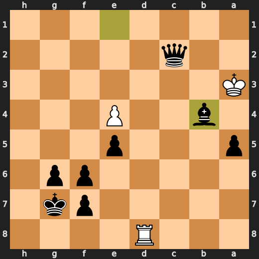

---

## Key Moments

### ❌ Mistake: 29. f3 by CPU (White)

White's f3 fails to improve their position and instead worsens it significantly by weakening the light squares around the king, making it easier for Black to attack with pieces like knights or bishops. The preferred move a5 improves White's pawn structure, preventing Black from opening up the queenside and giving them more control over the position.

- **Eval:** -0.51 → -5.25
- **Preferred:** `a5`
- **Loss:** 474 cp

**Before 29. f3**

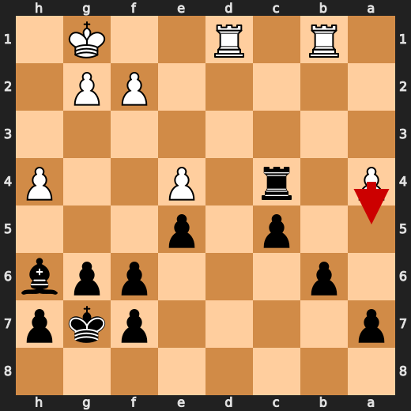

**After 29. f3**

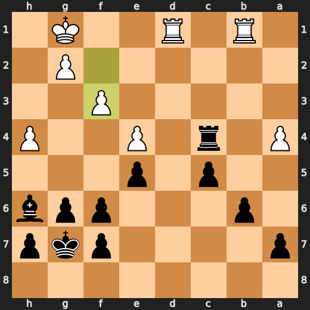

### 💀 Blunder: 45. Rb7 by CPU (White)

White's Rb7 failed to improve their position by leaving a rook on an open file and allowing Black counterplay in the center. The preferred move, Rb2, would have protected the bishop on c3 while maintaining control of the open file. White's blunder worsened their position due to the loss in evaluation (-68.62 compared to -62.59). This move should teach players about the importance of controlling open files and protecting important pieces, especially when they are under attack or vulnerable.

- **Eval:** -62.59 → -68.62
- **Preferred:** `Rb2`
- **Loss:** 603 cp

**Before 45. Rb7**

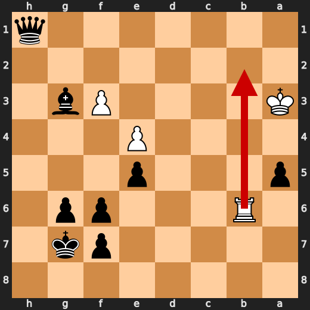

**After 45. Rb7**

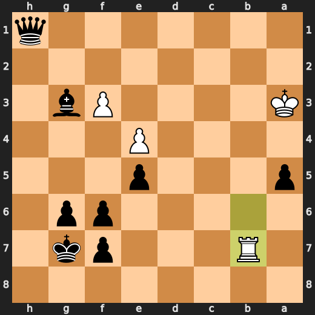

### ❌ Mistake: 45. Qxf3+ by You (Black)

You (Black) played Qxf3+ as a significant eval loss. The preferred move is Qa1+, which improves Black's position by protecting their queen and creating an escape square for it. By playing Qxf3+ instead, Black loses material without achieving any concrete tactical goal or improving their position significantly. This move worsened the position due to its lack of tangible benefit.

- **Eval:** -68.92 → -64.65
- **Preferred:** `Qa1+`
- **Loss:** 427 cp

**Before 45. Qxf3+**

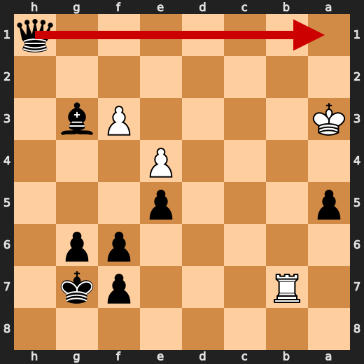

**After 45. Qxf3+**

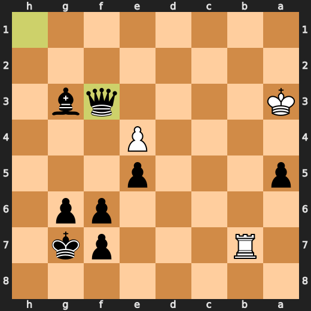

### 💀 Blunder: 46. Rb3 by CPU (White)

White's Rb3 failed to improve their position by leaving a rook on an open file and allowing Black counterplay in the center. The preferred move, Rb2, would have protected the bishop on c3 while maintaining control of the open file. White's blunder worsened their position due to the loss in evaluation (-68.62 compared to -62.59). This move should teach players about the importance of controlling open files and protecting important pieces, especially when they are under attack or vulnerable.

- **Eval:** -12.23 → -63.76
- **Preferred:** `Rb3`
- **Loss:** 5153 cp

**Before 46. Rb3**

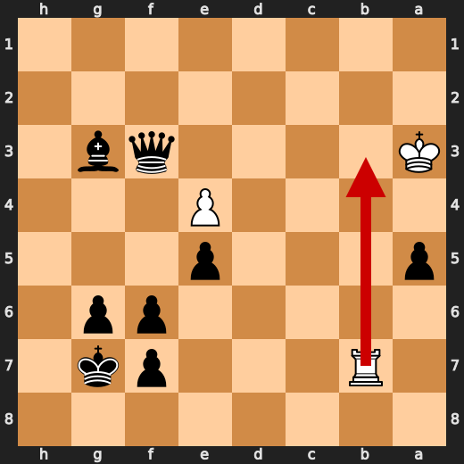

**After 46. Rb3**

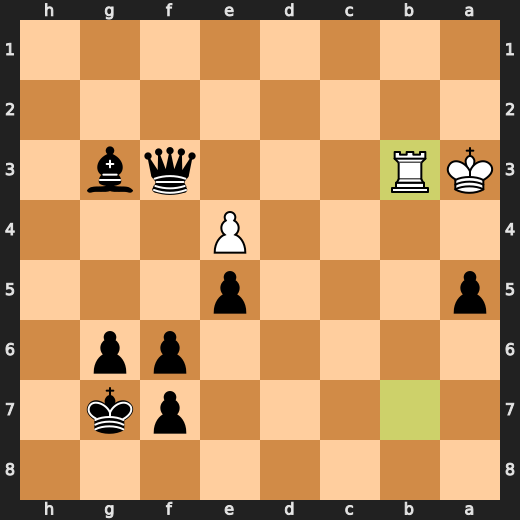

### ❌ Mistake: 47. Rd3 by CPU (White)

White's Rd3 fails to improve their position and instead worsens it significantly by weakening the light squares around the king, making it easier for Black to attack with pieces like knights or bishops. The preferred move Rc3 improves White's pawn structure, preventing Black from opening up the queenside and giving them more control over the position.

- **Eval:** -65.74 → -69.13
- **Preferred:** `Rc3`
- **Loss:** 339 cp

**Before 47. Rd3**

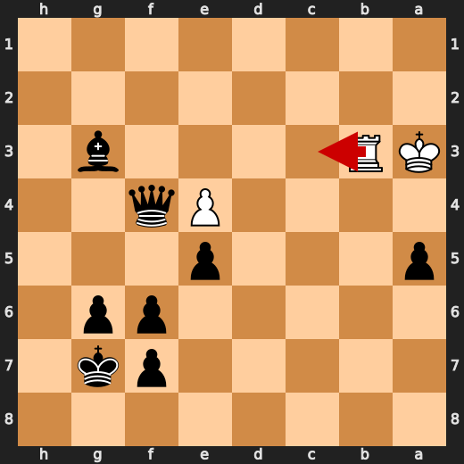

**After 47. Rd3**

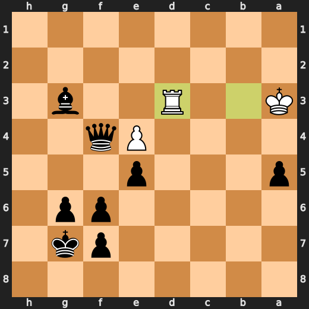

### 💀 Blunder: 47. Be1 by You (Black)

Black played Be1, which worsened their position by giving up a pawn and allowing White to gain space on the queenside. The preferred move Qc1+ improves Black's position by attacking the white king while opening lines for the rooks. However, playing Be1 instead of Qc1+ was a major blunder that gave White an advantage in this endgame position.

- **Eval:** -79.90 → -9.66
- **Preferred:** `Qc1+`
- **Loss:** 7024 cp

**Before 47. Be1**

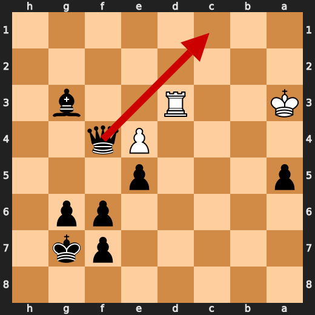

**After 47. Be1**

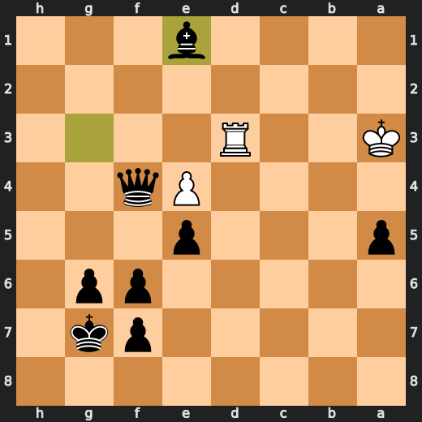

### 💀 Blunder: 48. Rd8 by CPU (White)

White's Rd8 failed to improve their position by leaving a rook on an open file and allowing Black counterplay in the center. The preferred move, Ra3, would have protected the bishop on c3 while maintaining control of the open file. White's blunder worsened their position due to the loss in evaluation (-68.75 compared to -62.49). This move should teach players about the importance of controlling open files and protecting important pieces, especially when they are under attack or vulnerable.

- **Eval:** -69.04 → Black has mate
- **Preferred:** `Rb3`
- **Loss:** 93096 cp

**Before 48. Rd8**

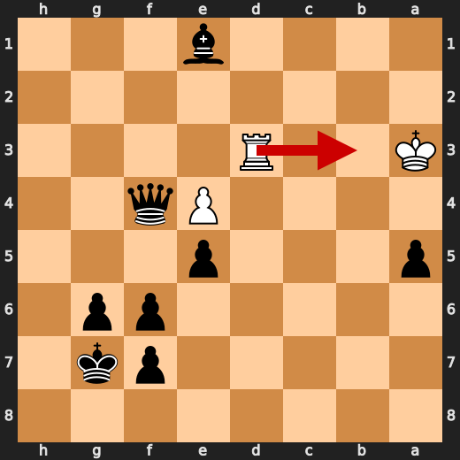

**After 48. Rd8**

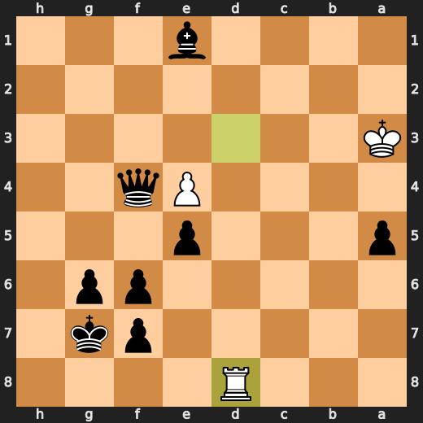

### 🏁 Checkmate: 50. Bb4# by You (Black)

You (Black) played Bb4# to checkmate White at move 50. This forcing move was preferred over any other option because it effectively ends the game by delivering a mate. The fallback explanation for this move is that it serves as a game-ending forcing move, which in this case, leads to an immediate checkmate.

- **Eval:** Black has mate → Black has mate
- **Preferred:** `Bb4#`
- **Loss:** 0 cp

**Before 50. Bb4#**

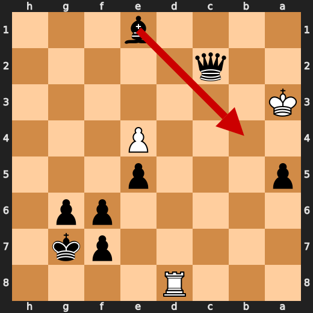

**After 50. Bb4#**


---

## Human Notes

Biggest caveman lesson: CPU (White) blew it with **45. Rb7**.

There was another real screw-up at **29. f3** by **CPU (White)**.

The game-ending shot was **50. Bb4#** by **You (Black)**.

---

<details>
<summary>Compact move list</summary>

- 📖 **1. d4** (CPU (White), Book) — +0.46 → +0.39, preferred `d4`, loss 7 cp
- 📖 **1. Nf6** (You (Black), Book) — +0.44 → +0.57, preferred `Nf6`, loss 13 cp
- 📖 **2. Bf4** (CPU (White), Book) — +0.47 → +0.03, preferred `c4`, loss 44 cp
- 📖 **2. d6** (You (Black), Book) — +0.02 → +0.36, preferred `d5`, loss 34 cp
- 📖 **3. Nf3** (CPU (White), Book) — +0.31 → +0.50, preferred `Nf3`, loss 0 cp
- 📖 **3. g6** (You (Black), Book) — +0.31 → +0.80, preferred `c5`, loss 49 cp
- 👍 **4. e3** (CPU (White), Good) — +0.67 → -0.02, preferred `Nc3`, loss 69 cp
- ✅ **4. Bg7** (You (Black), Best) — +0.09 → +0.06, preferred `Bg7`, loss 0 cp
- ✅ **5. Bd3** (CPU (White), Best) — +0.07 → -0.04, preferred `h3`, loss 11 cp
- ✅ **5. O-O** (You (Black), Best) — -0.03 → +0.02, preferred `c5`, loss 5 cp
- ✅ **6. O-O** (CPU (White), Best) — +0.05 → +0.03, preferred `O-O`, loss 2 cp
- 👍 **6. Nd5** (You (Black), Good) — -0.08 → +0.53, preferred `Nc6`, loss 61 cp
- ⚠️ **7. Nc3** (CPU (White), Inaccuracy) — +0.68 → -1.07, preferred `Bg3`, loss 175 cp
- 👍 **7. Nxc3** (You (Black), Good) — -1.09 → -0.18, preferred `Nxf4`, loss 91 cp
- ✅ **8. bxc3** (CPU (White), Best) — -0.19 → -0.26, preferred `bxc3`, loss 7 cp
- ✅ **8. Nc6** (You (Black), Best) — -0.28 → -0.38, preferred `Qe8`, loss 0 cp
- 🔥 **9. d5** (CPU (White), Great) — -0.31 → -0.81, preferred `e4`, loss 50 cp
- ✅ **9. Ne5** (You (Black), Best) — -0.72 → -0.81, preferred `Ne5`, loss 0 cp
- ✅ **10. Bxe5** (CPU (White), Best) — -0.82 → -0.84, preferred `e4`, loss 2 cp
- ✅ **10. dxe5** (You (Black), Best) — -0.72 → -0.85, preferred `dxe5`, loss 0 cp
- ✅ **11. e4** (CPU (White), Best) — -0.83 → -0.86, preferred `c4`, loss 3 cp
- 🔥 **11. Bg4** (You (Black), Great) — -0.85 → -0.41, preferred `c6`, loss 44 cp
- ✅ **12. c4** (CPU (White), Best) — -0.43 → -0.52, preferred `h3`, loss 9 cp
- 🔥 **12. Qd6** (You (Black), Great) — -0.56 → -0.20, preferred `e6`, loss 36 cp
- ✅ **13. h3** (CPU (White), Best) — -0.27 → -0.37, preferred `a4`, loss 10 cp
- 🔥 **13. Bxf3** (You (Black), Great) — -0.43 → +0.00, preferred `Bd7`, loss 43 cp
- ✅ **14. Qxf3** (CPU (White), Best) — +0.17 → -0.10, preferred `Qxf3`, loss 27 cp
- 👍 **14. c5** (You (Black), Good) — -0.03 → +1.11, preferred `Bh6`, loss 114 cp
- 👍 **15. Rfe1** (CPU (White), Good) — +1.26 → +0.48, preferred `a4`, loss 78 cp
- 👍 **15. Qf6** (You (Black), Good) — +0.45 → +1.14, preferred `f5`, loss 69 cp
- ✅ **16. Qxf6** (CPU (White), Best) — +1.14 → +1.23, preferred `Qxf6`, loss 0 cp
- ✅ **16. exf6** (You (Black), Best) — +1.23 → +1.13, preferred `Bxf6`, loss 0 cp
- ⚠️ **17. d6** (CPU (White), Inaccuracy) — +1.14 → -0.75, preferred `Rab1`, loss 189 cp
- ✅ **17. Rad8** (You (Black), Best) — -0.81 → -0.68, preferred `Rad8`, loss 13 cp
- ⚠️ **18. Rad1** (CPU (White), Inaccuracy) — -0.53 → -2.00, preferred `Reb1`, loss 147 cp
- 👍 **18. Rxd6** (You (Black), Good) — -2.11 → -1.39, preferred `Rxd6`, loss 72 cp
- ✅ **19. Rb1** (CPU (White), Best) — -1.50 → -1.46, preferred `Rb1`, loss 0 cp
- ✅ **19. b6** (You (Black), Best) — -1.62 → -1.64, preferred `b6`, loss 0 cp
- ✅ **20. Bf1** (CPU (White), Best) — -1.53 → -1.66, preferred `a4`, loss 13 cp
- ✅ **20. Rfd8** (You (Black), Best) — -1.74 → -1.63, preferred `Bh6`, loss 11 cp
- 👍 **21. Re3** (CPU (White), Good) — -1.57 → -2.59, preferred `Bd3`, loss 102 cp
- 🔥 **21. Rd2** (You (Black), Great) — -2.42 → -2.15, preferred `f5`, loss 27 cp
- ✅ **22. Bd3** (CPU (White), Best) — -1.99 → -1.70, preferred `Bd3`, loss 0 cp
- 👍 **22. Bh6** (You (Black), Good) — -2.07 → -1.49, preferred `Bh6`, loss 58 cp
- ✅ **23. Ree1** (CPU (White), Best) — -1.12 → -0.66, preferred `Ree1`, loss 0 cp
- ✅ **23. Rd6** (You (Black), Best) — -0.52 → -0.41, preferred `Bg5`, loss 11 cp
- 🔥 **24. a3** (CPU (White), Great) — -0.37 → -0.68, preferred `Kf1`, loss 31 cp
- ✅ **24. Kg7** (You (Black), Best) — -0.53 → -0.42, preferred `Bg5`, loss 11 cp
- 👍 **25. h4** (CPU (White), Good) — -0.38 → -1.28, preferred `Kf1`, loss 90 cp
- ⚠️ **25. R6xd3** (You (Black), Inaccuracy) — -1.24 → +1.53, preferred `g5`, loss 277 cp
- ✅ **26. cxd3** (CPU (White), Best) — +1.42 → +1.48, preferred `cxd3`, loss 0 cp
- 🔥 **26. Rxd3** (You (Black), Great) — +1.06 → +1.51, preferred `Rxd3`, loss 45 cp
- ✅ **27. Red1** (CPU (White), Best) — +1.27 → +1.30, preferred `Red1`, loss 0 cp
- 👍 **27. Rc3** (You (Black), Good) — +1.18 → +1.70, preferred `Rd4`, loss 52 cp
- ⚠️ **28. a4** (CPU (White), Inaccuracy) — +1.78 → -0.77, preferred `Rd7`, loss 255 cp
- ✅ **28. Rxc4** (You (Black), Best) — -0.49 → -0.56, preferred `Rxc4`, loss 0 cp
- ❌ **29. f3** (CPU (White), Mistake) — -0.51 → -5.25, preferred `a5`, loss 474 cp
- 👍 **29. Rxa4** (You (Black), Good) — -5.43 → -4.33, preferred `Be3+`, loss 110 cp
- ⚠️ **30. Rd7** (CPU (White), Inaccuracy) — -4.70 → -6.14, preferred `Ra1`, loss 144 cp
- ✅ **30. c4** (You (Black), Best) — -6.30 → -6.44, preferred `Be3+`, loss 0 cp
- 🔥 **31. Kf1** (CPU (White), Great) — -6.69 → -7.10, preferred `Kh2`, loss 41 cp
- ❌ **31. c3** (You (Black), Mistake) — -6.87 → -3.77, preferred `Be3`, loss 310 cp
- ✅ **32. Rc7** (CPU (White), Best) — -3.75 → -3.27, preferred `Rc7`, loss 0 cp
- 👍 **32. Bd2** (You (Black), Good) — -3.98 → -3.25, preferred `Bd2`, loss 73 cp
- ⚠️ **33. Rb5** (CPU (White), Inaccuracy) — -3.53 → -4.74, preferred `Ke2`, loss 121 cp
- ✅ **33. Ra2** (You (Black), Best) — -4.70 → -5.11, preferred `Ra2`, loss 0 cp
- 🔥 **34. Ke2** (CPU (White), Great) — -5.42 → -5.61, preferred `Ke2`, loss 19 cp
- ✅ **34. Bg5+** (You (Black), Best) — -5.75 → -5.70, preferred `Bg5+`, loss 5 cp
- 🔥 **35. Kd3** (CPU (White), Great) — -5.55 → -5.71, preferred `Kd3`, loss 16 cp
- ✅ **35. Bxh4** (You (Black), Best) — -5.62 → -5.45, preferred `Bxh4`, loss 17 cp
- ⚠️ **36. g3** (CPU (White), Inaccuracy) — -4.82 → -7.31, preferred `Kxc3`, loss 249 cp
- 👍 **36. Bxg3** (You (Black), Good) — -7.47 → -6.74, preferred `Bxg3`, loss 73 cp
- ✅ **37. Kxc3** (CPU (White), Best) — -7.75 → -7.79, preferred `Kxc3`, loss 4 cp
- 👍 **37. Ra3+** (You (Black), Good) — -7.61 → -7.08, preferred `Ra3+`, loss 53 cp
- 🔥 **38. Kc4** (CPU (White), Great) — -7.69 → -8.00, preferred `Rb3`, loss 31 cp
- 👍 **38. h5** (You (Black), Good) — -7.95 → -7.38, preferred `Rxf3`, loss 57 cp
- ⚠️ **39. Rb4** (CPU (White), Inaccuracy) — -6.92 → -9.74, preferred `Rd5`, loss 282 cp
- 👍 **39. h4** (You (Black), Good) — -9.69 → -8.61, preferred `Be1`, loss 108 cp
- ✅ **40. Rb3** (CPU (White), Best) — -8.57 → -8.52, preferred `Rb1`, loss 0 cp
- 🔥 **40. Rxb3** (You (Black), Great) — -8.83 → -8.66, preferred `Ra1`, loss 17 cp
- ✅ **41. Kxb3** (CPU (White), Best) — -8.40 → -8.45, preferred `Kxb3`, loss 5 cp
- ✅ **41. a5** (You (Black), Best) — -8.30 → -8.38, preferred `a6`, loss 0 cp
- 👍 **42. Ka3** (CPU (White), Good) — -8.20 → -8.98, preferred `Kc4`, loss 78 cp
- ✅ **42. h3** (You (Black), Best) — -9.15 → -9.26, preferred `h3`, loss 0 cp
- 👍 **43. Rc6** (CPU (White), Good) — -9.30 → -10.25, preferred `Rc1`, loss 95 cp
- ✅ **43. h2** (You (Black), Best) — -10.27 → -10.59, preferred `Bf2`, loss 0 cp
- ⚠️ **44. Rxb6** (CPU (White), Inaccuracy) — -10.43 → -11.75, preferred `Rc1`, loss 132 cp
- ✅ **44. h1=Q** (You (Black), Best) — -11.63 → -62.59, preferred `h1=Q`, loss 0 cp
- 💀 **45. Rb7** (CPU (White), Blunder) — -62.59 → -68.62, preferred `Rb2`, loss 603 cp
- ❌ **45. Qxf3+** (You (Black), Mistake) — -68.92 → -64.65, preferred `Qa1+`, loss 427 cp
- 💀 **46. Rb3** (CPU (White), Blunder) — -12.23 → -63.76, preferred `Rb3`, loss 5153 cp
- ✅ **46. Qf4** (You (Black), Best) — -64.09 → -64.09, preferred `Qf4`, loss 0 cp
- ❌ **47. Rd3** (CPU (White), Mistake) — -65.74 → -69.13, preferred `Rc3`, loss 339 cp
- 💀 **47. Be1** (You (Black), Blunder) — -79.90 → -9.66, preferred `Qc1+`, loss 7024 cp
- 💀 **48. Rd8** (CPU (White), Blunder) — -69.04 → Black has mate, preferred `Rb3`, loss 93096 cp
- ✅ **48. Qc1+** (You (Black), Best) — Black has mate → Black has mate, preferred `Qc1+`, loss 0 cp
- ✅ **49. Ka2** (CPU (White), Best) — Black has mate → Black has mate, preferred `Ka4`, loss 0 cp
- ✅ **49. Qc2+** (You (Black), Best) — Black has mate → Black has mate, preferred `Qc2+`, loss 0 cp
- ✅ **50. Ka3** (CPU (White), Best) — Black has mate → Black has mate, preferred `Ka1`, loss 0 cp
- 🏁 **50. Bb4#** (You (Black), Checkmate) — Black has mate → Black has mate, preferred `Bb4#`, loss 0 cp

</details>

---

<details>
<summary>Raw engine table</summary>

| Ply | Move | Actor | Played | Label | Eval Before | Eval After | Preferred | Loss |
|---:|---:|---|---|---|---:|---:|---|---:|
| 1 | 1 | CPU (White) | d4 | Book | +0.46 | +0.39 | d4 | 7 |
| 2 | 1 | You (Black) | Nf6 | Book | +0.44 | +0.57 | Nf6 | 13 |
| 3 | 2 | CPU (White) | Bf4 | Book | +0.47 | +0.03 | c4 | 44 |
| 4 | 2 | You (Black) | d6 | Book | +0.02 | +0.36 | d5 | 34 |
| 5 | 3 | CPU (White) | Nf3 | Book | +0.31 | +0.50 | Nf3 | 0 |
| 6 | 3 | You (Black) | g6 | Book | +0.31 | +0.80 | c5 | 49 |
| 7 | 4 | CPU (White) | e3 | Good | +0.67 | -0.02 | Nc3 | 69 |
| 8 | 4 | You (Black) | Bg7 | Best | +0.09 | +0.06 | Bg7 | 0 |
| 9 | 5 | CPU (White) | Bd3 | Best | +0.07 | -0.04 | h3 | 11 |
| 10 | 5 | You (Black) | O-O | Best | -0.03 | +0.02 | c5 | 5 |
| 11 | 6 | CPU (White) | O-O | Best | +0.05 | +0.03 | O-O | 2 |
| 12 | 6 | You (Black) | Nd5 | Good | -0.08 | +0.53 | Nc6 | 61 |
| 13 | 7 | CPU (White) | Nc3 | Inaccuracy | +0.68 | -1.07 | Bg3 | 175 |
| 14 | 7 | You (Black) | Nxc3 | Good | -1.09 | -0.18 | Nxf4 | 91 |
| 15 | 8 | CPU (White) | bxc3 | Best | -0.19 | -0.26 | bxc3 | 7 |
| 16 | 8 | You (Black) | Nc6 | Best | -0.28 | -0.38 | Qe8 | 0 |
| 17 | 9 | CPU (White) | d5 | Great | -0.31 | -0.81 | e4 | 50 |
| 18 | 9 | You (Black) | Ne5 | Best | -0.72 | -0.81 | Ne5 | 0 |
| 19 | 10 | CPU (White) | Bxe5 | Best | -0.82 | -0.84 | e4 | 2 |
| 20 | 10 | You (Black) | dxe5 | Best | -0.72 | -0.85 | dxe5 | 0 |
| 21 | 11 | CPU (White) | e4 | Best | -0.83 | -0.86 | c4 | 3 |
| 22 | 11 | You (Black) | Bg4 | Great | -0.85 | -0.41 | c6 | 44 |
| 23 | 12 | CPU (White) | c4 | Best | -0.43 | -0.52 | h3 | 9 |
| 24 | 12 | You (Black) | Qd6 | Great | -0.56 | -0.20 | e6 | 36 |
| 25 | 13 | CPU (White) | h3 | Best | -0.27 | -0.37 | a4 | 10 |
| 26 | 13 | You (Black) | Bxf3 | Great | -0.43 | +0.00 | Bd7 | 43 |
| 27 | 14 | CPU (White) | Qxf3 | Best | +0.17 | -0.10 | Qxf3 | 27 |
| 28 | 14 | You (Black) | c5 | Good | -0.03 | +1.11 | Bh6 | 114 |
| 29 | 15 | CPU (White) | Rfe1 | Good | +1.26 | +0.48 | a4 | 78 |
| 30 | 15 | You (Black) | Qf6 | Good | +0.45 | +1.14 | f5 | 69 |
| 31 | 16 | CPU (White) | Qxf6 | Best | +1.14 | +1.23 | Qxf6 | 0 |
| 32 | 16 | You (Black) | exf6 | Best | +1.23 | +1.13 | Bxf6 | 0 |
| 33 | 17 | CPU (White) | d6 | Inaccuracy | +1.14 | -0.75 | Rab1 | 189 |
| 34 | 17 | You (Black) | Rad8 | Best | -0.81 | -0.68 | Rad8 | 13 |
| 35 | 18 | CPU (White) | Rad1 | Inaccuracy | -0.53 | -2.00 | Reb1 | 147 |
| 36 | 18 | You (Black) | Rxd6 | Good | -2.11 | -1.39 | Rxd6 | 72 |
| 37 | 19 | CPU (White) | Rb1 | Best | -1.50 | -1.46 | Rb1 | 0 |
| 38 | 19 | You (Black) | b6 | Best | -1.62 | -1.64 | b6 | 0 |
| 39 | 20 | CPU (White) | Bf1 | Best | -1.53 | -1.66 | a4 | 13 |
| 40 | 20 | You (Black) | Rfd8 | Best | -1.74 | -1.63 | Bh6 | 11 |
| 41 | 21 | CPU (White) | Re3 | Good | -1.57 | -2.59 | Bd3 | 102 |
| 42 | 21 | You (Black) | Rd2 | Great | -2.42 | -2.15 | f5 | 27 |
| 43 | 22 | CPU (White) | Bd3 | Best | -1.99 | -1.70 | Bd3 | 0 |
| 44 | 22 | You (Black) | Bh6 | Good | -2.07 | -1.49 | Bh6 | 58 |
| 45 | 23 | CPU (White) | Ree1 | Best | -1.12 | -0.66 | Ree1 | 0 |
| 46 | 23 | You (Black) | Rd6 | Best | -0.52 | -0.41 | Bg5 | 11 |
| 47 | 24 | CPU (White) | a3 | Great | -0.37 | -0.68 | Kf1 | 31 |
| 48 | 24 | You (Black) | Kg7 | Best | -0.53 | -0.42 | Bg5 | 11 |
| 49 | 25 | CPU (White) | h4 | Good | -0.38 | -1.28 | Kf1 | 90 |
| 50 | 25 | You (Black) | R6xd3 | Inaccuracy | -1.24 | +1.53 | g5 | 277 |
| 51 | 26 | CPU (White) | cxd3 | Best | +1.42 | +1.48 | cxd3 | 0 |
| 52 | 26 | You (Black) | Rxd3 | Great | +1.06 | +1.51 | Rxd3 | 45 |
| 53 | 27 | CPU (White) | Red1 | Best | +1.27 | +1.30 | Red1 | 0 |
| 54 | 27 | You (Black) | Rc3 | Good | +1.18 | +1.70 | Rd4 | 52 |
| 55 | 28 | CPU (White) | a4 | Inaccuracy | +1.78 | -0.77 | Rd7 | 255 |
| 56 | 28 | You (Black) | Rxc4 | Best | -0.49 | -0.56 | Rxc4 | 0 |
| 57 | 29 | CPU (White) | f3 | Mistake | -0.51 | -5.25 | a5 | 474 |
| 58 | 29 | You (Black) | Rxa4 | Good | -5.43 | -4.33 | Be3+ | 110 |
| 59 | 30 | CPU (White) | Rd7 | Inaccuracy | -4.70 | -6.14 | Ra1 | 144 |
| 60 | 30 | You (Black) | c4 | Best | -6.30 | -6.44 | Be3+ | 0 |
| 61 | 31 | CPU (White) | Kf1 | Great | -6.69 | -7.10 | Kh2 | 41 |
| 62 | 31 | You (Black) | c3 | Mistake | -6.87 | -3.77 | Be3 | 310 |
| 63 | 32 | CPU (White) | Rc7 | Best | -3.75 | -3.27 | Rc7 | 0 |
| 64 | 32 | You (Black) | Bd2 | Good | -3.98 | -3.25 | Bd2 | 73 |
| 65 | 33 | CPU (White) | Rb5 | Inaccuracy | -3.53 | -4.74 | Ke2 | 121 |
| 66 | 33 | You (Black) | Ra2 | Best | -4.70 | -5.11 | Ra2 | 0 |
| 67 | 34 | CPU (White) | Ke2 | Great | -5.42 | -5.61 | Ke2 | 19 |
| 68 | 34 | You (Black) | Bg5+ | Best | -5.75 | -5.70 | Bg5+ | 5 |
| 69 | 35 | CPU (White) | Kd3 | Great | -5.55 | -5.71 | Kd3 | 16 |
| 70 | 35 | You (Black) | Bxh4 | Best | -5.62 | -5.45 | Bxh4 | 17 |
| 71 | 36 | CPU (White) | g3 | Inaccuracy | -4.82 | -7.31 | Kxc3 | 249 |
| 72 | 36 | You (Black) | Bxg3 | Good | -7.47 | -6.74 | Bxg3 | 73 |
| 73 | 37 | CPU (White) | Kxc3 | Best | -7.75 | -7.79 | Kxc3 | 4 |
| 74 | 37 | You (Black) | Ra3+ | Good | -7.61 | -7.08 | Ra3+ | 53 |
| 75 | 38 | CPU (White) | Kc4 | Great | -7.69 | -8.00 | Rb3 | 31 |
| 76 | 38 | You (Black) | h5 | Good | -7.95 | -7.38 | Rxf3 | 57 |
| 77 | 39 | CPU (White) | Rb4 | Inaccuracy | -6.92 | -9.74 | Rd5 | 282 |
| 78 | 39 | You (Black) | h4 | Good | -9.69 | -8.61 | Be1 | 108 |
| 79 | 40 | CPU (White) | Rb3 | Best | -8.57 | -8.52 | Rb1 | 0 |
| 80 | 40 | You (Black) | Rxb3 | Great | -8.83 | -8.66 | Ra1 | 17 |
| 81 | 41 | CPU (White) | Kxb3 | Best | -8.40 | -8.45 | Kxb3 | 5 |
| 82 | 41 | You (Black) | a5 | Best | -8.30 | -8.38 | a6 | 0 |
| 83 | 42 | CPU (White) | Ka3 | Good | -8.20 | -8.98 | Kc4 | 78 |
| 84 | 42 | You (Black) | h3 | Best | -9.15 | -9.26 | h3 | 0 |
| 85 | 43 | CPU (White) | Rc6 | Good | -9.30 | -10.25 | Rc1 | 95 |
| 86 | 43 | You (Black) | h2 | Best | -10.27 | -10.59 | Bf2 | 0 |
| 87 | 44 | CPU (White) | Rxb6 | Inaccuracy | -10.43 | -11.75 | Rc1 | 132 |
| 88 | 44 | You (Black) | h1=Q | Best | -11.63 | -62.59 | h1=Q | 0 |
| 89 | 45 | CPU (White) | Rb7 | Blunder | -62.59 | -68.62 | Rb2 | 603 |
| 90 | 45 | You (Black) | Qxf3+ | Mistake | -68.92 | -64.65 | Qa1+ | 427 |
| 91 | 46 | CPU (White) | Rb3 | Blunder | -12.23 | -63.76 | Rb3 | 5153 |
| 92 | 46 | You (Black) | Qf4 | Best | -64.09 | -64.09 | Qf4 | 0 |
| 93 | 47 | CPU (White) | Rd3 | Mistake | -65.74 | -69.13 | Rc3 | 339 |
| 94 | 47 | You (Black) | Be1 | Blunder | -79.90 | -9.66 | Qc1+ | 7024 |
| 95 | 48 | CPU (White) | Rd8 | Blunder | -69.04 | Black has mate | Rb3 | 93096 |
| 96 | 48 | You (Black) | Qc1+ | Best | Black has mate | Black has mate | Qc1+ | 0 |
| 97 | 49 | CPU (White) | Ka2 | Best | Black has mate | Black has mate | Ka4 | 0 |
| 98 | 49 | You (Black) | Qc2+ | Best | Black has mate | Black has mate | Qc2+ | 0 |
| 99 | 50 | CPU (White) | Ka3 | Best | Black has mate | Black has mate | Ka1 | 0 |
| 100 | 50 | You (Black) | Bb4# | Checkmate | Black has mate | Black has mate | Bb4# | 0 |

</details>

---

<details>
<summary>Clean PGN</summary>

```pgn
[Event "AI Factory's Chess"]
[Site "Android Device"]
[Date "2026.05.21"]
[Round "1"]
[White "CPU (5)"]
[Black "You"]
[Result "0-1"]
[PlyCount "102"]

1. d4 Nf6 2. Bf4 d6 3. Nf3 g6 4. e3 Bg7 5. Bd3 O-O 6. O-O Nd5 7. Nc3 Nxc3 8.
bxc3 Nc6 9. d5 Ne5 10. Bxe5 dxe5 11. e4 Bg4 12. c4 Qd6 13. h3 Bxf3 14. Qxf3 c5
15. Rfe1 Qf6 16. Qxf6 exf6 17. d6 Rad8 18. Rad1 Rxd6 19. Rb1 b6 20. Bf1 Rfd8
21. Re3 Rd2 22. Bd3 Bh6 23. Ree1 Rd6 24. a3 Kg7 25. h4 R6xd3 26. cxd3 Rxd3 27.
Red1 Rc3 28. a4 Rxc4 29. f3 Rxa4 30. Rd7 c4 31. Kf1 c3 32. Rc7 Bd2 33. Rb5 Ra2
34. Ke2 Bg5+ 35. Kd3 Bxh4 36. g3 Bxg3 37. Kxc3 Ra3+ 38. Kc4 h5 39. Rb4 h4 40.
Rb3 Rxb3 41. Kxb3 a5 42. Ka3 h3 43. Rc6 h2 44. Rxb6 h1=Q 45. Rb7 Qxf3+ 46. Rb3
Qf4 47. Rd3 Be1 48. Rd8 Qc1+ 49. Ka2 Qc2+ 50. Ka3 Bb4# 0-1
```

</details>
