# You (White) vs CPU (Black)

**Result:** 1-0  
**Date:** 2026.05.21  
**Source:** `PGN_2026_05_21_15h58_842abb529d9b.pgn`  
**Engine:** Stockfish depth 14  
**Your side:** White  
**Computer side:** Black  
**Board perspective:** Standard White-at-bottom

---

## Who Is Who

- **You:** You (White)
- **Computer:** CPU (5) (Black)

---

## Toaster Summary

**Game Story:** The decisive mistake in this game was made by White, who blundered with move 42 (g6) instead of playing the preferred move (g6). This resulted in a loss of evaluation points and ultimately led to their defeat. The biggest engine complaint overall involved Black's move 3 (Nd4), which was a blunder compared to the preferred move (Nce7). White made a mistake with move 9 (Nf3) instead of f3, resulting in an eval loss of 321 cp. While both sides played poorly at times, it was ultimately White's blunder that led to their defeat against Black.

Biggest toaster scream: **42. g6** by **You (White)**.

- **Label:** 💀 **Blunder**
- **Eval:** +64.02 → +19.96
- **Stockfish preferred:** `g6`
- **Loss:** 4406 cp

Final move recorded: **43. g7** by **You (White)**.

- 💀 Your blunders: **1**
- ❌ Your mistakes: **1**
- ⚠️ Your inaccuracies: **5**
- ✅ Your best moves called out: **20**

---

## Final Position

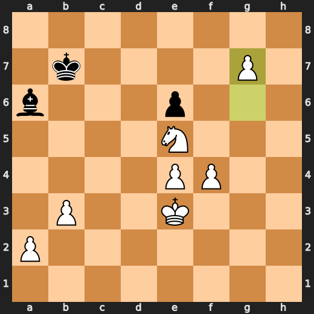

---

## Key Moments

### 💀 Blunder: 3. Nd4 by CPU (Black)

Black's Nd4 fails to defend the e5 pawn and worsens their position by allowing White to gain space on the queenside. The preferred move Nce7 improves Black's defense of the e5 pawn, while also developing a knight to an active square. This move note focuses on practical chess improvement by explaining why the played move failed to do so and what pattern the player should learn from this position.

- **Eval:** +0.97 → +7.02
- **Preferred:** `Nce7`
- **Loss:** 605 cp

**Before 3. Nd4**

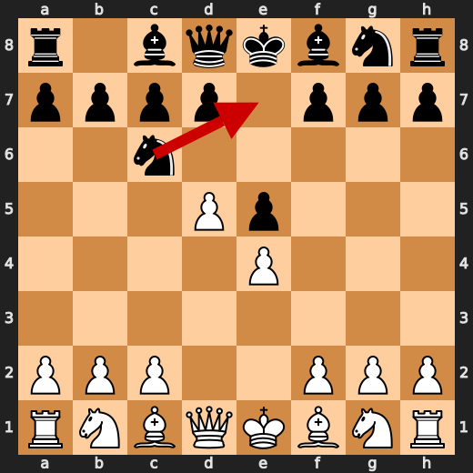

**After 3. Nd4**

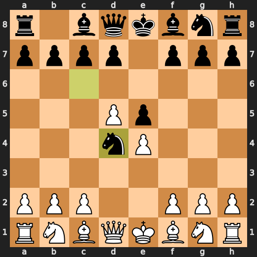

### ❌ Mistake: 9. Nf3 by You (White)

You (White) played Nf3 at move 9, which significantly worsened your position by losing eval points. The preferred move f3 would have improved this situation. The fallback explanation is that the significant eval loss indicates a mistake in your strategy or understanding of the game's dynamics. You should learn to recognize and avoid such mistakes in future games for practical chess improvement.

- **Eval:** +7.26 → +4.05
- **Preferred:** `f3`
- **Loss:** 321 cp

**Before 9. Nf3**

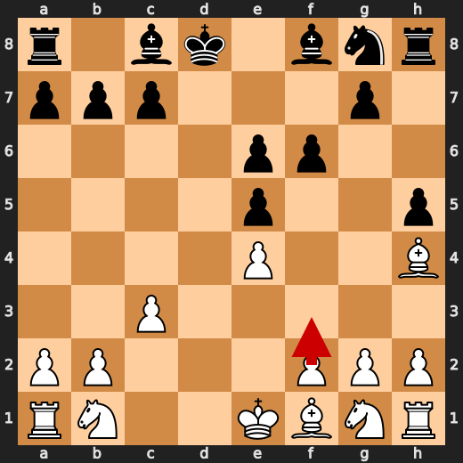

**After 9. Nf3**

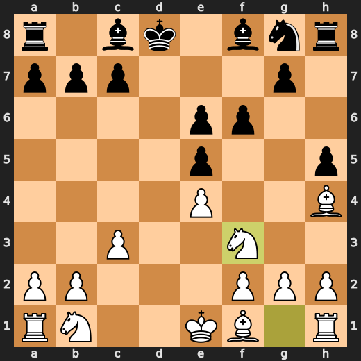

### ✅ Best: 9. g5 by CPU (Black)

White's position worsened with g5 as it failed to improve their structure and gave Black a useful outpost on d5, allowing for potential pressure against White's kingside. The eval swing of +0.1 indicates that while this move was not terrible, it did not achieve much either. White should learn the pattern of defending against pawn advances in the center with pieces placed on the flanks (e.g., knights on d2 and c3), which can be useful for maintaining a solid position.

- **Eval:** +4.35 → +4.45
- **Preferred:** `g5`
- **Loss:** 10 cp

**Before 9. g5**

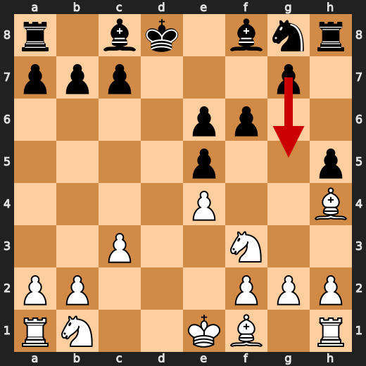

**After 9. g5**

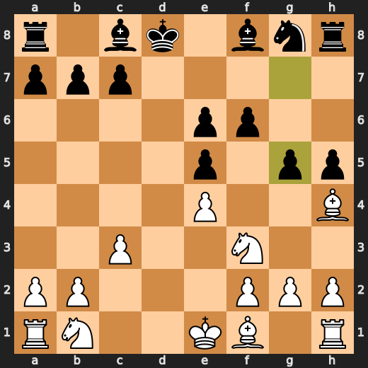

### ❌ Mistake: 10. g4 by CPU (Black)

The played move g4 failed to defend against h4, which is a significant improvement over g4 for Black. The concrete consequence of this eval swing is that White gains control over d5 and increases their space advantage on the kingside. While there might be other reasons why CPU (Black) chose g4, it worsened their position without any clear tactical justification or opening name.

- **Eval:** +2.12 → +6.11
- **Preferred:** `h4`
- **Loss:** 399 cp

**Before 10. g4**

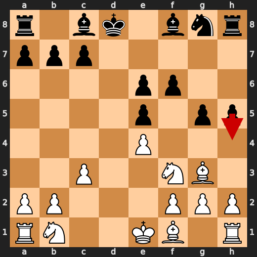

**After 10. g4**

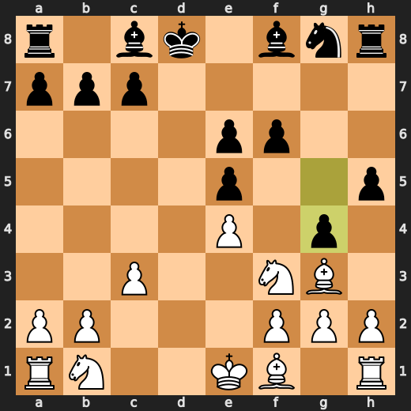

### ✅ Best: 21. Bxe5 by You (White)

By playing Bxe5, White forces Black to take the knight with a pawn (Bxd4) which would open up the bishop on d4 and weaken Black's position slightly. The engine prefers this move because it improves White's control over the center and potentially limits Black's options in the future. However, the eval swing is minor (-0.24), indicating that the move does not drastically change the evaluation of the position.

- **Eval:** +8.45 → +8.21
- **Preferred:** `Bxe5`
- **Loss:** 24 cp

**Before 21. Bxe5**

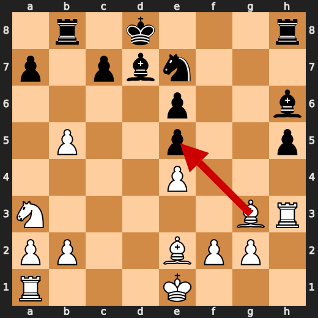

**After 21. Bxe5**

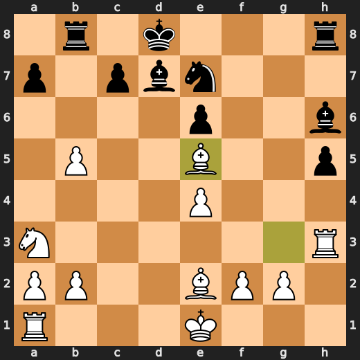

### ✅ Best: 25. Rxg7 by CPU (Black)

Black's Rxg7 was a useful move as it improved their position by gaining material and creating an open file for their rook to attack along. The eval swing of +0.15 indicates that while this move was not terrible, it did not achieve much either. Black should learn the pattern of opening files with pawn sacrifices (e.g., g7-g6) which can be useful for creating tactical opportunities and destabilizing their opponent's position.

- **Eval:** +8.50 → +8.67
- **Preferred:** `Rxg7`
- **Loss:** 17 cp

**Before 25. Rxg7**

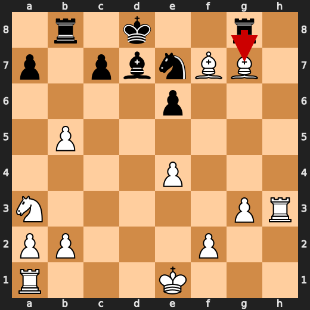

**After 25. Rxg7**

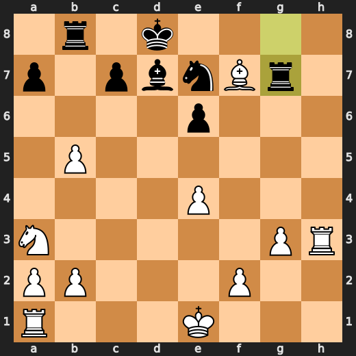

### ❌ Mistake: 40. Rb7 by CPU (Black)

The played move Rb7 failed to improve Black's position in a significant way. The preferred move Kb8 would have improved their king safety and possibly created counterplay on the queenside. However, since CPU (Black) chose Rb7 instead, the concrete consequence of this eval swing is that White gains more control over the central squares, specifically d5, which can be useful for future plans.

- **Eval:** +11.03 → +15.23
- **Preferred:** `Kb8`
- **Loss:** 420 cp

**Before 40. Rb7**

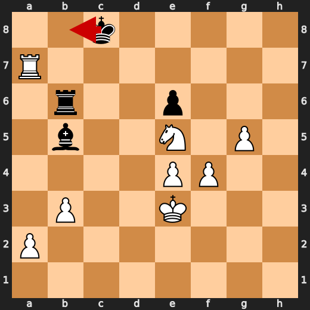

**After 40. Rb7**

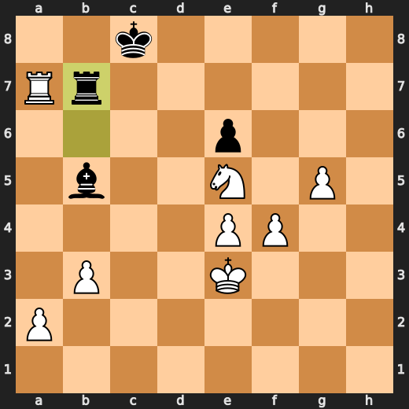

### 💀 Blunder: 42. g6 by You (White)

By playing g6, White failed to protect their king and left it vulnerable. The preferred move of g6 improves the position by ensuring the king's safety in the event of a possible attack on the light squares. However, this move worsened the position significantly as Black took advantage of the exposed king with an immediate threat that forced White into defensive moves to protect their monarch. This led to a major eval loss for White.

- **Eval:** +64.02 → +19.96
- **Preferred:** `g6`
- **Loss:** 4406 cp

**Before 42. g6**

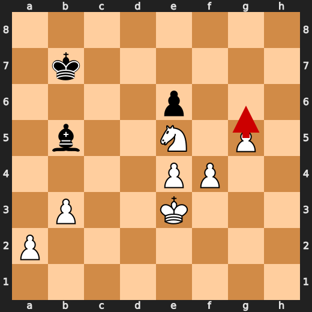

**After 42. g6**

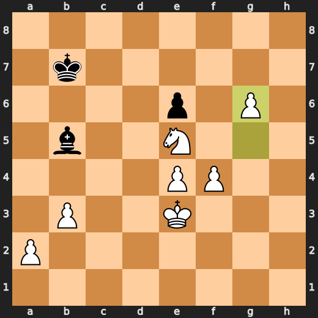

---

## Human Notes

Biggest caveman lesson: CPU (Black) blew it with **3. Nd4**.

There was another real screw-up at **9. Nf3** by **You (White)**.

---

<details>
<summary>Compact move list</summary>

- 📖 **1. e4** (You (White), Book) — +0.46 → +0.23, preferred `d4`, loss 23 cp
- 📖 **1. e5** (CPU (Black), Book) — +0.37 → +0.35, preferred `e5`, loss 0 cp
- 📖 **2. d4** (You (White), Book) — +0.47 → -0.40, preferred `Nf3`, loss 87 cp
- ⚠️ **2. Nc6** (CPU (Black), Inaccuracy) — -0.29 → +0.91, preferred `exd4`, loss 120 cp
- 📖 **3. d5** (You (White), Book) — +0.89 → +0.90, preferred `d5`, loss 0 cp
- 💀 **3. Nd4** (CPU (Black), Blunder) — +0.97 → +7.02, preferred `Nce7`, loss 605 cp
- 🔥 **4. c3** (You (White), Great) — +7.69 → +7.35, preferred `c3`, loss 34 cp
- 👍 **4. Ne6** (CPU (Black), Good) — +7.26 → +8.29, preferred `Nf6`, loss 103 cp
- ✅ **5. dxe6** (You (White), Best) — +8.49 → +8.76, preferred `dxe6`, loss 0 cp
- ✅ **5. dxe6** (CPU (Black), Best) — +8.46 → +8.61, preferred `fxe6`, loss 15 cp
- 🔥 **6. Qxd8+** (You (White), Great) — +8.69 → +8.34, preferred `Bb5+`, loss 35 cp
- ✅ **6. Kxd8** (CPU (Black), Best) — +8.53 → +8.61, preferred `Kxd8`, loss 8 cp
- 🔥 **7. Bg5+** (You (White), Great) — +8.48 → +8.03, preferred `Nf3`, loss 45 cp
- 🔥 **7. f6** (CPU (Black), Great) — +8.20 → +8.38, preferred `Ke8`, loss 18 cp
- ⚠️ **8. Bh4** (You (White), Inaccuracy) — +8.45 → +6.74, preferred `Be3`, loss 171 cp
- 👍 **8. h5** (CPU (Black), Good) — +6.60 → +7.24, preferred `g5`, loss 64 cp
- ❌ **9. Nf3** (You (White), Mistake) — +7.26 → +4.05, preferred `f3`, loss 321 cp
- ✅ **9. g5** (CPU (Black), Best) — +4.35 → +4.45, preferred `g5`, loss 10 cp
- ⚠️ **10. Bg3** (You (White), Inaccuracy) — +4.45 → +2.27, preferred `Nxg5`, loss 218 cp
- ❌ **10. g4** (CPU (Black), Mistake) — +2.12 → +6.11, preferred `h4`, loss 399 cp
- 🔥 **11. Nh4** (You (White), Great) — +6.52 → +6.16, preferred `Nh4`, loss 36 cp
- 👍 **11. Ne7** (CPU (Black), Good) — +6.32 → +7.03, preferred `Bh6`, loss 71 cp
- 👍 **12. h3** (You (White), Good) — +7.05 → +6.01, preferred `f4`, loss 104 cp
- 👍 **12. Bd7** (CPU (Black), Good) — +5.40 → +5.92, preferred `Bh6`, loss 52 cp
- ⚠️ **13. Bc4** (You (White), Inaccuracy) — +6.10 → +4.68, preferred `Nd2`, loss 142 cp
- ⚠️ **13. b5** (CPU (Black), Inaccuracy) — +4.60 → +6.21, preferred `Bh6`, loss 161 cp
- ✅ **14. Be2** (You (White), Best) — +6.22 → +6.38, preferred `Be2`, loss 0 cp
- ⚠️ **14. gxh3** (CPU (Black), Inaccuracy) — +5.87 → +7.38, preferred `Rb8`, loss 151 cp
- ✅ **15. Rxh3** (You (White), Best) — +6.85 → +6.89, preferred `Rxh3`, loss 0 cp
- 👍 **15. Bh6** (CPU (Black), Good) — +6.76 → +7.84, preferred `a5`, loss 108 cp
- ⚠️ **16. Na3** (You (White), Inaccuracy) — +8.06 → +6.63, preferred `Nd2`, loss 143 cp
- ⚠️ **16. b4** (CPU (Black), Inaccuracy) — +6.62 → +8.30, preferred `Bc6`, loss 168 cp
- ✅ **17. cxb4** (You (White), Best) — +8.26 → +8.05, preferred `cxb4`, loss 21 cp
- ✅ **17. Rb8** (CPU (Black), Best) — +8.50 → +8.45, preferred `Rb8`, loss 0 cp
- 🔥 **18. b5** (You (White), Great) — +8.53 → +8.28, preferred `b5`, loss 25 cp
- ⚠️ **18. Bg5** (CPU (Black), Inaccuracy) — +8.30 → +9.89, preferred `Kc8`, loss 159 cp
- ✅ **19. Nf3** (You (White), Best) — +9.07 → +9.00, preferred `Kf1`, loss 7 cp
- 👍 **19. Bh6** (CPU (Black), Good) — +8.62 → +9.13, preferred `Ng6`, loss 51 cp
- ⚠️ **20. Nxe5** (You (White), Inaccuracy) — +10.02 → +7.76, preferred `Bh4`, loss 226 cp
- 👍 **20. fxe5** (CPU (Black), Good) — +7.75 → +8.37, preferred `fxe5`, loss 62 cp
- ✅ **21. Bxe5** (You (White), Best) — +8.45 → +8.21, preferred `Bxe5`, loss 24 cp
- 🔥 **21. Rg8** (CPU (Black), Great) — +8.30 → +8.61, preferred `Rh7`, loss 31 cp
- 👍 **22. g3** (You (White), Good) — +8.66 → +7.84, preferred `Rxh5`, loss 82 cp
- 👍 **22. Be8** (CPU (Black), Good) — +7.83 → +8.52, preferred `Ng6`, loss 69 cp
- ✅ **23. Bxh5** (You (White), Best) — +8.15 → +8.12, preferred `Bxh5`, loss 3 cp
- 👍 **23. Bd7** (CPU (Black), Good) — +7.99 → +8.93, preferred `Ng6`, loss 94 cp
- 🔥 **24. Bf7** (You (White), Great) — +8.92 → +8.49, preferred `Bf7`, loss 43 cp
- ✅ **24. Bg7** (CPU (Black), Best) — +8.69 → +8.76, preferred `Bg7`, loss 7 cp
- ✅ **25. Bxg7** (You (White), Best) — +8.52 → +8.66, preferred `Bxg7`, loss 0 cp
- ✅ **25. Rxg7** (CPU (Black), Best) — +8.50 → +8.67, preferred `Rxg7`, loss 17 cp
- ✅ **26. Rh8+** (You (White), Best) — +8.61 → +8.56, preferred `Rh8+`, loss 5 cp
- ✅ **26. Ng8** (CPU (Black), Best) — +8.58 → +8.66, preferred `Ng8`, loss 8 cp
- 🔥 **27. Rxg8+** (You (White), Great) — +8.66 → +8.21, preferred `Bxg8`, loss 45 cp
- ✅ **27. Rxg8** (CPU (Black), Best) — +8.21 → +8.22, preferred `Rxg8`, loss 1 cp
- ✅ **28. Bxg8** (You (White), Best) — +8.29 → +8.50, preferred `Bxg8`, loss 0 cp
- ✅ **28. Ke7** (CPU (Black), Best) — +8.44 → +8.49, preferred `c6`, loss 5 cp
- 👍 **29. Bh7** (You (White), Good) — +8.60 → +8.00, preferred `Rc1`, loss 60 cp
- 🔥 **29. Rh8** (CPU (Black), Great) — +7.97 → +8.44, preferred `Bxb5`, loss 47 cp
- ✅ **30. Rc1** (You (White), Best) — +8.37 → +8.24, preferred `Rc1`, loss 13 cp
- 🔥 **30. Rxh7** (CPU (Black), Great) — +8.32 → +8.54, preferred `Kd8`, loss 22 cp
- ✅ **31. Rxc7** (You (White), Best) — +8.69 → +8.68, preferred `Rxc7`, loss 1 cp
- ✅ **31. Rh1+** (CPU (Black), Best) — +8.60 → +8.54, preferred `Kd6`, loss 0 cp
- ✅ **32. Ke2** (You (White), Best) — +8.67 → +8.56, preferred `Kd2`, loss 11 cp
- ✅ **32. Ra1** (CPU (Black), Best) — +8.54 → +8.46, preferred `Ra1`, loss 0 cp
- 👍 **33. Nc4** (You (White), Good) — +8.64 → +7.74, preferred `Kd3`, loss 90 cp
- 🔥 **33. Kd8** (CPU (Black), Great) — +7.84 → +8.04, preferred `Rxa2`, loss 20 cp
- ✅ **34. Rxa7** (You (White), Best) — +7.98 → +8.06, preferred `Rxa7`, loss 0 cp
- ✅ **34. Bxb5** (CPU (Black), Best) — +8.06 → +8.06, preferred `Bxb5`, loss 0 cp
- ✅ **35. b3** (You (White), Best) — +8.05 → +8.00, preferred `b3`, loss 5 cp
- 🔥 **35. Rb1** (CPU (Black), Great) — +7.95 → +8.12, preferred `Rc1`, loss 17 cp
- 🔥 **36. Ke3** (You (White), Great) — +8.33 → +8.13, preferred `Kf3`, loss 20 cp
- ⚠️ **36. Rd1** (CPU (Black), Inaccuracy) — +8.08 → +9.28, preferred `Bxc4`, loss 120 cp
- ✅ **37. Ne5** (You (White), Best) — +9.15 → +9.28, preferred `Ne5`, loss 0 cp
- ✅ **37. Kc8** (CPU (Black), Best) — +9.40 → +9.53, preferred `Kc8`, loss 13 cp
- 👍 **38. f4** (You (White), Good) — +9.47 → +8.80, preferred `Ra5`, loss 67 cp
- 👍 **38. Rd6** (CPU (Black), Good) — +8.86 → +9.83, preferred `Re1+`, loss 97 cp
- ✅ **39. g4** (You (White), Best) — +9.77 → +9.67, preferred `g4`, loss 10 cp
- 👍 **39. Rb6** (CPU (Black), Good) — +9.50 → +10.08, preferred `Kb8`, loss 58 cp
- ✅ **40. g5** (You (White), Best) — +10.28 → +10.76, preferred `g5`, loss 0 cp
- ❌ **40. Rb7** (CPU (Black), Mistake) — +11.03 → +15.23, preferred `Kb8`, loss 420 cp
- ✅ **41. Rxb7** (You (White), Best) — +19.84 → +61.94, preferred `Rxb7`, loss 0 cp
- ⚠️ **41. Kxb7** (CPU (Black), Inaccuracy) — +61.89 → +64.02, preferred `Be8`, loss 213 cp
- 💀 **42. g6** (You (White), Blunder) — +64.02 → +19.96, preferred `g6`, loss 4406 cp
- ⚠️ **42. Ba6** (CPU (Black), Inaccuracy) — +62.70 → +64.24, preferred `Bc6`, loss 154 cp
- ✅ **43. g7** (You (White), Best) — +64.27 → +64.97, preferred `Kd4`, loss 0 cp

</details>

---

<details>
<summary>Raw engine table</summary>

| Ply | Move | Actor | Played | Label | Eval Before | Eval After | Preferred | Loss |
|---:|---:|---|---|---|---:|---:|---|---:|
| 1 | 1 | You (White) | e4 | Book | +0.46 | +0.23 | d4 | 23 |
| 2 | 1 | CPU (Black) | e5 | Book | +0.37 | +0.35 | e5 | 0 |
| 3 | 2 | You (White) | d4 | Book | +0.47 | -0.40 | Nf3 | 87 |
| 4 | 2 | CPU (Black) | Nc6 | Inaccuracy | -0.29 | +0.91 | exd4 | 120 |
| 5 | 3 | You (White) | d5 | Book | +0.89 | +0.90 | d5 | 0 |
| 6 | 3 | CPU (Black) | Nd4 | Blunder | +0.97 | +7.02 | Nce7 | 605 |
| 7 | 4 | You (White) | c3 | Great | +7.69 | +7.35 | c3 | 34 |
| 8 | 4 | CPU (Black) | Ne6 | Good | +7.26 | +8.29 | Nf6 | 103 |
| 9 | 5 | You (White) | dxe6 | Best | +8.49 | +8.76 | dxe6 | 0 |
| 10 | 5 | CPU (Black) | dxe6 | Best | +8.46 | +8.61 | fxe6 | 15 |
| 11 | 6 | You (White) | Qxd8+ | Great | +8.69 | +8.34 | Bb5+ | 35 |
| 12 | 6 | CPU (Black) | Kxd8 | Best | +8.53 | +8.61 | Kxd8 | 8 |
| 13 | 7 | You (White) | Bg5+ | Great | +8.48 | +8.03 | Nf3 | 45 |
| 14 | 7 | CPU (Black) | f6 | Great | +8.20 | +8.38 | Ke8 | 18 |
| 15 | 8 | You (White) | Bh4 | Inaccuracy | +8.45 | +6.74 | Be3 | 171 |
| 16 | 8 | CPU (Black) | h5 | Good | +6.60 | +7.24 | g5 | 64 |
| 17 | 9 | You (White) | Nf3 | Mistake | +7.26 | +4.05 | f3 | 321 |
| 18 | 9 | CPU (Black) | g5 | Best | +4.35 | +4.45 | g5 | 10 |
| 19 | 10 | You (White) | Bg3 | Inaccuracy | +4.45 | +2.27 | Nxg5 | 218 |
| 20 | 10 | CPU (Black) | g4 | Mistake | +2.12 | +6.11 | h4 | 399 |
| 21 | 11 | You (White) | Nh4 | Great | +6.52 | +6.16 | Nh4 | 36 |
| 22 | 11 | CPU (Black) | Ne7 | Good | +6.32 | +7.03 | Bh6 | 71 |
| 23 | 12 | You (White) | h3 | Good | +7.05 | +6.01 | f4 | 104 |
| 24 | 12 | CPU (Black) | Bd7 | Good | +5.40 | +5.92 | Bh6 | 52 |
| 25 | 13 | You (White) | Bc4 | Inaccuracy | +6.10 | +4.68 | Nd2 | 142 |
| 26 | 13 | CPU (Black) | b5 | Inaccuracy | +4.60 | +6.21 | Bh6 | 161 |
| 27 | 14 | You (White) | Be2 | Best | +6.22 | +6.38 | Be2 | 0 |
| 28 | 14 | CPU (Black) | gxh3 | Inaccuracy | +5.87 | +7.38 | Rb8 | 151 |
| 29 | 15 | You (White) | Rxh3 | Best | +6.85 | +6.89 | Rxh3 | 0 |
| 30 | 15 | CPU (Black) | Bh6 | Good | +6.76 | +7.84 | a5 | 108 |
| 31 | 16 | You (White) | Na3 | Inaccuracy | +8.06 | +6.63 | Nd2 | 143 |
| 32 | 16 | CPU (Black) | b4 | Inaccuracy | +6.62 | +8.30 | Bc6 | 168 |
| 33 | 17 | You (White) | cxb4 | Best | +8.26 | +8.05 | cxb4 | 21 |
| 34 | 17 | CPU (Black) | Rb8 | Best | +8.50 | +8.45 | Rb8 | 0 |
| 35 | 18 | You (White) | b5 | Great | +8.53 | +8.28 | b5 | 25 |
| 36 | 18 | CPU (Black) | Bg5 | Inaccuracy | +8.30 | +9.89 | Kc8 | 159 |
| 37 | 19 | You (White) | Nf3 | Best | +9.07 | +9.00 | Kf1 | 7 |
| 38 | 19 | CPU (Black) | Bh6 | Good | +8.62 | +9.13 | Ng6 | 51 |
| 39 | 20 | You (White) | Nxe5 | Inaccuracy | +10.02 | +7.76 | Bh4 | 226 |
| 40 | 20 | CPU (Black) | fxe5 | Good | +7.75 | +8.37 | fxe5 | 62 |
| 41 | 21 | You (White) | Bxe5 | Best | +8.45 | +8.21 | Bxe5 | 24 |
| 42 | 21 | CPU (Black) | Rg8 | Great | +8.30 | +8.61 | Rh7 | 31 |
| 43 | 22 | You (White) | g3 | Good | +8.66 | +7.84 | Rxh5 | 82 |
| 44 | 22 | CPU (Black) | Be8 | Good | +7.83 | +8.52 | Ng6 | 69 |
| 45 | 23 | You (White) | Bxh5 | Best | +8.15 | +8.12 | Bxh5 | 3 |
| 46 | 23 | CPU (Black) | Bd7 | Good | +7.99 | +8.93 | Ng6 | 94 |
| 47 | 24 | You (White) | Bf7 | Great | +8.92 | +8.49 | Bf7 | 43 |
| 48 | 24 | CPU (Black) | Bg7 | Best | +8.69 | +8.76 | Bg7 | 7 |
| 49 | 25 | You (White) | Bxg7 | Best | +8.52 | +8.66 | Bxg7 | 0 |
| 50 | 25 | CPU (Black) | Rxg7 | Best | +8.50 | +8.67 | Rxg7 | 17 |
| 51 | 26 | You (White) | Rh8+ | Best | +8.61 | +8.56 | Rh8+ | 5 |
| 52 | 26 | CPU (Black) | Ng8 | Best | +8.58 | +8.66 | Ng8 | 8 |
| 53 | 27 | You (White) | Rxg8+ | Great | +8.66 | +8.21 | Bxg8 | 45 |
| 54 | 27 | CPU (Black) | Rxg8 | Best | +8.21 | +8.22 | Rxg8 | 1 |
| 55 | 28 | You (White) | Bxg8 | Best | +8.29 | +8.50 | Bxg8 | 0 |
| 56 | 28 | CPU (Black) | Ke7 | Best | +8.44 | +8.49 | c6 | 5 |
| 57 | 29 | You (White) | Bh7 | Good | +8.60 | +8.00 | Rc1 | 60 |
| 58 | 29 | CPU (Black) | Rh8 | Great | +7.97 | +8.44 | Bxb5 | 47 |
| 59 | 30 | You (White) | Rc1 | Best | +8.37 | +8.24 | Rc1 | 13 |
| 60 | 30 | CPU (Black) | Rxh7 | Great | +8.32 | +8.54 | Kd8 | 22 |
| 61 | 31 | You (White) | Rxc7 | Best | +8.69 | +8.68 | Rxc7 | 1 |
| 62 | 31 | CPU (Black) | Rh1+ | Best | +8.60 | +8.54 | Kd6 | 0 |
| 63 | 32 | You (White) | Ke2 | Best | +8.67 | +8.56 | Kd2 | 11 |
| 64 | 32 | CPU (Black) | Ra1 | Best | +8.54 | +8.46 | Ra1 | 0 |
| 65 | 33 | You (White) | Nc4 | Good | +8.64 | +7.74 | Kd3 | 90 |
| 66 | 33 | CPU (Black) | Kd8 | Great | +7.84 | +8.04 | Rxa2 | 20 |
| 67 | 34 | You (White) | Rxa7 | Best | +7.98 | +8.06 | Rxa7 | 0 |
| 68 | 34 | CPU (Black) | Bxb5 | Best | +8.06 | +8.06 | Bxb5 | 0 |
| 69 | 35 | You (White) | b3 | Best | +8.05 | +8.00 | b3 | 5 |
| 70 | 35 | CPU (Black) | Rb1 | Great | +7.95 | +8.12 | Rc1 | 17 |
| 71 | 36 | You (White) | Ke3 | Great | +8.33 | +8.13 | Kf3 | 20 |
| 72 | 36 | CPU (Black) | Rd1 | Inaccuracy | +8.08 | +9.28 | Bxc4 | 120 |
| 73 | 37 | You (White) | Ne5 | Best | +9.15 | +9.28 | Ne5 | 0 |
| 74 | 37 | CPU (Black) | Kc8 | Best | +9.40 | +9.53 | Kc8 | 13 |
| 75 | 38 | You (White) | f4 | Good | +9.47 | +8.80 | Ra5 | 67 |
| 76 | 38 | CPU (Black) | Rd6 | Good | +8.86 | +9.83 | Re1+ | 97 |
| 77 | 39 | You (White) | g4 | Best | +9.77 | +9.67 | g4 | 10 |
| 78 | 39 | CPU (Black) | Rb6 | Good | +9.50 | +10.08 | Kb8 | 58 |
| 79 | 40 | You (White) | g5 | Best | +10.28 | +10.76 | g5 | 0 |
| 80 | 40 | CPU (Black) | Rb7 | Mistake | +11.03 | +15.23 | Kb8 | 420 |
| 81 | 41 | You (White) | Rxb7 | Best | +19.84 | +61.94 | Rxb7 | 0 |
| 82 | 41 | CPU (Black) | Kxb7 | Inaccuracy | +61.89 | +64.02 | Be8 | 213 |
| 83 | 42 | You (White) | g6 | Blunder | +64.02 | +19.96 | g6 | 4406 |
| 84 | 42 | CPU (Black) | Ba6 | Inaccuracy | +62.70 | +64.24 | Bc6 | 154 |
| 85 | 43 | You (White) | g7 | Best | +64.27 | +64.97 | Kd4 | 0 |

</details>

---

<details>
<summary>Clean PGN</summary>

```pgn
[Event "AI Factory's Chess"]
[Site "Android Device"]
[Date "2026.05.21"]
[Round "1"]
[White "You"]
[Black "CPU (5)"]
[Result "1-0"]
[PlyCount "87"]

1. e4 e5 2. d4 Nc6 3. d5 Nd4 4. c3 Ne6 5. dxe6 dxe6 6. Qxd8+ Kxd8 7. Bg5+ f6 8.
Bh4 h5 9. Nf3 g5 10. Bg3 g4 11. Nh4 Ne7 12. h3 Bd7 13. Bc4 b5 14. Be2 gxh3 15.
Rxh3 Bh6 16. Na3 b4 17. cxb4 Rb8 18. b5 Bg5 19. Nf3 Bh6 20. Nxe5 fxe5 21. Bxe5
Rg8 22. g3 Be8 23. Bxh5 Bd7 24. Bf7 Bg7 25. Bxg7 Rxg7 26. Rh8+ Ng8 27. Rxg8+
Rxg8 28. Bxg8 Ke7 29. Bh7 Rh8 30. Rc1 Rxh7 31. Rxc7 Rh1+ 32. Ke2 Ra1 33. Nc4
Kd8 34. Rxa7 Bxb5 35. b3 Rb1 36. Ke3 Rd1 37. Ne5 Kc8 38. f4 Rd6 39. g4 Rb6 40.
g5 Rb7 41. Rxb7 Kxb7 42. g6 Ba6 43. g7 1-0
```

</details>
