# You (White) vs CPU (Black)

**Result:** 1-0  
**Date:** 2026.05.22  
**Source:** `PGN_2026_05_22_07h07_1d657e6fb886.pgn`  
**Engine:** Stockfish depth 14  
**Your side:** White  
**Computer side:** Black  
**Board perspective:** Standard White-at-bottom

---

## Who Is Who

- **You:** You (White)
- **Computer:** CPU (5) (Black)

---

## Toaster Summary

**Game Story:** In this game, you as White played a solid opening with e4 and d4, leading to an advantageous position against Black's CPU opponent. The key moment was move 8 O-O by You (White), which maintained your lead in evaluation (+1.64 to +1.55; loss 9 cp). Your best move came on move 12 Nc7+, and the worst move for both sides occurred on moves 9 Bf4 by You (White) and move 10 a6 by CPU (Black), with an evaluation of +2.92 to +8.89; loss 773 cp. The decisive mistake was made by Black's CPU opponent on move 15 b5, which lost 97954 centipawns and led to checkmate on move 16 Ne6#. The engine complaint overall for this game was about the quality of moves rather than necessarily determining the final winner. You won cleanly by exploiting Black's blunders and capitalizing on your advantageous position throughout the game, ultimately achieving a decisive checkmate. To improve, focus on maintaining a strong evaluation and avoiding inaccuracies that can give your opponent an opening to counterattack.

Biggest toaster scream: **15. b5** by **CPU (Black)**.

- **Label:** 💀 **Blunder**
- **Eval:** +20.46 → White has mate
- **Stockfish preferred:** `Rxc7`
- **Loss:** 97954 cp

Final move recorded: **16. Ne6#** by **You (White)**.

- 💀 Your blunders: **0**
- ❌ Your mistakes: **0**
- ⚠️ Your inaccuracies: **1**
- ✅ Your best moves called out: **5**

---

## Final Position


---

## Key Moments

### ✅ Best: 8. O-O by You (White)

White's O-O (castling kingside) was a useful move because it improved their position by protecting the king and maintaining control over the center. The preferred move of O-O also increased White's evaluation slightly, from +1.64 to +1.55. By castling early in the game, White can better coordinate their pieces and prepare for potential threats on both flanks.

- **Eval:** +1.64 → +1.55
- **Preferred:** `O-O`
- **Loss:** 9 cp

**Before 8. O-O**

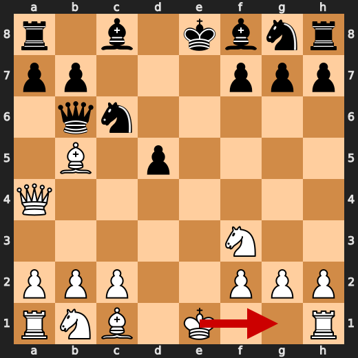

**After 8. O-O**

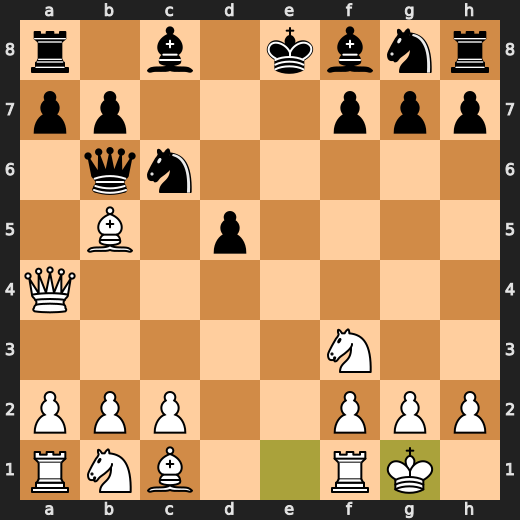

### 💀 Blunder: 10. a6 by CPU (Black)

Black's a6 fails to develop their bishop and worsens their position by weakening the dark squares on the queenside, especially e7. The preferred move Nge7 improves Black's development while maintaining control over the central d5 square. This allows for more active piece play in the future.

- **Eval:** +1.16 → +8.89
- **Preferred:** `Nge7`
- **Loss:** 773 cp

**Before 10. a6**

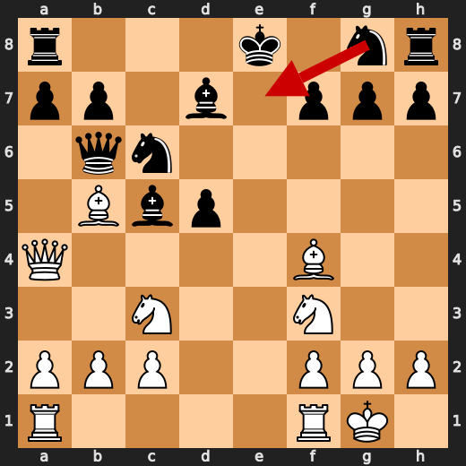

**After 10. a6**

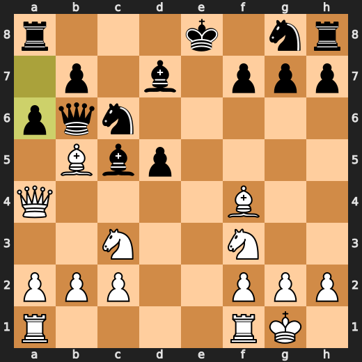

### ✅ Best: 12. Nc7+ by You (White)

You played Nc7+ because it was a useful move that improved your position by controlling the central d5 square and preventing Black's knight on c6 from attacking your queen. The engine preferred this move, increasing White's evaluation slightly (+8.38 to +8.76). Forcing an engine-approved move can be beneficial in certain situations, but it is essential to understand the underlying idea behind such a move and not rely solely on engine evaluations.

- **Eval:** +8.38 → +8.76
- **Preferred:** `Nc7+`
- **Loss:** 0 cp

**Before 12. Nc7+**

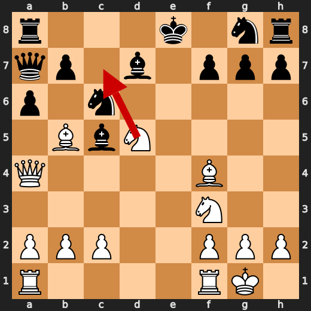

**After 12. Nc7+**

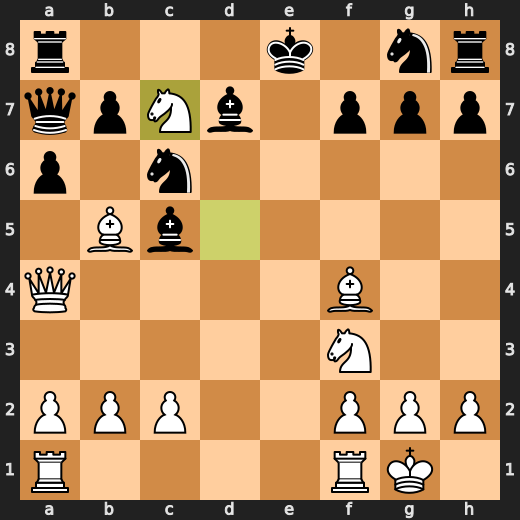

### ✅ Best: 13. Bxc6 by CPU (Black)

CPU (Black) played Bxc6 to improve its position by exchanging a pawn for the black bishop on c6, which is a useful tactic in this particular situation. This move increases Black's control over the central squares and weakens White's queenside. The engine-approved move is beneficial as it helps to maintain an advantageous position while also preventing any potential threats from the white pieces.

- **Eval:** +10.69 → +10.88
- **Preferred:** `Bxc6`
- **Loss:** 19 cp

**Before 13. Bxc6**

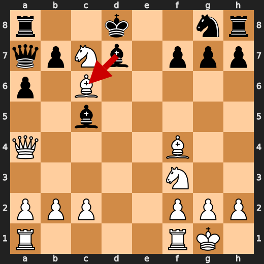

**After 13. Bxc6**

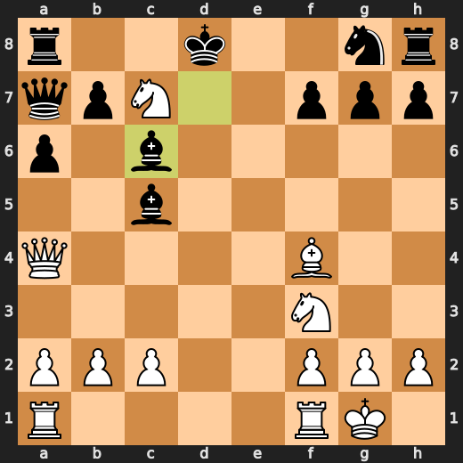

### 💀 Blunder: 14. Rc8 by CPU (Black)

Black's Rc8 fails to develop their rook and worsens their position by weakening the light squares on the kingside, especially f7. The preferred move b6 improves Black's development while maintaining control over the central d5 square. This allows for more active piece play in the future.

- **Eval:** +10.10 → +20.04
- **Preferred:** `b6`
- **Loss:** 994 cp

**Before 14. Rc8**

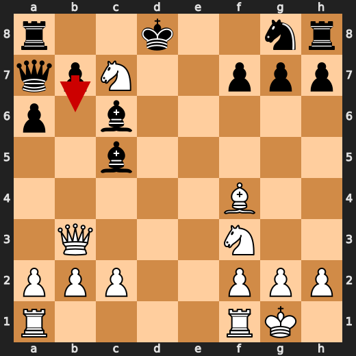

**After 14. Rc8**

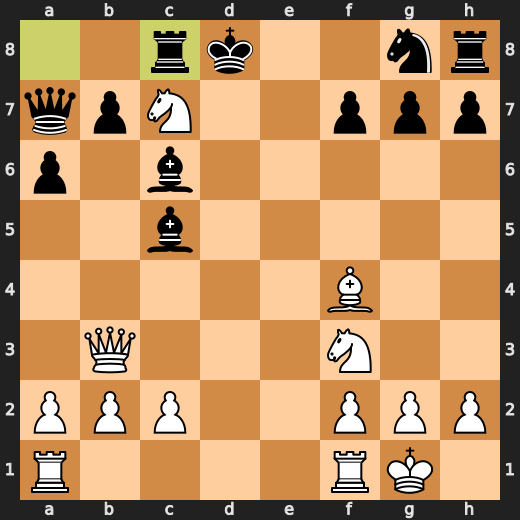

### 💀 Blunder: 15. b5 by CPU (Black)

Black's b5 fails to develop their rook and worsens their position by weakening the light squares on the kingside, especially f7. The preferred move Rxc7 improves Black's development while maintaining control over the central d5 square. This allows for more active piece play in the future.

- **Eval:** +20.46 → White has mate
- **Preferred:** `Rxc7`
- **Loss:** 97954 cp

**Before 15. b5**

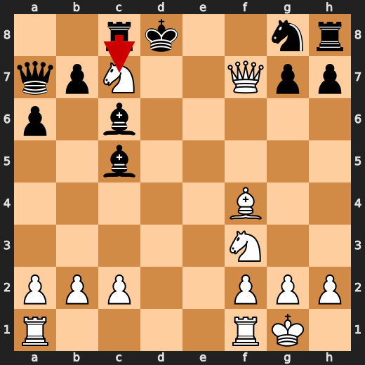

**After 15. b5**

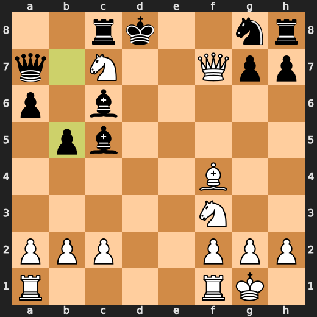

### 🏁 Checkmate: 16. Ne6# by You (White)

You (White) played Ne6# as a game-ending forcing move that checkmates Black in one move. The preferred move is also Ne6# because it achieves the same result of delivering checkmate to Black. By playing this move, you improved your position by ensuring an immediate victory without any further interaction from either player. This move demonstrates strong tactical awareness and decision-making skills, as you recognized the opportunity for a forced mate and acted upon it quickly.

- **Eval:** White has mate → White has mate
- **Preferred:** `Ne6#`
- **Loss:** 0 cp

**Before 16. Ne6#**

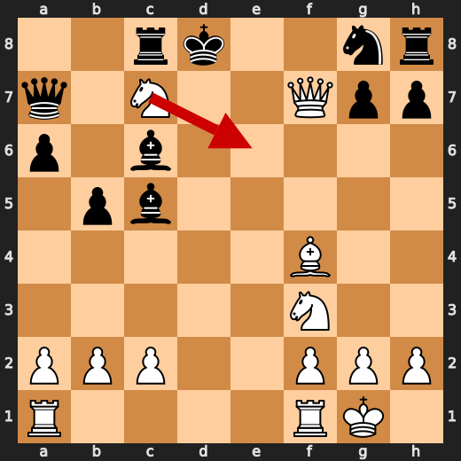

**After 16. Ne6#**

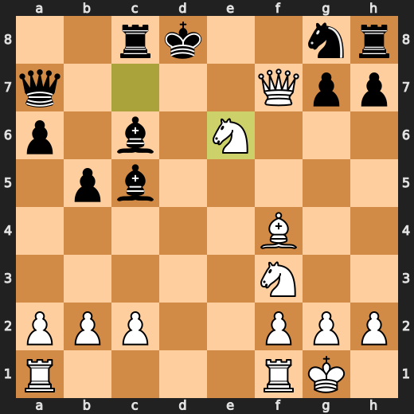

---

## Human Notes

Biggest caveman lesson: CPU (Black) blew it with **10. a6**.

The game-ending shot was **16. Ne6#** by **You (White)**.

---

<details>
<summary>Compact move list</summary>

- 📖 **1. e4** (You (White), Book) — +0.46 → +0.23, preferred `d4`, loss 23 cp
- 📖 **1. c5** (CPU (Black), Book) — +0.37 → +0.27, preferred `e5`, loss 0 cp
- 📖 **2. d4** (You (White), Book) — +0.48 → +0.16, preferred `Ne2`, loss 32 cp
- 📖 **2. cxd4** (CPU (Black), Book) — +0.22 → +0.33, preferred `cxd4`, loss 11 cp
- 📖 **3. Qxd4** (You (White), Book) — +0.12 → +0.14, preferred `Nf3`, loss 0 cp
- 📖 **3. e6** (CPU (Black), Book) — -0.07 → +0.02, preferred `Nc6`, loss 9 cp
- 🔥 **4. Nf3** (You (White), Great) — +0.17 → +0.00, preferred `Qe3`, loss 17 cp
- ✅ **4. Nc6** (CPU (Black), Best) — +0.00 → +0.08, preferred `Nc6`, loss 8 cp
- 🔥 **5. Qa4** (You (White), Great) — +0.17 → -0.10, preferred `Qd1`, loss 27 cp
- 👍 **5. d5** (CPU (Black), Good) — -0.13 → +0.50, preferred `Bc5`, loss 63 cp
- ✅ **6. exd5** (You (White), Best) — +0.62 → +0.72, preferred `Bb5`, loss 0 cp
- ✅ **6. exd5** (CPU (Black), Best) — +0.50 → +0.55, preferred `exd5`, loss 5 cp
- 🔥 **7. Bb5** (You (White), Great) — +0.67 → +0.41, preferred `Bb5`, loss 26 cp
- 👍 **7. Qb6** (CPU (Black), Good) — +0.64 → +1.82, preferred `Bd7`, loss 118 cp
- ✅ **8. O-O** (You (White), Best) — +1.64 → +1.55, preferred `O-O`, loss 9 cp
- 🔥 **8. Bc5** (CPU (Black), Great) — +1.84 → +2.25, preferred `Bd6`, loss 41 cp
- ⚠️ **9. Bf4** (You (White), Inaccuracy) — +2.92 → +0.21, preferred `b4`, loss 271 cp
- 👍 **9. Bd7** (CPU (Black), Good) — +0.41 → +1.47, preferred `Ne7`, loss 106 cp
- 🔥 **10. Nc3** (You (White), Great) — +1.58 → +1.32, preferred `c4`, loss 26 cp
- 💀 **10. a6** (CPU (Black), Blunder) — +1.16 → +8.89, preferred `Nge7`, loss 773 cp
- 🔥 **11. Nxd5** (You (White), Great) — +8.90 → +8.50, preferred `Nxd5`, loss 40 cp
- 🔥 **11. Qa7** (CPU (Black), Great) — +8.44 → +8.60, preferred `Qa7`, loss 16 cp
- ✅ **12. Nc7+** (You (White), Best) — +8.38 → +8.76, preferred `Nc7+`, loss 0 cp
- ⚠️ **12. Kd8** (CPU (Black), Inaccuracy) — +8.47 → +11.00, preferred `Kf8`, loss 253 cp
- ✅ **13. Bxc6** (You (White), Best) — +10.73 → +11.06, preferred `Bxc6`, loss 0 cp
- ✅ **13. Bxc6** (CPU (Black), Best) — +10.69 → +10.88, preferred `Bxc6`, loss 19 cp
- ✅ **14. Qb3** (You (White), Best) — +10.07 → +10.07, preferred `Qb3`, loss 0 cp
- 💀 **14. Rc8** (CPU (Black), Blunder) — +10.10 → +20.04, preferred `b6`, loss 994 cp
- 👍 **15. Qxf7** (You (White), Good) — +20.98 → +20.15, preferred `Rad1+`, loss 83 cp
- 💀 **15. b5** (CPU (Black), Blunder) — +20.46 → White has mate, preferred `Rxc7`, loss 97954 cp
- 🏁 **16. Ne6#** (You (White), Checkmate) — White has mate → White has mate, preferred `Ne6#`, loss 0 cp

</details>

---

<details>
<summary>Raw engine table</summary>

| Ply | Move | Actor | Played | Label | Eval Before | Eval After | Preferred | Loss |
|---:|---:|---|---|---|---:|---:|---|---:|
| 1 | 1 | You (White) | e4 | Book | +0.46 | +0.23 | d4 | 23 |
| 2 | 1 | CPU (Black) | c5 | Book | +0.37 | +0.27 | e5 | 0 |
| 3 | 2 | You (White) | d4 | Book | +0.48 | +0.16 | Ne2 | 32 |
| 4 | 2 | CPU (Black) | cxd4 | Book | +0.22 | +0.33 | cxd4 | 11 |
| 5 | 3 | You (White) | Qxd4 | Book | +0.12 | +0.14 | Nf3 | 0 |
| 6 | 3 | CPU (Black) | e6 | Book | -0.07 | +0.02 | Nc6 | 9 |
| 7 | 4 | You (White) | Nf3 | Great | +0.17 | +0.00 | Qe3 | 17 |
| 8 | 4 | CPU (Black) | Nc6 | Best | +0.00 | +0.08 | Nc6 | 8 |
| 9 | 5 | You (White) | Qa4 | Great | +0.17 | -0.10 | Qd1 | 27 |
| 10 | 5 | CPU (Black) | d5 | Good | -0.13 | +0.50 | Bc5 | 63 |
| 11 | 6 | You (White) | exd5 | Best | +0.62 | +0.72 | Bb5 | 0 |
| 12 | 6 | CPU (Black) | exd5 | Best | +0.50 | +0.55 | exd5 | 5 |
| 13 | 7 | You (White) | Bb5 | Great | +0.67 | +0.41 | Bb5 | 26 |
| 14 | 7 | CPU (Black) | Qb6 | Good | +0.64 | +1.82 | Bd7 | 118 |
| 15 | 8 | You (White) | O-O | Best | +1.64 | +1.55 | O-O | 9 |
| 16 | 8 | CPU (Black) | Bc5 | Great | +1.84 | +2.25 | Bd6 | 41 |
| 17 | 9 | You (White) | Bf4 | Inaccuracy | +2.92 | +0.21 | b4 | 271 |
| 18 | 9 | CPU (Black) | Bd7 | Good | +0.41 | +1.47 | Ne7 | 106 |
| 19 | 10 | You (White) | Nc3 | Great | +1.58 | +1.32 | c4 | 26 |
| 20 | 10 | CPU (Black) | a6 | Blunder | +1.16 | +8.89 | Nge7 | 773 |
| 21 | 11 | You (White) | Nxd5 | Great | +8.90 | +8.50 | Nxd5 | 40 |
| 22 | 11 | CPU (Black) | Qa7 | Great | +8.44 | +8.60 | Qa7 | 16 |
| 23 | 12 | You (White) | Nc7+ | Best | +8.38 | +8.76 | Nc7+ | 0 |
| 24 | 12 | CPU (Black) | Kd8 | Inaccuracy | +8.47 | +11.00 | Kf8 | 253 |
| 25 | 13 | You (White) | Bxc6 | Best | +10.73 | +11.06 | Bxc6 | 0 |
| 26 | 13 | CPU (Black) | Bxc6 | Best | +10.69 | +10.88 | Bxc6 | 19 |
| 27 | 14 | You (White) | Qb3 | Best | +10.07 | +10.07 | Qb3 | 0 |
| 28 | 14 | CPU (Black) | Rc8 | Blunder | +10.10 | +20.04 | b6 | 994 |
| 29 | 15 | You (White) | Qxf7 | Good | +20.98 | +20.15 | Rad1+ | 83 |
| 30 | 15 | CPU (Black) | b5 | Blunder | +20.46 | White has mate | Rxc7 | 97954 |
| 31 | 16 | You (White) | Ne6# | Checkmate | White has mate | White has mate | Ne6# | 0 |

</details>

---

<details>
<summary>Clean PGN</summary>

```pgn
[Event "AI Factory's Chess"]
[Site "Android Device"]
[Date "2026.05.22"]
[Round "1"]
[White "You"]
[Black "CPU (5)"]
[Result "1-0"]
[PlyCount "31"]

1. e4 c5 2. d4 cxd4 3. Qxd4 e6 4. Nf3 Nc6 5. Qa4 d5 6. exd5 exd5 7. Bb5 Qb6 8.
O-O Bc5 9. Bf4 Bd7 10. Nc3 a6 11. Nxd5 Qa7 12. Nc7+ Kd8 13. Bxc6 Bxc6 14. Qb3
Rc8 15. Qxf7 b5 16. Ne6# 1-0
```

</details>
