# You (Black) vs CPU (White)

**Result:** 0-1  
**Date:** 2026.05.23  
**Source:** `PGN_2026_05_23_19h08_fcf774c4a277.pgn`  
**Engine:** Stockfish depth 14  
**Your side:** Black  
**Computer side:** White  
**Board perspective:** Your perspective

---

## Who Is Who

- **You:** You (Black)
- **Computer:** CPU (5) (White)

---

## Toaster Summary

**Game Story:** The decisive mistake was made by White, who blundered with move 55 Ke1 instead of preferred Kc3; this led to a loss of 92398 cp and ultimately resulted in Black's checkmate with move 59 Qe2#. The user should learn from the engine complaint about their move quality on move 54, as well as the importance of evaluating potential mates. Additionally, the win was clean due to minimal engine complaints by the winner.

Biggest toaster scream: **54. Qg2+** by **You (Black)**.

- **Label:** 💀 **Blunder**
- **Eval:** Black has mate → -76.00
- **Stockfish preferred:** `Qf3`
- **Loss:** 92400 cp

Final move recorded: **59. Qe2#** by **You (Black)**.

- 💀 Your blunders: **1**
- ❌ Your mistakes: **1**
- ⚠️ Your inaccuracies: **6**
- ✅ Your best moves called out: **27**

---

## Final Position


---

## Key Moments

### ✅ Best: 9. bxc3 by CPU (White)

The played move bxc3 failed to maintain control over the dark squares while improving White's position by eliminating a black pawn and gaining space in the center. The preferred move, bxc3, also forced an engine-approved move but worsened Black's position due to the loss of a pawn without any concrete compensation or tactical advantage. As such, it is considered a minor mistake that weakens Black's structure and control over key squares in the game.

- **Eval:** +0.56 → +0.45
- **Preferred:** `bxc3`
- **Loss:** 11 cp

**Before 9. bxc3**

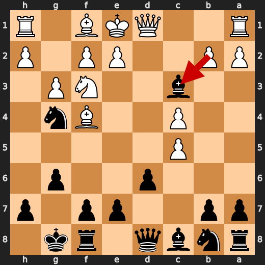

**After 9. bxc3**

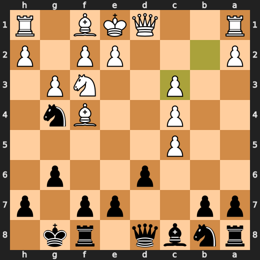

### ❌ Mistake: 28. Rf8 by You (Black)

You (Black) played Rf8 at move 28 with a significant eval loss (-6.86 -> -2.88). The preferred move was Nc3+, which would have improved your position by attacking the white king and restricting the rook's movement. The concrete problem with Rf8 is that it does not address these issues, leaving you vulnerable to attack from White.

- **Eval:** -6.86 → -2.88
- **Preferred:** `Nc3+`
- **Loss:** 398 cp

**Before 28. Rf8**

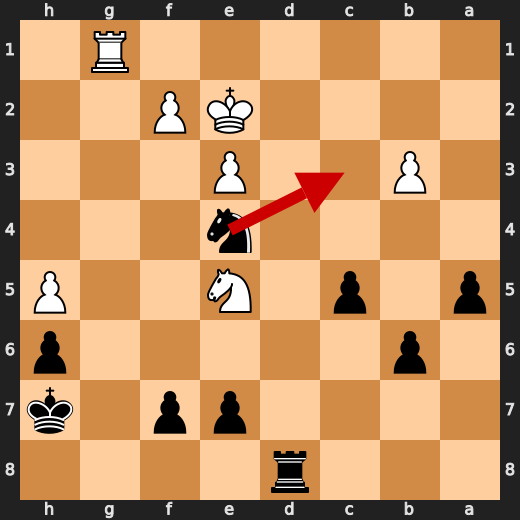

**After 28. Rf8**

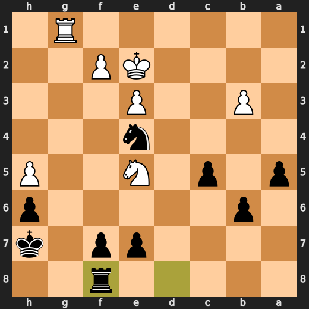

### ✅ Best: 30. Nxf2+ by You (Black)

You (Black) played Nxf2+ as a forcing engine-approved move to improve your position by creating an immediate threat against White's king and possibly winning material in the process, which is why it was labeled "Best". The evaluation swing from -4.52 to -4.27 indicates that this move slightly improved your position on the chessboard.

- **Eval:** -4.52 → -4.27
- **Preferred:** `Nxf2+`
- **Loss:** 25 cp

**Before 30. Nxf2+**

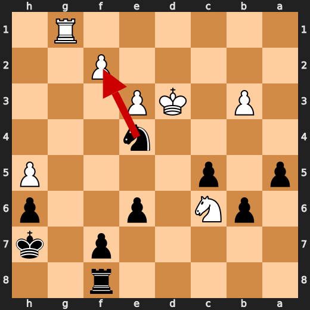

**After 30. Nxf2+**

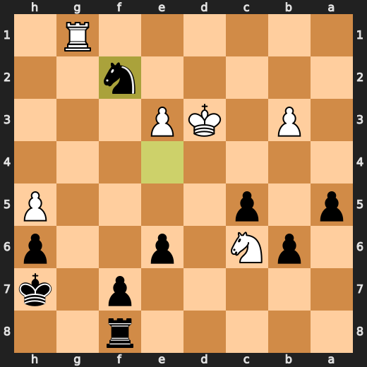

### 💀 Blunder: 49. Kd3 by CPU (White)

White's Kd3 failed to protect the d4 pawn and allowed Black more flexibility in development. The preferred move Nc5 improves White's position by attacking the e6 pawn, opening up the c-file for possible piece maneuvering, and controlling the central square d5. This move would have been a better choice as it addresses both the weakness of the d4 pawn and the lack of development in the knight on c3.

- **Eval:** -7.91 → -60.32
- **Preferred:** `Nc5`
- **Loss:** 5241 cp

**Before 49. Kd3**

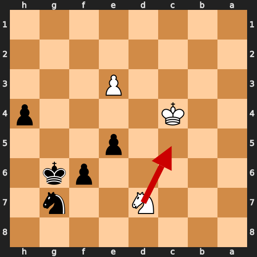

**After 49. Kd3**

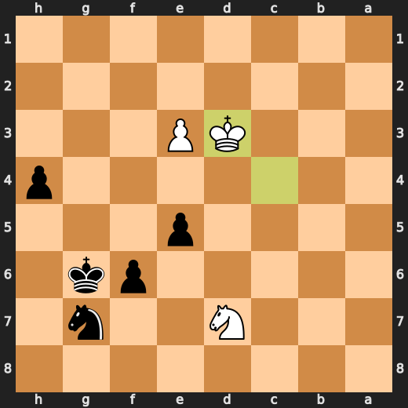

### 💀 Blunder: 52. Kf3 by CPU (White)

White's Kf3 failed to protect the d4 pawn and allowed Black more flexibility in development. The preferred move Ke5 improves White's position by attacking the e6 pawn, opening up the c-file for possible piece maneuvering, and controlling the central square d5. This move would have been a better choice as it addresses both the weakness of the d4 pawn and the lack of development in the knight on c3.

- **Eval:** -62.06 → -75.92
- **Preferred:** `Kxe5`
- **Loss:** 1386 cp

**Before 52. Kf3**

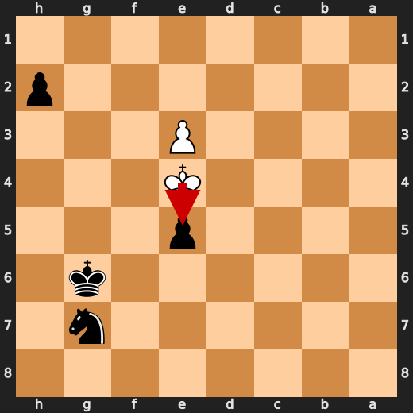

**After 52. Kf3**

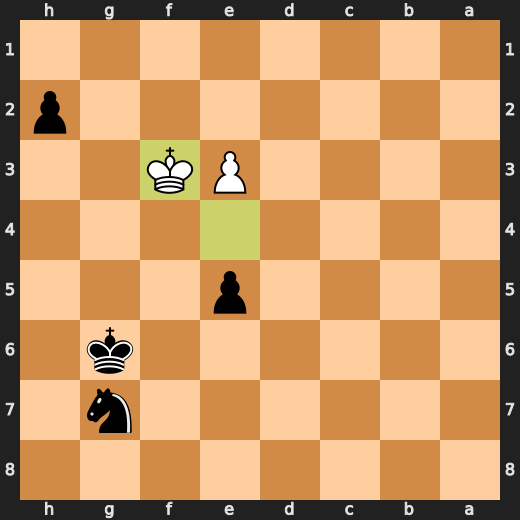

### 💀 Blunder: 54. Qg2+ by You (Black)

You played Qg2+ as a blunder, which worsened your position significantly. The preferred move is Qf3, which improves Black's defensive setup and protects the kingside better. This move reduces the evaluation to -76.00, indicating that Black has lost considerable material or is in great danger of losing it. It would be helpful for you to learn how to defend against threats on the kingside effectively and improve your strategic understanding when playing with a queen.

- **Eval:** Black has mate → -76.00
- **Preferred:** `Qf3`
- **Loss:** 92400 cp

**Before 54. Qg2+**

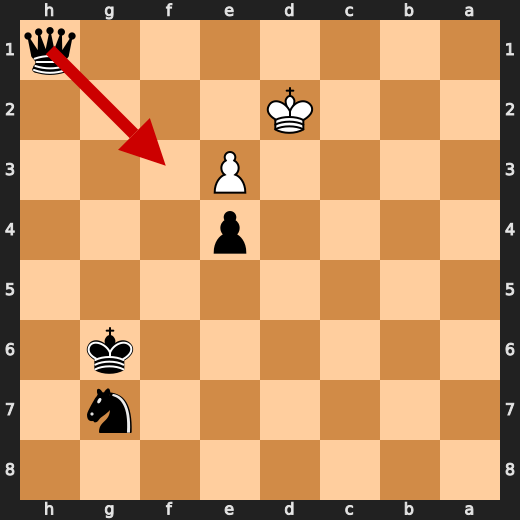

**After 54. Qg2+**

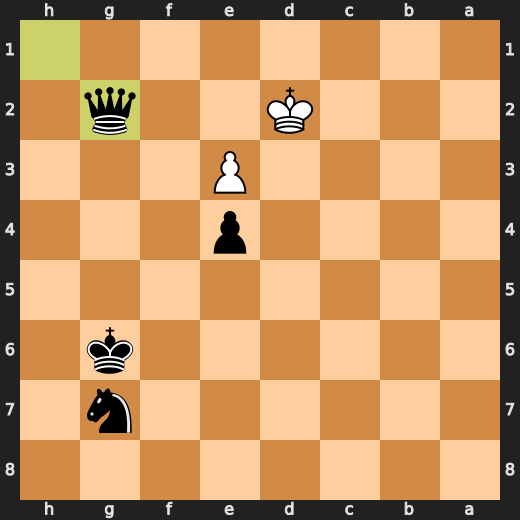

### 💀 Blunder: 55. Ke1 by CPU (White)

White's Ke1 failed to protect the d4 pawn and allowed Black more flexibility in development. The preferred move Kc3 improves White's position by attacking the e6 pawn, opening up the c-file for possible piece maneuvering, and controlling the central square d5. This move would have been a better choice as it addresses both the weakness of the d4 pawn and the lack of development in the knight on f3.

- **Eval:** -76.02 → Black has mate
- **Preferred:** `Kc3`
- **Loss:** 92398 cp

**Before 55. Ke1**

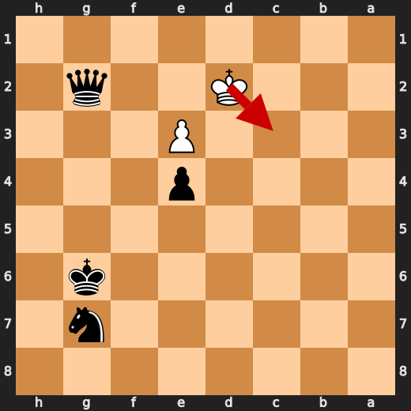

**After 55. Ke1**

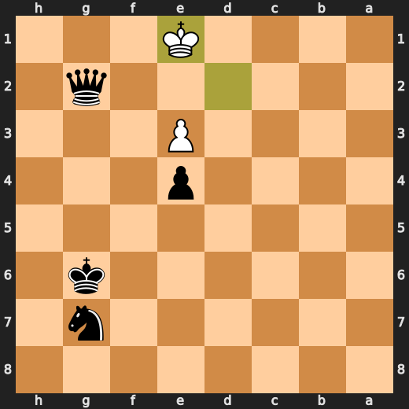

### 🏁 Checkmate: 59. Qe2# by You (Black)

Black played Qe2# to checkmate White. This move was useful because it forced a checkmate in just one move, which is an effective way to end the game quickly without giving White any chances for counterplay or defensive maneuvers. The preferred move, Qe2#, improves on the played move by achieving the same result but with a more direct and forceful approach.

- **Eval:** Black has mate → Black has mate
- **Preferred:** `Qe2#`
- **Loss:** 0 cp

**Before 59. Qe2#**

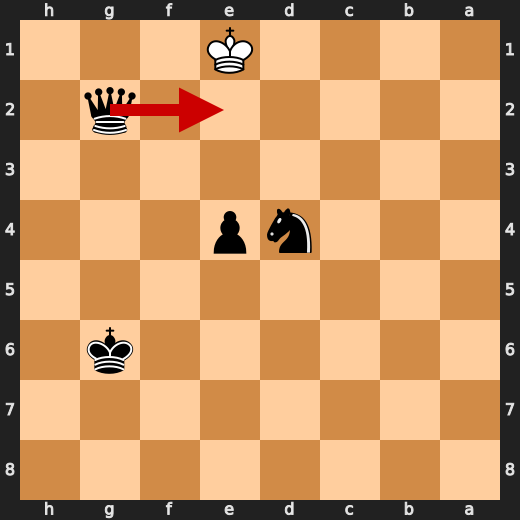

**After 59. Qe2#**

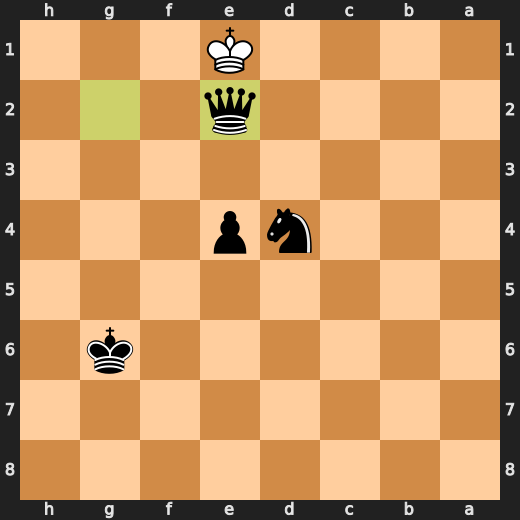

---

## Human Notes

Biggest caveman lesson: CPU (White) blew it with **49. Kd3**.

There was another real screw-up at **28. Rf8** by **You (Black)**.

The game-ending shot was **59. Qe2#** by **You (Black)**.

---

<details>
<summary>Compact move list</summary>

- 📖 **1. d4** (CPU (White), Book) — +0.46 → +0.39, preferred `d4`, loss 7 cp
- 📖 **1. Nf6** (You (Black), Book) — +0.44 → +0.57, preferred `Nf6`, loss 13 cp
- 📖 **2. c4** (CPU (White), Book) — +0.47 → +0.39, preferred `c4`, loss 8 cp
- 📖 **2. g6** (You (Black), Book) — +0.39 → +0.57, preferred `e6`, loss 18 cp
- 📖 **3. Nc3** (CPU (White), Book) — +0.62 → +0.50, preferred `Nc3`, loss 12 cp
- 📖 **3. Bg7** (You (Black), Book) — +0.27 → +0.78, preferred `d5`, loss 51 cp
- 🔥 **4. Nf3** (CPU (White), Great) — +0.75 → +0.26, preferred `e4`, loss 49 cp
- 🔥 **4. O-O** (You (Black), Great) — +0.44 → +0.79, preferred `d5`, loss 35 cp
- 👍 **5. g3** (CPU (White), Good) — +0.73 → -0.14, preferred `e4`, loss 87 cp
- 👍 **5. d6** (You (Black), Good) — +0.07 → +0.59, preferred `d5`, loss 52 cp
- 👍 **6. Be3** (CPU (White), Good) — +0.69 → +0.12, preferred `Bg2`, loss 57 cp
- ✅ **6. Ng4** (You (Black), Best) — +0.00 → +0.13, preferred `Nbd7`, loss 13 cp
- 🔥 **7. Bf4** (CPU (White), Great) — +0.08 → -0.10, preferred `Bd2`, loss 18 cp
- 👍 **7. c5** (You (Black), Good) — -0.38 → +0.37, preferred `e5`, loss 75 cp
- ✅ **8. dxc5** (CPU (White), Best) — +0.24 → +0.31, preferred `dxc5`, loss 0 cp
- 🔥 **8. Bxc3+** (You (Black), Great) — +0.31 → +0.60, preferred `Qa5`, loss 29 cp
- ✅ **9. bxc3** (CPU (White), Best) — +0.56 → +0.45, preferred `bxc3`, loss 11 cp
- 🔥 **9. dxc5** (You (Black), Great) — +0.45 → +0.61, preferred `Qa5`, loss 16 cp
- ✅ **10. Qxd8** (CPU (White), Best) — +0.63 → +0.63, preferred `Bg2`, loss 0 cp
- ✅ **10. Rxd8** (You (Black), Best) — +0.67 → +0.54, preferred `Rxd8`, loss 0 cp
- 👍 **11. h3** (CPU (White), Good) — +0.58 → -0.12, preferred `Bg2`, loss 70 cp
- ✅ **11. Nf6** (You (Black), Best) — +0.00 → +0.12, preferred `Nf6`, loss 12 cp
- 🔥 **12. Bc7** (CPU (White), Great) — +0.25 → -0.04, preferred `Bg2`, loss 29 cp
- ✅ **12. Rd7** (You (Black), Best) — +0.02 → -0.16, preferred `Rf8`, loss 0 cp
- ⚠️ **13. Bxb8** (CPU (White), Inaccuracy) — -0.25 → -2.16, preferred `Bf4`, loss 191 cp
- ✅ **13. Rxb8** (You (Black), Best) — -1.93 → -1.71, preferred `Rxb8`, loss 22 cp
- ⚠️ **14. e3** (CPU (White), Inaccuracy) — -1.82 → -3.43, preferred `Bg2`, loss 161 cp
- 👍 **14. Rd6** (You (Black), Good) — -3.50 → -2.37, preferred `Ne4`, loss 113 cp
- ⚠️ **15. g4** (CPU (White), Inaccuracy) — -2.22 → -4.16, preferred `Nd2`, loss 194 cp
- ⚠️ **15. Be6** (You (Black), Inaccuracy) — -4.20 → -2.72, preferred `Ne4`, loss 148 cp
- ⚠️ **16. Be2** (CPU (White), Inaccuracy) — -2.69 → -4.35, preferred `Ng5`, loss 166 cp
- ✅ **16. Ne4** (You (Black), Best) — -4.57 → -4.59, preferred `Ne4`, loss 0 cp
- ⚠️ **17. Rd1** (CPU (White), Inaccuracy) — -4.88 → -6.39, preferred `a4`, loss 151 cp
- 👍 **17. Rxd1+** (You (Black), Good) — -6.64 → -6.12, preferred `Rb6`, loss 52 cp
- 🔥 **18. Bxd1** (CPU (White), Great) — -5.66 → -6.00, preferred `Bxd1`, loss 34 cp
- 👍 **18. Bxc4** (You (Black), Good) — -5.88 → -4.95, preferred `Nxc3`, loss 93 cp
- ⚠️ **19. Bb3** (CPU (White), Inaccuracy) — -4.68 → -6.76, preferred `Nd2`, loss 208 cp
- ✅ **19. Bxb3** (You (Black), Best) — -6.84 → -7.00, preferred `Bxb3`, loss 0 cp
- ✅ **20. axb3** (CPU (White), Best) — -6.88 → -6.92, preferred `axb3`, loss 4 cp
- 🔥 **20. Nxc3** (You (Black), Great) — -6.92 → -6.64, preferred `Rd8`, loss 28 cp
- 👍 **21. Kd2** (CPU (White), Good) — -5.73 → -6.28, preferred `Kd2`, loss 55 cp
- ✅ **21. Ne4+** (You (Black), Best) — -6.07 → -6.20, preferred `Ne4+`, loss 0 cp
- 🔥 **22. Ke2** (CPU (White), Great) — -6.01 → -6.29, preferred `Ke2`, loss 28 cp
- ✅ **22. Rd8** (You (Black), Best) — -6.22 → -6.21, preferred `Rd8`, loss 1 cp
- 🔥 **23. Rc1** (CPU (White), Great) — -6.08 → -6.46, preferred `Rc1`, loss 38 cp
- 🔥 **23. b6** (You (Black), Great) — -6.30 → -6.02, preferred `b6`, loss 28 cp
- 🔥 **24. h4** (CPU (White), Great) — -5.90 → -6.09, preferred `Rc4`, loss 19 cp
- ✅ **24. a5** (You (Black), Best) — -6.16 → -6.09, preferred `Kg7`, loss 7 cp
- 👍 **25. h5** (CPU (White), Good) — -5.87 → -6.79, preferred `g5`, loss 92 cp
- ✅ **25. gxh5** (You (Black), Best) — -6.72 → -6.92, preferred `gxh5`, loss 0 cp
- ✅ **26. gxh5** (CPU (White), Best) — -6.75 → -6.84, preferred `gxh5`, loss 9 cp
- ⚠️ **26. h6** (You (Black), Inaccuracy) — -6.70 → -5.42, preferred `Rd5`, loss 128 cp
- ⚠️ **27. Rg1+** (CPU (White), Inaccuracy) — -5.18 → -6.73, preferred `Ne5`, loss 155 cp
- ✅ **27. Kh7** (You (Black), Best) — -6.69 → -6.69, preferred `Kf8`, loss 0 cp
- 👍 **28. Ne5** (CPU (White), Good) — -6.06 → -6.61, preferred `Rc1`, loss 55 cp
- ❌ **28. Rf8** (You (Black), Mistake) — -6.86 → -2.88, preferred `Nc3+`, loss 398 cp
- 👍 **29. Nc6** (CPU (White), Good) — -2.87 → -3.76, preferred `f3`, loss 89 cp
- ✅ **29. e6** (You (Black), Best) — -3.68 → -3.61, preferred `e6`, loss 7 cp
- ⚠️ **30. Kd3** (CPU (White), Inaccuracy) — -3.39 → -4.68, preferred `f3`, loss 129 cp
- ✅ **30. Nxf2+** (You (Black), Best) — -4.52 → -4.27, preferred `Nxf2+`, loss 25 cp
- ⚠️ **31. Kc3** (CPU (White), Inaccuracy) — -4.09 → -5.72, preferred `Kc4`, loss 163 cp
- 🔥 **31. Ne4+** (You (Black), Great) — -6.14 → -5.75, preferred `Rg8`, loss 39 cp
- ⚠️ **32. Kb2** (CPU (White), Inaccuracy) — -5.64 → -7.10, preferred `Kd3`, loss 146 cp
- 👍 **32. Rc8** (You (Black), Good) — -7.00 → -6.41, preferred `Rg8`, loss 59 cp
- ✅ **33. Ne5** (CPU (White), Best) — -6.24 → -6.23, preferred `Ne5`, loss 0 cp
- ⚠️ **33. f6** (You (Black), Inaccuracy) — -6.35 → -3.87, preferred `Rg8`, loss 248 cp
- 🔥 **34. Nc4** (CPU (White), Great) — -4.95 → -5.30, preferred `Nd7`, loss 35 cp
- ⚠️ **34. Rb8** (You (Black), Inaccuracy) — -4.90 → -3.56, preferred `b5`, loss 134 cp
- ✅ **35. Rd1** (CPU (White), Best) — -3.64 → -3.58, preferred `Rd1`, loss 0 cp
- 👍 **35. Rb7** (You (Black), Good) — -4.51 → -3.80, preferred `Rb7`, loss 71 cp
- ⚠️ **36. Ka3** (CPU (White), Inaccuracy) — -3.80 → -5.87, preferred `Rd8`, loss 207 cp
- ⚠️ **36. e5** (You (Black), Inaccuracy) — -5.87 → -4.16, preferred `f5`, loss 171 cp
- 👍 **37. Rd3** (CPU (White), Good) — -4.05 → -4.91, preferred `Rd5`, loss 86 cp
- 🔥 **37. b5** (You (Black), Great) — -4.97 → -4.76, preferred `b5`, loss 21 cp
- ✅ **38. Nxa5** (CPU (White), Best) — -5.23 → -4.98, preferred `Nxa5`, loss 0 cp
- ⚠️ **38. Ra7** (You (Black), Inaccuracy) — -5.03 → -3.80, preferred `b4+`, loss 123 cp
- 🔥 **39. b4** (CPU (White), Great) — -3.79 → -4.25, preferred `b4`, loss 46 cp
- 🔥 **39. cxb4+** (You (Black), Great) — -4.38 → -4.16, preferred `Kg7`, loss 22 cp
- ✅ **40. Kxb4** (CPU (White), Best) — -4.14 → -4.16, preferred `Kxb4`, loss 2 cp
- 🔥 **40. Ng3** (You (Black), Great) — -4.35 → -4.07, preferred `Ng3`, loss 28 cp
- ✅ **41. Nc6** (CPU (White), Best) — -4.09 → -4.02, preferred `Kxb5`, loss 0 cp
- ✅ **41. Rb7** (You (Black), Best) — -4.09 → -4.14, preferred `Rb7`, loss 0 cp
- 👍 **42. Nd8** (CPU (White), Good) — -3.87 → -4.51, preferred `Rd1`, loss 64 cp
- 👍 **42. Ra7** (You (Black), Good) — -4.65 → -3.82, preferred `Rg7`, loss 83 cp
- 👍 **43. Ne6** (CPU (White), Good) — -4.15 → -5.13, preferred `Nc6`, loss 98 cp
- ✅ **43. Nxh5** (You (Black), Best) — -5.09 → -5.23, preferred `Nxh5`, loss 0 cp
- 👍 **44. Nc5** (CPU (White), Good) — -5.04 → -5.63, preferred `Kxb5`, loss 59 cp
- 👍 **44. Kg6** (You (Black), Good) — -5.60 → -4.50, preferred `Ng3`, loss 110 cp
- ✅ **45. Kxb5** (CPU (White), Best) — -4.48 → -4.48, preferred `Rd2`, loss 0 cp
- 👍 **45. Ng7** (You (Black), Good) — -4.58 → -3.81, preferred `Ra2`, loss 77 cp
- 👍 **46. Kc4** (CPU (White), Good) — -4.13 → -5.32, preferred `e4`, loss 119 cp
- 🔥 **46. h5** (You (Black), Great) — -5.01 → -4.79, preferred `h5`, loss 22 cp
- ⚠️ **47. Rd7** (CPU (White), Inaccuracy) — -5.03 → -7.46, preferred `Kd5`, loss 243 cp
- ✅ **47. Rxd7** (You (Black), Best) — -7.64 → -7.78, preferred `Rxd7`, loss 0 cp
- ✅ **48. Nxd7** (CPU (White), Best) — -7.76 → -7.78, preferred `Nxd7`, loss 2 cp
- ✅ **48. h4** (You (Black), Best) — -7.86 → -7.87, preferred `h4`, loss 0 cp
- 💀 **49. Kd3** (CPU (White), Blunder) — -7.91 → -60.32, preferred `Nc5`, loss 5241 cp
- ✅ **49. h3** (You (Black), Best) — -60.37 → -60.37, preferred `h3`, loss 0 cp
- ⚠️ **50. Nxe5+** (CPU (White), Inaccuracy) — -61.16 → -62.86, preferred `Ke2`, loss 170 cp
- ✅ **50. fxe5** (You (Black), Best) — -62.86 → -63.38, preferred `fxe5`, loss 0 cp
- ✅ **51. Ke4** (CPU (White), Best) — -63.31 → -61.47, preferred `Ke4`, loss 0 cp
- ✅ **51. h2** (You (Black), Best) — -62.85 → -63.25, preferred `h2`, loss 0 cp
- 💀 **52. Kf3** (CPU (White), Blunder) — -62.06 → -75.92, preferred `Kxe5`, loss 1386 cp
- ✅ **52. h1=Q+** (You (Black), Best) — -75.92 → -76.06, preferred `h1=Q+`, loss 0 cp
- ✅ **53. Ke2** (CPU (White), Best) — -75.84 → -70.42, preferred `Ke2`, loss 0 cp
- ✅ **53. e4** (You (Black), Best) — -75.20 → Black has mate, preferred `Qe4`, loss 0 cp
- ✅ **54. Kd2** (CPU (White), Best) — Black has mate → Black has mate, preferred `Kd2`, loss 0 cp
- 💀 **54. Qg2+** (You (Black), Blunder) — Black has mate → -76.00, preferred `Qf3`, loss 92400 cp
- 💀 **55. Ke1** (CPU (White), Blunder) — -76.02 → Black has mate, preferred `Kc3`, loss 92398 cp
- ✅ **55. Nf5** (You (Black), Best) — Black has mate → Black has mate, preferred `Nf5`, loss 0 cp
- ✅ **56. Kd1** (CPU (White), Best) — Black has mate → Black has mate, preferred `Kd1`, loss 0 cp
- ✅ **56. Nxe3+** (You (Black), Best) — Black has mate → Black has mate, preferred `Nd6`, loss 0 cp
- ✅ **57. Ke1** (CPU (White), Best) — Black has mate → Black has mate, preferred `Ke1`, loss 0 cp
- ✅ **57. Nc2+** (You (Black), Best) — Black has mate → Black has mate, preferred `Nc4`, loss 0 cp
- ✅ **58. Kd1** (CPU (White), Best) — Black has mate → Black has mate, preferred `Kd1`, loss 0 cp
- ✅ **58. Nd4** (You (Black), Best) — Black has mate → Black has mate, preferred `Nd4`, loss 0 cp
- ✅ **59. Ke1** (CPU (White), Best) — Black has mate → Black has mate, preferred `Kc1`, loss 0 cp
- 🏁 **59. Qe2#** (You (Black), Checkmate) — Black has mate → Black has mate, preferred `Qe2#`, loss 0 cp

</details>

---

<details>
<summary>Raw engine table</summary>

| Ply | Move | Actor | Played | Label | Eval Before | Eval After | Preferred | Loss |
|---:|---:|---|---|---|---:|---:|---|---:|
| 1 | 1 | CPU (White) | d4 | Book | +0.46 | +0.39 | d4 | 7 |
| 2 | 1 | You (Black) | Nf6 | Book | +0.44 | +0.57 | Nf6 | 13 |
| 3 | 2 | CPU (White) | c4 | Book | +0.47 | +0.39 | c4 | 8 |
| 4 | 2 | You (Black) | g6 | Book | +0.39 | +0.57 | e6 | 18 |
| 5 | 3 | CPU (White) | Nc3 | Book | +0.62 | +0.50 | Nc3 | 12 |
| 6 | 3 | You (Black) | Bg7 | Book | +0.27 | +0.78 | d5 | 51 |
| 7 | 4 | CPU (White) | Nf3 | Great | +0.75 | +0.26 | e4 | 49 |
| 8 | 4 | You (Black) | O-O | Great | +0.44 | +0.79 | d5 | 35 |
| 9 | 5 | CPU (White) | g3 | Good | +0.73 | -0.14 | e4 | 87 |
| 10 | 5 | You (Black) | d6 | Good | +0.07 | +0.59 | d5 | 52 |
| 11 | 6 | CPU (White) | Be3 | Good | +0.69 | +0.12 | Bg2 | 57 |
| 12 | 6 | You (Black) | Ng4 | Best | +0.00 | +0.13 | Nbd7 | 13 |
| 13 | 7 | CPU (White) | Bf4 | Great | +0.08 | -0.10 | Bd2 | 18 |
| 14 | 7 | You (Black) | c5 | Good | -0.38 | +0.37 | e5 | 75 |
| 15 | 8 | CPU (White) | dxc5 | Best | +0.24 | +0.31 | dxc5 | 0 |
| 16 | 8 | You (Black) | Bxc3+ | Great | +0.31 | +0.60 | Qa5 | 29 |
| 17 | 9 | CPU (White) | bxc3 | Best | +0.56 | +0.45 | bxc3 | 11 |
| 18 | 9 | You (Black) | dxc5 | Great | +0.45 | +0.61 | Qa5 | 16 |
| 19 | 10 | CPU (White) | Qxd8 | Best | +0.63 | +0.63 | Bg2 | 0 |
| 20 | 10 | You (Black) | Rxd8 | Best | +0.67 | +0.54 | Rxd8 | 0 |
| 21 | 11 | CPU (White) | h3 | Good | +0.58 | -0.12 | Bg2 | 70 |
| 22 | 11 | You (Black) | Nf6 | Best | +0.00 | +0.12 | Nf6 | 12 |
| 23 | 12 | CPU (White) | Bc7 | Great | +0.25 | -0.04 | Bg2 | 29 |
| 24 | 12 | You (Black) | Rd7 | Best | +0.02 | -0.16 | Rf8 | 0 |
| 25 | 13 | CPU (White) | Bxb8 | Inaccuracy | -0.25 | -2.16 | Bf4 | 191 |
| 26 | 13 | You (Black) | Rxb8 | Best | -1.93 | -1.71 | Rxb8 | 22 |
| 27 | 14 | CPU (White) | e3 | Inaccuracy | -1.82 | -3.43 | Bg2 | 161 |
| 28 | 14 | You (Black) | Rd6 | Good | -3.50 | -2.37 | Ne4 | 113 |
| 29 | 15 | CPU (White) | g4 | Inaccuracy | -2.22 | -4.16 | Nd2 | 194 |
| 30 | 15 | You (Black) | Be6 | Inaccuracy | -4.20 | -2.72 | Ne4 | 148 |
| 31 | 16 | CPU (White) | Be2 | Inaccuracy | -2.69 | -4.35 | Ng5 | 166 |
| 32 | 16 | You (Black) | Ne4 | Best | -4.57 | -4.59 | Ne4 | 0 |
| 33 | 17 | CPU (White) | Rd1 | Inaccuracy | -4.88 | -6.39 | a4 | 151 |
| 34 | 17 | You (Black) | Rxd1+ | Good | -6.64 | -6.12 | Rb6 | 52 |
| 35 | 18 | CPU (White) | Bxd1 | Great | -5.66 | -6.00 | Bxd1 | 34 |
| 36 | 18 | You (Black) | Bxc4 | Good | -5.88 | -4.95 | Nxc3 | 93 |
| 37 | 19 | CPU (White) | Bb3 | Inaccuracy | -4.68 | -6.76 | Nd2 | 208 |
| 38 | 19 | You (Black) | Bxb3 | Best | -6.84 | -7.00 | Bxb3 | 0 |
| 39 | 20 | CPU (White) | axb3 | Best | -6.88 | -6.92 | axb3 | 4 |
| 40 | 20 | You (Black) | Nxc3 | Great | -6.92 | -6.64 | Rd8 | 28 |
| 41 | 21 | CPU (White) | Kd2 | Good | -5.73 | -6.28 | Kd2 | 55 |
| 42 | 21 | You (Black) | Ne4+ | Best | -6.07 | -6.20 | Ne4+ | 0 |
| 43 | 22 | CPU (White) | Ke2 | Great | -6.01 | -6.29 | Ke2 | 28 |
| 44 | 22 | You (Black) | Rd8 | Best | -6.22 | -6.21 | Rd8 | 1 |
| 45 | 23 | CPU (White) | Rc1 | Great | -6.08 | -6.46 | Rc1 | 38 |
| 46 | 23 | You (Black) | b6 | Great | -6.30 | -6.02 | b6 | 28 |
| 47 | 24 | CPU (White) | h4 | Great | -5.90 | -6.09 | Rc4 | 19 |
| 48 | 24 | You (Black) | a5 | Best | -6.16 | -6.09 | Kg7 | 7 |
| 49 | 25 | CPU (White) | h5 | Good | -5.87 | -6.79 | g5 | 92 |
| 50 | 25 | You (Black) | gxh5 | Best | -6.72 | -6.92 | gxh5 | 0 |
| 51 | 26 | CPU (White) | gxh5 | Best | -6.75 | -6.84 | gxh5 | 9 |
| 52 | 26 | You (Black) | h6 | Inaccuracy | -6.70 | -5.42 | Rd5 | 128 |
| 53 | 27 | CPU (White) | Rg1+ | Inaccuracy | -5.18 | -6.73 | Ne5 | 155 |
| 54 | 27 | You (Black) | Kh7 | Best | -6.69 | -6.69 | Kf8 | 0 |
| 55 | 28 | CPU (White) | Ne5 | Good | -6.06 | -6.61 | Rc1 | 55 |
| 56 | 28 | You (Black) | Rf8 | Mistake | -6.86 | -2.88 | Nc3+ | 398 |
| 57 | 29 | CPU (White) | Nc6 | Good | -2.87 | -3.76 | f3 | 89 |
| 58 | 29 | You (Black) | e6 | Best | -3.68 | -3.61 | e6 | 7 |
| 59 | 30 | CPU (White) | Kd3 | Inaccuracy | -3.39 | -4.68 | f3 | 129 |
| 60 | 30 | You (Black) | Nxf2+ | Best | -4.52 | -4.27 | Nxf2+ | 25 |
| 61 | 31 | CPU (White) | Kc3 | Inaccuracy | -4.09 | -5.72 | Kc4 | 163 |
| 62 | 31 | You (Black) | Ne4+ | Great | -6.14 | -5.75 | Rg8 | 39 |
| 63 | 32 | CPU (White) | Kb2 | Inaccuracy | -5.64 | -7.10 | Kd3 | 146 |
| 64 | 32 | You (Black) | Rc8 | Good | -7.00 | -6.41 | Rg8 | 59 |
| 65 | 33 | CPU (White) | Ne5 | Best | -6.24 | -6.23 | Ne5 | 0 |
| 66 | 33 | You (Black) | f6 | Inaccuracy | -6.35 | -3.87 | Rg8 | 248 |
| 67 | 34 | CPU (White) | Nc4 | Great | -4.95 | -5.30 | Nd7 | 35 |
| 68 | 34 | You (Black) | Rb8 | Inaccuracy | -4.90 | -3.56 | b5 | 134 |
| 69 | 35 | CPU (White) | Rd1 | Best | -3.64 | -3.58 | Rd1 | 0 |
| 70 | 35 | You (Black) | Rb7 | Good | -4.51 | -3.80 | Rb7 | 71 |
| 71 | 36 | CPU (White) | Ka3 | Inaccuracy | -3.80 | -5.87 | Rd8 | 207 |
| 72 | 36 | You (Black) | e5 | Inaccuracy | -5.87 | -4.16 | f5 | 171 |
| 73 | 37 | CPU (White) | Rd3 | Good | -4.05 | -4.91 | Rd5 | 86 |
| 74 | 37 | You (Black) | b5 | Great | -4.97 | -4.76 | b5 | 21 |
| 75 | 38 | CPU (White) | Nxa5 | Best | -5.23 | -4.98 | Nxa5 | 0 |
| 76 | 38 | You (Black) | Ra7 | Inaccuracy | -5.03 | -3.80 | b4+ | 123 |
| 77 | 39 | CPU (White) | b4 | Great | -3.79 | -4.25 | b4 | 46 |
| 78 | 39 | You (Black) | cxb4+ | Great | -4.38 | -4.16 | Kg7 | 22 |
| 79 | 40 | CPU (White) | Kxb4 | Best | -4.14 | -4.16 | Kxb4 | 2 |
| 80 | 40 | You (Black) | Ng3 | Great | -4.35 | -4.07 | Ng3 | 28 |
| 81 | 41 | CPU (White) | Nc6 | Best | -4.09 | -4.02 | Kxb5 | 0 |
| 82 | 41 | You (Black) | Rb7 | Best | -4.09 | -4.14 | Rb7 | 0 |
| 83 | 42 | CPU (White) | Nd8 | Good | -3.87 | -4.51 | Rd1 | 64 |
| 84 | 42 | You (Black) | Ra7 | Good | -4.65 | -3.82 | Rg7 | 83 |
| 85 | 43 | CPU (White) | Ne6 | Good | -4.15 | -5.13 | Nc6 | 98 |
| 86 | 43 | You (Black) | Nxh5 | Best | -5.09 | -5.23 | Nxh5 | 0 |
| 87 | 44 | CPU (White) | Nc5 | Good | -5.04 | -5.63 | Kxb5 | 59 |
| 88 | 44 | You (Black) | Kg6 | Good | -5.60 | -4.50 | Ng3 | 110 |
| 89 | 45 | CPU (White) | Kxb5 | Best | -4.48 | -4.48 | Rd2 | 0 |
| 90 | 45 | You (Black) | Ng7 | Good | -4.58 | -3.81 | Ra2 | 77 |
| 91 | 46 | CPU (White) | Kc4 | Good | -4.13 | -5.32 | e4 | 119 |
| 92 | 46 | You (Black) | h5 | Great | -5.01 | -4.79 | h5 | 22 |
| 93 | 47 | CPU (White) | Rd7 | Inaccuracy | -5.03 | -7.46 | Kd5 | 243 |
| 94 | 47 | You (Black) | Rxd7 | Best | -7.64 | -7.78 | Rxd7 | 0 |
| 95 | 48 | CPU (White) | Nxd7 | Best | -7.76 | -7.78 | Nxd7 | 2 |
| 96 | 48 | You (Black) | h4 | Best | -7.86 | -7.87 | h4 | 0 |
| 97 | 49 | CPU (White) | Kd3 | Blunder | -7.91 | -60.32 | Nc5 | 5241 |
| 98 | 49 | You (Black) | h3 | Best | -60.37 | -60.37 | h3 | 0 |
| 99 | 50 | CPU (White) | Nxe5+ | Inaccuracy | -61.16 | -62.86 | Ke2 | 170 |
| 100 | 50 | You (Black) | fxe5 | Best | -62.86 | -63.38 | fxe5 | 0 |
| 101 | 51 | CPU (White) | Ke4 | Best | -63.31 | -61.47 | Ke4 | 0 |
| 102 | 51 | You (Black) | h2 | Best | -62.85 | -63.25 | h2 | 0 |
| 103 | 52 | CPU (White) | Kf3 | Blunder | -62.06 | -75.92 | Kxe5 | 1386 |
| 104 | 52 | You (Black) | h1=Q+ | Best | -75.92 | -76.06 | h1=Q+ | 0 |
| 105 | 53 | CPU (White) | Ke2 | Best | -75.84 | -70.42 | Ke2 | 0 |
| 106 | 53 | You (Black) | e4 | Best | -75.20 | Black has mate | Qe4 | 0 |
| 107 | 54 | CPU (White) | Kd2 | Best | Black has mate | Black has mate | Kd2 | 0 |
| 108 | 54 | You (Black) | Qg2+ | Blunder | Black has mate | -76.00 | Qf3 | 92400 |
| 109 | 55 | CPU (White) | Ke1 | Blunder | -76.02 | Black has mate | Kc3 | 92398 |
| 110 | 55 | You (Black) | Nf5 | Best | Black has mate | Black has mate | Nf5 | 0 |
| 111 | 56 | CPU (White) | Kd1 | Best | Black has mate | Black has mate | Kd1 | 0 |
| 112 | 56 | You (Black) | Nxe3+ | Best | Black has mate | Black has mate | Nd6 | 0 |
| 113 | 57 | CPU (White) | Ke1 | Best | Black has mate | Black has mate | Ke1 | 0 |
| 114 | 57 | You (Black) | Nc2+ | Best | Black has mate | Black has mate | Nc4 | 0 |
| 115 | 58 | CPU (White) | Kd1 | Best | Black has mate | Black has mate | Kd1 | 0 |
| 116 | 58 | You (Black) | Nd4 | Best | Black has mate | Black has mate | Nd4 | 0 |
| 117 | 59 | CPU (White) | Ke1 | Best | Black has mate | Black has mate | Kc1 | 0 |
| 118 | 59 | You (Black) | Qe2# | Checkmate | Black has mate | Black has mate | Qe2# | 0 |

</details>

---

<details>
<summary>Clean PGN</summary>

```pgn
[Event "AI Factory's Chess"]
[Site "Android Device"]
[Date "2026.05.23"]
[Round "1"]
[White "CPU (5)"]
[Black "You"]
[Result "0-1"]
[PlyCount "120"]

1. d4 Nf6 2. c4 g6 3. Nc3 Bg7 4. Nf3 O-O 5. g3 d6 6. Be3 Ng4 7. Bf4 c5 8. dxc5
Bxc3+ 9. bxc3 dxc5 10. Qxd8 Rxd8 11. h3 Nf6 12. Bc7 Rd7 13. Bxb8 Rxb8 14. e3
Rd6 15. g4 Be6 16. Be2 Ne4 17. Rd1 Rxd1+ 18. Bxd1 Bxc4 19. Bb3 Bxb3 20. axb3
Nxc3 21. Kd2 Ne4+ 22. Ke2 Rd8 23. Rc1 b6 24. h4 a5 25. h5 gxh5 26. gxh5 h6 27.
Rg1+ Kh7 28. Ne5 Rf8 29. Nc6 e6 30. Kd3 Nxf2+ 31. Kc3 Ne4+ 32. Kb2 Rc8 33. Ne5
f6 34. Nc4 Rb8 35. Rd1 Rb7 36. Ka3 e5 37. Rd3 b5 38. Nxa5 Ra7 39. b4 cxb4+ 40.
Kxb4 Ng3 41. Nc6 Rb7 42. Nd8 Ra7 43. Ne6 Nxh5 44. Nc5 Kg6 45. Kxb5 Ng7 46. Kc4
h5 47. Rd7 Rxd7 48. Nxd7 h4 49. Kd3 h3 50. Nxe5+ fxe5 51. Ke4 h2 52. Kf3 h1=Q+
53. Ke2 e4 54. Kd2 Qg2+ 55. Ke1 Nf5 56. Kd1 Nxe3+ 57. Ke1 Nc2+ 58. Kd1 Nd4 59.
Ke1 Qe2# 0-1
```

</details>
