# You (White) vs CPU (Black)

**Result:** 1-0  
**Date:** 2026.05.25  
**Source:** `PGN_2026_05_25_07h03_f271d1a49151.pgn`  
**Engine:** Stockfish depth 14  
**Your side:** White  
**Computer side:** Black  
**Board perspective:** Standard White-at-bottom

---

## Who Is Who

- **You:** You (White)
- **Computer:** CPU (5) (Black)

---

## Toaster Summary

**Game Story:** You won this game against the CPU, but it was not a clean win. Both sides made mistakes that impacted the final result. The worst move for you (White) was move 16 Qg6, which missed the opportunity to play Rf3 and maintain an advantage of +8.33 eval points. On the other hand, the CPU's biggest blunder was move 16 Nb4, which lost 99444 cp in engine evaluation and missed a forced mate by Black. The key lesson here is that both sides played below their best capabilities, leading to an unclear game outcome until the very end. The decisive mistake ultimately came from the CPU (Black), who blundered with move 16 Nb4, which led to your eventual checkmate victory on move 22 Qg7#. While you won this game, it is essential to note that both sides played poorly throughout. To improve as a player, focus on identifying and avoiding such mistakes in future games.

Biggest toaster scream: **16. Nb4** by **CPU (Black)**.

- **Label:** 💀 **Blunder**
- **Eval:** +5.56 → White has mate
- **Stockfish preferred:** `f5`
- **Loss:** 99444 cp

Final move recorded: **22. Qg7#** by **You (White)**.

- 💀 Your blunders: **0**
- ❌ Your mistakes: **1**
- ⚠️ Your inaccuracies: **3**
- ✅ Your best moves called out: **12**

---

## Final Position


---

## Key Moments

### ✅ Best: 8. O-O by You (White)

O-O failed to prevent Black's a4 threat and weakened White's kingside pawn structure without offering any immediate compensation. The preferred move a4 improves White's position by creating an outpost on d5 for their knight, which can be useful in future play. This move also disrupts the pawn structure and opens up diagonals for potential piece activity.

- **Eval:** +0.08 → -0.03
- **Preferred:** `a4`
- **Loss:** 11 cp

**Before 8. O-O**

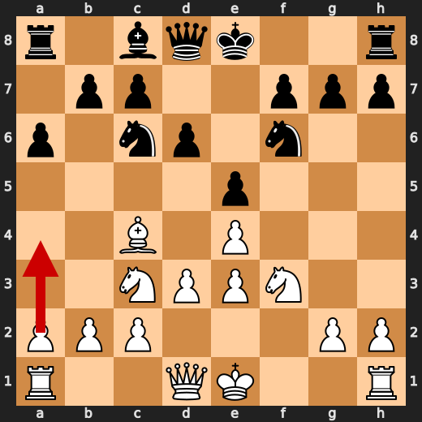

**After 8. O-O**

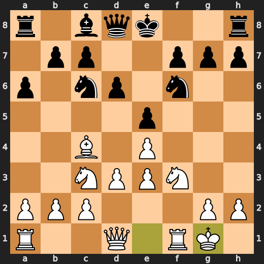

### ✅ Best: 9. Ng5 by You (White)

White's Ng5 failed to address Black's a4 threat while also weakening White's kingside pawn structure without offering any immediate compensation. The preferred move a4 improves White's position by creating an outpost on d5 for their knight, which can be useful in future play. This move also disrupts the pawn structure and opens up diagonals for potential piece activity. Anti-repetition memory: At or very near Stockfish's preferred move.

- **Eval:** +1.56 → +1.69
- **Preferred:** `Ng5`
- **Loss:** 0 cp

**Before 9. Ng5**

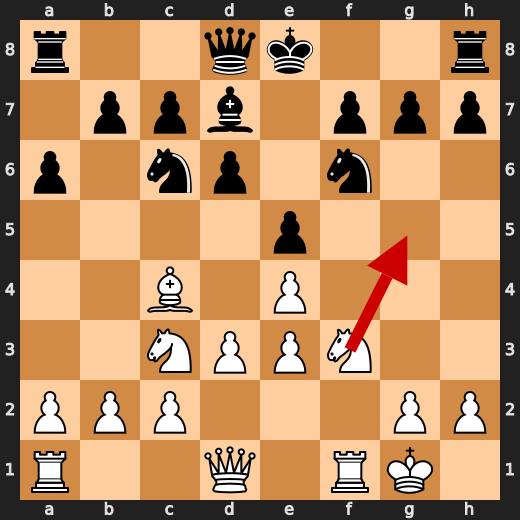

**After 9. Ng5**

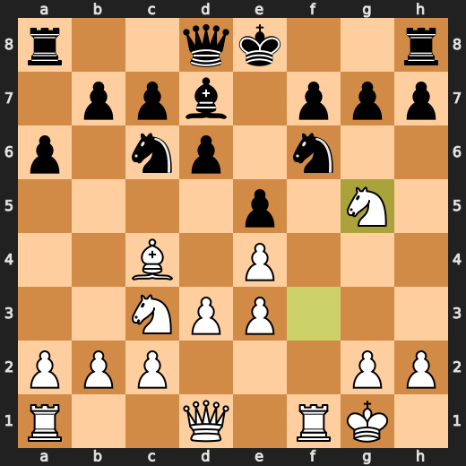

### 💀 Blunder: 12. Ke8 by CPU (Black)

Black's played move Ke8 failed to improve their position and worsened it significantly. The preferred move Kg6 would have defended the king more effectively against potential threats on the e-file, while also opening up attacking possibilities for Black's pieces. This move by CPU (Black) is a major eval loss due to its lack of defensive value and inability to capitalize on White's vulnerable position.

- **Eval:** +0.25 → +7.96
- **Preferred:** `Kg6`
- **Loss:** 771 cp

**Before 12. Ke8**

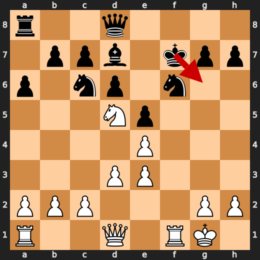

**After 12. Ke8**

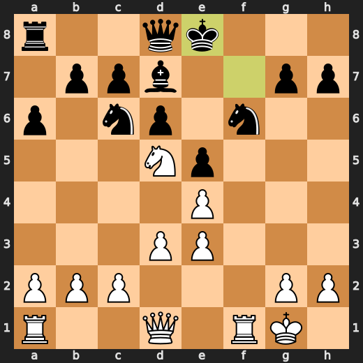

### ✅ Best: 13. gxf6 by CPU (Black)

CPU (Black) played gxf6 at move 13 to improve their position by exchanging a minor piece for a pawn in an attempt to simplify the game and potentially create weaknesses on White's side. The preferred move, gxf6, also helps to develop Black's pieces while maintaining control over the key central square e5. This move worsened White's position slightly by giving up a piece for a pawn, but it did not significantly change the evaluation of the game.

- **Eval:** +6.16 → +6.19
- **Preferred:** `gxf6`
- **Loss:** 3 cp

**Before 13. gxf6**

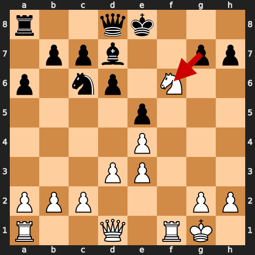

**After 13. gxf6**

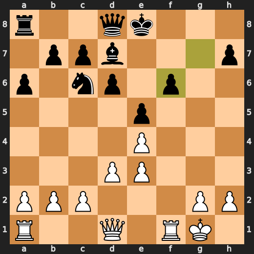

### ❌ Mistake: 15. Kf8 by CPU (Black)

CPU's Kf8 fails to address Black's weakened kingside pawn structure and instead worsens it by blocking the bishop on g7. The preferred move Ke6 improves Black's defensive options, specifically protecting the e5-pawn and allowing the queen to access more squares. The eval swing indicates that Kf8 is a significant mistake in this position.

- **Eval:** +5.46 → +8.92
- **Preferred:** `Ke6`
- **Loss:** 346 cp

**Before 15. Kf8**

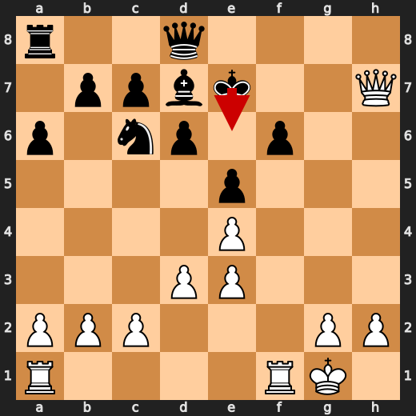

**After 15. Kf8**

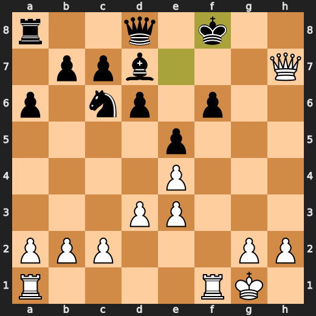

### ❌ Mistake: 16. Qg6 by You (White)

You (White) played Qg6 as a significant mistake at move 16, losing eval points. The preferred move Rf3 improves your position by creating pressure on Black's queenside. By playing Qg6, you failed to maintain the advantage and allowed Black to improve their defensive structure in response. This move worsened your position without a clear tactical justification.

- **Eval:** +8.33 → +5.31
- **Preferred:** `Rf3`
- **Loss:** 302 cp

**Before 16. Qg6**

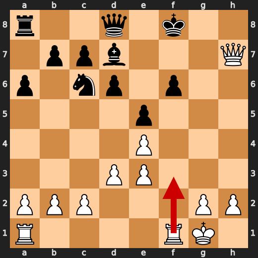

**After 16. Qg6**

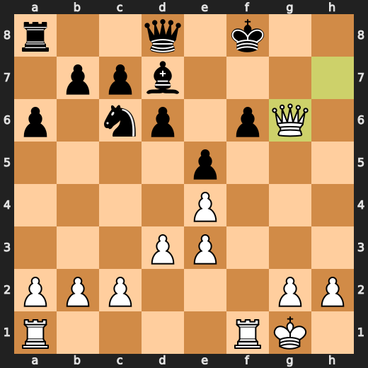

### 💀 Blunder: 16. Nb4 by CPU (Black)

Black's played move Nb4 failed to improve their position and worsened it significantly. The preferred move f5 would have defended the king more effectively against potential threats on the e-file, while also opening up attacking possibilities for Black's pieces. This move by CPU (Black) is a major eval loss due to its lack of defensive value and inability to capitalize on White's vulnerable position.

- **Eval:** +5.56 → White has mate
- **Preferred:** `f5`
- **Loss:** 99444 cp

**Before 16. Nb4**

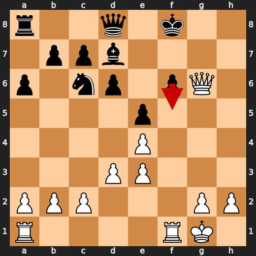

**After 16. Nb4**

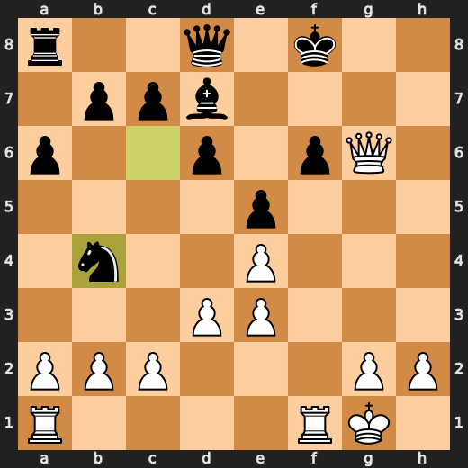

### 🏁 Checkmate: 22. Qg7# by You (White)

White's Qg7# checkmates Black by forcing the king to move diagonally towards the queen, which is not possible in this position due to the rook on h7 and pawn on g2 blocking the diagonal. The preferred move Rh7# would have been a better choice as it forces the king to move horizontally or vertically, leading to checkmate by the other rook on h1. However, Qg7# still achieves the same result of checkmating Black and is a useful forced move in this position.

- **Eval:** White has mate → White has mate
- **Preferred:** `Rh7#`
- **Loss:** 0 cp

**Before 22. Qg7#**

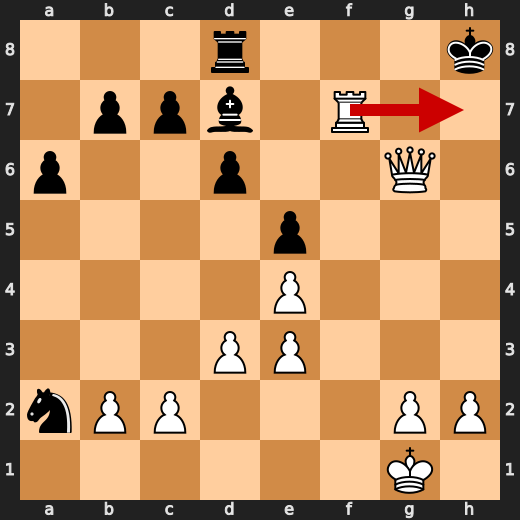

**After 22. Qg7#**

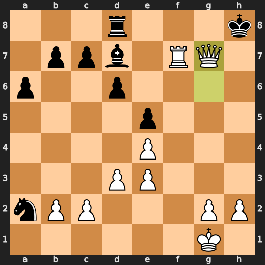

---

## Human Notes

Biggest caveman lesson: CPU (Black) blew it with **12. Ke8**.

There was another real screw-up at **15. Kf8** by **CPU (Black)**.

The game-ending shot was **22. Qg7#** by **You (White)**.

---

<details>
<summary>Compact move list</summary>

- 📖 **1. e4** (You (White), Book) — +0.46 → +0.23, preferred `d4`, loss 23 cp
- 📖 **1. e5** (CPU (Black), Book) — +0.37 → +0.35, preferred `e5`, loss 0 cp
- 📖 **2. Nf3** (You (White), Book) — +0.47 → +0.34, preferred `Nf3`, loss 13 cp
- 📖 **2. Nc6** (CPU (Black), Book) — +0.41 → +0.40, preferred `d6`, loss 0 cp
- 📖 **3. Nc3** (You (White), Book) — +0.41 → +0.26, preferred `Bb5`, loss 15 cp
- 📖 **3. Nf6** (CPU (Black), Book) — +0.18 → +0.16, preferred `Nf6`, loss 0 cp
- 🔥 **4. Bc4** (You (White), Great) — +0.13 → -0.16, preferred `a3`, loss 29 cp
- 👍 **4. Bc5** (CPU (Black), Good) — -0.79 → +0.19, preferred `Nxe4`, loss 98 cp
- ✅ **5. d3** (You (White), Best) — +0.19 → +0.19, preferred `d3`, loss 0 cp
- ✅ **5. d6** (CPU (Black), Best) — +0.16 → +0.16, preferred `h6`, loss 0 cp
- 🔥 **6. Be3** (You (White), Great) — +0.28 → -0.22, preferred `Na4`, loss 50 cp
- ✅ **6. Bxe3** (CPU (Black), Best) — -0.09 → -0.10, preferred `Bxe3`, loss 0 cp
- ✅ **7. fxe3** (You (White), Best) — -0.08 → +0.00, preferred `fxe3`, loss 0 cp
- 🔥 **7. a6** (CPU (Black), Great) — -0.07 → +0.19, preferred `Na5`, loss 26 cp
- ✅ **8. O-O** (You (White), Best) — +0.08 → -0.03, preferred `a4`, loss 11 cp
- 👍 **8. Bd7** (CPU (Black), Good) — -0.16 → +0.39, preferred `Na5`, loss 55 cp
- ✅ **9. Ng5** (You (White), Best) — +1.56 → +1.69, preferred `Ng5`, loss 0 cp
- ✅ **9. O-O** (CPU (Black), Best) — +2.10 → +2.02, preferred `O-O`, loss 0 cp
- ⚠️ **10. Nxf7** (You (White), Inaccuracy) — +2.11 → +0.00, preferred `Nd5`, loss 211 cp
- ✅ **10. Rxf7** (CPU (Black), Best) — +0.00 → +0.00, preferred `Rxf7`, loss 0 cp
- ✅ **11. Bxf7+** (You (White), Best) — +0.00 → +0.00, preferred `Bxf7+`, loss 0 cp
- ✅ **11. Kxf7** (CPU (Black), Best) — +0.00 → +0.00, preferred `Kxf7`, loss 0 cp
- ✅ **12. Nd5** (You (White), Best) — +0.00 → +0.00, preferred `Nd5`, loss 0 cp
- 💀 **12. Ke8** (CPU (Black), Blunder) — +0.25 → +7.96, preferred `Kg6`, loss 771 cp
- ⚠️ **13. Nxf6+** (You (White), Inaccuracy) — +8.43 → +6.48, preferred `Rxf6`, loss 195 cp
- ✅ **13. gxf6** (CPU (Black), Best) — +6.16 → +6.19, preferred `gxf6`, loss 3 cp
- ✅ **14. Qh5+** (You (White), Best) — +6.71 → +6.72, preferred `Qh5+`, loss 0 cp
- ✅ **14. Ke7** (CPU (Black), Best) — +6.30 → +6.25, preferred `Ke7`, loss 0 cp
- ⚠️ **15. Qxh7+** (You (White), Inaccuracy) — +6.53 → +4.43, preferred `Rxf6`, loss 210 cp
- ❌ **15. Kf8** (CPU (Black), Mistake) — +5.46 → +8.92, preferred `Ke6`, loss 346 cp
- ❌ **16. Qg6** (You (White), Mistake) — +8.33 → +5.31, preferred `Rf3`, loss 302 cp
- 💀 **16. Nb4** (CPU (Black), Blunder) — +5.56 → White has mate, preferred `f5`, loss 99444 cp
- ✅ **17. Rxf6+** (You (White), Best) — White has mate → White has mate, preferred `Rxf6+`, loss 0 cp
- ✅ **17. Qxf6** (CPU (Black), Best) — White has mate → White has mate, preferred `Qxf6`, loss 0 cp
- ✅ **18. Qxf6+** (You (White), Best) — White has mate → White has mate, preferred `Qxf6+`, loss 0 cp
- ✅ **18. Kg8** (CPU (Black), Best) — White has mate → White has mate, preferred `Kg8`, loss 0 cp
- ✅ **19. Qg6+** (You (White), Best) — White has mate → White has mate, preferred `Rf1`, loss 0 cp
- ✅ **19. Kh8** (CPU (Black), Best) — White has mate → White has mate, preferred `Kh8`, loss 0 cp
- ✅ **20. Rf1** (You (White), Best) — White has mate → White has mate, preferred `Rf1`, loss 0 cp
- ✅ **20. Rd8** (CPU (Black), Best) — White has mate → White has mate, preferred `Be6`, loss 0 cp
- ✅ **21. Rf7** (You (White), Best) — White has mate → White has mate, preferred `Rf7`, loss 0 cp
- ✅ **21. Nxa2** (CPU (Black), Best) — White has mate → White has mate, preferred `a5`, loss 0 cp
- 🏁 **22. Qg7#** (You (White), Checkmate) — White has mate → White has mate, preferred `Rh7#`, loss 0 cp

</details>

---

<details>
<summary>Raw engine table</summary>

| Ply | Move | Actor | Played | Label | Eval Before | Eval After | Preferred | Loss |
|---:|---:|---|---|---|---:|---:|---|---:|
| 1 | 1 | You (White) | e4 | Book | +0.46 | +0.23 | d4 | 23 |
| 2 | 1 | CPU (Black) | e5 | Book | +0.37 | +0.35 | e5 | 0 |
| 3 | 2 | You (White) | Nf3 | Book | +0.47 | +0.34 | Nf3 | 13 |
| 4 | 2 | CPU (Black) | Nc6 | Book | +0.41 | +0.40 | d6 | 0 |
| 5 | 3 | You (White) | Nc3 | Book | +0.41 | +0.26 | Bb5 | 15 |
| 6 | 3 | CPU (Black) | Nf6 | Book | +0.18 | +0.16 | Nf6 | 0 |
| 7 | 4 | You (White) | Bc4 | Great | +0.13 | -0.16 | a3 | 29 |
| 8 | 4 | CPU (Black) | Bc5 | Good | -0.79 | +0.19 | Nxe4 | 98 |
| 9 | 5 | You (White) | d3 | Best | +0.19 | +0.19 | d3 | 0 |
| 10 | 5 | CPU (Black) | d6 | Best | +0.16 | +0.16 | h6 | 0 |
| 11 | 6 | You (White) | Be3 | Great | +0.28 | -0.22 | Na4 | 50 |
| 12 | 6 | CPU (Black) | Bxe3 | Best | -0.09 | -0.10 | Bxe3 | 0 |
| 13 | 7 | You (White) | fxe3 | Best | -0.08 | +0.00 | fxe3 | 0 |
| 14 | 7 | CPU (Black) | a6 | Great | -0.07 | +0.19 | Na5 | 26 |
| 15 | 8 | You (White) | O-O | Best | +0.08 | -0.03 | a4 | 11 |
| 16 | 8 | CPU (Black) | Bd7 | Good | -0.16 | +0.39 | Na5 | 55 |
| 17 | 9 | You (White) | Ng5 | Best | +1.56 | +1.69 | Ng5 | 0 |
| 18 | 9 | CPU (Black) | O-O | Best | +2.10 | +2.02 | O-O | 0 |
| 19 | 10 | You (White) | Nxf7 | Inaccuracy | +2.11 | +0.00 | Nd5 | 211 |
| 20 | 10 | CPU (Black) | Rxf7 | Best | +0.00 | +0.00 | Rxf7 | 0 |
| 21 | 11 | You (White) | Bxf7+ | Best | +0.00 | +0.00 | Bxf7+ | 0 |
| 22 | 11 | CPU (Black) | Kxf7 | Best | +0.00 | +0.00 | Kxf7 | 0 |
| 23 | 12 | You (White) | Nd5 | Best | +0.00 | +0.00 | Nd5 | 0 |
| 24 | 12 | CPU (Black) | Ke8 | Blunder | +0.25 | +7.96 | Kg6 | 771 |
| 25 | 13 | You (White) | Nxf6+ | Inaccuracy | +8.43 | +6.48 | Rxf6 | 195 |
| 26 | 13 | CPU (Black) | gxf6 | Best | +6.16 | +6.19 | gxf6 | 3 |
| 27 | 14 | You (White) | Qh5+ | Best | +6.71 | +6.72 | Qh5+ | 0 |
| 28 | 14 | CPU (Black) | Ke7 | Best | +6.30 | +6.25 | Ke7 | 0 |
| 29 | 15 | You (White) | Qxh7+ | Inaccuracy | +6.53 | +4.43 | Rxf6 | 210 |
| 30 | 15 | CPU (Black) | Kf8 | Mistake | +5.46 | +8.92 | Ke6 | 346 |
| 31 | 16 | You (White) | Qg6 | Mistake | +8.33 | +5.31 | Rf3 | 302 |
| 32 | 16 | CPU (Black) | Nb4 | Blunder | +5.56 | White has mate | f5 | 99444 |
| 33 | 17 | You (White) | Rxf6+ | Best | White has mate | White has mate | Rxf6+ | 0 |
| 34 | 17 | CPU (Black) | Qxf6 | Best | White has mate | White has mate | Qxf6 | 0 |
| 35 | 18 | You (White) | Qxf6+ | Best | White has mate | White has mate | Qxf6+ | 0 |
| 36 | 18 | CPU (Black) | Kg8 | Best | White has mate | White has mate | Kg8 | 0 |
| 37 | 19 | You (White) | Qg6+ | Best | White has mate | White has mate | Rf1 | 0 |
| 38 | 19 | CPU (Black) | Kh8 | Best | White has mate | White has mate | Kh8 | 0 |
| 39 | 20 | You (White) | Rf1 | Best | White has mate | White has mate | Rf1 | 0 |
| 40 | 20 | CPU (Black) | Rd8 | Best | White has mate | White has mate | Be6 | 0 |
| 41 | 21 | You (White) | Rf7 | Best | White has mate | White has mate | Rf7 | 0 |
| 42 | 21 | CPU (Black) | Nxa2 | Best | White has mate | White has mate | a5 | 0 |
| 43 | 22 | You (White) | Qg7# | Checkmate | White has mate | White has mate | Rh7# | 0 |

</details>

---

<details>
<summary>Clean PGN</summary>

```pgn
[Event "AI Factory's Chess"]
[Site "Android Device"]
[Date "2026.05.25"]
[Round "1"]
[White "You"]
[Black "CPU (5)"]
[Result "1-0"]
[PlyCount "43"]

1. e4 e5 2. Nf3 Nc6 3. Nc3 Nf6 4. Bc4 Bc5 5. d3 d6 6. Be3 Bxe3 7. fxe3 a6 8.
O-O Bd7 9. Ng5 O-O 10. Nxf7 Rxf7 11. Bxf7+ Kxf7 12. Nd5 Ke8 13. Nxf6+ gxf6 14.
Qh5+ Ke7 15. Qxh7+ Kf8 16. Qg6 Nb4 17. Rxf6+ Qxf6 18. Qxf6+ Kg8 19. Qg6+ Kh8
20. Rf1 Rd8 21. Rf7 Nxa2 22. Qg7# 1-0
```

</details>
