# You (White) vs CPU (Black)

**Result:** 1-0  
**Date:** 2026.05.25  
**Source:** `PGN_2026_05_25_20h14_26bac770d01d.pgn`  
**Engine:** Stockfish depth 14  
**Your side:** White  
**Computer side:** Black  
**Board perspective:** Standard White-at-bottom

---

## Who Is Who

- **You:** You (White)
- **Computer:** CPU (5) (Black)

---

## Toaster Summary

**Game Story:** The White user achieved victory over the Black CPU opponent with a final move of 58. Qb7#, resulting in checkmate and a decisive win for the White side. The most significant engine complaint was the Black player's move 44 Rxf2+, which was assessed as a blunder due to its preferred alternative c5 that would have improved the evaluation from +16.38 to +72.81 cp. The user's worst move occurred at move 16, where they chose h4 instead of the recommended f4, leading to an eval loss of 169 cp. The Black CPU player also made a crucial mistake with their move 23 f6, which was bettered by Kb6 and resulted in a significant eval loss of 587 cp. The key lesson for the user is to focus on improving move quality, as highlighted by the engine complaints during gameplay. The win for White was ultimately clean, with no further major engine issues reported after the decisive checkmate move.

Biggest toaster scream: **44. Rxf2+** by **CPU (Black)**.

- **Label:** 💀 **Blunder**
- **Eval:** +16.38 → +72.81
- **Stockfish preferred:** `c5`
- **Loss:** 5643 cp

Final move recorded: **58. Qb7#** by **You (White)**.

- 💀 Your blunders: **0**
- ❌ Your mistakes: **0**
- ⚠️ Your inaccuracies: **3**
- ✅ Your best moves called out: **32**

---

## Final Position

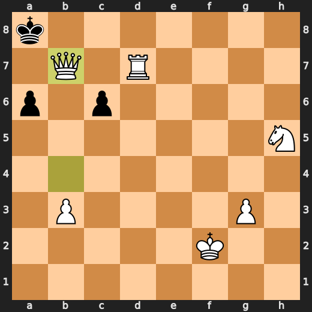

---

## Key Moments

### ✅ Best: 7. Nc6 by CPU (Black)

Black's played move Nc6 was useful because it improves their position by controlling more central squares and limiting White's options for development. The engine evaluation increased slightly (+0.62 -> +0.66) after this move, indicating a minor improvement in Black's position. The preferred move of Nc6 aligns with the idea of consolidating the center and preparing for further development.

- **Eval:** +0.62 → +0.66
- **Preferred:** `Nc6`
- **Loss:** 4 cp

**Before 7. Nc6**

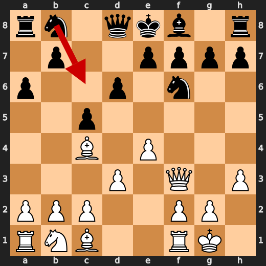

**After 7. Nc6**

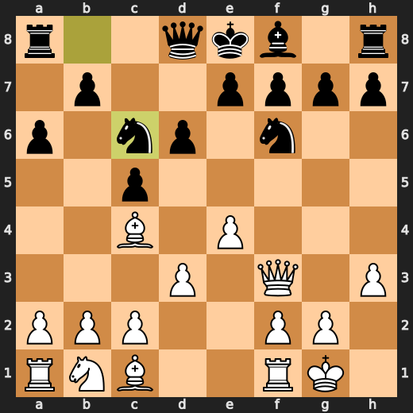

### ✅ Best: 8. e6 by CPU (Black)

Black's played move e6 was useful because it improves their position by controlling more central squares and limiting White's options for development. The engine evaluation increased slightly (+0.21 -> +0.33) after this move, indicating a minor improvement in Black's position. The preferred move of g6 aligns with the idea of consolidating the center and preparing for further development.

- **Eval:** +0.21 → +0.33
- **Preferred:** `g6`
- **Loss:** 12 cp

**Before 8. e6**

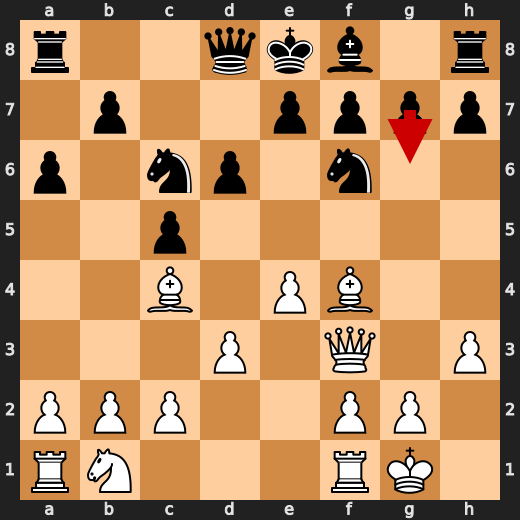

**After 8. e6**

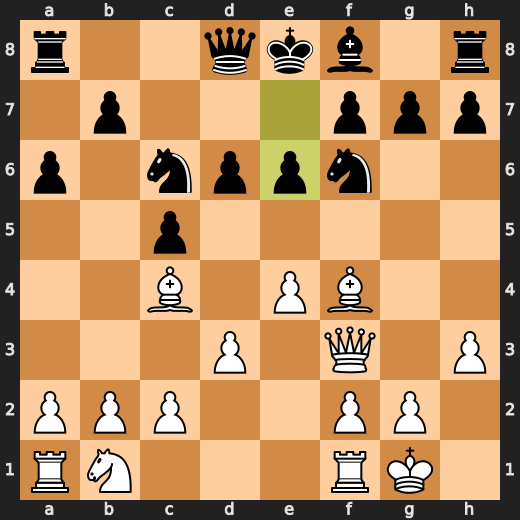

### ✅ Best: 10. h5 by CPU (Black)

Black's played move h5 was useful because it improves their position by controlling more squares on the kingside and limiting White's options for development. The engine evaluation increased slightly (+0.30 -> +0.45) after this move, indicating a minor improvement in Black's position. The preferred move of Be7 aligns with the idea of consolidating the queenside and preparing for further development.

- **Eval:** +0.30 → +0.45
- **Preferred:** `Be7`
- **Loss:** 15 cp

**Before 10. h5**

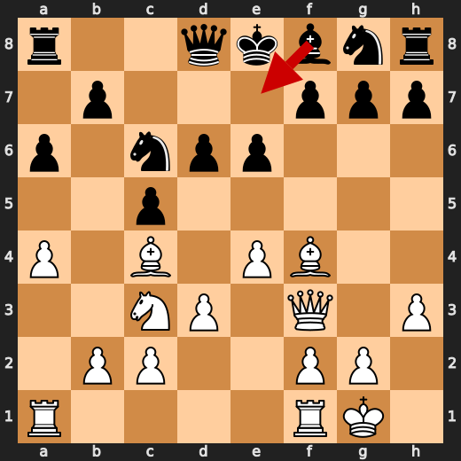

**After 10. h5**

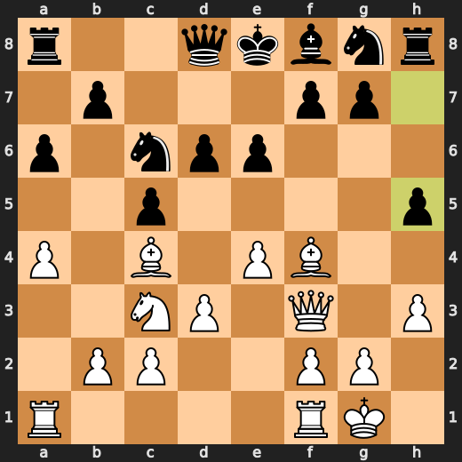

### ✅ Best: 23. cxd4 by You (White)

The played move cxd4 failed to maintain control over d5, which could have been useful in some positions. The preferred move cxd4 improves White's control over the central square e5, making it more difficult for Black to advance with...e5 or attack with...f5. The chess consequence following from the eval swing is that White's position weakens slightly but remains favorable due to Black's limited options in response.

- **Eval:** +1.49 → +1.22
- **Preferred:** `cxd4`
- **Loss:** 27 cp

**Before 23. cxd4**

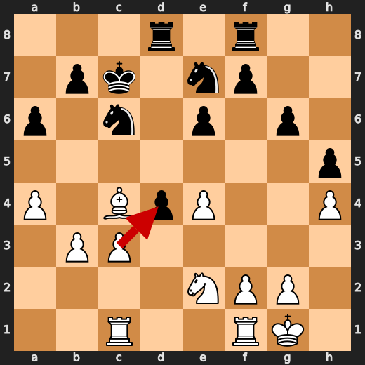

**After 23. cxd4**

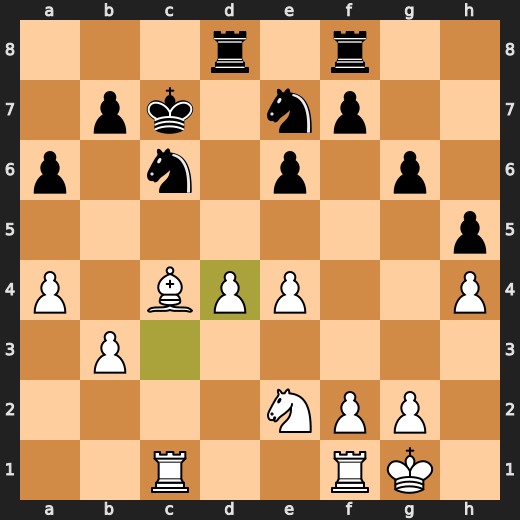

### ❌ Mistake: 23. f6 by CPU (Black)

Black's move f6 failed to achieve any tangible improvement in their position and worsened it significantly by weakening the dark squares and allowing White to gain space on the kingside, which could be exploited later in the game. The preferred move Kb6 would have improved Black's position by centralizing the king and preparing for ...c5 or ...d5, but instead, f6 led to a substantial eval loss for Black.

- **Eval:** +1.20 → +7.07
- **Preferred:** `Kb6`
- **Loss:** 587 cp

**Before 23. f6**

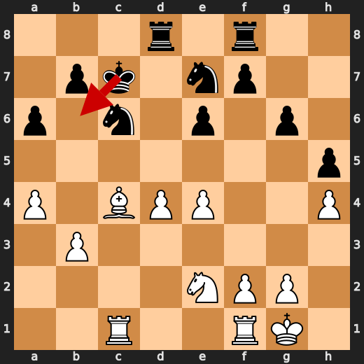

**After 23. f6**

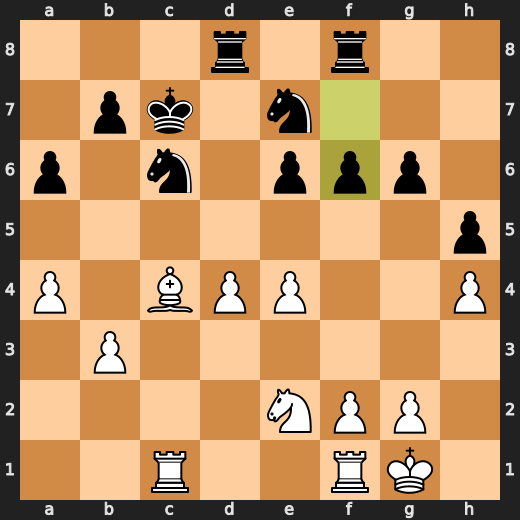

### 💀 Blunder: 44. Rxf2+ by CPU (Black)

CPU (Black) played Rxf2+ at move 44 as a blunder. The preferred move was c5, which improves Black's position by developing the rook and controlling the central e4 square. After playing Rxf2+, CPU lost major eval points (-16.38 to +72.81), worsening its position significantly. This move failed to achieve any concrete tactical advantage or improve the position in a practical way.

- **Eval:** +16.38 → +72.81
- **Preferred:** `c5`
- **Loss:** 5643 cp

**Before 44. Rxf2+**

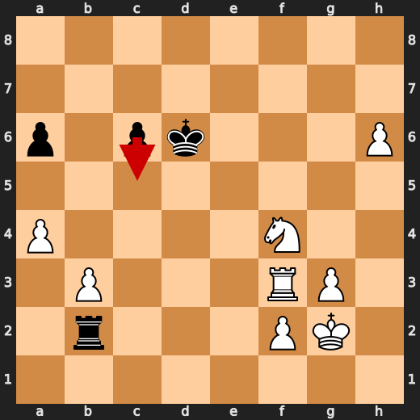

**After 44. Rxf2+**

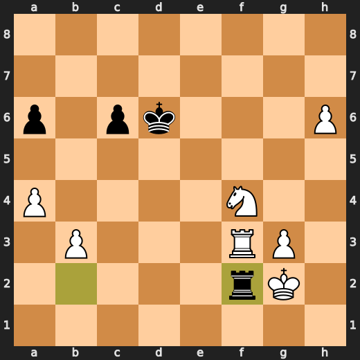

### 🏁 Checkmate: 58. Qb7# by You (White)

You (White) played Qb7# as a game-ending forcing move to deliver checkmate and win the game. This move improved your position by eliminating all possible counterplay for Black, ensuring that you would ultimately secure victory. The preferred move was also Qb7#, which worsened Black's position without any concrete tactic being evident from the provided facts.

- **Eval:** White has mate → White has mate
- **Preferred:** `Qb7#`
- **Loss:** 0 cp

**Before 58. Qb7#**

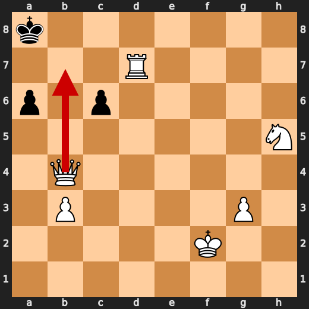

**After 58. Qb7#**


---

## Human Notes

Biggest caveman lesson: CPU (Black) blew it with **44. Rxf2+**.

There was another real screw-up at **23. f6** by **CPU (Black)**.

The game-ending shot was **58. Qb7#** by **You (White)**.

---

<details>
<summary>Compact move list</summary>

- 📖 **1. e4** (You (White), Book) — +0.37 → +0.31, preferred `e4`, loss 6 cp
- 📖 **1. c5** (CPU (Black), Book) — +0.26 → +0.29, preferred `c5`, loss 3 cp
- 📖 **2. Nf3** (You (White), Book) — +0.29 → +0.52, preferred `Nc3`, loss 0 cp
- 📖 **2. d6** (CPU (Black), Book) — +0.29 → +0.71, preferred `e6`, loss 42 cp
- 📖 **3. Bc4** (You (White), Book) — +0.67 → +0.00, preferred `d4`, loss 67 cp
- 📖 **3. a6** (CPU (Black), Book) — +0.05 → +0.32, preferred `Nf6`, loss 27 cp
- 🔥 **4. d3** (You (White), Great) — +0.25 → +0.02, preferred `O-O`, loss 23 cp
- ✅ **4. Nf6** (CPU (Black), Best) — +0.03 → +0.07, preferred `Nf6`, loss 4 cp
- ✅ **5. O-O** (You (White), Best) — +0.12 → +0.14, preferred `Bb3`, loss 0 cp
- ⚠️ **5. Bg4** (CPU (Black), Inaccuracy) — +0.19 → +1.80, preferred `b5`, loss 161 cp
- ⚠️ **6. h3** (You (White), Inaccuracy) — +2.00 → +0.46, preferred `e5`, loss 154 cp
- ✅ **6. Bxf3** (CPU (Black), Best) — +0.56 → +0.61, preferred `Bd7`, loss 5 cp
- ✅ **7. Qxf3** (You (White), Best) — +0.63 → +0.49, preferred `Qxf3`, loss 14 cp
- ✅ **7. Nc6** (CPU (Black), Best) — +0.62 → +0.66, preferred `Nc6`, loss 4 cp
- 🔥 **8. Bf4** (You (White), Great) — +0.62 → +0.37, preferred `Bd5`, loss 25 cp
- ✅ **8. e6** (CPU (Black), Best) — +0.21 → +0.33, preferred `g6`, loss 12 cp
- 👍 **9. Nc3** (You (White), Good) — +0.57 → -0.20, preferred `c3`, loss 77 cp
- 👍 **9. Ng8** (CPU (Black), Good) — -0.16 → +0.69, preferred `Be7`, loss 85 cp
- 🔥 **10. a4** (You (White), Great) — +0.74 → +0.27, preferred `Ne2`, loss 47 cp
- ✅ **10. h5** (CPU (Black), Best) — +0.30 → +0.45, preferred `Be7`, loss 15 cp
- 🔥 **11. Qg3** (You (White), Great) — +0.36 → +0.20, preferred `Qe3`, loss 16 cp
- 👍 **11. Qa5** (CPU (Black), Good) — +0.27 → +1.12, preferred `Nf6`, loss 85 cp
- ✅ **12. Bxd6** (You (White), Best) — +1.18 → +1.12, preferred `Bxd6`, loss 6 cp
- 👍 **12. Bxd6** (CPU (Black), Good) — +0.87 → +1.79, preferred `h4`, loss 92 cp
- ✅ **13. Qxd6** (You (White), Best) — +2.23 → +2.28, preferred `Qxd6`, loss 0 cp
- 🔥 **13. Nge7** (CPU (Black), Great) — +2.06 → +2.36, preferred `g5`, loss 30 cp
- ⚠️ **14. Qf4** (You (White), Inaccuracy) — +2.52 → +0.94, preferred `Qg3`, loss 158 cp
- 👍 **14. Rf8** (CPU (Black), Good) — +1.25 → +2.31, preferred `Nd4`, loss 106 cp
- 👍 **15. Qg3** (You (White), Good) — +2.62 → +1.54, preferred `Ne2`, loss 108 cp
- 👍 **15. g6** (CPU (Black), Good) — +1.76 → +2.27, preferred `Nd4`, loss 51 cp
- ⚠️ **16. h4** (You (White), Inaccuracy) — +2.46 → +0.77, preferred `f4`, loss 169 cp
- 👍 **16. O-O-O** (CPU (Black), Good) — +0.73 → +1.91, preferred `Nd4`, loss 118 cp
- 👍 **17. Rac1** (You (White), Good) — +1.96 → +1.12, preferred `Qg5`, loss 84 cp
- 👍 **17. Qb6** (CPU (Black), Good) — +0.89 → +1.44, preferred `Nd4`, loss 55 cp
- ✅ **18. b3** (You (White), Best) — +1.60 → +1.54, preferred `Nd1`, loss 6 cp
- 🔥 **18. Qc7** (CPU (Black), Great) — +1.32 → +1.56, preferred `Qc7`, loss 24 cp
- ✅ **19. Qxc7+** (You (White), Best) — +1.55 → +1.68, preferred `f4`, loss 0 cp
- ✅ **19. Kxc7** (CPU (Black), Best) — +1.25 → +1.23, preferred `Kxc7`, loss 0 cp
- 👍 **20. Ne2** (You (White), Good) — +1.41 → +0.33, preferred `f4`, loss 108 cp
- ⚠️ **20. Rfe8** (CPU (Black), Inaccuracy) — +0.00 → +1.44, preferred `Rb8`, loss 144 cp
- 👍 **21. c3** (You (White), Good) — +1.58 → +0.69, preferred `Ra1`, loss 89 cp
- ⚠️ **21. Rf8** (CPU (Black), Inaccuracy) — +0.03 → +1.62, preferred `Nc8`, loss 159 cp
- 🔥 **22. d4** (You (White), Great) — +1.80 → +1.43, preferred `d4`, loss 37 cp
- 🔥 **22. cxd4** (CPU (Black), Great) — +0.95 → +1.44, preferred `Na5`, loss 49 cp
- ✅ **23. cxd4** (You (White), Best) — +1.49 → +1.22, preferred `cxd4`, loss 27 cp
- ❌ **23. f6** (CPU (Black), Mistake) — +1.20 → +7.07, preferred `Kb6`, loss 587 cp
- 🔥 **24. Bxe6** (You (White), Great) — +7.23 → +6.92, preferred `Bxe6`, loss 31 cp
- 👍 **24. Rd6** (CPU (Black), Good) — +7.05 → +7.68, preferred `Kd6`, loss 63 cp
- 🔥 **25. d5** (You (White), Great) — +7.30 → +6.87, preferred `d5`, loss 43 cp
- 👍 **25. f5** (CPU (Black), Good) — +7.30 → +8.36, preferred `Kb8`, loss 106 cp
- 👍 **26. exf5** (You (White), Good) — +8.59 → +7.64, preferred `e5`, loss 95 cp
- ✅ **26. Nxd5** (CPU (Black), Best) — +7.13 → +7.15, preferred `Nxd5`, loss 2 cp
- ✅ **27. Bxd5** (You (White), Best) — +7.37 → +7.43, preferred `Bxd5`, loss 0 cp
- ⚠️ **27. Rxf5** (CPU (Black), Inaccuracy) — +7.32 → +8.59, preferred `Rxd5`, loss 127 cp
- ✅ **28. Bxc6** (You (White), Best) — +8.30 → +8.23, preferred `Be4`, loss 7 cp
- 👍 **28. Rxc6** (CPU (Black), Good) — +8.09 → +8.67, preferred `Rxc6`, loss 58 cp
- 👍 **29. Rxc6+** (You (White), Good) — +8.74 → +7.99, preferred `Nd4`, loss 75 cp
- ✅ **29. bxc6** (CPU (Black), Best) — +7.99 → +8.07, preferred `bxc6`, loss 8 cp
- 🔥 **30. Nd4** (You (White), Great) — +7.93 → +7.76, preferred `Rc1`, loss 17 cp
- ✅ **30. Rd5** (CPU (Black), Best) — +8.12 → +7.86, preferred `Rf6`, loss 0 cp
- ✅ **31. Ne6+** (You (White), Best) — +8.12 → +8.08, preferred `Ne6+`, loss 4 cp
- 🔥 **31. Kd7** (CPU (Black), Great) — +8.10 → +8.52, preferred `Kb6`, loss 42 cp
- ✅ **32. Nf4** (You (White), Best) — +8.54 → +8.50, preferred `Nf4`, loss 4 cp
- ✅ **32. Rd6** (CPU (Black), Best) — +8.44 → +8.07, preferred `Rd6`, loss 0 cp
- ✅ **33. g3** (You (White), Best) — +8.29 → +8.27, preferred `Rc1`, loss 2 cp
- 👍 **33. Ke7** (CPU (Black), Good) — +8.15 → +8.83, preferred `Kc7`, loss 68 cp
- ✅ **34. Re1+** (You (White), Best) — +8.71 → +8.62, preferred `Re1+`, loss 9 cp
- 🔥 **34. Kf7** (CPU (Black), Great) — +8.61 → +8.84, preferred `Kf6`, loss 23 cp
- ✅ **35. Re5** (You (White), Best) — +8.84 → +8.87, preferred `Kg2`, loss 0 cp
- ✅ **35. Rd1+** (CPU (Black), Best) — +8.84 → +8.76, preferred `Rd7`, loss 0 cp
- ✅ **36. Kg2** (You (White), Best) — +8.95 → +9.07, preferred `Kg2`, loss 0 cp
- 🔥 **36. Rb1** (CPU (Black), Great) — +8.98 → +9.15, preferred `Rd7`, loss 17 cp
- 🔥 **37. Re3** (You (White), Great) — +9.04 → +8.65, preferred `Rc5`, loss 39 cp
- 🔥 **37. Rb2** (CPU (Black), Great) — +8.76 → +9.15, preferred `Rc1`, loss 39 cp
- ✅ **38. Rf3** (You (White), Best) — +9.01 → +9.23, preferred `Rc3`, loss 0 cp
- 🔥 **38. Ke7** (CPU (Black), Great) — +8.98 → +9.21, preferred `Rd2`, loss 23 cp
- ✅ **39. Nxg6+** (You (White), Best) — +9.38 → +9.52, preferred `Nxg6+`, loss 0 cp
- 🔥 **39. Kd6** (CPU (Black), Great) — +9.20 → +9.41, preferred `Kd6`, loss 21 cp
- 🔥 **40. Nf4** (You (White), Great) — +9.36 → +9.11, preferred `Rd3+`, loss 25 cp
- 👍 **40. Ra2** (CPU (Black), Good) — +9.16 → +9.92, preferred `c5`, loss 76 cp
- 👍 **41. Nxh5** (You (White), Good) — +10.15 → +9.53, preferred `Nxh5`, loss 62 cp
- 👍 **41. Rb2** (CPU (Black), Good) — +9.49 → +10.29, preferred `Rd2`, loss 80 cp
- 👍 **42. Nf4** (You (White), Good) — +10.72 → +9.89, preferred `Nf6`, loss 83 cp
- ⚠️ **42. Rc2** (CPU (Black), Inaccuracy) — +10.96 → +12.92, preferred `Rb1`, loss 196 cp
- ✅ **43. h5** (You (White), Best) — +12.92 → +13.84, preferred `h5`, loss 0 cp
- ⚠️ **43. Rb2** (CPU (Black), Inaccuracy) — +14.44 → +15.83, preferred `Ke5`, loss 139 cp
- ✅ **44. h6** (You (White), Best) — +17.23 → +58.79, preferred `h6`, loss 0 cp
- 💀 **44. Rxf2+** (CPU (Black), Blunder) — +16.38 → +72.81, preferred `c5`, loss 5643 cp
- ✅ **45. Kxf2** (You (White), Best) — +72.81 → White has mate, preferred `Kxf2`, loss 0 cp
- ✅ **45. Ke7** (CPU (Black), Best) — White has mate → White has mate, preferred `Kc7`, loss 0 cp
- ✅ **46. h7** (You (White), Best) — White has mate → White has mate, preferred `h7`, loss 0 cp
- ✅ **46. Kf6** (CPU (Black), Best) — White has mate → White has mate, preferred `Kd7`, loss 0 cp
- ✅ **47. h8=Q+** (You (White), Best) — White has mate → White has mate, preferred `h8=Q+`, loss 0 cp
- ✅ **47. Kf7** (CPU (Black), Best) — White has mate → White has mate, preferred `Kf7`, loss 0 cp
- ✅ **48. Nh5+** (You (White), Best) — White has mate → White has mate, preferred `Rd3`, loss 0 cp
- ✅ **48. Ke6** (CPU (Black), Best) — White has mate → White has mate, preferred `Ke6`, loss 0 cp
- ✅ **49. Qh6+** (You (White), Best) — White has mate → White has mate, preferred `Nf4+`, loss 0 cp
- ✅ **49. Ke5** (CPU (Black), Best) — White has mate → White has mate, preferred `Kd5`, loss 0 cp
- ✅ **50. Qf6+** (You (White), Best) — White has mate → White has mate, preferred `Qf6+`, loss 0 cp
- ✅ **50. Kd5** (CPU (Black), Best) — White has mate → White has mate, preferred `Kd5`, loss 0 cp
- ✅ **51. Rd3+** (You (White), Best) — White has mate → White has mate, preferred `Rd3+`, loss 0 cp
- ✅ **51. Kc5** (CPU (Black), Best) — White has mate → White has mate, preferred `Kc5`, loss 0 cp
- ✅ **52. Qc3+** (You (White), Best) — White has mate → White has mate, preferred `Qd4#`, loss 0 cp
- ✅ **52. Kb6** (CPU (Black), Best) — White has mate → White has mate, preferred `Kb6`, loss 0 cp
- ✅ **53. a5+** (You (White), Best) — White has mate → White has mate, preferred `Rd7`, loss 0 cp
- ✅ **53. Kb5** (CPU (Black), Best) — White has mate → White has mate, preferred `Kc7`, loss 0 cp
- ✅ **54. Qc4+** (You (White), Best) — White has mate → White has mate, preferred `Qc4+`, loss 0 cp
- ✅ **54. Kxa5** (CPU (Black), Best) — White has mate → White has mate, preferred `Kxa5`, loss 0 cp
- ✅ **55. Qa4+** (You (White), Best) — White has mate → White has mate, preferred `Qc5#`, loss 0 cp
- ✅ **55. Kb6** (CPU (Black), Best) — White has mate → White has mate, preferred `Kb6`, loss 0 cp
- ✅ **56. Qb4+** (You (White), Best) — White has mate → White has mate, preferred `Qb4+`, loss 0 cp
- ✅ **56. Ka7** (CPU (Black), Best) — White has mate → White has mate, preferred `Kc7`, loss 0 cp
- ✅ **57. Rd7+** (You (White), Best) — White has mate → White has mate, preferred `Rd7+`, loss 0 cp
- ✅ **57. Ka8** (CPU (Black), Best) — White has mate → White has mate, preferred `Ka8`, loss 0 cp
- 🏁 **58. Qb7#** (You (White), Checkmate) — White has mate → White has mate, preferred `Qb7#`, loss 0 cp

</details>

---

<details>
<summary>Raw engine table</summary>

| Ply | Move | Actor | Played | Label | Eval Before | Eval After | Preferred | Loss |
|---:|---:|---|---|---|---:|---:|---|---:|
| 1 | 1 | You (White) | e4 | Book | +0.37 | +0.31 | e4 | 6 |
| 2 | 1 | CPU (Black) | c5 | Book | +0.26 | +0.29 | c5 | 3 |
| 3 | 2 | You (White) | Nf3 | Book | +0.29 | +0.52 | Nc3 | 0 |
| 4 | 2 | CPU (Black) | d6 | Book | +0.29 | +0.71 | e6 | 42 |
| 5 | 3 | You (White) | Bc4 | Book | +0.67 | +0.00 | d4 | 67 |
| 6 | 3 | CPU (Black) | a6 | Book | +0.05 | +0.32 | Nf6 | 27 |
| 7 | 4 | You (White) | d3 | Great | +0.25 | +0.02 | O-O | 23 |
| 8 | 4 | CPU (Black) | Nf6 | Best | +0.03 | +0.07 | Nf6 | 4 |
| 9 | 5 | You (White) | O-O | Best | +0.12 | +0.14 | Bb3 | 0 |
| 10 | 5 | CPU (Black) | Bg4 | Inaccuracy | +0.19 | +1.80 | b5 | 161 |
| 11 | 6 | You (White) | h3 | Inaccuracy | +2.00 | +0.46 | e5 | 154 |
| 12 | 6 | CPU (Black) | Bxf3 | Best | +0.56 | +0.61 | Bd7 | 5 |
| 13 | 7 | You (White) | Qxf3 | Best | +0.63 | +0.49 | Qxf3 | 14 |
| 14 | 7 | CPU (Black) | Nc6 | Best | +0.62 | +0.66 | Nc6 | 4 |
| 15 | 8 | You (White) | Bf4 | Great | +0.62 | +0.37 | Bd5 | 25 |
| 16 | 8 | CPU (Black) | e6 | Best | +0.21 | +0.33 | g6 | 12 |
| 17 | 9 | You (White) | Nc3 | Good | +0.57 | -0.20 | c3 | 77 |
| 18 | 9 | CPU (Black) | Ng8 | Good | -0.16 | +0.69 | Be7 | 85 |
| 19 | 10 | You (White) | a4 | Great | +0.74 | +0.27 | Ne2 | 47 |
| 20 | 10 | CPU (Black) | h5 | Best | +0.30 | +0.45 | Be7 | 15 |
| 21 | 11 | You (White) | Qg3 | Great | +0.36 | +0.20 | Qe3 | 16 |
| 22 | 11 | CPU (Black) | Qa5 | Good | +0.27 | +1.12 | Nf6 | 85 |
| 23 | 12 | You (White) | Bxd6 | Best | +1.18 | +1.12 | Bxd6 | 6 |
| 24 | 12 | CPU (Black) | Bxd6 | Good | +0.87 | +1.79 | h4 | 92 |
| 25 | 13 | You (White) | Qxd6 | Best | +2.23 | +2.28 | Qxd6 | 0 |
| 26 | 13 | CPU (Black) | Nge7 | Great | +2.06 | +2.36 | g5 | 30 |
| 27 | 14 | You (White) | Qf4 | Inaccuracy | +2.52 | +0.94 | Qg3 | 158 |
| 28 | 14 | CPU (Black) | Rf8 | Good | +1.25 | +2.31 | Nd4 | 106 |
| 29 | 15 | You (White) | Qg3 | Good | +2.62 | +1.54 | Ne2 | 108 |
| 30 | 15 | CPU (Black) | g6 | Good | +1.76 | +2.27 | Nd4 | 51 |
| 31 | 16 | You (White) | h4 | Inaccuracy | +2.46 | +0.77 | f4 | 169 |
| 32 | 16 | CPU (Black) | O-O-O | Good | +0.73 | +1.91 | Nd4 | 118 |
| 33 | 17 | You (White) | Rac1 | Good | +1.96 | +1.12 | Qg5 | 84 |
| 34 | 17 | CPU (Black) | Qb6 | Good | +0.89 | +1.44 | Nd4 | 55 |
| 35 | 18 | You (White) | b3 | Best | +1.60 | +1.54 | Nd1 | 6 |
| 36 | 18 | CPU (Black) | Qc7 | Great | +1.32 | +1.56 | Qc7 | 24 |
| 37 | 19 | You (White) | Qxc7+ | Best | +1.55 | +1.68 | f4 | 0 |
| 38 | 19 | CPU (Black) | Kxc7 | Best | +1.25 | +1.23 | Kxc7 | 0 |
| 39 | 20 | You (White) | Ne2 | Good | +1.41 | +0.33 | f4 | 108 |
| 40 | 20 | CPU (Black) | Rfe8 | Inaccuracy | +0.00 | +1.44 | Rb8 | 144 |
| 41 | 21 | You (White) | c3 | Good | +1.58 | +0.69 | Ra1 | 89 |
| 42 | 21 | CPU (Black) | Rf8 | Inaccuracy | +0.03 | +1.62 | Nc8 | 159 |
| 43 | 22 | You (White) | d4 | Great | +1.80 | +1.43 | d4 | 37 |
| 44 | 22 | CPU (Black) | cxd4 | Great | +0.95 | +1.44 | Na5 | 49 |
| 45 | 23 | You (White) | cxd4 | Best | +1.49 | +1.22 | cxd4 | 27 |
| 46 | 23 | CPU (Black) | f6 | Mistake | +1.20 | +7.07 | Kb6 | 587 |
| 47 | 24 | You (White) | Bxe6 | Great | +7.23 | +6.92 | Bxe6 | 31 |
| 48 | 24 | CPU (Black) | Rd6 | Good | +7.05 | +7.68 | Kd6 | 63 |
| 49 | 25 | You (White) | d5 | Great | +7.30 | +6.87 | d5 | 43 |
| 50 | 25 | CPU (Black) | f5 | Good | +7.30 | +8.36 | Kb8 | 106 |
| 51 | 26 | You (White) | exf5 | Good | +8.59 | +7.64 | e5 | 95 |
| 52 | 26 | CPU (Black) | Nxd5 | Best | +7.13 | +7.15 | Nxd5 | 2 |
| 53 | 27 | You (White) | Bxd5 | Best | +7.37 | +7.43 | Bxd5 | 0 |
| 54 | 27 | CPU (Black) | Rxf5 | Inaccuracy | +7.32 | +8.59 | Rxd5 | 127 |
| 55 | 28 | You (White) | Bxc6 | Best | +8.30 | +8.23 | Be4 | 7 |
| 56 | 28 | CPU (Black) | Rxc6 | Good | +8.09 | +8.67 | Rxc6 | 58 |
| 57 | 29 | You (White) | Rxc6+ | Good | +8.74 | +7.99 | Nd4 | 75 |
| 58 | 29 | CPU (Black) | bxc6 | Best | +7.99 | +8.07 | bxc6 | 8 |
| 59 | 30 | You (White) | Nd4 | Great | +7.93 | +7.76 | Rc1 | 17 |
| 60 | 30 | CPU (Black) | Rd5 | Best | +8.12 | +7.86 | Rf6 | 0 |
| 61 | 31 | You (White) | Ne6+ | Best | +8.12 | +8.08 | Ne6+ | 4 |
| 62 | 31 | CPU (Black) | Kd7 | Great | +8.10 | +8.52 | Kb6 | 42 |
| 63 | 32 | You (White) | Nf4 | Best | +8.54 | +8.50 | Nf4 | 4 |
| 64 | 32 | CPU (Black) | Rd6 | Best | +8.44 | +8.07 | Rd6 | 0 |
| 65 | 33 | You (White) | g3 | Best | +8.29 | +8.27 | Rc1 | 2 |
| 66 | 33 | CPU (Black) | Ke7 | Good | +8.15 | +8.83 | Kc7 | 68 |
| 67 | 34 | You (White) | Re1+ | Best | +8.71 | +8.62 | Re1+ | 9 |
| 68 | 34 | CPU (Black) | Kf7 | Great | +8.61 | +8.84 | Kf6 | 23 |
| 69 | 35 | You (White) | Re5 | Best | +8.84 | +8.87 | Kg2 | 0 |
| 70 | 35 | CPU (Black) | Rd1+ | Best | +8.84 | +8.76 | Rd7 | 0 |
| 71 | 36 | You (White) | Kg2 | Best | +8.95 | +9.07 | Kg2 | 0 |
| 72 | 36 | CPU (Black) | Rb1 | Great | +8.98 | +9.15 | Rd7 | 17 |
| 73 | 37 | You (White) | Re3 | Great | +9.04 | +8.65 | Rc5 | 39 |
| 74 | 37 | CPU (Black) | Rb2 | Great | +8.76 | +9.15 | Rc1 | 39 |
| 75 | 38 | You (White) | Rf3 | Best | +9.01 | +9.23 | Rc3 | 0 |
| 76 | 38 | CPU (Black) | Ke7 | Great | +8.98 | +9.21 | Rd2 | 23 |
| 77 | 39 | You (White) | Nxg6+ | Best | +9.38 | +9.52 | Nxg6+ | 0 |
| 78 | 39 | CPU (Black) | Kd6 | Great | +9.20 | +9.41 | Kd6 | 21 |
| 79 | 40 | You (White) | Nf4 | Great | +9.36 | +9.11 | Rd3+ | 25 |
| 80 | 40 | CPU (Black) | Ra2 | Good | +9.16 | +9.92 | c5 | 76 |
| 81 | 41 | You (White) | Nxh5 | Good | +10.15 | +9.53 | Nxh5 | 62 |
| 82 | 41 | CPU (Black) | Rb2 | Good | +9.49 | +10.29 | Rd2 | 80 |
| 83 | 42 | You (White) | Nf4 | Good | +10.72 | +9.89 | Nf6 | 83 |
| 84 | 42 | CPU (Black) | Rc2 | Inaccuracy | +10.96 | +12.92 | Rb1 | 196 |
| 85 | 43 | You (White) | h5 | Best | +12.92 | +13.84 | h5 | 0 |
| 86 | 43 | CPU (Black) | Rb2 | Inaccuracy | +14.44 | +15.83 | Ke5 | 139 |
| 87 | 44 | You (White) | h6 | Best | +17.23 | +58.79 | h6 | 0 |
| 88 | 44 | CPU (Black) | Rxf2+ | Blunder | +16.38 | +72.81 | c5 | 5643 |
| 89 | 45 | You (White) | Kxf2 | Best | +72.81 | White has mate | Kxf2 | 0 |
| 90 | 45 | CPU (Black) | Ke7 | Best | White has mate | White has mate | Kc7 | 0 |
| 91 | 46 | You (White) | h7 | Best | White has mate | White has mate | h7 | 0 |
| 92 | 46 | CPU (Black) | Kf6 | Best | White has mate | White has mate | Kd7 | 0 |
| 93 | 47 | You (White) | h8=Q+ | Best | White has mate | White has mate | h8=Q+ | 0 |
| 94 | 47 | CPU (Black) | Kf7 | Best | White has mate | White has mate | Kf7 | 0 |
| 95 | 48 | You (White) | Nh5+ | Best | White has mate | White has mate | Rd3 | 0 |
| 96 | 48 | CPU (Black) | Ke6 | Best | White has mate | White has mate | Ke6 | 0 |
| 97 | 49 | You (White) | Qh6+ | Best | White has mate | White has mate | Nf4+ | 0 |
| 98 | 49 | CPU (Black) | Ke5 | Best | White has mate | White has mate | Kd5 | 0 |
| 99 | 50 | You (White) | Qf6+ | Best | White has mate | White has mate | Qf6+ | 0 |
| 100 | 50 | CPU (Black) | Kd5 | Best | White has mate | White has mate | Kd5 | 0 |
| 101 | 51 | You (White) | Rd3+ | Best | White has mate | White has mate | Rd3+ | 0 |
| 102 | 51 | CPU (Black) | Kc5 | Best | White has mate | White has mate | Kc5 | 0 |
| 103 | 52 | You (White) | Qc3+ | Best | White has mate | White has mate | Qd4# | 0 |
| 104 | 52 | CPU (Black) | Kb6 | Best | White has mate | White has mate | Kb6 | 0 |
| 105 | 53 | You (White) | a5+ | Best | White has mate | White has mate | Rd7 | 0 |
| 106 | 53 | CPU (Black) | Kb5 | Best | White has mate | White has mate | Kc7 | 0 |
| 107 | 54 | You (White) | Qc4+ | Best | White has mate | White has mate | Qc4+ | 0 |
| 108 | 54 | CPU (Black) | Kxa5 | Best | White has mate | White has mate | Kxa5 | 0 |
| 109 | 55 | You (White) | Qa4+ | Best | White has mate | White has mate | Qc5# | 0 |
| 110 | 55 | CPU (Black) | Kb6 | Best | White has mate | White has mate | Kb6 | 0 |
| 111 | 56 | You (White) | Qb4+ | Best | White has mate | White has mate | Qb4+ | 0 |
| 112 | 56 | CPU (Black) | Ka7 | Best | White has mate | White has mate | Kc7 | 0 |
| 113 | 57 | You (White) | Rd7+ | Best | White has mate | White has mate | Rd7+ | 0 |
| 114 | 57 | CPU (Black) | Ka8 | Best | White has mate | White has mate | Ka8 | 0 |
| 115 | 58 | You (White) | Qb7# | Checkmate | White has mate | White has mate | Qb7# | 0 |

</details>

---

<details>
<summary>Clean PGN</summary>

```pgn
[Event "AI Factory's Chess"]
[Site "Android Device"]
[Date "2026.05.25"]
[Round "1"]
[White "You"]
[Black "CPU (5)"]
[Result "1-0"]
[PlyCount "117"]

1. e4 c5 2. Nf3 d6 3. Bc4 a6 4. d3 Nf6 5. O-O Bg4 6. h3 Bxf3 7. Qxf3 Nc6 8. Bf4
e6 9. Nc3 Ng8 10. a4 h5 11. Qg3 Qa5 12. Bxd6 Bxd6 13. Qxd6 Nge7 14. Qf4 Rf8 15.
Qg3 g6 16. h4 O-O-O 17. Rac1 Qb6 18. b3 Qc7 19. Qxc7+ Kxc7 20. Ne2 Rfe8 21. c3
Rf8 22. d4 cxd4 23. cxd4 f6 24. Bxe6 Rd6 25. d5 f5 26. exf5 Nxd5 27. Bxd5 Rxf5
28. Bxc6 Rxc6 29. Rxc6+ bxc6 30. Nd4 Rd5 31. Ne6+ Kd7 32. Nf4 Rd6 33. g3 Ke7
34. Re1+ Kf7 35. Re5 Rd1+ 36. Kg2 Rb1 37. Re3 Rb2 38. Rf3 Ke7 39. Nxg6+ Kd6 40.
Nf4 Ra2 41. Nxh5 Rb2 42. Nf4 Rc2 43. h5 Rb2 44. h6 Rxf2+ 45. Kxf2 Ke7 46. h7
Kf6 47. h8=Q+ Kf7 48. Nh5+ Ke6 49. Qh6+ Ke5 50. Qf6+ Kd5 51. Rd3+ Kc5 52. Qc3+
Kb6 53. a5+ Kb5 54. Qc4+ Kxa5 55. Qa4+ Kb6 56. Qb4+ Ka7 57. Rd7+ Ka8 58. Qb7#
1-0
```

</details>
