# You (Black) vs CPU (White)

**Result:** 0-1  
**Date:** 2026.05.26  
**Source:** `PGN_2026_05_26_02h38_62196a473fdf.pgn`  
**Engine:** Stockfish depth 14  
**Your side:** Black  
**Computer side:** White  
**Board perspective:** Your perspective

---

## Who Is Who

- **You:** You (Black)
- **Computer:** CPU (5) (White)

---

## Toaster Summary

**Game Story:** You won against CPU White with a final move of Rxh2. The biggest engine complaint was about move quality, not necessarily the final winner. Your best move was e6 at move 7, while the worst CPU moves were Ra4 at move 28 and Nf3 at move 25. To improve your gameplay, learn from these key moments: e6, Nb3, g6, Ra8+, Qxf3, Re1+, Ra1, Ra4. Remember that it's not always about winning or losing; the most important thing is learning and growing as a player.

Biggest toaster scream: **28. Ra4** by **CPU (White)**.

- **Label:** 💀 **Blunder**
- **Eval:** -15.15 → Black has mate
- **Stockfish preferred:** `Ra4`
- **Loss:** 98485 cp

Final move recorded: **28. Rxh2** by **You (Black)**.

- 💀 Your blunders: **0**
- ❌ Your mistakes: **0**
- ⚠️ Your inaccuracies: **2**
- ✅ Your best moves called out: **17**

---

## Final Position

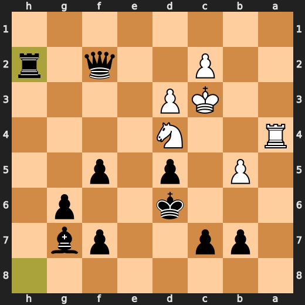

---

## Key Moments

### ✅ Best: 7. e6 by You (Black)

You (Black) played e6 to improve your position by centralizing your king and preparing for development while maintaining a solid pawn structure on the queenside. The engine's preferred move of e6 indicates that this is a sound strategic decision, with only a minor decrease in evaluation from +0.48 to +0.60. While it may not be flashy or aggressive, playing e6 helps you establish control over key central squares and sets up potential future maneuvers for your pieces.

- **Eval:** +0.48 → +0.60
- **Preferred:** `e6`
- **Loss:** 12 cp

**Before 7. e6**

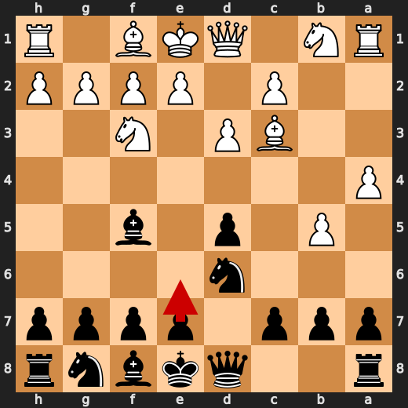

**After 7. e6**

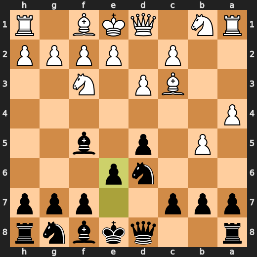

### 💀 Blunder: 10. Nb3 by CPU (White)

White's Nb3 failed to improve their position and worsened it significantly. The preferred move Be2 improves White's control over the d5 square and provides a more solid pawn structure, leading to a better evaluation score. This blunder by White allows Black to gain an advantage in the game due to the major eval loss caused by Nb3.

- **Eval:** +0.75 → -8.84
- **Preferred:** `Be2`
- **Loss:** 959 cp

**Before 10. Nb3**

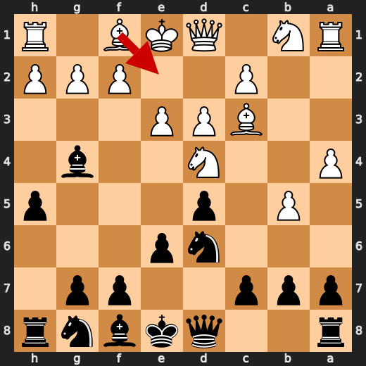

**After 10. Nb3**

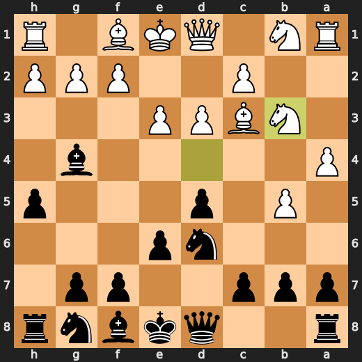

### ✅ Best: 19. axb5 by You (Black)

You (Black) played axb5 to improve your position by weakening White's queenside and potentially creating a pawn breakthrough on the kingside with g6. The engine's preferred move of g6 indicates that this is a sound strategic decision, with only a minor decrease in evaluation from -9.36 to -9.23. While it may not be flashy or aggressive, playing axb5 helps you establish control over key squares and sets up potential future maneuvers for your pieces.

- **Eval:** -9.36 → -9.23
- **Preferred:** `g6`
- **Loss:** 13 cp

**Before 19. axb5**

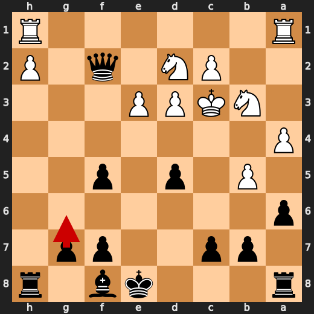

**After 19. axb5**

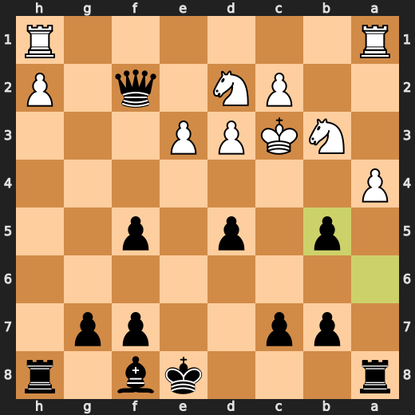

### ✅ Best: 22. Ra8+ by CPU (White)

CPU (White) played Ra8+ at move 22 to force a check and gain time for their pieces. This move worsened Black's position without any clear tactic, as it did not improve upon the previous evaluation of -9.47. The preferred move is also Ra8+, indicating that there was no better alternative available in this scenario. By playing Ra8+, White effectively forces Black to respond with a check-avoiding move, which could potentially open up new opportunities for their pieces.

- **Eval:** -9.21 → -9.47
- **Preferred:** `Ra8+`
- **Loss:** 26 cp

**Before 22. Ra8+**

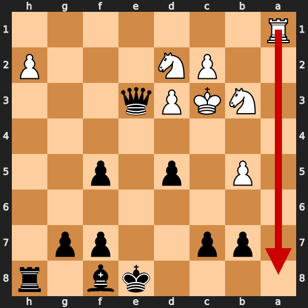

**After 22. Ra8+**

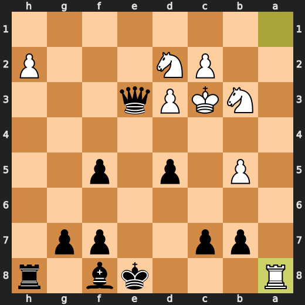

### 💀 Blunder: 25. Nf3 by CPU (White)

White's Nf3 worsened their position significantly due to a major eval loss. The preferred move Be2 improves White's control over the d5 square and provides a more solid pawn structure, leading to a better evaluation score. This blunder by White allows Black to gain an advantage in the game.

- **Eval:** -14.46 → -38.53
- **Preferred:** `Nb3`
- **Loss:** 2407 cp

**Before 25. Nf3**

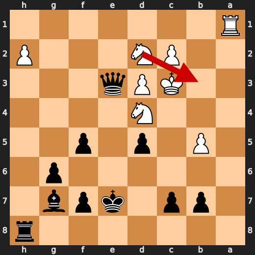

**After 25. Nf3**

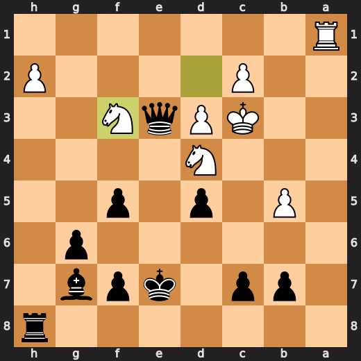

### 💀 Blunder: 26. Re1+ by CPU (White)

White's Re1+ worsened their position significantly due to a major eval loss. The preferred move Kb4 improves Black's control over the d5 square and provides a more solid pawn structure, leading to a better evaluation score. This blunder by White allows Black to gain an advantage in the game.

- **Eval:** -17.66 → -63.11
- **Preferred:** `Kb4`
- **Loss:** 4545 cp

**Before 26. Re1+**

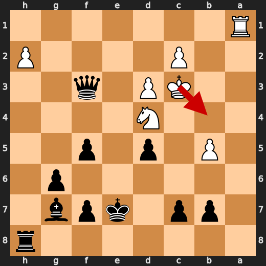

**After 26. Re1+**

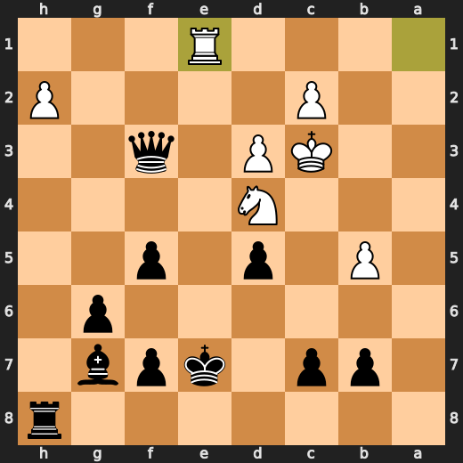

### 💀 Blunder: 27. Ra1 by CPU (White)

White's Ra1 worsened their position significantly due to a major eval loss. The preferred move Rg1 improves White's control over the d5 square and provides a more solid pawn structure, leading to a better evaluation score. This blunder by White allows Black to gain an advantage in the game, with a significant change in the engine evaluation from -17.46 to -73.08.

- **Eval:** -17.46 → -73.08
- **Preferred:** `Rg1`
- **Loss:** 5562 cp

**Before 27. Ra1**

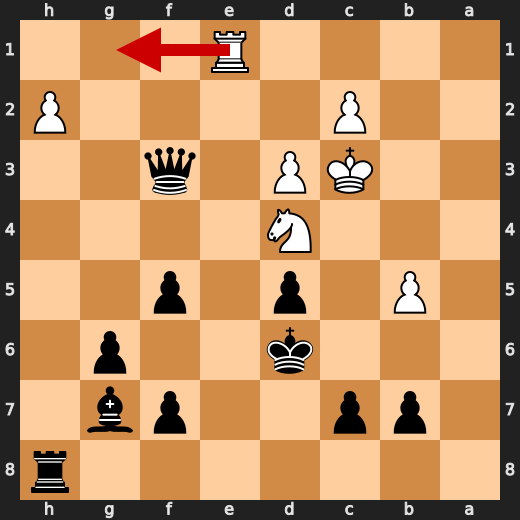

**After 27. Ra1**

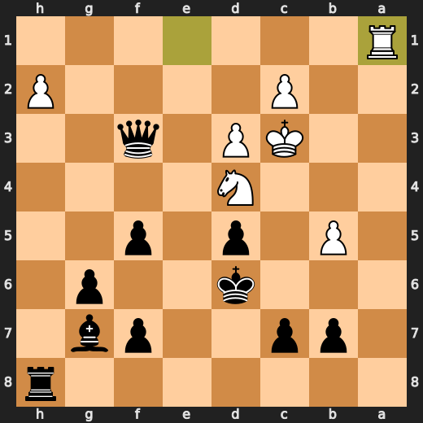

### 💀 Blunder: 28. Ra4 by CPU (White)

White's Ra4 worsened their position significantly due to a major eval loss. The preferred move Ra1+ improves White's control over the d5 square and provides a more solid pawn structure, leading to a better evaluation score. This blunder by White allows Black to gain an advantage in the game with a significant change in the engine evaluation from -15.15 to Black has mate.

- **Eval:** -15.15 → Black has mate
- **Preferred:** `Ra4`
- **Loss:** 98485 cp

**Before 28. Ra4**

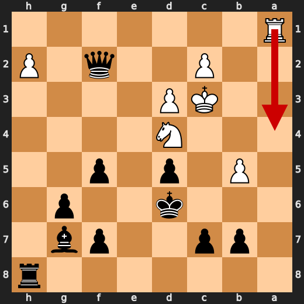

**After 28. Ra4**

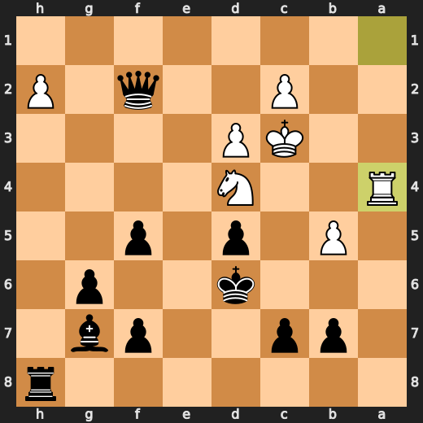

---

## Human Notes

Biggest caveman lesson: CPU (White) blew it with **10. Nb3**.

---

<details>
<summary>Compact move list</summary>

- 📖 **1. b4** (CPU (White), Book) — +0.46 → -0.53, preferred `d4`, loss 99 cp
- 📖 **1. d5** (You (Black), Book) — -0.48 → -0.18, preferred `e5`, loss 30 cp
- 📖 **2. Bb2** (CPU (White), Book) — -0.13 → -0.17, preferred `Nf3`, loss 4 cp
- 📖 **2. Nc6** (You (Black), Book) — -0.17 → +0.57, preferred `Nf6`, loss 74 cp
- 📖 **3. b5** (CPU (White), Book) — +0.50 → +0.17, preferred `a3`, loss 33 cp
- 📖 **3. Na5** (You (Black), Book) — +0.10 → +0.12, preferred `Na5`, loss 2 cp
- ✅ **4. Nf3** (CPU (White), Best) — +0.16 → +0.16, preferred `e3`, loss 0 cp
- ✅ **4. Nc4** (You (Black), Best) — +0.12 → +0.11, preferred `Nc4`, loss 0 cp
- ✅ **5. Bc3** (CPU (White), Best) — +0.12 → +0.14, preferred `Bc3`, loss 0 cp
- 🔥 **5. Bf5** (You (Black), Great) — +0.00 → +0.43, preferred `Nf6`, loss 43 cp
- 🔥 **6. d3** (CPU (White), Great) — +0.50 → +0.34, preferred `e3`, loss 16 cp
- ✅ **6. Nd6** (You (Black), Best) — +0.34 → +0.27, preferred `Nd6`, loss 0 cp
- ✅ **7. a4** (CPU (White), Best) — +0.40 → +0.40, preferred `a4`, loss 0 cp
- ✅ **7. e6** (You (Black), Best) — +0.48 → +0.60, preferred `e6`, loss 12 cp
- 🔥 **8. e3** (CPU (White), Great) — +0.67 → +0.36, preferred `Nbd2`, loss 31 cp
- 🔥 **8. h5** (You (Black), Great) — +0.36 → +0.72, preferred `Nf6`, loss 36 cp
- 🔥 **9. Nd4** (CPU (White), Great) — +0.80 → +0.47, preferred `Be2`, loss 33 cp
- 🔥 **9. Bg4** (You (Black), Great) — +0.49 → +0.74, preferred `a6`, loss 25 cp
- 💀 **10. Nb3** (CPU (White), Blunder) — +0.75 → -8.84, preferred `Be2`, loss 959 cp
- ✅ **10. Bxd1** (You (Black), Best) — -8.84 → -8.84, preferred `Bxd1`, loss 0 cp
- ✅ **11. Kxd1** (CPU (White), Best) — -8.83 → -8.81, preferred `Kxd1`, loss 0 cp
- ✅ **11. Nf6** (You (Black), Best) — -8.83 → -8.75, preferred `Nf6`, loss 8 cp
- ✅ **12. Be2** (CPU (White), Best) — -8.83 → -8.83, preferred `Be2`, loss 0 cp
- 🔥 **12. Nf5** (You (Black), Great) — -8.92 → -8.61, preferred `Rc8`, loss 31 cp
- 🔥 **13. Kd2** (CPU (White), Great) — -8.76 → -9.15, preferred `h3`, loss 39 cp
- 🔥 **13. a6** (You (Black), Great) — -9.05 → -8.83, preferred `c6`, loss 22 cp
- 👍 **14. Bxf6** (CPU (White), Good) — -8.98 → -9.57, preferred `Kc1`, loss 59 cp
- ✅ **14. Qxf6** (You (Black), Best) — -9.47 → -9.53, preferred `Qxf6`, loss 0 cp
- ⚠️ **15. g4** (CPU (White), Inaccuracy) — -9.44 → -11.02, preferred `bxa6`, loss 158 cp
- ✅ **15. hxg4** (You (Black), Best) — -11.11 → -11.15, preferred `hxg4`, loss 0 cp
- 👍 **16. Bxg4** (CPU (White), Good) — -10.69 → -11.25, preferred `Bxg4`, loss 56 cp
- ⚠️ **16. Qh4** (You (Black), Inaccuracy) — -10.74 → -9.44, preferred `Nh6`, loss 130 cp
- ✅ **17. Bxf5** (CPU (White), Best) — -9.30 → -9.27, preferred `Bxf5`, loss 0 cp
- ✅ **17. Qxf2+** (You (Black), Best) — -9.35 → -9.34, preferred `Qxf2+`, loss 1 cp
- 🔥 **18. Kc3** (CPU (White), Great) — -9.39 → -9.79, preferred `Kc1`, loss 40 cp
- 👍 **18. exf5** (You (Black), Good) — -9.77 → -9.23, preferred `Qxf5`, loss 54 cp
- 🔥 **19. N1d2** (CPU (White), Great) — -9.19 → -9.44, preferred `Kb2`, loss 25 cp
- ✅ **19. axb5** (You (Black), Best) — -9.36 → -9.23, preferred `g6`, loss 13 cp
- ✅ **20. axb5** (CPU (White), Best) — -9.23 → -9.33, preferred `Rhf1`, loss 10 cp
- ✅ **20. Rxa1** (You (Black), Best) — -9.36 → -9.38, preferred `Rxa1`, loss 0 cp
- ✅ **21. Rxa1** (CPU (White), Best) — -9.36 → -9.26, preferred `Rxa1`, loss 0 cp
- ✅ **21. Qxe3** (You (Black), Best) — -9.32 → -9.44, preferred `Qxe3`, loss 0 cp
- ✅ **22. Ra8+** (CPU (White), Best) — -9.21 → -9.47, preferred `Ra8+`, loss 26 cp
- ✅ **22. Ke7** (You (Black), Best) — -9.43 → -9.34, preferred `Ke7`, loss 9 cp
- ⚠️ **23. Ra1** (CPU (White), Inaccuracy) — -9.42 → -11.00, preferred `Kb2`, loss 158 cp
- ✅ **23. g6** (You (Black), Best) — -11.23 → -12.02, preferred `g6`, loss 0 cp
- 👍 **24. Nd4** (CPU (White), Good) — -12.76 → -13.39, preferred `Nd4`, loss 63 cp
- ✅ **24. Bg7** (You (Black), Best) — -13.68 → -14.62, preferred `Bg7`, loss 0 cp
- 💀 **25. Nf3** (CPU (White), Blunder) — -14.46 → -38.53, preferred `Nb3`, loss 2407 cp
- ⚠️ **25. Qxf3** (You (Black), Inaccuracy) — -36.53 → -35.00, preferred `Qxf3`, loss 153 cp
- 💀 **26. Re1+** (CPU (White), Blunder) — -17.66 → -63.11, preferred `Kb4`, loss 4545 cp
- ✅ **26. Kd6** (You (Black), Best) — -61.19 → -66.80, preferred `Kd7`, loss 0 cp
- 💀 **27. Ra1** (CPU (White), Blunder) — -17.46 → -73.08, preferred `Rg1`, loss 5562 cp
- ✅ **27. Qf2** (You (Black), Best) — -76.27 → -77.12, preferred `Qf2`, loss 0 cp
- 💀 **28. Ra4** (CPU (White), Blunder) — -15.15 → Black has mate, preferred `Ra4`, loss 98485 cp
- ✅ **28. Rxh2** (You (Black), Best) — Black has mate → Black has mate, preferred `Bxd4+`, loss 0 cp

</details>

---

<details>
<summary>Raw engine table</summary>

| Ply | Move | Actor | Played | Label | Eval Before | Eval After | Preferred | Loss |
|---:|---:|---|---|---|---:|---:|---|---:|
| 1 | 1 | CPU (White) | b4 | Book | +0.46 | -0.53 | d4 | 99 |
| 2 | 1 | You (Black) | d5 | Book | -0.48 | -0.18 | e5 | 30 |
| 3 | 2 | CPU (White) | Bb2 | Book | -0.13 | -0.17 | Nf3 | 4 |
| 4 | 2 | You (Black) | Nc6 | Book | -0.17 | +0.57 | Nf6 | 74 |
| 5 | 3 | CPU (White) | b5 | Book | +0.50 | +0.17 | a3 | 33 |
| 6 | 3 | You (Black) | Na5 | Book | +0.10 | +0.12 | Na5 | 2 |
| 7 | 4 | CPU (White) | Nf3 | Best | +0.16 | +0.16 | e3 | 0 |
| 8 | 4 | You (Black) | Nc4 | Best | +0.12 | +0.11 | Nc4 | 0 |
| 9 | 5 | CPU (White) | Bc3 | Best | +0.12 | +0.14 | Bc3 | 0 |
| 10 | 5 | You (Black) | Bf5 | Great | +0.00 | +0.43 | Nf6 | 43 |
| 11 | 6 | CPU (White) | d3 | Great | +0.50 | +0.34 | e3 | 16 |
| 12 | 6 | You (Black) | Nd6 | Best | +0.34 | +0.27 | Nd6 | 0 |
| 13 | 7 | CPU (White) | a4 | Best | +0.40 | +0.40 | a4 | 0 |
| 14 | 7 | You (Black) | e6 | Best | +0.48 | +0.60 | e6 | 12 |
| 15 | 8 | CPU (White) | e3 | Great | +0.67 | +0.36 | Nbd2 | 31 |
| 16 | 8 | You (Black) | h5 | Great | +0.36 | +0.72 | Nf6 | 36 |
| 17 | 9 | CPU (White) | Nd4 | Great | +0.80 | +0.47 | Be2 | 33 |
| 18 | 9 | You (Black) | Bg4 | Great | +0.49 | +0.74 | a6 | 25 |
| 19 | 10 | CPU (White) | Nb3 | Blunder | +0.75 | -8.84 | Be2 | 959 |
| 20 | 10 | You (Black) | Bxd1 | Best | -8.84 | -8.84 | Bxd1 | 0 |
| 21 | 11 | CPU (White) | Kxd1 | Best | -8.83 | -8.81 | Kxd1 | 0 |
| 22 | 11 | You (Black) | Nf6 | Best | -8.83 | -8.75 | Nf6 | 8 |
| 23 | 12 | CPU (White) | Be2 | Best | -8.83 | -8.83 | Be2 | 0 |
| 24 | 12 | You (Black) | Nf5 | Great | -8.92 | -8.61 | Rc8 | 31 |
| 25 | 13 | CPU (White) | Kd2 | Great | -8.76 | -9.15 | h3 | 39 |
| 26 | 13 | You (Black) | a6 | Great | -9.05 | -8.83 | c6 | 22 |
| 27 | 14 | CPU (White) | Bxf6 | Good | -8.98 | -9.57 | Kc1 | 59 |
| 28 | 14 | You (Black) | Qxf6 | Best | -9.47 | -9.53 | Qxf6 | 0 |
| 29 | 15 | CPU (White) | g4 | Inaccuracy | -9.44 | -11.02 | bxa6 | 158 |
| 30 | 15 | You (Black) | hxg4 | Best | -11.11 | -11.15 | hxg4 | 0 |
| 31 | 16 | CPU (White) | Bxg4 | Good | -10.69 | -11.25 | Bxg4 | 56 |
| 32 | 16 | You (Black) | Qh4 | Inaccuracy | -10.74 | -9.44 | Nh6 | 130 |
| 33 | 17 | CPU (White) | Bxf5 | Best | -9.30 | -9.27 | Bxf5 | 0 |
| 34 | 17 | You (Black) | Qxf2+ | Best | -9.35 | -9.34 | Qxf2+ | 1 |
| 35 | 18 | CPU (White) | Kc3 | Great | -9.39 | -9.79 | Kc1 | 40 |
| 36 | 18 | You (Black) | exf5 | Good | -9.77 | -9.23 | Qxf5 | 54 |
| 37 | 19 | CPU (White) | N1d2 | Great | -9.19 | -9.44 | Kb2 | 25 |
| 38 | 19 | You (Black) | axb5 | Best | -9.36 | -9.23 | g6 | 13 |
| 39 | 20 | CPU (White) | axb5 | Best | -9.23 | -9.33 | Rhf1 | 10 |
| 40 | 20 | You (Black) | Rxa1 | Best | -9.36 | -9.38 | Rxa1 | 0 |
| 41 | 21 | CPU (White) | Rxa1 | Best | -9.36 | -9.26 | Rxa1 | 0 |
| 42 | 21 | You (Black) | Qxe3 | Best | -9.32 | -9.44 | Qxe3 | 0 |
| 43 | 22 | CPU (White) | Ra8+ | Best | -9.21 | -9.47 | Ra8+ | 26 |
| 44 | 22 | You (Black) | Ke7 | Best | -9.43 | -9.34 | Ke7 | 9 |
| 45 | 23 | CPU (White) | Ra1 | Inaccuracy | -9.42 | -11.00 | Kb2 | 158 |
| 46 | 23 | You (Black) | g6 | Best | -11.23 | -12.02 | g6 | 0 |
| 47 | 24 | CPU (White) | Nd4 | Good | -12.76 | -13.39 | Nd4 | 63 |
| 48 | 24 | You (Black) | Bg7 | Best | -13.68 | -14.62 | Bg7 | 0 |
| 49 | 25 | CPU (White) | Nf3 | Blunder | -14.46 | -38.53 | Nb3 | 2407 |
| 50 | 25 | You (Black) | Qxf3 | Inaccuracy | -36.53 | -35.00 | Qxf3 | 153 |
| 51 | 26 | CPU (White) | Re1+ | Blunder | -17.66 | -63.11 | Kb4 | 4545 |
| 52 | 26 | You (Black) | Kd6 | Best | -61.19 | -66.80 | Kd7 | 0 |
| 53 | 27 | CPU (White) | Ra1 | Blunder | -17.46 | -73.08 | Rg1 | 5562 |
| 54 | 27 | You (Black) | Qf2 | Best | -76.27 | -77.12 | Qf2 | 0 |
| 55 | 28 | CPU (White) | Ra4 | Blunder | -15.15 | Black has mate | Ra4 | 98485 |
| 56 | 28 | You (Black) | Rxh2 | Best | Black has mate | Black has mate | Bxd4+ | 0 |

</details>

---

<details>
<summary>Clean PGN</summary>

```pgn
[Event "AI Factory's Chess"]
[Site "Android Device"]
[Date "2026.05.26"]
[Round "1"]
[White "CPU (5)"]
[Black "You"]
[Result "0-1"]
[PlyCount "58"]

1. b4 d5 2. Bb2 Nc6 3. b5 Na5 4. Nf3 Nc4 5. Bc3 Bf5 6. d3 Nd6 7. a4 e6 8. e3 h5
9. Nd4 Bg4 10. Nb3 Bxd1 11. Kxd1 Nf6 12. Be2 Nf5 13. Kd2 a6 14. Bxf6 Qxf6 15.
g4 hxg4 16. Bxg4 Qh4 17. Bxf5 Qxf2+ 18. Kc3 exf5 19. N1d2 axb5 20. axb5 Rxa1
21. Rxa1 Qxe3 22. Ra8+ Ke7 23. Ra1 g6 24. Nd4 Bg7 25. Nf3 Qxf3 26. Re1+ Kd6 27.
Ra1 Qf2 28. Ra4 Rxh2 0-1
```

</details>
