# You (Black) vs CPU (White)

**Result:** 0-1  
**Date:** 2026.05.31  
**Source:** `PGN_2026_05_31_13h08_05fddf6cc453.pgn`  
**Engine:** Stockfish depth 14  
**Your side:** Black  
**Computer side:** White  
**Board perspective:** Your perspective

---

## Who Is Who

- **You:** You (Black)
- **Computer:** CPU (5) (White)

---

## Toaster Summary

**Game Story:** The opening is unclear, but White’s early 9. Bd2 and later 14. Bxf6 let you take over the game. Your 9...Bb6 was inaccurate because a sharper continuation was available, so the win was not flawless. White’s decisive mistake was 38. Rgd1, after which you converted the attack into 43...Rf2# checkmate. Learn to look for forcing moves earlier, because you had chances to make the conversion cleaner.

Biggest toaster scream: **38. Rgd1** by **CPU (White)**.

- **Label:** 💀 **Blunder**
- **Eval:** -11.46 → Black has mate
- **Stockfish preferred:** `Kh4`
- **Loss:** 98854 cp

Final move recorded: **43. Rf2#** by **You (Black)**.

- 💀 Your blunders: **0**
- ❌ Your mistakes: **0**
- ⚠️ Your inaccuracies: **11**
- ✅ Your best moves called out: **17**

---

## Final Position


---

## Key Moments

### ❌ Mistake: 9. Bd2 by CPU (White)

Bd2 missed the stronger Nxc5, which was the preferred way for White to improve the position. The move caused a major swing in Black’s favor, so the practical lesson is to check active captures before making a quiet developing move.

- **Eval:** +1.02 → -4.30
- **Preferred:** `Nxc5`
- **Loss:** 532 cp

**Before 9. Bd2**

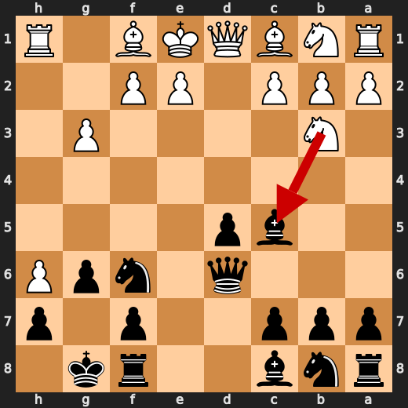

**After 9. Bd2**

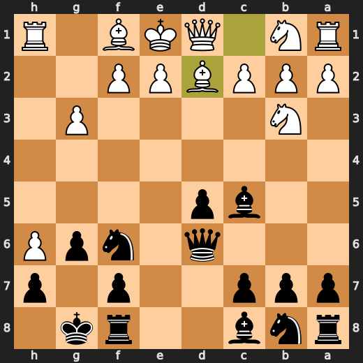

### ✅ Best: 10. Nc3 by CPU (White)

Nc3 was the preferred move and usefully develops White’s knight. The practical pattern is to improve undeveloped pieces when there is no clearer concrete tactic.

- **Eval:** -1.34 → -1.08
- **Preferred:** `Nc3`
- **Loss:** 0 cp

**Before 10. Nc3**

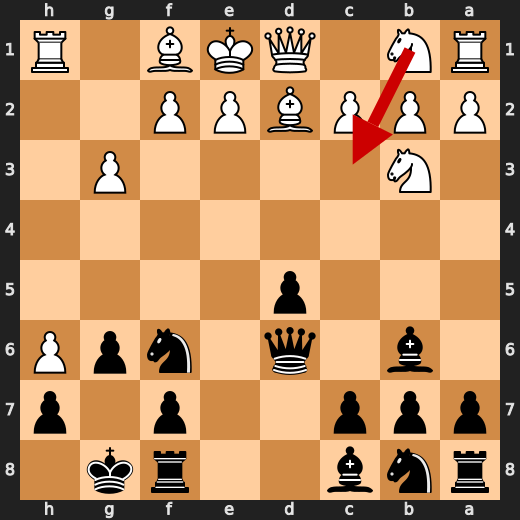

**After 10. Nc3**

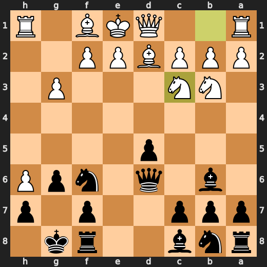

### ❌ Mistake: 14. Bxf6 by CPU (White)

Bxf6 worsened White’s position significantly instead of keeping more tension. Bf4 was preferred because it improved White’s setup without allowing such a large swing toward Black. Learn to be cautious with bishop captures that trade away an active piece when there is no clear concrete gain.

- **Eval:** +0.24 → -4.70
- **Preferred:** `Bf4`
- **Loss:** 494 cp

**Before 14. Bxf6**

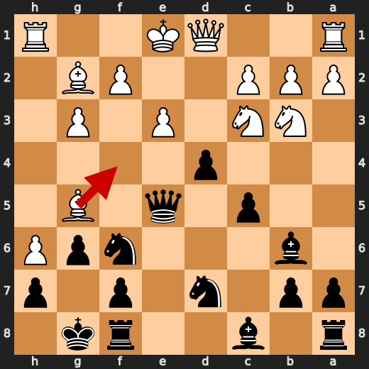

**After 14. Bxf6**

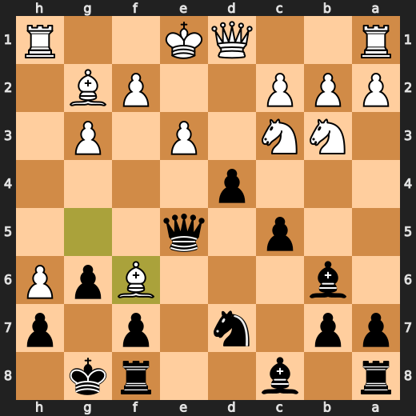

### ❌ Mistake: 17. O-O by CPU (White)

O-O did not address the position’s urgent problems and allowed White’s position to get much worse. Qd3 was preferred because it offered a more useful way to improve White’s setup. Learn to check whether castling is actually safe before choosing it automatically.

- **Eval:** -2.70 → -7.99
- **Preferred:** `Qd3`
- **Loss:** 529 cp

**Before 17. O-O**

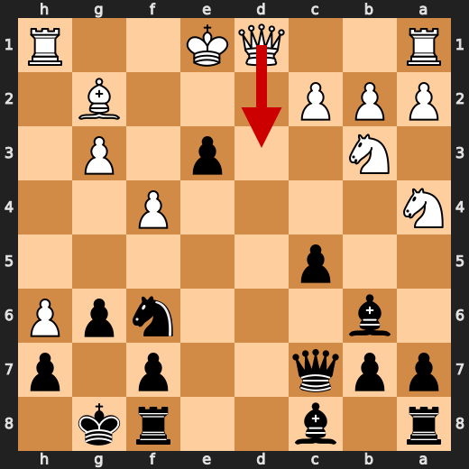

**After 17. O-O**

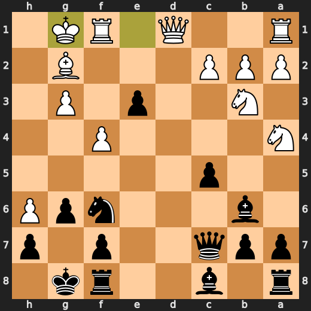

### ✅ Best: 23. Qg2 by CPU (White)

Qg2 was at or very near the engine’s preferred move, so it did not worsen White’s position. The useful pattern is to choose the move that best holds the position when no better improvement is available.

- **Eval:** -10.38 → -10.48
- **Preferred:** `Qg2`
- **Loss:** 10 cp

**Before 23. Qg2**

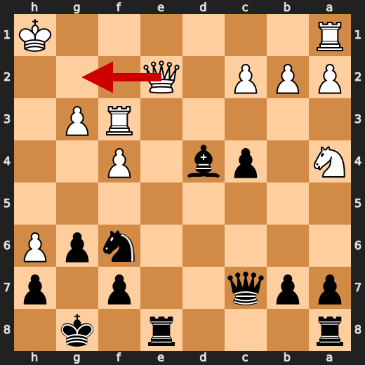

**After 23. Qg2**

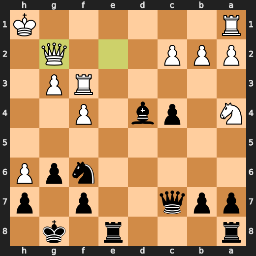

### ✅ Best: 29. Qxg2+ by You (Black)

Qxg2+ was at or very near Stockfish’s preferred move, so it kept Black’s winning position intact. Kf7 was the engine’s slight preference, but the played check is still a useful move that does not meaningfully worsen the position.

- **Eval:** -8.53 → -8.42
- **Preferred:** `Kf7`
- **Loss:** 11 cp

**Before 29. Qxg2+**

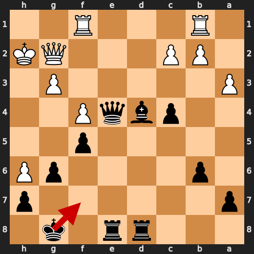

**After 29. Qxg2+**

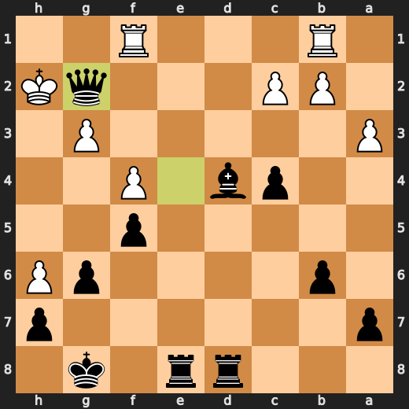

### 💀 Blunder: 38. Rgd1 by CPU (White)

Rgd1 failed to address Black’s decisive mating chances, and the position became lost by force. Kh4 was the preferred move because it gave White a better chance to keep resisting instead of allowing an immediate mate sequence.

- **Eval:** -11.46 → Black has mate
- **Preferred:** `Kh4`
- **Loss:** 98854 cp

**Before 38. Rgd1**

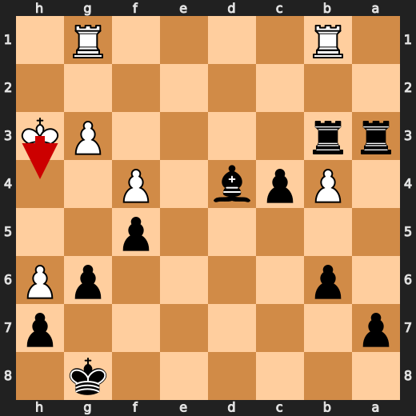

**After 38. Rgd1**

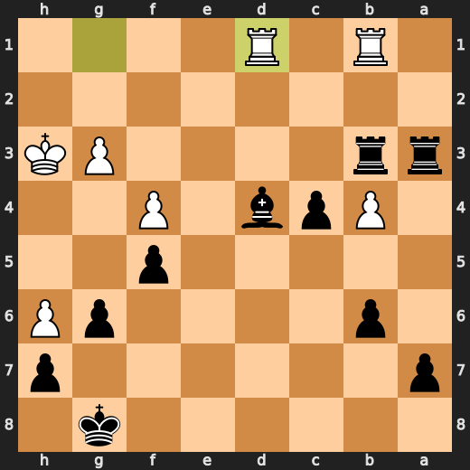

### 🏁 Checkmate: 43. Rf2# by You (Black)

Rf2# was the preferred move and a game-ending forcing move. The useful pattern is to choose the direct forcing move when the position already has a decisive finish.

- **Eval:** Black has mate → Black has mate
- **Preferred:** `Rf2#`
- **Loss:** 0 cp

**Before 43. Rf2#**

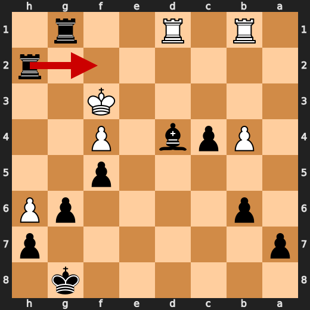

**After 43. Rf2#**

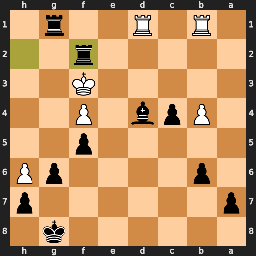

---

## Human Notes

Biggest caveman lesson: CPU (White) blew it with **38. Rgd1**.

There was another real screw-up at **9. Bd2** by **CPU (White)**.

The game-ending shot was **43. Rf2#** by **You (Black)**.

---

<details>
<summary>Compact move list</summary>

- 📖 **1. h4** (CPU (White), Book) — +0.46 → -0.63, preferred `d4`, loss 109 cp
- 📖 **1. d5** (You (Black), Book) — -0.60 → -0.50, preferred `d5`, loss 10 cp
- 📖 **2. h5** (CPU (White), Book) — -0.23 → -1.17, preferred `d4`, loss 94 cp
- 📖 **2. Nf6** (You (Black), Book) — -1.17 → -0.83, preferred `e5`, loss 34 cp
- 📖 **3. g3** (CPU (White), Book) — -0.78 → -1.40, preferred `d4`, loss 62 cp
- 📖 **3. e5** (You (Black), Book) — -1.41 → -1.34, preferred `h6`, loss 7 cp
- 🔥 **4. d4** (CPU (White), Great) — -1.20 → -1.60, preferred `h6`, loss 40 cp
- ✅ **4. exd4** (You (Black), Best) — -1.60 → -1.32, preferred `exd4`, loss 28 cp
- 👍 **5. Nf3** (CPU (White), Good) — -1.61 → -2.78, preferred `h6`, loss 117 cp
- ⚠️ **5. Bc5** (You (Black), Inaccuracy) — -2.86 → -0.91, preferred `h6`, loss 195 cp
- ✅ **6. h6** (CPU (White), Best) — -0.92 → -0.91, preferred `h6`, loss 0 cp
- 👍 **6. g6** (You (Black), Good) — -1.11 → -0.39, preferred `Nc6`, loss 72 cp
- 🔥 **7. Nxd4** (CPU (White), Great) — -0.73 → -1.05, preferred `Bg2`, loss 32 cp
- 🔥 **7. O-O** (You (Black), Great) — -0.96 → -0.67, preferred `O-O`, loss 29 cp
- 👍 **8. Nb3** (CPU (White), Good) — -0.68 → -1.45, preferred `Nc3`, loss 77 cp
- ⚠️ **8. Qd6** (You (Black), Inaccuracy) — -1.36 → +1.16, preferred `Bb6`, loss 252 cp
- ❌ **9. Bd2** (CPU (White), Mistake) — +1.02 → -4.30, preferred `Nxc5`, loss 532 cp
- ⚠️ **9. Bb6** (You (Black), Inaccuracy) — -3.96 → -1.41, preferred `Bxf2+`, loss 255 cp
- ✅ **10. Nc3** (CPU (White), Best) — -1.34 → -1.08, preferred `Nc3`, loss 0 cp
- ⚠️ **10. c5** (You (Black), Inaccuracy) — -1.53 → +0.36, preferred `Ng4`, loss 189 cp
- 🔥 **11. Bg5** (CPU (White), Great) — +0.22 → -0.16, preferred `Bf4`, loss 38 cp
- 🔥 **11. Nbd7** (You (Black), Great) — -0.28 → +0.00, preferred `Nbd7`, loss 28 cp
- 👍 **12. Bg2** (CPU (White), Good) — +0.21 → -0.42, preferred `Bg2`, loss 63 cp
- 🔥 **12. d4** (You (Black), Great) — -0.45 → -0.10, preferred `d4`, loss 35 cp
- 👍 **13. e3** (CPU (White), Good) — +0.16 → -0.74, preferred `a4`, loss 90 cp
- 👍 **13. Qe5** (You (Black), Good) — -0.51 → +0.39, preferred `Qe6`, loss 90 cp
- ❌ **14. Bxf6** (CPU (White), Mistake) — +0.24 → -4.70, preferred `Bf4`, loss 494 cp
- ✅ **14. Nxf6** (You (Black), Best) — -4.56 → -4.67, preferred `Nxf6`, loss 0 cp
- ✅ **15. Na4** (CPU (White), Best) — -4.64 → -3.70, preferred `Na4`, loss 0 cp
- ✅ **15. dxe3** (You (Black), Best) — -3.58 → -4.09, preferred `dxe3`, loss 0 cp
- 🔥 **16. f4** (CPU (White), Great) — -4.43 → -4.70, preferred `f4`, loss 27 cp
- ⚠️ **16. Qc7** (You (Black), Inaccuracy) — -4.89 → -2.73, preferred `Qe7`, loss 216 cp
- ❌ **17. O-O** (CPU (White), Mistake) — -2.70 → -7.99, preferred `Qd3`, loss 529 cp
- 🔥 **17. c4** (You (Black), Great) — -7.99 → -7.59, preferred `c4`, loss 40 cp
- 👍 **18. Nd4** (CPU (White), Good) — -7.75 → -8.36, preferred `Nxb6`, loss 61 cp
- ✅ **18. e2** (You (Black), Best) — -8.40 → -8.76, preferred `e2`, loss 0 cp
- 👍 **19. Qxe2** (CPU (White), Good) — -8.84 → -9.89, preferred `Qd2`, loss 105 cp
- ✅ **19. Bxd4+** (You (Black), Best) — -9.79 → -9.89, preferred `Bxd4+`, loss 0 cp
- ✅ **20. Kh1** (CPU (White), Best) — -10.02 → -9.89, preferred `Kh1`, loss 0 cp
- ✅ **20. Bg4** (You (Black), Best) — -9.82 → -10.01, preferred `Bg4`, loss 0 cp
- 🔥 **21. Bf3** (CPU (White), Great) — -9.71 → -10.15, preferred `Bf3`, loss 44 cp
- ⚠️ **21. Bxf3+** (You (Black), Inaccuracy) — -10.23 → -8.84, preferred `Rae8`, loss 139 cp
- ⚠️ **22. Rxf3** (CPU (White), Inaccuracy) — -9.00 → -11.38, preferred `Qxf3`, loss 238 cp
- ✅ **22. Rfe8** (You (Black), Best) — -10.61 → -10.84, preferred `Rfe8`, loss 0 cp
- ✅ **23. Qg2** (CPU (White), Best) — -10.38 → -10.48, preferred `Qg2`, loss 10 cp
- ⚠️ **23. Qc6** (You (Black), Inaccuracy) — -10.69 → -9.32, preferred `Ng4`, loss 137 cp
- 👍 **24. Nc3** (CPU (White), Good) — -9.84 → -10.96, preferred `c3`, loss 112 cp
- ⚠️ **24. Ne4** (You (Black), Inaccuracy) — -11.03 → -9.01, preferred `Ng4`, loss 202 cp
- 👍 **25. Nxe4** (CPU (White), Good) — -8.96 → -9.79, preferred `Rd1`, loss 83 cp
- ⚠️ **25. Qxe4** (You (Black), Inaccuracy) — -9.66 → -7.92, preferred `Rxe4`, loss 174 cp
- ⚠️ **26. Rb1** (CPU (White), Inaccuracy) — -7.93 → -9.32, preferred `Rff1`, loss 139 cp
- ⚠️ **26. f5** (You (Black), Inaccuracy) — -9.62 → -7.84, preferred `Qf5`, loss 178 cp
- 🔥 **27. a3** (CPU (White), Great) — -7.80 → -8.12, preferred `Rff1`, loss 32 cp
- 👍 **27. b6** (You (Black), Good) — -8.27 → -7.76, preferred `Qc6`, loss 51 cp
- 👍 **28. Kh2** (CPU (White), Good) — -7.76 → -8.29, preferred `Rff1`, loss 53 cp
- ✅ **28. Rad8** (You (Black), Best) — -8.11 → -8.08, preferred `Qe2`, loss 3 cp
- ✅ **29. Rff1** (CPU (White), Best) — -8.46 → -7.76, preferred `Rd1`, loss 0 cp
- ✅ **29. Qxg2+** (You (Black), Best) — -8.53 → -8.42, preferred `Kf7`, loss 11 cp
- ✅ **30. Kxg2** (CPU (White), Best) — -8.42 → -8.42, preferred `Kxg2`, loss 0 cp
- ✅ **30. Re2+** (You (Black), Best) — -8.49 → -8.42, preferred `Re2+`, loss 7 cp
- 🔥 **31. Kh3** (CPU (White), Great) — -8.23 → -8.71, preferred `Kh3`, loss 48 cp
- 👍 **31. Rxc2** (You (Black), Good) — -8.76 → -7.90, preferred `b5`, loss 86 cp
- ⚠️ **32. b4** (CPU (White), Inaccuracy) — -8.01 → -10.10, preferred `Rfc1`, loss 209 cp
- 👍 **32. Rc3** (You (Black), Good) — -10.46 → -9.38, preferred `Rd2`, loss 108 cp
- 👍 **33. Kh4** (CPU (White), Good) — -9.74 → -10.82, preferred `b5`, loss 108 cp
- 🔥 **33. Bf6+** (You (Black), Great) — -10.96 → -10.46, preferred `Rd3`, loss 50 cp
- 👍 **34. Kh3** (CPU (White), Good) — -10.43 → -10.98, preferred `Kh3`, loss 55 cp
- 🔥 **34. Rdd3** (You (Black), Great) — -10.84 → -10.56, preferred `Rcd3`, loss 28 cp
- ✅ **35. Rg1** (CPU (White), Best) — -10.76 → -10.65, preferred `Rg1`, loss 0 cp
- ✅ **35. Rxa3** (You (Black), Best) — -10.76 → -10.72, preferred `Rxa3`, loss 4 cp
- 🔥 **36. Rbe1** (CPU (White), Great) — -10.58 → -11.04, preferred `Rbe1`, loss 46 cp
- ⚠️ **36. Rdb3** (You (Black), Inaccuracy) — -11.15 → -9.36, preferred `Kf7`, loss 179 cp
- ⚠️ **37. Rb1** (CPU (White), Inaccuracy) — -9.61 → -10.92, preferred `Re8+`, loss 131 cp
- ✅ **37. Bd4** (You (Black), Best) — -11.07 → -11.23, preferred `Kf7`, loss 0 cp
- 💀 **38. Rgd1** (CPU (White), Blunder) — -11.46 → Black has mate, preferred `Kh4`, loss 98854 cp
- ✅ **38. Rxg3+** (You (Black), Best) — Black has mate → Black has mate, preferred `Rxg3+`, loss 0 cp
- ✅ **39. Kh2** (CPU (White), Best) — Black has mate → Black has mate, preferred `Kh2`, loss 0 cp
- ✅ **39. Rh3+** (You (Black), Best) — Black has mate → Black has mate, preferred `Rh3+`, loss 0 cp
- ✅ **40. Kg2** (CPU (White), Best) — Black has mate → Black has mate, preferred `Kg2`, loss 0 cp
- ✅ **40. Rag3+** (You (Black), Best) — Black has mate → Black has mate, preferred `Rag3+`, loss 0 cp
- ✅ **41. Kf1** (CPU (White), Best) — Black has mate → Black has mate, preferred `Kf1`, loss 0 cp
- ✅ **41. Rg1+** (You (Black), Best) — Black has mate → Black has mate, preferred `Rh1+`, loss 0 cp
- ✅ **42. Ke2** (CPU (White), Best) — Black has mate → Black has mate, preferred `Ke2`, loss 0 cp
- ✅ **42. Rh2+** (You (Black), Best) — Black has mate → Black has mate, preferred `Rh2+`, loss 0 cp
- ✅ **43. Kf3** (CPU (White), Best) — Black has mate → Black has mate, preferred `Kf3`, loss 0 cp
- 🏁 **43. Rf2#** (You (Black), Checkmate) — Black has mate → Black has mate, preferred `Rf2#`, loss 0 cp

</details>

---

<details>
<summary>Raw engine table</summary>

| Ply | Move | Actor | Played | Label | Eval Before | Eval After | Preferred | Loss |
|---:|---:|---|---|---|---:|---:|---|---:|
| 1 | 1 | CPU (White) | h4 | Book | +0.46 | -0.63 | d4 | 109 |
| 2 | 1 | You (Black) | d5 | Book | -0.60 | -0.50 | d5 | 10 |
| 3 | 2 | CPU (White) | h5 | Book | -0.23 | -1.17 | d4 | 94 |
| 4 | 2 | You (Black) | Nf6 | Book | -1.17 | -0.83 | e5 | 34 |
| 5 | 3 | CPU (White) | g3 | Book | -0.78 | -1.40 | d4 | 62 |
| 6 | 3 | You (Black) | e5 | Book | -1.41 | -1.34 | h6 | 7 |
| 7 | 4 | CPU (White) | d4 | Great | -1.20 | -1.60 | h6 | 40 |
| 8 | 4 | You (Black) | exd4 | Best | -1.60 | -1.32 | exd4 | 28 |
| 9 | 5 | CPU (White) | Nf3 | Good | -1.61 | -2.78 | h6 | 117 |
| 10 | 5 | You (Black) | Bc5 | Inaccuracy | -2.86 | -0.91 | h6 | 195 |
| 11 | 6 | CPU (White) | h6 | Best | -0.92 | -0.91 | h6 | 0 |
| 12 | 6 | You (Black) | g6 | Good | -1.11 | -0.39 | Nc6 | 72 |
| 13 | 7 | CPU (White) | Nxd4 | Great | -0.73 | -1.05 | Bg2 | 32 |
| 14 | 7 | You (Black) | O-O | Great | -0.96 | -0.67 | O-O | 29 |
| 15 | 8 | CPU (White) | Nb3 | Good | -0.68 | -1.45 | Nc3 | 77 |
| 16 | 8 | You (Black) | Qd6 | Inaccuracy | -1.36 | +1.16 | Bb6 | 252 |
| 17 | 9 | CPU (White) | Bd2 | Mistake | +1.02 | -4.30 | Nxc5 | 532 |
| 18 | 9 | You (Black) | Bb6 | Inaccuracy | -3.96 | -1.41 | Bxf2+ | 255 |
| 19 | 10 | CPU (White) | Nc3 | Best | -1.34 | -1.08 | Nc3 | 0 |
| 20 | 10 | You (Black) | c5 | Inaccuracy | -1.53 | +0.36 | Ng4 | 189 |
| 21 | 11 | CPU (White) | Bg5 | Great | +0.22 | -0.16 | Bf4 | 38 |
| 22 | 11 | You (Black) | Nbd7 | Great | -0.28 | +0.00 | Nbd7 | 28 |
| 23 | 12 | CPU (White) | Bg2 | Good | +0.21 | -0.42 | Bg2 | 63 |
| 24 | 12 | You (Black) | d4 | Great | -0.45 | -0.10 | d4 | 35 |
| 25 | 13 | CPU (White) | e3 | Good | +0.16 | -0.74 | a4 | 90 |
| 26 | 13 | You (Black) | Qe5 | Good | -0.51 | +0.39 | Qe6 | 90 |
| 27 | 14 | CPU (White) | Bxf6 | Mistake | +0.24 | -4.70 | Bf4 | 494 |
| 28 | 14 | You (Black) | Nxf6 | Best | -4.56 | -4.67 | Nxf6 | 0 |
| 29 | 15 | CPU (White) | Na4 | Best | -4.64 | -3.70 | Na4 | 0 |
| 30 | 15 | You (Black) | dxe3 | Best | -3.58 | -4.09 | dxe3 | 0 |
| 31 | 16 | CPU (White) | f4 | Great | -4.43 | -4.70 | f4 | 27 |
| 32 | 16 | You (Black) | Qc7 | Inaccuracy | -4.89 | -2.73 | Qe7 | 216 |
| 33 | 17 | CPU (White) | O-O | Mistake | -2.70 | -7.99 | Qd3 | 529 |
| 34 | 17 | You (Black) | c4 | Great | -7.99 | -7.59 | c4 | 40 |
| 35 | 18 | CPU (White) | Nd4 | Good | -7.75 | -8.36 | Nxb6 | 61 |
| 36 | 18 | You (Black) | e2 | Best | -8.40 | -8.76 | e2 | 0 |
| 37 | 19 | CPU (White) | Qxe2 | Good | -8.84 | -9.89 | Qd2 | 105 |
| 38 | 19 | You (Black) | Bxd4+ | Best | -9.79 | -9.89 | Bxd4+ | 0 |
| 39 | 20 | CPU (White) | Kh1 | Best | -10.02 | -9.89 | Kh1 | 0 |
| 40 | 20 | You (Black) | Bg4 | Best | -9.82 | -10.01 | Bg4 | 0 |
| 41 | 21 | CPU (White) | Bf3 | Great | -9.71 | -10.15 | Bf3 | 44 |
| 42 | 21 | You (Black) | Bxf3+ | Inaccuracy | -10.23 | -8.84 | Rae8 | 139 |
| 43 | 22 | CPU (White) | Rxf3 | Inaccuracy | -9.00 | -11.38 | Qxf3 | 238 |
| 44 | 22 | You (Black) | Rfe8 | Best | -10.61 | -10.84 | Rfe8 | 0 |
| 45 | 23 | CPU (White) | Qg2 | Best | -10.38 | -10.48 | Qg2 | 10 |
| 46 | 23 | You (Black) | Qc6 | Inaccuracy | -10.69 | -9.32 | Ng4 | 137 |
| 47 | 24 | CPU (White) | Nc3 | Good | -9.84 | -10.96 | c3 | 112 |
| 48 | 24 | You (Black) | Ne4 | Inaccuracy | -11.03 | -9.01 | Ng4 | 202 |
| 49 | 25 | CPU (White) | Nxe4 | Good | -8.96 | -9.79 | Rd1 | 83 |
| 50 | 25 | You (Black) | Qxe4 | Inaccuracy | -9.66 | -7.92 | Rxe4 | 174 |
| 51 | 26 | CPU (White) | Rb1 | Inaccuracy | -7.93 | -9.32 | Rff1 | 139 |
| 52 | 26 | You (Black) | f5 | Inaccuracy | -9.62 | -7.84 | Qf5 | 178 |
| 53 | 27 | CPU (White) | a3 | Great | -7.80 | -8.12 | Rff1 | 32 |
| 54 | 27 | You (Black) | b6 | Good | -8.27 | -7.76 | Qc6 | 51 |
| 55 | 28 | CPU (White) | Kh2 | Good | -7.76 | -8.29 | Rff1 | 53 |
| 56 | 28 | You (Black) | Rad8 | Best | -8.11 | -8.08 | Qe2 | 3 |
| 57 | 29 | CPU (White) | Rff1 | Best | -8.46 | -7.76 | Rd1 | 0 |
| 58 | 29 | You (Black) | Qxg2+ | Best | -8.53 | -8.42 | Kf7 | 11 |
| 59 | 30 | CPU (White) | Kxg2 | Best | -8.42 | -8.42 | Kxg2 | 0 |
| 60 | 30 | You (Black) | Re2+ | Best | -8.49 | -8.42 | Re2+ | 7 |
| 61 | 31 | CPU (White) | Kh3 | Great | -8.23 | -8.71 | Kh3 | 48 |
| 62 | 31 | You (Black) | Rxc2 | Good | -8.76 | -7.90 | b5 | 86 |
| 63 | 32 | CPU (White) | b4 | Inaccuracy | -8.01 | -10.10 | Rfc1 | 209 |
| 64 | 32 | You (Black) | Rc3 | Good | -10.46 | -9.38 | Rd2 | 108 |
| 65 | 33 | CPU (White) | Kh4 | Good | -9.74 | -10.82 | b5 | 108 |
| 66 | 33 | You (Black) | Bf6+ | Great | -10.96 | -10.46 | Rd3 | 50 |
| 67 | 34 | CPU (White) | Kh3 | Good | -10.43 | -10.98 | Kh3 | 55 |
| 68 | 34 | You (Black) | Rdd3 | Great | -10.84 | -10.56 | Rcd3 | 28 |
| 69 | 35 | CPU (White) | Rg1 | Best | -10.76 | -10.65 | Rg1 | 0 |
| 70 | 35 | You (Black) | Rxa3 | Best | -10.76 | -10.72 | Rxa3 | 4 |
| 71 | 36 | CPU (White) | Rbe1 | Great | -10.58 | -11.04 | Rbe1 | 46 |
| 72 | 36 | You (Black) | Rdb3 | Inaccuracy | -11.15 | -9.36 | Kf7 | 179 |
| 73 | 37 | CPU (White) | Rb1 | Inaccuracy | -9.61 | -10.92 | Re8+ | 131 |
| 74 | 37 | You (Black) | Bd4 | Best | -11.07 | -11.23 | Kf7 | 0 |
| 75 | 38 | CPU (White) | Rgd1 | Blunder | -11.46 | Black has mate | Kh4 | 98854 |
| 76 | 38 | You (Black) | Rxg3+ | Best | Black has mate | Black has mate | Rxg3+ | 0 |
| 77 | 39 | CPU (White) | Kh2 | Best | Black has mate | Black has mate | Kh2 | 0 |
| 78 | 39 | You (Black) | Rh3+ | Best | Black has mate | Black has mate | Rh3+ | 0 |
| 79 | 40 | CPU (White) | Kg2 | Best | Black has mate | Black has mate | Kg2 | 0 |
| 80 | 40 | You (Black) | Rag3+ | Best | Black has mate | Black has mate | Rag3+ | 0 |
| 81 | 41 | CPU (White) | Kf1 | Best | Black has mate | Black has mate | Kf1 | 0 |
| 82 | 41 | You (Black) | Rg1+ | Best | Black has mate | Black has mate | Rh1+ | 0 |
| 83 | 42 | CPU (White) | Ke2 | Best | Black has mate | Black has mate | Ke2 | 0 |
| 84 | 42 | You (Black) | Rh2+ | Best | Black has mate | Black has mate | Rh2+ | 0 |
| 85 | 43 | CPU (White) | Kf3 | Best | Black has mate | Black has mate | Kf3 | 0 |
| 86 | 43 | You (Black) | Rf2# | Checkmate | Black has mate | Black has mate | Rf2# | 0 |

</details>

---

<details>
<summary>Clean PGN</summary>

```pgn
[Event "AI Factory's Chess"]
[Site "Android Device"]
[Date "2026.05.31"]
[Round "1"]
[White "CPU (5)"]
[Black "You"]
[Result "0-1"]
[PlyCount "86"]

1. h4 d5 2. h5 Nf6 3. g3 e5 4. d4 exd4 5. Nf3 Bc5 6. h6 g6 7. Nxd4 O-O 8. Nb3
Qd6 9. Bd2 Bb6 10. Nc3 c5 11. Bg5 Nbd7 12. Bg2 d4 13. e3 Qe5 14. Bxf6 Nxf6 15.
Na4 dxe3 16. f4 Qc7 17. O-O c4 18. Nd4 e2 19. Qxe2 Bxd4+ 20. Kh1 Bg4 21. Bf3
Bxf3+ 22. Rxf3 Rfe8 23. Qg2 Qc6 24. Nc3 Ne4 25. Nxe4 Qxe4 26. Rb1 f5 27. a3 b6
28. Kh2 Rad8 29. Rff1 Qxg2+ 30. Kxg2 Re2+ 31. Kh3 Rxc2 32. b4 Rc3 33. Kh4 Bf6+
34. Kh3 Rdd3 35. Rg1 Rxa3 36. Rbe1 Rdb3 37. Rb1 Bd4 38. Rgd1 Rxg3+ 39. Kh2 Rh3+
40. Kg2 Rag3+ 41. Kf1 Rg1+ 42. Ke2 Rh2+ 43. Kf3 Rf2# 0-1
```

</details>
