# You (Black) vs CPU (White)

**Result:** 0-1  
**Date:** 2026.05.31  
**Source:** `PGN_2026_05_31_13h34_7ce2f0956ee5.pgn`  
**Engine:** Stockfish depth 14  
**Your side:** Black  
**Computer side:** White  
**Board perspective:** Your perspective

---

## Who Is Who

- **You:** You (Black)
- **Computer:** CPU (5) (White)

---

## Toaster Summary

**Game Story:** The game began as a King’s Indian Defense, and Black won because White’s queen-side and king-safety mistakes after 22 Qe2, 27 Qb5, 28 b4, and 29 Qd3 let your attack take over. Your 30...cxb4 was a sloppy conversion because 30...Qd7+ was stronger, but it did not give up the win. White’s 31 axb4 made the defense collapse further, and you finished the attack with 39...Qh2#. Learn to look for forcing checks when mate is available, even in positions you are already winning.

Biggest toaster scream: **30. cxb4** by **You (Black)**.

- **Label:** 💀 **Blunder**
- **Eval:** Black has mate → -20.48
- **Stockfish preferred:** `Qd7+`
- **Loss:** 97952 cp

Final move recorded: **39. Qh2#** by **You (Black)**.

- 💀 Your blunders: **1**
- ❌ Your mistakes: **0**
- ⚠️ Your inaccuracies: **4**
- ✅ Your best moves called out: **18**

---

## Final Position

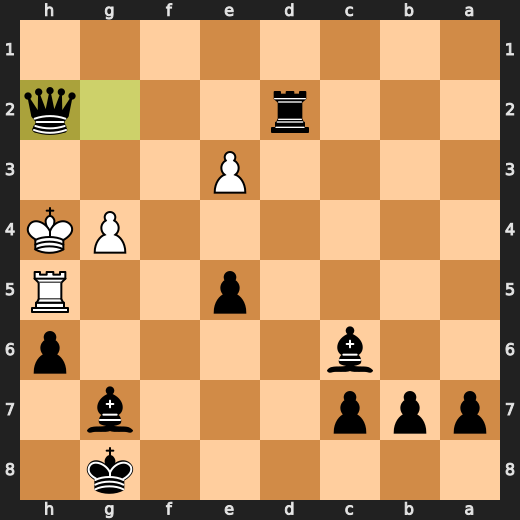

---

## Key Moments

### ✅ Best: 17. Nxd3 by You (Black)

Nxd3 was the preferred move, so it kept Black’s position strong with a forcing engine-approved choice. Learn to trust forcing captures when they are supported by the position rather than switching to a quieter move.

- **Eval:** -1.66 → -1.50
- **Preferred:** `Nxd3`
- **Loss:** 16 cp

**Before 17. Nxd3**

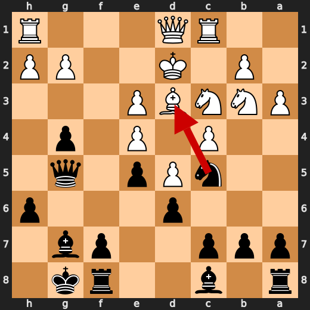

**After 17. Nxd3**

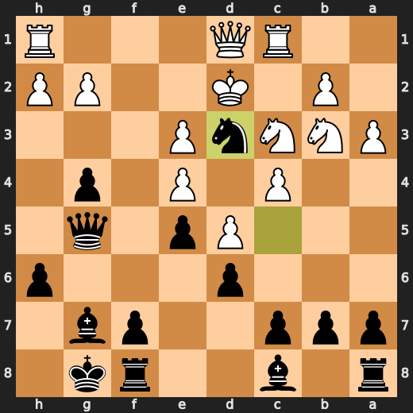

### ❌ Mistake: 22. Qe2 by CPU (White)

Qe2 missed the chance to improve White’s position with Kxc2. The move significantly worsened the position, so the practical lesson is to address the most urgent concrete problem before making a quieter queen move.

- **Eval:** -4.05 → -8.27
- **Preferred:** `Kxc2`
- **Loss:** 422 cp

**Before 22. Qe2**

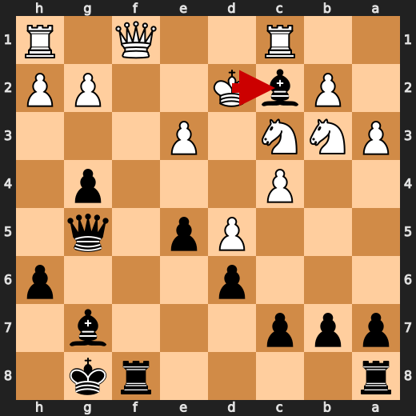

**After 22. Qe2**

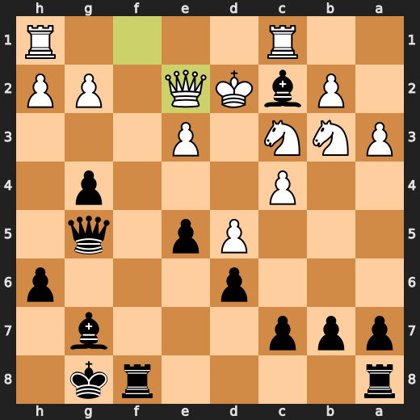

### ❌ Mistake: 27. Qb5 by CPU (White)

Qb5 failed to improve White’s position as much as the preferred Rg1. The position became significantly worse after the queen move, so the lesson is to choose the move that best limits the damage when already under pressure.

- **Eval:** -7.30 → -10.76
- **Preferred:** `Rg1`
- **Loss:** 346 cp

**Before 27. Qb5**

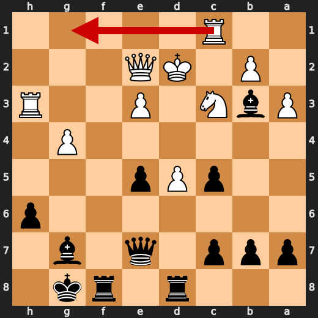

**After 27. Qb5**

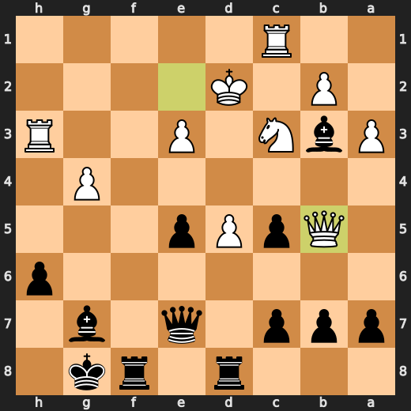

### 💀 Blunder: 28. b4 by CPU (White)

b4 failed to improve White’s difficult position and caused a major evaluation drop. Nxd5 was preferred because it would have made a more forcing, practical attempt to contest the position.

- **Eval:** -8.83 → -16.53
- **Preferred:** `Nxd5`
- **Loss:** 770 cp

**Before 28. b4**

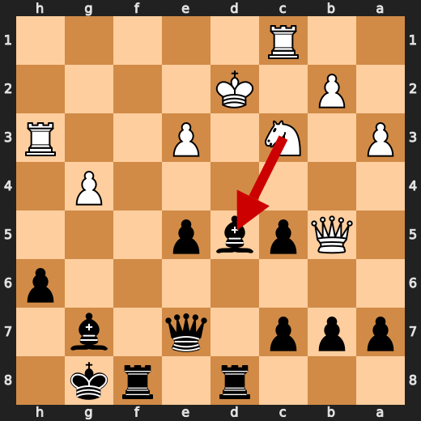

**After 28. b4**

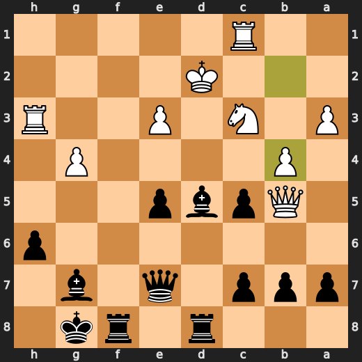

### 💀 Blunder: 29. Qd3 by CPU (White)

Qd3 worsened White’s position significantly without solving the main defensive problems. Kc2 was preferred as the more practical way to improve White’s king safety in a losing position.

- **Eval:** -19.53 → -75.75
- **Preferred:** `Kc2`
- **Loss:** 5622 cp

**Before 29. Qd3**

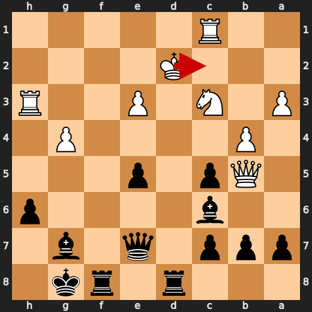

**After 29. Qd3**

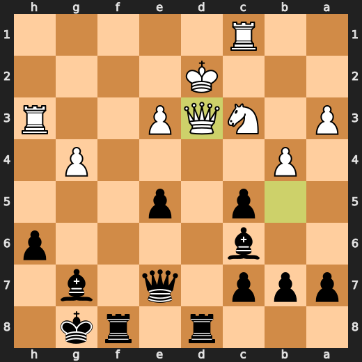

### 💀 Blunder: 30. cxb4 by You (Black)

cxb4 failed to use Black’s decisive checking chance, letting the position worsen instead of forcing the strongest continuation. Qd7+ was preferred because it keeps the attack immediate when Black had a mating position.

- **Eval:** Black has mate → -20.48
- **Preferred:** `Qd7+`
- **Loss:** 97952 cp

**Before 30. cxb4**

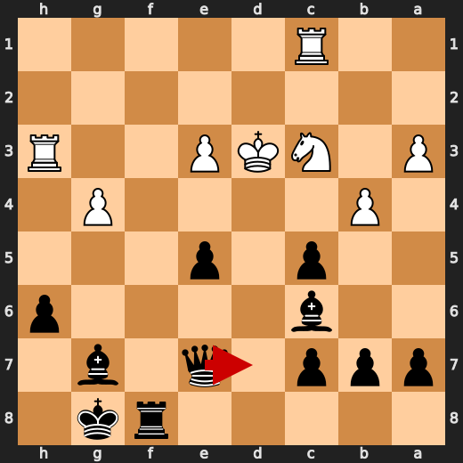

**After 30. cxb4**

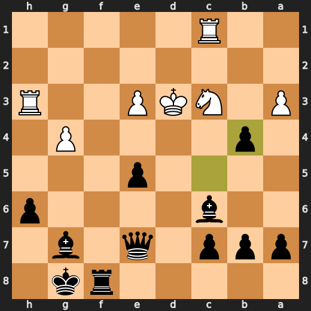

### 💀 Blunder: 31. axb4 by CPU (White)

axb4 did not address White’s bigger defensive needs and made the position much worse. Rf3 was preferred as a more resilient way to hold the position together.

- **Eval:** -17.46 → -74.74
- **Preferred:** `Rf3`
- **Loss:** 5728 cp

**Before 31. axb4**

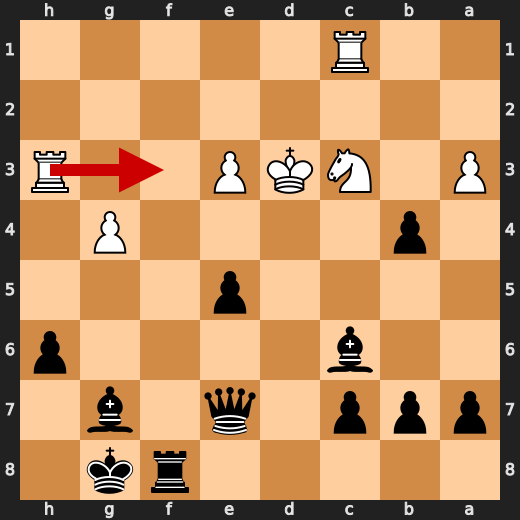

**After 31. axb4**

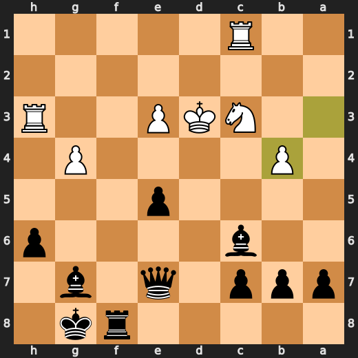

### 🏁 Checkmate: 39. Qh2# by You (Black)

Qh2# was the preferred move and a game-ending forcing move. The useful pattern is to choose the immediate forcing finish when the position already contains mate.

- **Eval:** Black has mate → Black has mate
- **Preferred:** `Qh2#`
- **Loss:** 0 cp

**Before 39. Qh2#**

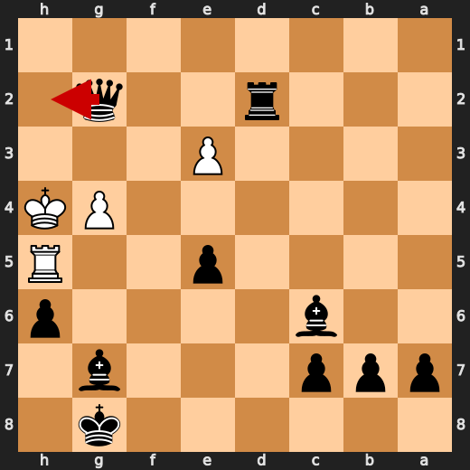

**After 39. Qh2#**


---

## Human Notes

Biggest caveman lesson: CPU (White) blew it with **28. b4**.

There was another real screw-up at **22. Qe2** by **CPU (White)**.

The game-ending shot was **39. Qh2#** by **You (Black)**.

---

<details>
<summary>Compact move list</summary>

- 📖 **1. d4** (CPU (White), Book) — +0.46 → +0.39, preferred `d4`, loss 7 cp
- 📖 **1. Nf6** (You (Black), Book) — +0.44 → +0.57, preferred `Nf6`, loss 13 cp
- 📖 **2. c4** (CPU (White), Book) — +0.47 → +0.39, preferred `c4`, loss 8 cp
- 📖 **2. g6** (You (Black), Book) — +0.39 → +0.57, preferred `e6`, loss 18 cp
- 📖 **3. Nc3** (CPU (White), Book) — +0.62 → +0.50, preferred `Nc3`, loss 12 cp
- 📖 **3. d6** (You (Black), Book) — +0.27 → +0.89, preferred `d5`, loss 62 cp
- ✅ **4. Nf3** (CPU (White), Best) — +0.71 → +0.74, preferred `e4`, loss 0 cp
- ✅ **4. Bg7** (You (Black), Best) — +0.75 → +0.77, preferred `Bg7`, loss 2 cp
- ✅ **5. e4** (CPU (White), Best) — +0.69 → +0.88, preferred `e4`, loss 0 cp
- ✅ **5. O-O** (You (Black), Best) — +0.86 → +0.93, preferred `O-O`, loss 7 cp
- 🔥 **6. Be2** (CPU (White), Great) — +0.97 → +0.69, preferred `Be2`, loss 28 cp
- 🔥 **6. Nc6** (You (Black), Great) — +0.76 → +1.26, preferred `e5`, loss 50 cp
- ✅ **7. d5** (CPU (White), Best) — +1.22 → +1.25, preferred `d5`, loss 0 cp
- ✅ **7. Nb4** (You (Black), Best) — +1.19 → +1.33, preferred `Nb4`, loss 14 cp
- 🔥 **8. a3** (CPU (White), Great) — +1.27 → +0.91, preferred `O-O`, loss 36 cp
- ✅ **8. Na6** (You (Black), Best) — +0.98 → +0.95, preferred `Na6`, loss 0 cp
- 🔥 **9. Bg5** (CPU (White), Great) — +0.95 → +0.51, preferred `Qc2`, loss 44 cp
- ✅ **9. Nc5** (You (Black), Best) — +0.50 → +0.63, preferred `Nc5`, loss 13 cp
- 👍 **10. Bd3** (CPU (White), Good) — +0.66 → -0.10, preferred `Nd2`, loss 76 cp
- 👍 **10. Ng4** (You (Black), Good) — -0.12 → +0.45, preferred `e6`, loss 57 cp
- 🔥 **11. Rc1** (CPU (White), Great) — +0.61 → +0.24, preferred `Bc2`, loss 37 cp
- ✅ **11. h6** (You (Black), Best) — +0.00 → +0.10, preferred `h6`, loss 10 cp
- ⚠️ **12. Bf4** (CPU (White), Inaccuracy) — +0.12 → -1.23, preferred `Bh4`, loss 135 cp
- ⚠️ **12. g5** (You (Black), Inaccuracy) — -1.18 → +0.12, preferred `e5`, loss 130 cp
- ⚠️ **13. Be3** (CPU (White), Inaccuracy) — +0.13 → -1.30, preferred `Bg3`, loss 143 cp
- 🔥 **13. Nxe3** (You (Black), Great) — -1.24 → -0.88, preferred `Nxe3`, loss 36 cp
- ✅ **14. fxe3** (CPU (White), Best) — -1.11 → -0.92, preferred `fxe3`, loss 0 cp
- 🔥 **14. g4** (You (Black), Great) — -1.23 → -1.03, preferred `g4`, loss 20 cp
- 🔥 **15. Nd4** (CPU (White), Great) — -1.02 → -1.41, preferred `Nh4`, loss 39 cp
- ✅ **15. e5** (You (Black), Best) — -1.32 → -1.21, preferred `e5`, loss 11 cp
- 🔥 **16. Nb3** (CPU (White), Great) — -1.19 → -1.44, preferred `Nde2`, loss 25 cp
- 🔥 **16. Qg5** (You (Black), Great) — -1.56 → -1.40, preferred `Qg5`, loss 16 cp
- 🔥 **17. Kd2** (CPU (White), Great) — -1.46 → -1.62, preferred `Ke2`, loss 16 cp
- ✅ **17. Nxd3** (You (Black), Best) — -1.66 → -1.50, preferred `Nxd3`, loss 16 cp
- ✅ **18. Kxd3** (CPU (White), Best) — -1.76 → -1.78, preferred `Kxd3`, loss 2 cp
- 👍 **18. Bd7** (You (Black), Good) — -1.82 → -1.12, preferred `f5`, loss 70 cp
- 👍 **19. Qf1** (CPU (White), Good) — -1.26 → -1.99, preferred `Qe2`, loss 73 cp
- ✅ **19. f5** (You (Black), Best) — -2.00 → -2.38, preferred `f5`, loss 0 cp
- 🔥 **20. exf5** (CPU (White), Great) — -2.01 → -2.42, preferred `Qe2`, loss 41 cp
- 👍 **20. Bxf5+** (You (Black), Good) — -2.44 → -1.38, preferred `b5`, loss 106 cp
- ⚠️ **21. Kd2** (CPU (White), Inaccuracy) — -1.44 → -4.11, preferred `e4`, loss 267 cp
- 🔥 **21. Bc2** (You (Black), Great) — -4.02 → -3.62, preferred `Bc2`, loss 40 cp
- ❌ **22. Qe2** (CPU (White), Mistake) — -4.05 → -8.27, preferred `Kxc2`, loss 422 cp
- 👍 **22. Bxb3** (You (Black), Good) — -7.99 → -7.46, preferred `Bxb3`, loss 53 cp
- ⚠️ **23. c5** (CPU (White), Inaccuracy) — -7.76 → -9.05, preferred `Rhf1`, loss 129 cp
- 🔥 **23. dxc5** (You (Black), Great) — -9.05 → -8.76, preferred `e4`, loss 29 cp
- ✅ **24. h4** (CPU (White), Best) — -8.84 → -8.90, preferred `h4`, loss 6 cp
- ⚠️ **24. gxh3** (You (Black), Inaccuracy) — -8.84 → -7.21, preferred `Qg6`, loss 163 cp
- ⚠️ **25. Rxh3** (CPU (White), Inaccuracy) — -7.07 → -9.49, preferred `gxh3`, loss 242 cp
- 🔥 **25. Rad8** (You (Black), Great) — -9.07 → -8.65, preferred `Rf7`, loss 42 cp
- 🔥 **26. g4** (CPU (White), Great) — -8.87 → -9.15, preferred `g4`, loss 28 cp
- ⚠️ **26. Qe7** (You (Black), Inaccuracy) — -9.49 → -7.53, preferred `b5`, loss 196 cp
- ❌ **27. Qb5** (CPU (White), Mistake) — -7.30 → -10.76, preferred `Rg1`, loss 346 cp
- ⚠️ **27. Bxd5** (You (Black), Inaccuracy) — -10.92 → -9.59, preferred `c4`, loss 133 cp
- 💀 **28. b4** (CPU (White), Blunder) — -8.83 → -16.53, preferred `Nxd5`, loss 770 cp
- 🔥 **28. Bc6+** (You (Black), Great) — -17.89 → -17.61, preferred `Bc4+`, loss 28 cp
- 💀 **29. Qd3** (CPU (White), Blunder) — -19.53 → -75.75, preferred `Kc2`, loss 5622 cp
- ✅ **29. Rxd3+** (You (Black), Best) — -26.30 → Black has mate, preferred `Rxd3+`, loss 0 cp
- ✅ **30. Kxd3** (CPU (White), Best) — Black has mate → Black has mate, preferred `Kxd3`, loss 0 cp
- 💀 **30. cxb4** (You (Black), Blunder) — Black has mate → -20.48, preferred `Qd7+`, loss 97952 cp
- 💀 **31. axb4** (CPU (White), Blunder) — -17.46 → -74.74, preferred `Rf3`, loss 5728 cp
- ✅ **31. Qxb4** (You (Black), Best) — Black has mate → Black has mate, preferred `Rf2`, loss 0 cp
- ✅ **32. Rh4** (CPU (White), Best) — Black has mate → Black has mate, preferred `Rf3`, loss 0 cp
- ✅ **32. Rd8+** (You (Black), Best) — Black has mate → Black has mate, preferred `Rf2`, loss 0 cp
- ✅ **33. Ke2** (CPU (White), Best) — Black has mate → Black has mate, preferred `Nd5`, loss 0 cp
- ✅ **33. Qb2+** (You (Black), Best) — Black has mate → Black has mate, preferred `Qb2+`, loss 0 cp
- ✅ **34. Kf1** (CPU (White), Best) — Black has mate → Black has mate, preferred `Rc2`, loss 0 cp
- ✅ **34. Qxc1+** (You (Black), Best) — Black has mate → Black has mate, preferred `Rf8+`, loss 0 cp
- ✅ **35. Kf2** (CPU (White), Best) — Black has mate → Black has mate, preferred `Kf2`, loss 0 cp
- ✅ **35. Rd2+** (You (Black), Best) — Black has mate → Black has mate, preferred `Qd2+`, loss 0 cp
- ✅ **36. Ne2** (CPU (White), Best) — Black has mate → Black has mate, preferred `Ne2`, loss 0 cp
- ✅ **36. Qc4** (You (Black), Best) — Black has mate → Black has mate, preferred `Qc4`, loss 0 cp
- ✅ **37. Rh5** (CPU (White), Best) — Black has mate → Black has mate, preferred `Kg3`, loss 0 cp
- ✅ **37. Qxe2+** (You (Black), Best) — Black has mate → Black has mate, preferred `Qxe2+`, loss 0 cp
- ✅ **38. Kg3** (CPU (White), Best) — Black has mate → Black has mate, preferred `Kg3`, loss 0 cp
- ✅ **38. Qg2+** (You (Black), Best) — Black has mate → Black has mate, preferred `Qg2+`, loss 0 cp
- ✅ **39. Kh4** (CPU (White), Best) — Black has mate → Black has mate, preferred `Kh4`, loss 0 cp
- 🏁 **39. Qh2#** (You (Black), Checkmate) — Black has mate → Black has mate, preferred `Qh2#`, loss 0 cp

</details>

---

<details>
<summary>Raw engine table</summary>

| Ply | Move | Actor | Played | Label | Eval Before | Eval After | Preferred | Loss |
|---:|---:|---|---|---|---:|---:|---|---:|
| 1 | 1 | CPU (White) | d4 | Book | +0.46 | +0.39 | d4 | 7 |
| 2 | 1 | You (Black) | Nf6 | Book | +0.44 | +0.57 | Nf6 | 13 |
| 3 | 2 | CPU (White) | c4 | Book | +0.47 | +0.39 | c4 | 8 |
| 4 | 2 | You (Black) | g6 | Book | +0.39 | +0.57 | e6 | 18 |
| 5 | 3 | CPU (White) | Nc3 | Book | +0.62 | +0.50 | Nc3 | 12 |
| 6 | 3 | You (Black) | d6 | Book | +0.27 | +0.89 | d5 | 62 |
| 7 | 4 | CPU (White) | Nf3 | Best | +0.71 | +0.74 | e4 | 0 |
| 8 | 4 | You (Black) | Bg7 | Best | +0.75 | +0.77 | Bg7 | 2 |
| 9 | 5 | CPU (White) | e4 | Best | +0.69 | +0.88 | e4 | 0 |
| 10 | 5 | You (Black) | O-O | Best | +0.86 | +0.93 | O-O | 7 |
| 11 | 6 | CPU (White) | Be2 | Great | +0.97 | +0.69 | Be2 | 28 |
| 12 | 6 | You (Black) | Nc6 | Great | +0.76 | +1.26 | e5 | 50 |
| 13 | 7 | CPU (White) | d5 | Best | +1.22 | +1.25 | d5 | 0 |
| 14 | 7 | You (Black) | Nb4 | Best | +1.19 | +1.33 | Nb4 | 14 |
| 15 | 8 | CPU (White) | a3 | Great | +1.27 | +0.91 | O-O | 36 |
| 16 | 8 | You (Black) | Na6 | Best | +0.98 | +0.95 | Na6 | 0 |
| 17 | 9 | CPU (White) | Bg5 | Great | +0.95 | +0.51 | Qc2 | 44 |
| 18 | 9 | You (Black) | Nc5 | Best | +0.50 | +0.63 | Nc5 | 13 |
| 19 | 10 | CPU (White) | Bd3 | Good | +0.66 | -0.10 | Nd2 | 76 |
| 20 | 10 | You (Black) | Ng4 | Good | -0.12 | +0.45 | e6 | 57 |
| 21 | 11 | CPU (White) | Rc1 | Great | +0.61 | +0.24 | Bc2 | 37 |
| 22 | 11 | You (Black) | h6 | Best | +0.00 | +0.10 | h6 | 10 |
| 23 | 12 | CPU (White) | Bf4 | Inaccuracy | +0.12 | -1.23 | Bh4 | 135 |
| 24 | 12 | You (Black) | g5 | Inaccuracy | -1.18 | +0.12 | e5 | 130 |
| 25 | 13 | CPU (White) | Be3 | Inaccuracy | +0.13 | -1.30 | Bg3 | 143 |
| 26 | 13 | You (Black) | Nxe3 | Great | -1.24 | -0.88 | Nxe3 | 36 |
| 27 | 14 | CPU (White) | fxe3 | Best | -1.11 | -0.92 | fxe3 | 0 |
| 28 | 14 | You (Black) | g4 | Great | -1.23 | -1.03 | g4 | 20 |
| 29 | 15 | CPU (White) | Nd4 | Great | -1.02 | -1.41 | Nh4 | 39 |
| 30 | 15 | You (Black) | e5 | Best | -1.32 | -1.21 | e5 | 11 |
| 31 | 16 | CPU (White) | Nb3 | Great | -1.19 | -1.44 | Nde2 | 25 |
| 32 | 16 | You (Black) | Qg5 | Great | -1.56 | -1.40 | Qg5 | 16 |
| 33 | 17 | CPU (White) | Kd2 | Great | -1.46 | -1.62 | Ke2 | 16 |
| 34 | 17 | You (Black) | Nxd3 | Best | -1.66 | -1.50 | Nxd3 | 16 |
| 35 | 18 | CPU (White) | Kxd3 | Best | -1.76 | -1.78 | Kxd3 | 2 |
| 36 | 18 | You (Black) | Bd7 | Good | -1.82 | -1.12 | f5 | 70 |
| 37 | 19 | CPU (White) | Qf1 | Good | -1.26 | -1.99 | Qe2 | 73 |
| 38 | 19 | You (Black) | f5 | Best | -2.00 | -2.38 | f5 | 0 |
| 39 | 20 | CPU (White) | exf5 | Great | -2.01 | -2.42 | Qe2 | 41 |
| 40 | 20 | You (Black) | Bxf5+ | Good | -2.44 | -1.38 | b5 | 106 |
| 41 | 21 | CPU (White) | Kd2 | Inaccuracy | -1.44 | -4.11 | e4 | 267 |
| 42 | 21 | You (Black) | Bc2 | Great | -4.02 | -3.62 | Bc2 | 40 |
| 43 | 22 | CPU (White) | Qe2 | Mistake | -4.05 | -8.27 | Kxc2 | 422 |
| 44 | 22 | You (Black) | Bxb3 | Good | -7.99 | -7.46 | Bxb3 | 53 |
| 45 | 23 | CPU (White) | c5 | Inaccuracy | -7.76 | -9.05 | Rhf1 | 129 |
| 46 | 23 | You (Black) | dxc5 | Great | -9.05 | -8.76 | e4 | 29 |
| 47 | 24 | CPU (White) | h4 | Best | -8.84 | -8.90 | h4 | 6 |
| 48 | 24 | You (Black) | gxh3 | Inaccuracy | -8.84 | -7.21 | Qg6 | 163 |
| 49 | 25 | CPU (White) | Rxh3 | Inaccuracy | -7.07 | -9.49 | gxh3 | 242 |
| 50 | 25 | You (Black) | Rad8 | Great | -9.07 | -8.65 | Rf7 | 42 |
| 51 | 26 | CPU (White) | g4 | Great | -8.87 | -9.15 | g4 | 28 |
| 52 | 26 | You (Black) | Qe7 | Inaccuracy | -9.49 | -7.53 | b5 | 196 |
| 53 | 27 | CPU (White) | Qb5 | Mistake | -7.30 | -10.76 | Rg1 | 346 |
| 54 | 27 | You (Black) | Bxd5 | Inaccuracy | -10.92 | -9.59 | c4 | 133 |
| 55 | 28 | CPU (White) | b4 | Blunder | -8.83 | -16.53 | Nxd5 | 770 |
| 56 | 28 | You (Black) | Bc6+ | Great | -17.89 | -17.61 | Bc4+ | 28 |
| 57 | 29 | CPU (White) | Qd3 | Blunder | -19.53 | -75.75 | Kc2 | 5622 |
| 58 | 29 | You (Black) | Rxd3+ | Best | -26.30 | Black has mate | Rxd3+ | 0 |
| 59 | 30 | CPU (White) | Kxd3 | Best | Black has mate | Black has mate | Kxd3 | 0 |
| 60 | 30 | You (Black) | cxb4 | Blunder | Black has mate | -20.48 | Qd7+ | 97952 |
| 61 | 31 | CPU (White) | axb4 | Blunder | -17.46 | -74.74 | Rf3 | 5728 |
| 62 | 31 | You (Black) | Qxb4 | Best | Black has mate | Black has mate | Rf2 | 0 |
| 63 | 32 | CPU (White) | Rh4 | Best | Black has mate | Black has mate | Rf3 | 0 |
| 64 | 32 | You (Black) | Rd8+ | Best | Black has mate | Black has mate | Rf2 | 0 |
| 65 | 33 | CPU (White) | Ke2 | Best | Black has mate | Black has mate | Nd5 | 0 |
| 66 | 33 | You (Black) | Qb2+ | Best | Black has mate | Black has mate | Qb2+ | 0 |
| 67 | 34 | CPU (White) | Kf1 | Best | Black has mate | Black has mate | Rc2 | 0 |
| 68 | 34 | You (Black) | Qxc1+ | Best | Black has mate | Black has mate | Rf8+ | 0 |
| 69 | 35 | CPU (White) | Kf2 | Best | Black has mate | Black has mate | Kf2 | 0 |
| 70 | 35 | You (Black) | Rd2+ | Best | Black has mate | Black has mate | Qd2+ | 0 |
| 71 | 36 | CPU (White) | Ne2 | Best | Black has mate | Black has mate | Ne2 | 0 |
| 72 | 36 | You (Black) | Qc4 | Best | Black has mate | Black has mate | Qc4 | 0 |
| 73 | 37 | CPU (White) | Rh5 | Best | Black has mate | Black has mate | Kg3 | 0 |
| 74 | 37 | You (Black) | Qxe2+ | Best | Black has mate | Black has mate | Qxe2+ | 0 |
| 75 | 38 | CPU (White) | Kg3 | Best | Black has mate | Black has mate | Kg3 | 0 |
| 76 | 38 | You (Black) | Qg2+ | Best | Black has mate | Black has mate | Qg2+ | 0 |
| 77 | 39 | CPU (White) | Kh4 | Best | Black has mate | Black has mate | Kh4 | 0 |
| 78 | 39 | You (Black) | Qh2# | Checkmate | Black has mate | Black has mate | Qh2# | 0 |

</details>

---

<details>
<summary>Clean PGN</summary>

```pgn
[Event "AI Factory's Chess"]
[Site "Android Device"]
[Date "2026.05.31"]
[Round "1"]
[White "CPU (5)"]
[Black "You"]
[Result "0-1"]
[PlyCount "80"]

1. d4 Nf6 2. c4 g6 3. Nc3 d6 4. Nf3 Bg7 5. e4 O-O 6. Be2 Nc6 7. d5 Nb4 8. a3
Na6 9. Bg5 Nc5 10. Bd3 Ng4 11. Rc1 h6 12. Bf4 g5 13. Be3 Nxe3 14. fxe3 g4 15.
Nd4 e5 16. Nb3 Qg5 17. Kd2 Nxd3 18. Kxd3 Bd7 19. Qf1 f5 20. exf5 Bxf5+ 21. Kd2
Bc2 22. Qe2 Bxb3 23. c5 dxc5 24. h4 gxh3 25. Rxh3 Rad8 26. g4 Qe7 27. Qb5 Bxd5
28. b4 Bc6+ 29. Qd3 Rxd3+ 30. Kxd3 cxb4 31. axb4 Qxb4 32. Rh4 Rd8+ 33. Ke2 Qb2+
34. Kf1 Qxc1+ 35. Kf2 Rd2+ 36. Ne2 Qc4 37. Rh5 Qxe2+ 38. Kg3 Qg2+ 39. Kh4 Qh2#
0-1
```

</details>
