# You (White) vs CPU (Black)

**Result:** 1-0  
**Date:** 2026.05.31  
**Source:** `PGN_2026_05_31_11h03_e68ad026927c.pgn`  
**Engine:** Stockfish depth 14  
**Your side:** White  
**Computer side:** Black  
**Board perspective:** Standard White-at-bottom

---

## Who Is Who

- **You:** You (White)
- **Computer:** CPU (5) (Black)

---

## Toaster Summary

**Game Story:** The opening is unclear, but Black’s early kingside weakening with 10...g5 and 11...fxg5 gave you a decisive attack. You converted accurately with 13. Qxg5+ and punished 18...Kh5, the decisive blunder that allowed mate. The win was sharp and forced at the end, with 20. g3# finishing the game.

Biggest toaster scream: **18. Kh5** by **CPU (Black)**.

- **Label:** 💀 **Blunder**
- **Eval:** +20.10 → White has mate
- **Stockfish preferred:** `Kg7`
- **Loss:** 97990 cp

Final move recorded: **20. g3#** by **You (White)**.

- 💀 Your blunders: **0**
- ❌ Your mistakes: **0**
- ⚠️ Your inaccuracies: **0**
- ✅ Your best moves called out: **8**

---

## Final Position


---

## Key Moments

### ✅ Best: 9. Nb8 by CPU (Black)

Nb8 was the preferred move, so Black did not worsen the position in a meaningful way. The useful pattern is to recognize when a quiet retreat is acceptable because it stays close to the engine’s best choice.

- **Eval:** +3.23 → +3.20
- **Preferred:** `Nb8`
- **Loss:** 0 cp

**Before 9. Nb8**

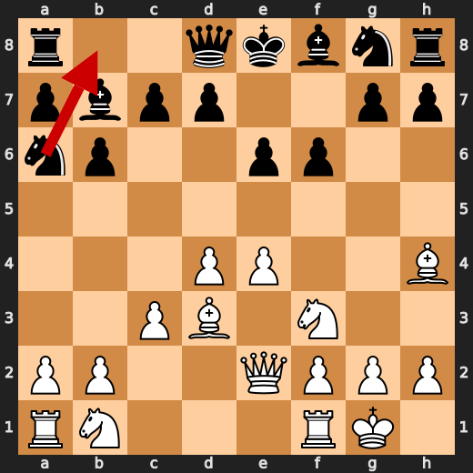

**After 9. Nb8**

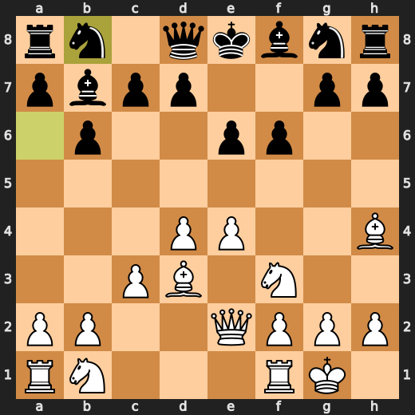

### ❌ Mistake: 10. g5 by CPU (Black)

g5 worsened Black’s position significantly instead of making the steadier Be7 move. Learn to avoid pawn pushes that create a major eval swing unless they solve a clear concrete problem.

- **Eval:** +2.25 → +7.47
- **Preferred:** `Be7`
- **Loss:** 522 cp

**Before 10. g5**

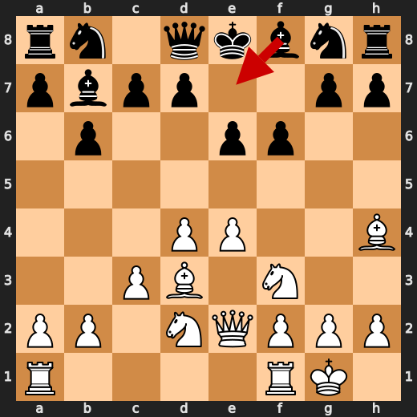

**After 10. g5**

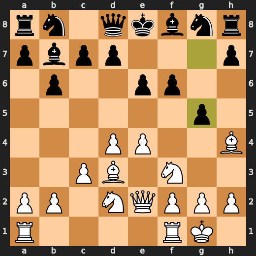

### ❌ Mistake: 11. fxg5 by CPU (Black)

fxg5 failed to improve Black’s position and caused a significant worsening. h5 was preferred as the more resilient move, so learn to be cautious with captures that do not solve the position’s main problems.

- **Eval:** +7.20 → +13.12
- **Preferred:** `h5`
- **Loss:** 592 cp

**Before 11. fxg5**

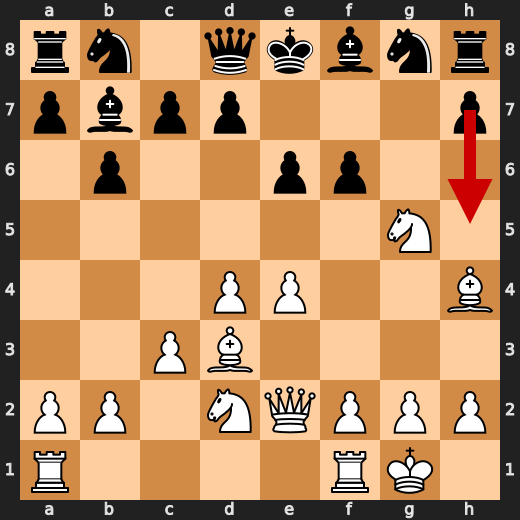

**After 11. fxg5**

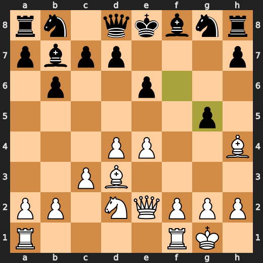

### ✅ Best: 13. Qxg5+ by You (White)

Qxg5+ was the preferred move, giving check while keeping White’s winning position intact. The useful pattern is to choose forcing, engine-approved moves when they do not give the opponent time to improve.

- **Eval:** +13.33 → +13.07
- **Preferred:** `Qxg5+`
- **Loss:** 26 cp

**Before 13. Qxg5+**

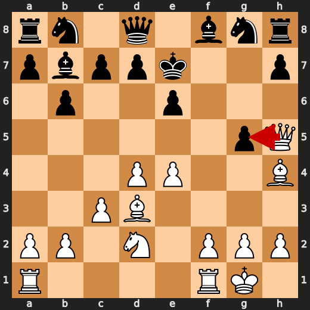

**After 13. Qxg5+**

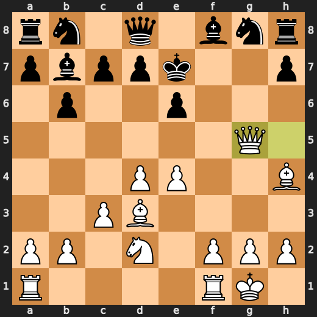

### ✅ Best: 13. Kf7 by CPU (Black)

Kf7 was the preferred move, so Black handled this position about as well as the engine expected. The practical pattern is to notice that a king move can still be best when it slightly improves safety without creating a new weakness.

- **Eval:** +13.05 → +13.17
- **Preferred:** `Kf7`
- **Loss:** 12 cp

**Before 13. Kf7**

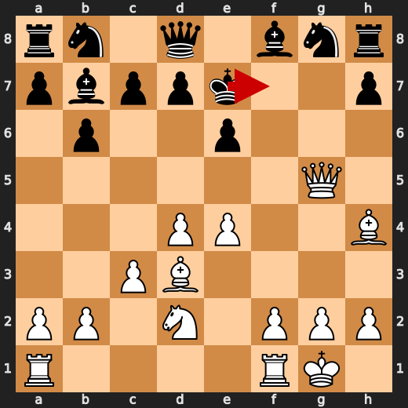

**After 13. Kf7**

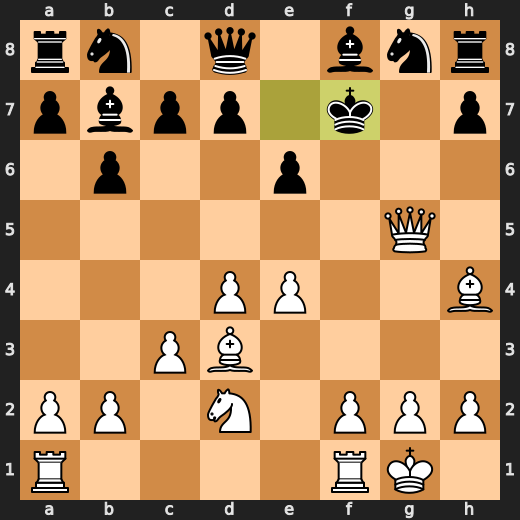

### ❌ Mistake: 17. Kg6 by CPU (Black)

Kg6 did not address Black’s defensive problems and made the position much worse. Nge7 was preferred because it offered more resistance, so learn to choose defensive moves that stabilize the position rather than king moves that allow a bigger advantage.

- **Eval:** +14.84 → +20.02
- **Preferred:** `Nge7`
- **Loss:** 518 cp

**Before 17. Kg6**

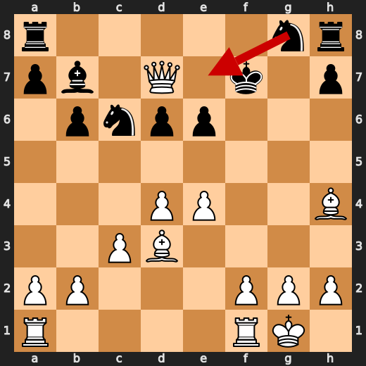

**After 17. Kg6**

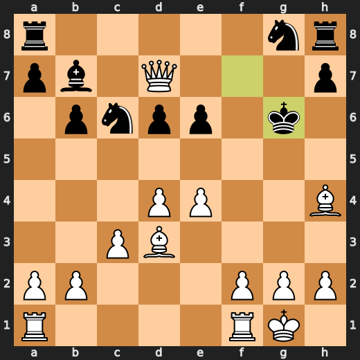

### 💀 Blunder: 18. Kh5 by CPU (Black)

Kh5 failed to avoid a mating position, turning an already difficult defense into a forced loss. Kg7 was the better try because it did not allow White mate immediately.

- **Eval:** +20.10 → White has mate
- **Preferred:** `Kg7`
- **Loss:** 97990 cp

**Before 18. Kh5**

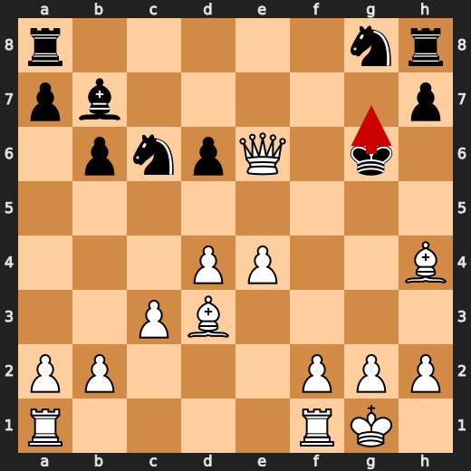

**After 18. Kh5**

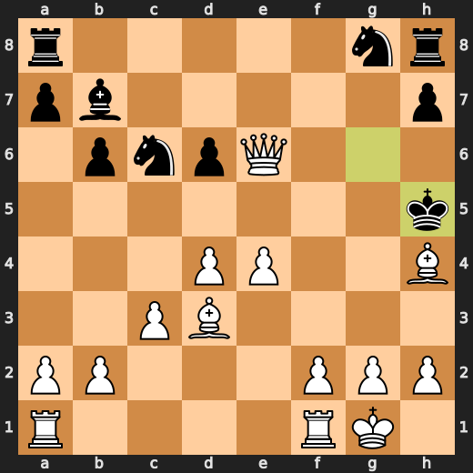

### 🏁 Checkmate: 20. g3# by You (White)

g3# was the preferred move because it used the available forced mate immediately. The key pattern is to finish the game with the forcing move when the opponent has no escape.

- **Eval:** White has mate → White has mate
- **Preferred:** `g3#`
- **Loss:** 0 cp

**Before 20. g3#**

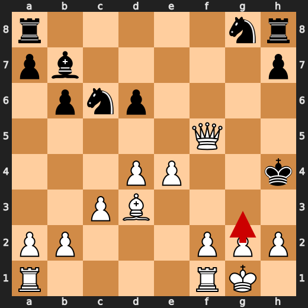

**After 20. g3#**

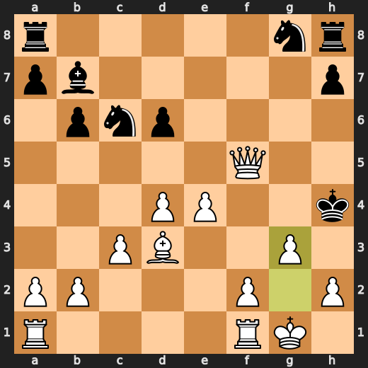

---

## Human Notes

Biggest caveman lesson: CPU (Black) blew it with **18. Kh5**.

There was another real screw-up at **10. g5** by **CPU (Black)**.

The game-ending shot was **20. g3#** by **You (White)**.

---

<details>
<summary>Compact move list</summary>

- 📖 **1. e4** (You (White), Book) — +0.46 → +0.23, preferred `d4`, loss 23 cp
- 📖 **1. e6** (CPU (Black), Book) — +0.37 → +0.53, preferred `e5`, loss 16 cp
- 📖 **2. d4** (You (White), Book) — +0.40 → +0.42, preferred `d4`, loss 0 cp
- 📖 **2. b6** (CPU (Black), Book) — +0.39 → +1.09, preferred `d5`, loss 70 cp
- 📖 **3. Nf3** (You (White), Book) — +1.02 → +1.01, preferred `Nf3`, loss 1 cp
- 📖 **3. Bb4+** (CPU (Black), Book) — +1.12 → +1.70, preferred `d5`, loss 58 cp
- ✅ **4. c3** (You (White), Best) — +1.66 → +1.70, preferred `c3`, loss 0 cp
- ✅ **4. Bf8** (CPU (Black), Best) — +1.70 → +1.73, preferred `Be7`, loss 3 cp
- ✅ **5. Bd3** (You (White), Best) — +1.78 → +1.75, preferred `a4`, loss 3 cp
- 👍 **5. Ba6** (CPU (Black), Good) — +1.82 → +2.47, preferred `Bb7`, loss 65 cp
- 🔥 **6. O-O** (You (White), Great) — +2.38 → +1.89, preferred `Bxa6`, loss 49 cp
- 🔥 **6. Bb7** (CPU (Black), Great) — +1.92 → +2.20, preferred `Bxd3`, loss 28 cp
- 👍 **7. Bg5** (You (White), Good) — +2.46 → +1.57, preferred `Qe2`, loss 89 cp
- 👍 **7. f6** (CPU (Black), Good) — +1.51 → +2.39, preferred `Be7`, loss 88 cp
- 👍 **8. Bh4** (You (White), Good) — +2.50 → +1.96, preferred `Be3`, loss 54 cp
- ⚠️ **8. Na6** (CPU (Black), Inaccuracy) — +1.87 → +3.51, preferred `Nh6`, loss 164 cp
- 🔥 **9. Qe2** (You (White), Great) — +3.27 → +2.94, preferred `Qe2`, loss 33 cp
- ✅ **9. Nb8** (CPU (Black), Best) — +3.23 → +3.20, preferred `Nb8`, loss 0 cp
- 👍 **10. Nbd2** (You (White), Good) — +3.06 → +2.14, preferred `a4`, loss 92 cp
- ❌ **10. g5** (CPU (Black), Mistake) — +2.25 → +7.47, preferred `Be7`, loss 522 cp
- ✅ **11. Nxg5** (You (White), Best) — +6.92 → +7.33, preferred `Nxg5`, loss 0 cp
- ❌ **11. fxg5** (CPU (Black), Mistake) — +7.20 → +13.12, preferred `h5`, loss 592 cp
- ✅ **12. Qh5+** (You (White), Best) — +12.69 → +12.75, preferred `Qh5+`, loss 0 cp
- ✅ **12. Ke7** (CPU (Black), Best) — +12.81 → +12.69, preferred `Ke7`, loss 0 cp
- ✅ **13. Qxg5+** (You (White), Best) — +13.33 → +13.07, preferred `Qxg5+`, loss 26 cp
- ✅ **13. Kf7** (CPU (Black), Best) — +13.05 → +13.17, preferred `Kf7`, loss 12 cp
- ✅ **14. Qxd8** (You (White), Best) — +13.23 → +13.38, preferred `Qxd8`, loss 0 cp
- 👍 **14. Bd6** (CPU (Black), Good) — +13.47 → +14.56, preferred `Be7`, loss 109 cp
- 👍 **15. Nc4** (You (White), Good) — +14.53 → +14.00, preferred `f4`, loss 53 cp
- 🔥 **15. Nc6** (CPU (Black), Great) — +14.61 → +15.07, preferred `b5`, loss 46 cp
- 🔥 **16. Nxd6+** (You (White), Great) — +15.02 → +14.84, preferred `Qxd7+`, loss 18 cp
- 🔥 **16. cxd6** (CPU (Black), Great) — +14.92 → +15.37, preferred `cxd6`, loss 45 cp
- ✅ **17. Qxd7+** (You (White), Best) — +15.30 → +15.23, preferred `Qxd7+`, loss 7 cp
- ❌ **17. Kg6** (CPU (Black), Mistake) — +14.84 → +20.02, preferred `Nge7`, loss 518 cp
- 👍 **18. Qxe6+** (You (White), Good) — +20.86 → +19.84, preferred `e5+`, loss 102 cp
- 💀 **18. Kh5** (CPU (Black), Blunder) — +20.10 → White has mate, preferred `Kg7`, loss 97990 cp
- ✅ **19. Qf5+** (You (White), Best) — White has mate → White has mate, preferred `Be2+`, loss 0 cp
- ✅ **19. Kxh4** (CPU (Black), Best) — White has mate → White has mate, preferred `Kh6`, loss 0 cp
- 🏁 **20. g3#** (You (White), Checkmate) — White has mate → White has mate, preferred `g3#`, loss 0 cp

</details>

---

<details>
<summary>Raw engine table</summary>

| Ply | Move | Actor | Played | Label | Eval Before | Eval After | Preferred | Loss |
|---:|---:|---|---|---|---:|---:|---|---:|
| 1 | 1 | You (White) | e4 | Book | +0.46 | +0.23 | d4 | 23 |
| 2 | 1 | CPU (Black) | e6 | Book | +0.37 | +0.53 | e5 | 16 |
| 3 | 2 | You (White) | d4 | Book | +0.40 | +0.42 | d4 | 0 |
| 4 | 2 | CPU (Black) | b6 | Book | +0.39 | +1.09 | d5 | 70 |
| 5 | 3 | You (White) | Nf3 | Book | +1.02 | +1.01 | Nf3 | 1 |
| 6 | 3 | CPU (Black) | Bb4+ | Book | +1.12 | +1.70 | d5 | 58 |
| 7 | 4 | You (White) | c3 | Best | +1.66 | +1.70 | c3 | 0 |
| 8 | 4 | CPU (Black) | Bf8 | Best | +1.70 | +1.73 | Be7 | 3 |
| 9 | 5 | You (White) | Bd3 | Best | +1.78 | +1.75 | a4 | 3 |
| 10 | 5 | CPU (Black) | Ba6 | Good | +1.82 | +2.47 | Bb7 | 65 |
| 11 | 6 | You (White) | O-O | Great | +2.38 | +1.89 | Bxa6 | 49 |
| 12 | 6 | CPU (Black) | Bb7 | Great | +1.92 | +2.20 | Bxd3 | 28 |
| 13 | 7 | You (White) | Bg5 | Good | +2.46 | +1.57 | Qe2 | 89 |
| 14 | 7 | CPU (Black) | f6 | Good | +1.51 | +2.39 | Be7 | 88 |
| 15 | 8 | You (White) | Bh4 | Good | +2.50 | +1.96 | Be3 | 54 |
| 16 | 8 | CPU (Black) | Na6 | Inaccuracy | +1.87 | +3.51 | Nh6 | 164 |
| 17 | 9 | You (White) | Qe2 | Great | +3.27 | +2.94 | Qe2 | 33 |
| 18 | 9 | CPU (Black) | Nb8 | Best | +3.23 | +3.20 | Nb8 | 0 |
| 19 | 10 | You (White) | Nbd2 | Good | +3.06 | +2.14 | a4 | 92 |
| 20 | 10 | CPU (Black) | g5 | Mistake | +2.25 | +7.47 | Be7 | 522 |
| 21 | 11 | You (White) | Nxg5 | Best | +6.92 | +7.33 | Nxg5 | 0 |
| 22 | 11 | CPU (Black) | fxg5 | Mistake | +7.20 | +13.12 | h5 | 592 |
| 23 | 12 | You (White) | Qh5+ | Best | +12.69 | +12.75 | Qh5+ | 0 |
| 24 | 12 | CPU (Black) | Ke7 | Best | +12.81 | +12.69 | Ke7 | 0 |
| 25 | 13 | You (White) | Qxg5+ | Best | +13.33 | +13.07 | Qxg5+ | 26 |
| 26 | 13 | CPU (Black) | Kf7 | Best | +13.05 | +13.17 | Kf7 | 12 |
| 27 | 14 | You (White) | Qxd8 | Best | +13.23 | +13.38 | Qxd8 | 0 |
| 28 | 14 | CPU (Black) | Bd6 | Good | +13.47 | +14.56 | Be7 | 109 |
| 29 | 15 | You (White) | Nc4 | Good | +14.53 | +14.00 | f4 | 53 |
| 30 | 15 | CPU (Black) | Nc6 | Great | +14.61 | +15.07 | b5 | 46 |
| 31 | 16 | You (White) | Nxd6+ | Great | +15.02 | +14.84 | Qxd7+ | 18 |
| 32 | 16 | CPU (Black) | cxd6 | Great | +14.92 | +15.37 | cxd6 | 45 |
| 33 | 17 | You (White) | Qxd7+ | Best | +15.30 | +15.23 | Qxd7+ | 7 |
| 34 | 17 | CPU (Black) | Kg6 | Mistake | +14.84 | +20.02 | Nge7 | 518 |
| 35 | 18 | You (White) | Qxe6+ | Good | +20.86 | +19.84 | e5+ | 102 |
| 36 | 18 | CPU (Black) | Kh5 | Blunder | +20.10 | White has mate | Kg7 | 97990 |
| 37 | 19 | You (White) | Qf5+ | Best | White has mate | White has mate | Be2+ | 0 |
| 38 | 19 | CPU (Black) | Kxh4 | Best | White has mate | White has mate | Kh6 | 0 |
| 39 | 20 | You (White) | g3# | Checkmate | White has mate | White has mate | g3# | 0 |

</details>

---

<details>
<summary>Clean PGN</summary>

```pgn
[Event "AI Factory's Chess"]
[Site "Android Device"]
[Date "2026.05.31"]
[Round "1"]
[White "You"]
[Black "CPU (5)"]
[Result "1-0"]
[PlyCount "41"]

1. e4 e6 2. d4 b6 3. Nf3 Bb4+ 4. c3 Bf8 5. Bd3 Ba6 6. O-O Bb7 7. Bg5 f6 8. Bh4
Na6 9. Qe2 Nb8 10. Nbd2 g5 11. Nxg5 fxg5 12. Qh5+ Ke7 13. Qxg5+ Kf7 14. Qxd8
Bd6 15. Nc4 Nc6 16. Nxd6+ cxd6 17. Qxd7+ Kg6 18. Qxe6+ Kh5 19. Qf5+ Kxh4 20.
g3# 1-0
```

</details>
