# You (White) vs CPU (Black)

**Result:** 1-0  
**Date:** 2026.05.31  
**Source:** `PGN_2026_05_31_13h26_81c100f0ec88.pgn`  
**Engine:** Stockfish depth 14  
**Your side:** White  
**Computer side:** Black  
**Board perspective:** Standard White-at-bottom

---

## Who Is Who

- **You:** You (White)
- **Computer:** CPU (5) (Black)

---

## Toaster Summary

**Game Story:** You won with 31. Qe7#, after Black’s 27...Qd8 allowed a forced mating finish. Your 29. Nc5 missed a stronger mate route, so the conversion was messy rather than clean. Learn to check forcing moves first when the enemy king is exposed, especially checks and captures near mate.

Biggest toaster scream: **27. Qd8** by **CPU (Black)**.

- **Label:** 💀 **Blunder**
- **Eval:** +11.19 → White has mate
- **Stockfish preferred:** `Qxb7`
- **Loss:** 98881 cp

Final move recorded: **31. Qe7#** by **You (White)**.

- 💀 Your blunders: **1**
- ❌ Your mistakes: **1**
- ⚠️ Your inaccuracies: **9**
- ✅ Your best moves called out: **12**

---

## Final Position

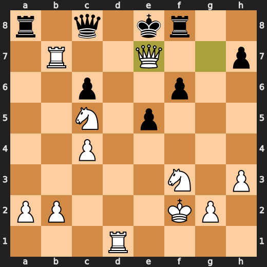

---

## Key Moments

### ❌ Mistake: 4. dxe5 by CPU (Black)

dxe5 worsened Black’s position significantly instead of choosing Nh6. The practical lesson is to prefer the engine’s developing move when a capture causes a large evaluation swing.

- **Eval:** +1.14 → +4.79
- **Preferred:** `Nh6`
- **Loss:** 365 cp

**Before 4. dxe5**

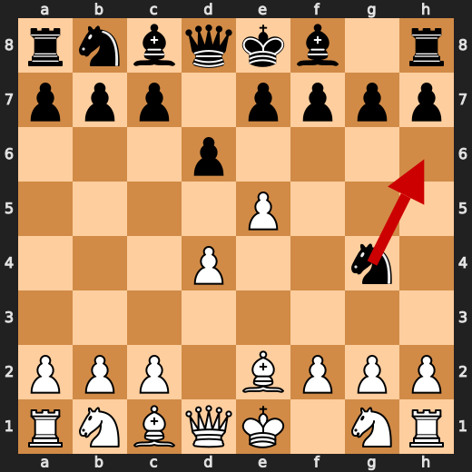

**After 4. dxe5**

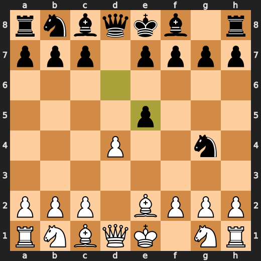

### ✅ Best: 9. c3 by You (White)

c3 was the preferred move, giving White a useful way to challenge Black’s advanced d-pawn while keeping the strong position intact. Learn this pattern: when ahead, steady pawn moves that reduce the opponent’s central space can be just as important as forcing moves.

- **Eval:** +4.57 → +4.46
- **Preferred:** `c3`
- **Loss:** 11 cp

**Before 9. c3**

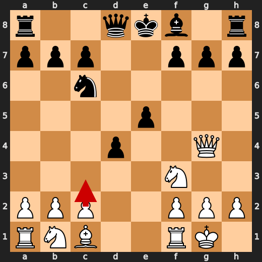

**After 9. c3**

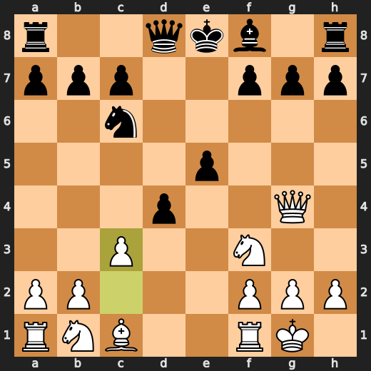

### ❌ Mistake: 25. Ra8 by CPU (Black)

Ra8 failed to improve Black’s position and allowed White’s advantage to grow. O-O was preferred because it would have addressed Black’s king safety more directly. The practical pattern is to prioritize castling when the engine indicates a quiet rook move worsens the position.

- **Eval:** +9.13 → +12.48
- **Preferred:** `O-O`
- **Loss:** 335 cp

**Before 25. Ra8**

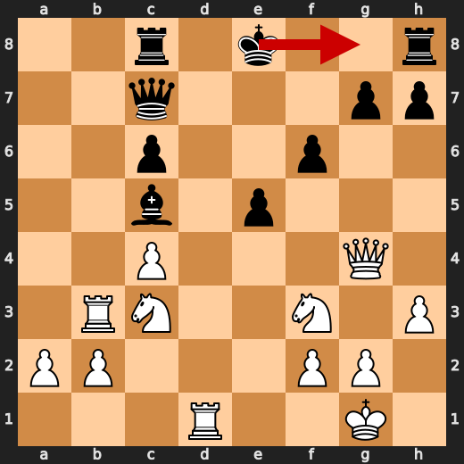

**After 25. Ra8**

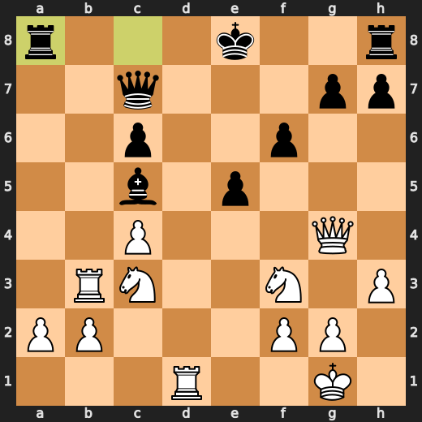

### ❌ Mistake: 27. Rb7 by You (White)

Rb7 was useful but failed to play the stronger Qe6+, which would improve White’s forcing chances immediately. The eval swing means White still stood much better, but let some of the advantage slip.

- **Eval:** +15.70 → +11.15
- **Preferred:** `Qe6+`
- **Loss:** 455 cp

**Before 27. Rb7**

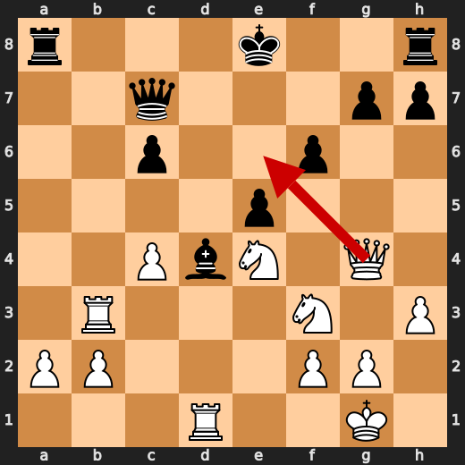

**After 27. Rb7**

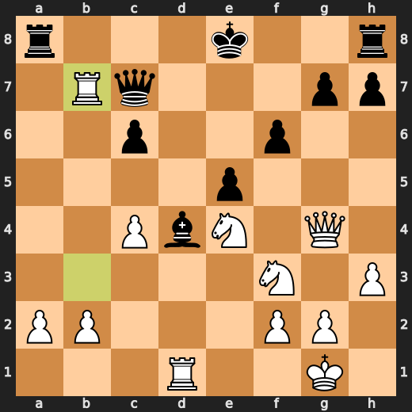

### 💀 Blunder: 27. Qd8 by CPU (Black)

Qd8 failed to stop White from having a forced mate. Qxb7 was the preferred move because it gave Black a better chance to prolong the defense. Learn to treat moves that allow immediate mate as the highest-priority mistakes to eliminate.

- **Eval:** +11.19 → White has mate
- **Preferred:** `Qxb7`
- **Loss:** 98881 cp

**Before 27. Qd8**

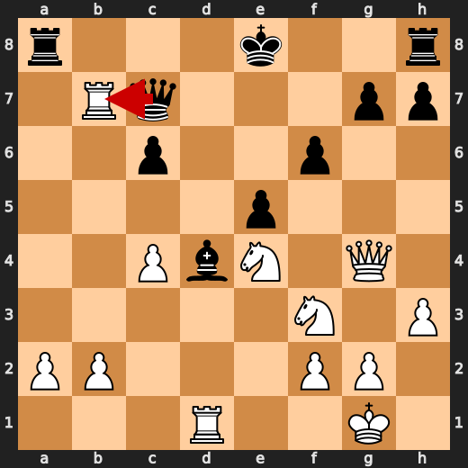

**After 27. Qd8**

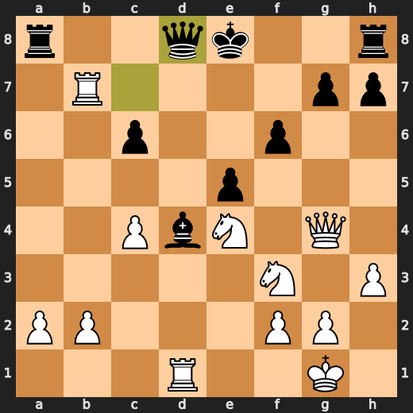

### 💀 Blunder: 29. Nc5 by You (White)

Nc5 missed the stronger Nxf6+, which preserved White’s forced mate. After the move, White is still winning, but the immediate decisive continuation was lost; learn to check forcing moves first when mate is available.

- **Eval:** White has mate → +21.07
- **Preferred:** `Nxf6+`
- **Loss:** 97893 cp

**Before 29. Nc5**

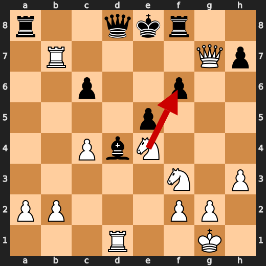

**After 29. Nc5**

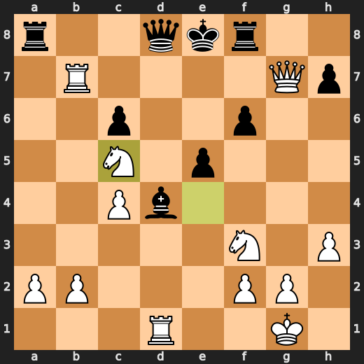

### 💀 Blunder: 29. Bxf2+ by CPU (Black)

Bxf2+ worsened Black’s position so badly that White now has a forced mate. Bxc5 was the preferred move because it avoided this major collapse and kept the defense going longer.

- **Eval:** +15.30 → White has mate
- **Preferred:** `Bxc5`
- **Loss:** 98470 cp

**Before 29. Bxf2+**

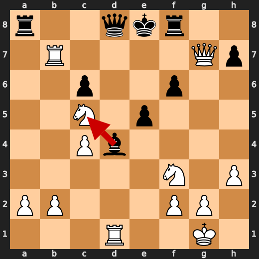

**After 29. Bxf2+**

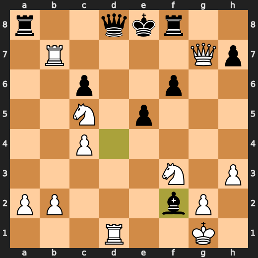

### 🏁 Checkmate: 31. Qe7# by You (White)

Qe7# was the preferred move because it used the available mate immediately. The key pattern is to finish with the forcing move when the position already contains checkmate.

- **Eval:** White has mate → White has mate
- **Preferred:** `Qe7#`
- **Loss:** 0 cp

**Before 31. Qe7#**

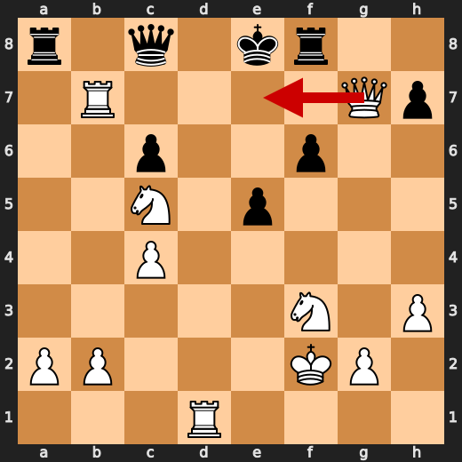

**After 31. Qe7#**


---

## Human Notes

Biggest caveman lesson: CPU (Black) blew it with **27. Qd8**.

There was another real screw-up at **4. dxe5** by **CPU (Black)**.

The game-ending shot was **31. Qe7#** by **You (White)**.

---

<details>
<summary>Compact move list</summary>

- 📖 **1. e4** (You (White), Book) — +0.46 → +0.23, preferred `d4`, loss 23 cp
- 📖 **1. d6** (CPU (Black), Book) — +0.37 → +0.83, preferred `e5`, loss 46 cp
- 📖 **2. d4** (You (White), Book) — +0.91 → +0.56, preferred `d4`, loss 35 cp
- 📖 **2. Nf6** (CPU (Black), Book) — +0.61 → +0.57, preferred `Nf6`, loss 0 cp
- ⚠️ **3. e5** (You (White), Inaccuracy) — +0.54 → -1.96, preferred `Nc3`, loss 250 cp
- ⚠️ **3. Ng4** (CPU (Black), Inaccuracy) — -1.76 → +1.22, preferred `dxe5`, loss 298 cp
- 🔥 **4. Be2** (You (White), Great) — +1.26 → +0.93, preferred `Bb5+`, loss 33 cp
- ❌ **4. dxe5** (CPU (Black), Mistake) — +1.14 → +4.79, preferred `Nh6`, loss 365 cp
- ✅ **5. Bxg4** (You (White), Best) — +4.74 → +4.67, preferred `Bxg4`, loss 7 cp
- ✅ **5. Bxg4** (CPU (Black), Best) — +4.49 → +4.78, preferred `Bxg4`, loss 29 cp
- ✅ **6. Qxg4** (You (White), Best) — +4.16 → +4.36, preferred `Qxg4`, loss 0 cp
- 👍 **6. exd4** (CPU (Black), Good) — +3.85 → +4.96, preferred `exd4`, loss 111 cp
- ✅ **7. Nf3** (You (White), Best) — +3.85 → +3.71, preferred `Nf3`, loss 14 cp
- ⚠️ **7. Nc6** (CPU (Black), Inaccuracy) — +3.61 → +5.35, preferred `c5`, loss 174 cp
- 🔥 **8. O-O** (You (White), Great) — +4.87 → +4.67, preferred `O-O`, loss 20 cp
- 🔥 **8. e5** (CPU (Black), Great) — +4.68 → +5.08, preferred `e5`, loss 40 cp
- ✅ **9. c3** (You (White), Best) — +4.57 → +4.46, preferred `c3`, loss 11 cp
- 👍 **9. d3** (CPU (Black), Good) — +4.72 → +5.25, preferred `Qd7`, loss 53 cp
- 👍 **10. Qe4** (You (White), Good) — +5.15 → +4.60, preferred `Nbd2`, loss 55 cp
- ⚠️ **10. Be7** (CPU (Black), Inaccuracy) — +4.76 → +7.21, preferred `Qe7`, loss 245 cp
- ⚠️ **11. Rd1** (You (White), Inaccuracy) — +6.94 → +5.39, preferred `Nxe5`, loss 155 cp
- ✅ **11. Qd6** (CPU (Black), Best) — +5.28 → +5.16, preferred `Qd7`, loss 0 cp
- ✅ **12. Rxd3** (You (White), Best) — +4.92 → +5.10, preferred `Rxd3`, loss 0 cp
- ⚠️ **12. Qf6** (CPU (Black), Inaccuracy) — +5.10 → +7.46, preferred `Qg6`, loss 236 cp
- ⚠️ **13. Rd5** (You (White), Inaccuracy) — +6.59 → +5.35, preferred `Qe2`, loss 124 cp
- ⚠️ **13. Bd6** (CPU (Black), Inaccuracy) — +5.22 → +6.73, preferred `Qe6`, loss 151 cp
- ⚠️ **14. Bg5** (You (White), Inaccuracy) — +7.14 → +4.68, preferred `Nbd2`, loss 246 cp
- 🔥 **14. Qe6** (CPU (Black), Great) — +4.63 → +4.87, preferred `Qe6`, loss 24 cp
- ⚠️ **15. Rb5** (You (White), Inaccuracy) — +4.71 → +3.21, preferred `Na3`, loss 150 cp
- ⚠️ **15. f6** (CPU (Black), Inaccuracy) — +3.57 → +6.30, preferred `f5`, loss 273 cp
- ✅ **16. Rxb7** (You (White), Best) — +6.51 → +6.44, preferred `Rxb7`, loss 7 cp
- ✅ **16. Qd7** (CPU (Black), Best) — +6.51 → +6.63, preferred `Qd7`, loss 12 cp
- 👍 **17. Be3** (You (White), Good) — +6.69 → +6.12, preferred `Bd2`, loss 57 cp
- ⚠️ **17. Nd8** (CPU (Black), Inaccuracy) — +5.84 → +8.07, preferred `a6`, loss 223 cp
- ✅ **18. Rb3** (You (White), Best) — +8.07 → +8.05, preferred `Rb3`, loss 2 cp
- 👍 **18. c6** (CPU (Black), Good) — +8.06 → +9.07, preferred `Rc8`, loss 101 cp
- ⚠️ **19. c4** (You (White), Inaccuracy) — +9.15 → +6.18, preferred `Qc4`, loss 297 cp
- ⚠️ **19. Ne6** (CPU (Black), Inaccuracy) — +6.07 → +8.23, preferred `f5`, loss 216 cp
- ⚠️ **20. h3** (You (White), Inaccuracy) — +9.15 → +6.92, preferred `Rd3`, loss 223 cp
- 🔥 **20. Rd8** (CPU (Black), Great) — +7.19 → +7.53, preferred `Rd8`, loss 34 cp
- ✅ **21. Nc3** (You (White), Best) — +7.66 → +7.61, preferred `Nc3`, loss 5 cp
- ⚠️ **21. Rc8** (CPU (Black), Inaccuracy) — +7.53 → +9.36, preferred `O-O`, loss 183 cp
- ✅ **22. Rd1** (You (White), Best) — +9.79 → +9.73, preferred `Rd1`, loss 6 cp
- ⚠️ **22. Qc7** (CPU (Black), Inaccuracy) — +9.55 → +11.15, preferred `Qe7`, loss 160 cp
- ⚠️ **23. Bxa7** (You (White), Inaccuracy) — +11.11 → +9.00, preferred `Qg4`, loss 211 cp
- 👍 **23. Nc5** (CPU (Black), Good) — +8.81 → +9.78, preferred `Qxa7`, loss 97 cp
- ✅ **24. Bxc5** (You (White), Best) — +10.10 → +10.47, preferred `Bxc5`, loss 0 cp
- ✅ **24. Bxc5** (CPU (Black), Best) — +10.46 → +10.35, preferred `Bxc5`, loss 0 cp
- ⚠️ **25. Qg4** (You (White), Inaccuracy) — +10.50 → +9.15, preferred `Qf5`, loss 135 cp
- ❌ **25. Ra8** (CPU (Black), Mistake) — +9.13 → +12.48, preferred `O-O`, loss 335 cp
- 🔥 **26. Ne4** (You (White), Great) — +11.53 → +11.33, preferred `Ne4`, loss 20 cp
- ⚠️ **26. Bd4** (CPU (Black), Inaccuracy) — +11.15 → +14.02, preferred `Qf7`, loss 287 cp
- ❌ **27. Rb7** (You (White), Mistake) — +15.70 → +11.15, preferred `Qe6+`, loss 455 cp
- 💀 **27. Qd8** (CPU (Black), Blunder) — +11.19 → White has mate, preferred `Qxb7`, loss 98881 cp
- ✅ **28. Qxg7** (You (White), Best) — White has mate → White has mate, preferred `Qe6+`, loss 0 cp
- ✅ **28. Rf8** (CPU (Black), Best) — White has mate → White has mate, preferred `Rf8`, loss 0 cp
- 💀 **29. Nc5** (You (White), Blunder) — White has mate → +21.07, preferred `Nxf6+`, loss 97893 cp
- 💀 **29. Bxf2+** (CPU (Black), Blunder) — +15.30 → White has mate, preferred `Bxc5`, loss 98470 cp
- ✅ **30. Kxf2** (You (White), Best) — White has mate → White has mate, preferred `Kxf2`, loss 0 cp
- ✅ **30. Qc8** (CPU (Black), Best) — White has mate → White has mate, preferred `e4`, loss 0 cp
- 🏁 **31. Qe7#** (You (White), Checkmate) — White has mate → White has mate, preferred `Qe7#`, loss 0 cp

</details>

---

<details>
<summary>Raw engine table</summary>

| Ply | Move | Actor | Played | Label | Eval Before | Eval After | Preferred | Loss |
|---:|---:|---|---|---|---:|---:|---|---:|
| 1 | 1 | You (White) | e4 | Book | +0.46 | +0.23 | d4 | 23 |
| 2 | 1 | CPU (Black) | d6 | Book | +0.37 | +0.83 | e5 | 46 |
| 3 | 2 | You (White) | d4 | Book | +0.91 | +0.56 | d4 | 35 |
| 4 | 2 | CPU (Black) | Nf6 | Book | +0.61 | +0.57 | Nf6 | 0 |
| 5 | 3 | You (White) | e5 | Inaccuracy | +0.54 | -1.96 | Nc3 | 250 |
| 6 | 3 | CPU (Black) | Ng4 | Inaccuracy | -1.76 | +1.22 | dxe5 | 298 |
| 7 | 4 | You (White) | Be2 | Great | +1.26 | +0.93 | Bb5+ | 33 |
| 8 | 4 | CPU (Black) | dxe5 | Mistake | +1.14 | +4.79 | Nh6 | 365 |
| 9 | 5 | You (White) | Bxg4 | Best | +4.74 | +4.67 | Bxg4 | 7 |
| 10 | 5 | CPU (Black) | Bxg4 | Best | +4.49 | +4.78 | Bxg4 | 29 |
| 11 | 6 | You (White) | Qxg4 | Best | +4.16 | +4.36 | Qxg4 | 0 |
| 12 | 6 | CPU (Black) | exd4 | Good | +3.85 | +4.96 | exd4 | 111 |
| 13 | 7 | You (White) | Nf3 | Best | +3.85 | +3.71 | Nf3 | 14 |
| 14 | 7 | CPU (Black) | Nc6 | Inaccuracy | +3.61 | +5.35 | c5 | 174 |
| 15 | 8 | You (White) | O-O | Great | +4.87 | +4.67 | O-O | 20 |
| 16 | 8 | CPU (Black) | e5 | Great | +4.68 | +5.08 | e5 | 40 |
| 17 | 9 | You (White) | c3 | Best | +4.57 | +4.46 | c3 | 11 |
| 18 | 9 | CPU (Black) | d3 | Good | +4.72 | +5.25 | Qd7 | 53 |
| 19 | 10 | You (White) | Qe4 | Good | +5.15 | +4.60 | Nbd2 | 55 |
| 20 | 10 | CPU (Black) | Be7 | Inaccuracy | +4.76 | +7.21 | Qe7 | 245 |
| 21 | 11 | You (White) | Rd1 | Inaccuracy | +6.94 | +5.39 | Nxe5 | 155 |
| 22 | 11 | CPU (Black) | Qd6 | Best | +5.28 | +5.16 | Qd7 | 0 |
| 23 | 12 | You (White) | Rxd3 | Best | +4.92 | +5.10 | Rxd3 | 0 |
| 24 | 12 | CPU (Black) | Qf6 | Inaccuracy | +5.10 | +7.46 | Qg6 | 236 |
| 25 | 13 | You (White) | Rd5 | Inaccuracy | +6.59 | +5.35 | Qe2 | 124 |
| 26 | 13 | CPU (Black) | Bd6 | Inaccuracy | +5.22 | +6.73 | Qe6 | 151 |
| 27 | 14 | You (White) | Bg5 | Inaccuracy | +7.14 | +4.68 | Nbd2 | 246 |
| 28 | 14 | CPU (Black) | Qe6 | Great | +4.63 | +4.87 | Qe6 | 24 |
| 29 | 15 | You (White) | Rb5 | Inaccuracy | +4.71 | +3.21 | Na3 | 150 |
| 30 | 15 | CPU (Black) | f6 | Inaccuracy | +3.57 | +6.30 | f5 | 273 |
| 31 | 16 | You (White) | Rxb7 | Best | +6.51 | +6.44 | Rxb7 | 7 |
| 32 | 16 | CPU (Black) | Qd7 | Best | +6.51 | +6.63 | Qd7 | 12 |
| 33 | 17 | You (White) | Be3 | Good | +6.69 | +6.12 | Bd2 | 57 |
| 34 | 17 | CPU (Black) | Nd8 | Inaccuracy | +5.84 | +8.07 | a6 | 223 |
| 35 | 18 | You (White) | Rb3 | Best | +8.07 | +8.05 | Rb3 | 2 |
| 36 | 18 | CPU (Black) | c6 | Good | +8.06 | +9.07 | Rc8 | 101 |
| 37 | 19 | You (White) | c4 | Inaccuracy | +9.15 | +6.18 | Qc4 | 297 |
| 38 | 19 | CPU (Black) | Ne6 | Inaccuracy | +6.07 | +8.23 | f5 | 216 |
| 39 | 20 | You (White) | h3 | Inaccuracy | +9.15 | +6.92 | Rd3 | 223 |
| 40 | 20 | CPU (Black) | Rd8 | Great | +7.19 | +7.53 | Rd8 | 34 |
| 41 | 21 | You (White) | Nc3 | Best | +7.66 | +7.61 | Nc3 | 5 |
| 42 | 21 | CPU (Black) | Rc8 | Inaccuracy | +7.53 | +9.36 | O-O | 183 |
| 43 | 22 | You (White) | Rd1 | Best | +9.79 | +9.73 | Rd1 | 6 |
| 44 | 22 | CPU (Black) | Qc7 | Inaccuracy | +9.55 | +11.15 | Qe7 | 160 |
| 45 | 23 | You (White) | Bxa7 | Inaccuracy | +11.11 | +9.00 | Qg4 | 211 |
| 46 | 23 | CPU (Black) | Nc5 | Good | +8.81 | +9.78 | Qxa7 | 97 |
| 47 | 24 | You (White) | Bxc5 | Best | +10.10 | +10.47 | Bxc5 | 0 |
| 48 | 24 | CPU (Black) | Bxc5 | Best | +10.46 | +10.35 | Bxc5 | 0 |
| 49 | 25 | You (White) | Qg4 | Inaccuracy | +10.50 | +9.15 | Qf5 | 135 |
| 50 | 25 | CPU (Black) | Ra8 | Mistake | +9.13 | +12.48 | O-O | 335 |
| 51 | 26 | You (White) | Ne4 | Great | +11.53 | +11.33 | Ne4 | 20 |
| 52 | 26 | CPU (Black) | Bd4 | Inaccuracy | +11.15 | +14.02 | Qf7 | 287 |
| 53 | 27 | You (White) | Rb7 | Mistake | +15.70 | +11.15 | Qe6+ | 455 |
| 54 | 27 | CPU (Black) | Qd8 | Blunder | +11.19 | White has mate | Qxb7 | 98881 |
| 55 | 28 | You (White) | Qxg7 | Best | White has mate | White has mate | Qe6+ | 0 |
| 56 | 28 | CPU (Black) | Rf8 | Best | White has mate | White has mate | Rf8 | 0 |
| 57 | 29 | You (White) | Nc5 | Blunder | White has mate | +21.07 | Nxf6+ | 97893 |
| 58 | 29 | CPU (Black) | Bxf2+ | Blunder | +15.30 | White has mate | Bxc5 | 98470 |
| 59 | 30 | You (White) | Kxf2 | Best | White has mate | White has mate | Kxf2 | 0 |
| 60 | 30 | CPU (Black) | Qc8 | Best | White has mate | White has mate | e4 | 0 |
| 61 | 31 | You (White) | Qe7# | Checkmate | White has mate | White has mate | Qe7# | 0 |

</details>

---

<details>
<summary>Clean PGN</summary>

```pgn
[Event "AI Factory's Chess"]
[Site "Android Device"]
[Date "2026.05.31"]
[Round "1"]
[White "You"]
[Black "CPU (5)"]
[Result "1-0"]
[PlyCount "61"]

1. e4 d6 2. d4 Nf6 3. e5 Ng4 4. Be2 dxe5 5. Bxg4 Bxg4 6. Qxg4 exd4 7. Nf3 Nc6
8. O-O e5 9. c3 d3 10. Qe4 Be7 11. Rd1 Qd6 12. Rxd3 Qf6 13. Rd5 Bd6 14. Bg5 Qe6
15. Rb5 f6 16. Rxb7 Qd7 17. Be3 Nd8 18. Rb3 c6 19. c4 Ne6 20. h3 Rd8 21. Nc3
Rc8 22. Rd1 Qc7 23. Bxa7 Nc5 24. Bxc5 Bxc5 25. Qg4 Ra8 26. Ne4 Bd4 27. Rb7 Qd8
28. Qxg7 Rf8 29. Nc5 Bxf2+ 30. Kxf2 Qc8 31. Qe7# 1-0
```

</details>
